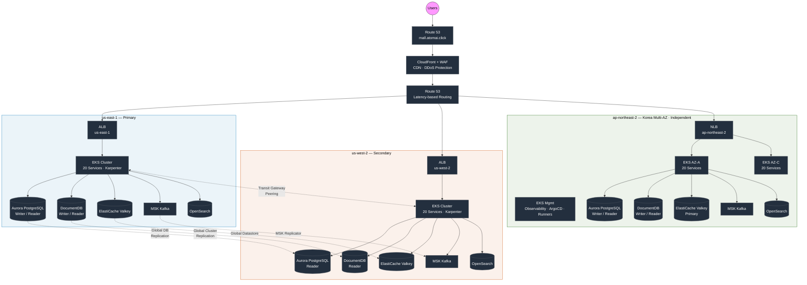
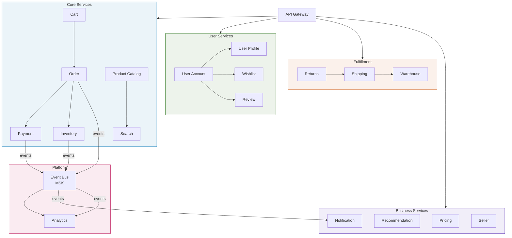
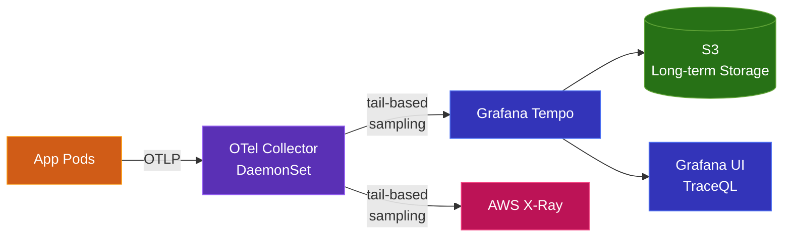

# Multi-Region Shopping Mall Platform

AWS 기반 멀티 리전 쇼핑몰 플랫폼. Amazon.com 규모의 글로벌 커머스 아키텍처를 구현합니다.

## Architecture Overview



### Design Pattern

- **US (us-east-1 ↔ us-west-2)**: Write-Primary / Read-Local 패턴. Aurora Global Write Forwarding으로 us-east-1에서 쓰기, 각 리전 Read Replica에서 읽기 (sub-10ms). MSK Replicator로 크로스 리전 이벤트 동기화.
- **Korea (ap-northeast-2)**: 모든 데이터 스토어가 **독립 Primary**. US와 Global Cluster를 공유하지 않음. 각 AZ별 Reader endpoint 분리 (write → cluster writer, read → nearest AZ instance).

## Tech Stack

| Layer | Technology | Purpose |
|-------|-----------|---------|
| **Edge** | CloudFront, WAF, Route 53 | CDN, DDoS 보호, 지연 시간 기반 라우팅 |
| **Compute** | EKS (Kubernetes), Karpenter | 컨테이너 오케스트레이션, 오토스케일링 |
| **RDBMS** | Aurora PostgreSQL Global | 주문, 결제, 사용자 (ACID 트랜잭션) |
| **Document DB** | DocumentDB Global | 상품 카탈로그, 리뷰, 프로필 |
| **Cache** | ElastiCache (Valkey) Global | 세션, 장바구니, 실시간 재고 |
| **Search** | OpenSearch | 상품 검색 (한국어 nori 분석기) |
| **Event Streaming** | MSK (Kafka) | 이벤트 기반 아키텍처 (35개 토픽) |
| **Object Storage** | S3 (Cross-Region Replication) | 정적 자산, 분석 데이터 |
| **Observability** | Prometheus, Grafana, Tempo, X-Ray | 메트릭, 로그, 분산 트레이싱 |
| **GitOps** | ArgoCD ApplicationSet | 멀티 리전 K8s 배포 자동화 |
| **IaC** | Terraform | 인프라 프로비저닝 (260+ 리소스/리전) |
| **Security** | KMS, Secrets Manager, IRSA | 암호화, 시크릿 관리, Pod IAM |

## Microservices (20 Services)

5개 도메인 그룹으로 구성된 20개의 마이크로서비스:



### Core Services (6)
| Service | Language | DB | Description |
|---------|----------|-----|-------------|
| `product-catalog` | Python | DocumentDB | 상품 정보, 카테고리, 브랜드 관리 |
| `search` | Go | OpenSearch | 상품 검색 (nori 한국어 분석기) |
| `cart` | Go | ElastiCache | 장바구니 관리 (TTL 7일) |
| `order` | Java | Aurora PostgreSQL | 주문 생성, 상태 관리 |
| `payment` | Java | Aurora PostgreSQL | 결제 처리 (카카오페이, 네이버페이, 토스) |
| `inventory` | Go | Aurora PostgreSQL | 재고 관리, 예약, 입고 |

### User Services (4)
| Service | DB | Description |
|---------|-----|-------------|
| `user-account` | Aurora PostgreSQL | 회원가입, 인증, 계정 관리 |
| `user-profile` | DocumentDB | 프로필, 선호도, 등급 관리 |
| `wishlist` | DocumentDB | 위시리스트 관리 |
| `review` | DocumentDB | 상품 리뷰, 평점 관리 |

### Fulfillment Services (3)
| Service | DB | Description |
|---------|-----|-------------|
| `shipping` | Aurora PostgreSQL | 배송 추적 (CJ대한통운, 한진택배 등) |
| `warehouse` | Aurora PostgreSQL | 창고 관리, 출고 처리 |
| `returns` | Aurora PostgreSQL | 반품/환불 처리 |

### Business Services (4)
| Service | DB | Description |
|---------|-----|-------------|
| `notification` | DocumentDB + MSK | 알림 (Push, Email, SMS, 카카오) |
| `pricing` | ElastiCache | 가격 정책, 할인, 쿠폰 |
| `recommendation` | DocumentDB | 추천 엔진 |
| `seller` | Aurora PostgreSQL | 셀러 관리 |

### Platform Services (4)
| Service | Language | DB | Description |
|---------|----------|-----|-------------|
| `api-gateway` | Go | - | API 라우팅, 인증, Rate Limiting |
| `event-bus` | Go | MSK | 이벤트 라우팅, Saga 오케스트레이션 |
| `analytics` | Python | OpenSearch + S3 | 분석, 이벤트 집계 |
| `synthetic-monitor` | Python | - | 합성 모니터링 (CronJob, 2분 주기) |

## Project Structure

```
multi-region-architecture/
├── terraform/                          # Infrastructure as Code
│   ├── environments/
│   │   └── production/
│   │       ├── us-east-1/              # Primary region (260 resources)
│   │       ├── us-west-2/              # Secondary region
│   │       └── ap-northeast-2/         # Korea (shared, eks-mgmt, eks-az-a, eks-az-c)
│   └── modules/
│       ├── networking/                 # VPC, Transit Gateway, Security Groups
│       ├── compute/                    # EKS, ALB Controller
│       ├── data/                       # Aurora, DocumentDB, ElastiCache, MSK, OpenSearch, S3
│       ├── edge/                       # CloudFront, WAF, Route53
│       ├── security/                   # KMS, Secrets Manager, IAM
│       └── observability/              # CloudWatch, X-Ray, Tempo Storage
│
├── k8s/                                # Kubernetes Manifests
│   ├── base/                           # Common resources (namespaces, RBAC)
│   ├── services/                       # 20 microservice deployments
│   │   ├── core/                       # api-gateway, product-catalog, search, cart, order, payment, inventory
│   │   ├── user/                       # user-account, user-profile, wishlist, review
│   │   ├── fulfillment/               # shipping, warehouse, returns
│   │   ├── business/                  # notification, pricing, recommendation, seller
│   │   └── platform/                  # analytics, api-gateway, event-bus
│   ├── infra/                          # Infrastructure components
│   │   ├── argocd/                    # ArgoCD ApplicationSets (US)
│   │   ├── argocd-korea/             # ArgoCD ApplicationSets (Korea, from mgmt)
│   │   ├── prometheus-stack/          # Prometheus + Grafana
│   │   ├── tempo/                     # Grafana Tempo (distributed tracing)
│   │   ├── otel-collector/            # OpenTelemetry Collector
│   │   ├── clickhouse/                # Trace/log analytics storage
│   │   ├── karpenter/                 # Node autoscaling
│   │   ├── external-secrets/          # AWS Secrets Manager sync
│   │   └── keda/                      # Event-driven autoscaling
│   └── overlays/                       # Region-specific patches
│       ├── us-east-1/                 # Primary config + real endpoints
│       ├── us-west-2/                 # Secondary config + real endpoints
│       ├── ap-northeast-2-az-a/       # Korea AZ-A (independent data stores)
│       └── ap-northeast-2-az-c/       # Korea AZ-C
│
├── src/                                # Application source code (20 services)
│
├── scripts/
│   └── seed-data/                     # Mock data for all data stores
│       ├── seed-aurora.sql            # 50 users, 200 orders, payments, inventory
│       ├── seed-documentdb.js         # 1000 products (crawled), profiles, wishlists, reviews
│       ├── seed-opensearch.sh         # Product search index (nori analyzer)
│       ├── seed-kafka-topics.sh       # 35 event topics
│       ├── seed-redis.sh             # Cache, sessions, carts, leaderboards
│       └── run-seed.sh              # Master orchestrator
│
└── docs/                              # Architecture documentation
    ├── architecture/
    │   └── architecture-design.md     # Detailed architecture design
    ├── deployment-design.md           # Deployment strategy
    ├── deployment-execution-plan.md   # Step-by-step deployment guide
    ├── argocd-gitops-design.md       # GitOps workflow design
    └── otel-tracing-design.md        # Distributed tracing design
```

## Deploy It Yourself (Quick Start)

이 리포지토리 하나로 **새 AWS 계정에 전체 플랫폼을 재현**할 수 있습니다. 기준 리전은 한국(ap-northeast-2, AZ별 zonal EKS 클러스터 2개 + 관리 클러스터)입니다. US 리전(us-east-1/us-west-2) terraform도 포함되어 있으나 현재 비용 절감을 위해 철수된 참조 구성이므로 선택 사항입니다.

### Prerequisites

- AWS 계정 (Administrator 또는 그에 준하는 권한)
- Terraform >= 1.9, AWS CLI v2, kubectl, kustomize (ArgoCD 설치 시 `--enable-helm` 사용), Docker, argocd CLI, istioctl (Istio mesh 사용 시)
- **Route53 호스팅 존 + ACM 인증서 (필수)** — `shared` 레이어가 `terraform.tfvars`의 zone ID/인증서 ARN을 요구합니다. CloudFront용 인증서는 반드시 us-east-1에서 발급.
- **계정 고정값 치환**: 이 리포는 데모 계정의 실제 값(계정 ID `180294183052`, SG/서브넷/엔드포인트)을 커밋해 둡니다. 새 계정에서는 `grep -rl 180294183052 | xargs sed -i 's/180294183052/<YOUR_ACCOUNT>/g'` 후 overlay/appset의 엔드포인트·ARN을 본인 terraform output으로 교체하는 단계가 필요합니다 (`docs/portability-assessment.md`의 체크리스트 참고).

### 0. State Backend 준비

Terraform state는 S3 + DynamoDB lock을 사용합니다. **새 계정에서는 본인 버킷을 만들고 각 레이어의 `backend.tf`의 `bucket`(현재 `multi-region-mall-terraform-state`)을 교체하세요.**

```bash
aws s3 mb s3://<your-tf-state-bucket> --region us-east-1
aws dynamodb create-table --table-name multi-region-mall-terraform-locks \
  --attribute-definitions AttributeName=LockID,AttributeType=S \
  --key-schema AttributeName=LockID,KeyType=HASH \
  --billing-mode PAY_PER_REQUEST --region us-east-1
```

### 1. Terraform — 반드시 이 순서로 (레이어 간 remote state 의존)

```bash
cd terraform/environments/production/ap-northeast-2

# ① VPC, SG, 데이터 스토어(Aurora/DocumentDB/ElastiCache/MSK/OpenSearch),
#    ECR 리포 22개(ecr.tf), CloudFront + mall.<domain> Route53
(cd shared    && terraform init && terraform apply)

# ② 관리 클러스터 (ArgoCD, observability, runners)
(cd eks-mgmt  && terraform init && terraform apply)

# ③④ 워크로드 클러스터 (AZ별 1개)
(cd eks-az-a  && terraform init && terraform apply)
(cd eks-az-c  && terraform init && terraform apply)
```

`terraform.tfvars`의 도메인/인증서 ARN을 본인 값으로 교체하세요. 기존 계정(이미 리소스 존재)에 적용하는 경우 `shared/ecr.tf` 상단 주석의 import 절차를 먼저 실행합니다.

> **Two-pass 부트스트랩**: `shared`에는 EKS 클러스터를 조회하는 리소스(backup-restore IRSA의 `data.aws_eks_cluster` 등)가 있어, **완전 신규 계정에서는 최초 `shared` apply가 해당 리소스에서 실패할 수 있습니다.** 이 경우 `-target`으로 VPC/SG/데이터 스토어만 먼저 적용 → ②③④ 클러스터 생성 → `shared`를 한 번 더 전체 apply 하세요.

### 2. 컨테이너 이미지 빌드 (재크롤링·외부 의존 없음)

모든 이미지(20개 서비스 + synthetic-monitor + seed-data)는 커밋된 소스에서 재빌드됩니다:

```bash
AWS_ACCOUNT_ID=<your-account-id> AWS_REGION=ap-northeast-2 bash scripts/build-and-push.sh
```

### 3. Seed 데이터 — 크롤링 없이 zip 다운로드

크롤링된 상품 1,000개 + 상품 이미지 스냅샷(949장)이 패키징되어 있습니다. (상품 JSON 자체는 이 리포의 `scripts/seed-data/products-1000.json`에 커밋되어 있고, zip은 이미지 스냅샷을 더한 편의 번들입니다 — 아래 URL은 기존 데모 배포가 살아있는 동안 유효하며, 죽었다면 `package-dataset.sh`로 본인 환경에서 재생성하면 됩니다):

```bash
curl -LO https://mall.atomai.click/datasets/mall-seed-dataset.zip && unzip mall-seed-dataset.zip
```

데이터 스토어 시딩 (엔드포인트는 `shared` 레이어의 `terraform output` 값 사용):

```bash
cd scripts/seed-data
export AURORA_ENDPOINT=... DOCUMENTDB_URI=... OPENSEARCH_ENDPOINT=... \
       MSK_BOOTSTRAP=... ELASTICACHE_ENDPOINT=...
bash run-seed.sh
```

본인 환경에서 zip을 재생성/재게시하려면: `bash scripts/seed-data/package-dataset.sh` (자신의 static-assets 버킷에 업로드되고 CloudFront 기본 경로로 즉시 서빙됨).

### 4. kubeconfig 컨텍스트 등록

```bash
aws eks update-kubeconfig --name mall-apne2-mgmt --region ap-northeast-2 --alias mall-apne2-mgmt
aws eks update-kubeconfig --name mall-apne2-az-a --region ap-northeast-2 --alias mall-apne2-az-a
aws eks update-kubeconfig --name mall-apne2-az-c --region ap-northeast-2 --alias mall-apne2-az-c
```

### 5. ArgoCD + App of Apps — root app 하나만 등록하면 전체 배포

ArgoCD는 mgmt 클러스터에서 실행되며 워크로드 클러스터를 원격 관리합니다.

```bash
# ① ArgoCD 설치 (mgmt) — helmCharts 필드를 쓰므로 kubectl -k가 아니라
#    standalone kustomize + --enable-helm이 필요
kustomize build --enable-helm k8s/infra/argocd-korea/ | kubectl apply -f - --context mall-apne2-mgmt

# ② 워크로드 클러스터 등록 — ApplicationSet의 cluster generator가
#    `cluster-name` 라벨로 클러스터를 선택하므로 라벨 지정이 필수
argocd cluster add mall-apne2-az-a --name mall-apne2-az-a --label cluster-name=mall-apne2-az-a
argocd cluster add mall-apne2-az-c --name mall-apne2-az-c --label cluster-name=mall-apne2-az-c
argocd cluster add mall-apne2-mgmt --name mall-apne2-mgmt --label cluster-name=mall-apne2-mgmt

# ③ root app 등록 — 이거 하나로 워크로드 20개 서비스 + 인프라(Karpenter,
#    ALB Controller, External Secrets, Istio ambient mesh 등) 전체가 배포됨
kubectl apply -f k8s/infra/argocd-korea/apps/root-app.yaml --context mall-apne2-mgmt
```

본인 fork에서 배포한다면 `root-app.yaml`과 `apps/appset-*.yaml`의 `repoURL`을 fork 주소로 교체하세요 (HTTPS 형식 권장 — SSH 형식 appset은 HTTPS 자격증명만 등록된 ArgoCD에서 sync되지 않습니다). 다른 ArgoCD(예: 별도 허브)에 tenant로 등록할 때도 `k8s/infra/argocd-korea/apps` 경로를 가리키는 Application 하나면 충분합니다.

> **현재 라이브 데모 계정은 이 모델과 다릅니다**: 운영 중인 환경에서는 플랫폼 계열 ApplicationSet(karpenter, ALB controller, external-secrets 등)의 실제 source of truth가 허브 리포(`AWS-Demo-Platform/argocd-apps/system/`)이고, 이 리포의 해당 파일들은 미러입니다 — 상세는 [`docs/portability-assessment.md`](docs/portability-assessment.md). 위 root-app 방식은 **신규/독립 환경에 이 리포 하나로 배포하는 표준 경로**이며, 두 모델의 통합(허브는 mgmt 전용, 이 리포가 워크로드 클러스터 전체 소유)은 진행 중인 정리 작업입니다.

### 6. (선택) Istio Ambient — AZ 간 zone failover

az-a/az-c 클러스터 간 부분 장애 우회(east-west failover)는 Istio ambient multicluster로 구성됩니다. GitOps로 배포되지 않는 수동 부트스트랩 2단계가 필요합니다 — **순서 중요**:

```bash
# ① 공통 root CA (istiod 기동 전) — 이거 없으면 cross-cluster mTLS가 신뢰되지 않아 failover가 동작하지 않음
bash scripts/istio-cacerts.sh

# ② 클러스터 간 remote secret (istiod 기동 후)
istioctl create-remote-secret --context=mall-apne2-az-a --name=mall-apne2-az-a | kubectl apply -f - --context mall-apne2-az-c
istioctl create-remote-secret --context=mall-apne2-az-c --name=mall-apne2-az-c | kubectl apply -f - --context mall-apne2-az-a
```

상세 절차와 검증(중복 결제 확인 포함)은 [`k8s/infra/istio-eastwest/README.md`](k8s/infra/istio-eastwest/README.md) 참고.

### 7. 검증

```bash
bash scripts/test-traffic-flow.sh          # DNS → CloudFront → NLB → pod 전체 경로 + SG 감사
kubectl get pods -A --context mall-apne2-az-a
kubectl get applications -n argocd --context mall-apne2-mgmt
```

프론트엔드 배포: `scripts/deploy-frontend.sh` (S3 버킷/CloudFront distribution ID를 본인 값으로 교체 필요).

## Observability

### Distributed Tracing (OTel + Tempo)



- **Tail-based Sampling**: 에러 100%, 지연(>500ms) 100%, 기본 10%
- **Dual Export**: Tempo (Grafana) + X-Ray (AWS Console) 동시 전송
- **Service Map**: Prometheus metrics_generator로 RED 메트릭 자동 생성

### Monitoring Stack

- **Prometheus**: 메트릭 수집 + 알림 규칙
- **Grafana**: 대시보드, Tempo/Prometheus/CloudWatch 통합
- **OTel Collector**: 로그 수집 (filelog receiver → ClickHouse + CloudWatch). Fluent Bit를 대체.
- **ClickHouse**: Trace/Log 분석 스토리지 (`otel` database, 30일 TTL)
- **CloudWatch**: 인프라 알림 (Aurora lag, MSK under-replicated, error rate)

## Event-Driven Architecture

35개 Kafka 토픽으로 구성된 이벤트 기반 아키텍처:

| Domain | Topics | Key Events |
|--------|--------|-----------|
| Order | 4 | created, confirmed, cancelled, status-changed |
| Payment | 4 | initiated, completed, failed, refunded |
| Inventory | 4 | reserved, released, low-stock, restocked |
| Shipping | 4 | dispatched, in-transit, delivered, returned |
| Notification | 4 | email, push, sms, kakao |
| User | 3 | registered, profile-updated, login |
| Product | 4 | created, updated, price-changed, viewed |
| Analytics | 3 | search query, page-view, click |
| Infra | 2 | DLQ, saga orchestrator |

## Disaster Recovery

| Metric | Target |
|--------|--------|
| RPO (Recovery Point Objective) | < 1 second (Aurora/DocumentDB global replication) |
| RTO (Recovery Time Objective) | < 5 minutes (automated failover) |
| Availability SLA | 99.99% |

### Failover Strategy

1. **Aurora/DocumentDB**: Global Database → promote secondary to primary
2. **ElastiCache**: Global Datastore → automatic failover
3. **MSK**: MSK Replicator → consumer failover to local cluster
4. **Route 53**: Health check failure → automatic DNS failover
5. **CloudFront**: Origin failover group → secondary ALB

## Cost Estimate (Monthly)

| Component | us-east-1 | us-west-2 | Total |
|-----------|-----------|-----------|-------|
| EKS + EC2 (Karpenter) | ~$2,500 | ~$2,500 | $5,000 |
| Aurora PostgreSQL (r6g.2xlarge) | ~$2,800 | ~$1,900 | $4,700 |
| DocumentDB (r6g.2xlarge) | ~$2,400 | ~$1,600 | $4,000 |
| ElastiCache (r7g.xlarge) | ~$1,800 | ~$1,800 | $3,600 |
| MSK (m5.2xlarge × 6) | ~$3,200 | ~$3,200 | $6,400 |
| OpenSearch | ~$2,000 | ~$2,000 | $4,000 |
| CloudFront + WAF | ~$500 | - | $500 |
| Tempo (S3) | ~$185 | ~$185 | $370 |
| Other (NAT, TGW, etc.) | ~$800 | ~$800 | $1,600 |
| **Total** | **~$16,185** | **~$13,985** | **~$30,170** |

## Documentation

| Document | Description |
|----------|-------------|
| [Architecture Design](docs/architecture/architecture-design.md) | 전체 아키텍처 상세 설계 |
| [Deployment Design](docs/deployment-design.md) | 배포 전략 및 파이프라인 |
| [Deployment Execution Plan](docs/deployment-execution-plan.md) | 단계별 배포 가이드 |
| [ArgoCD GitOps Design](docs/argocd-gitops-design.md) | GitOps 워크플로우 설계 |
| [OTel Tracing Design](docs/otel-tracing-design.md) | 분산 트레이싱 설계 |
| [Data Architecture](docs/data-architecture.md) | 데이터 아키텍처 및 스키마 |
| [Network Architecture](docs/network-architecture.md) | 네트워크 토폴로지 및 보안 |

## License

Internal use only.
