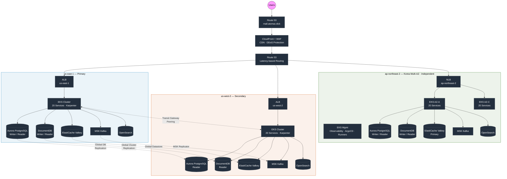
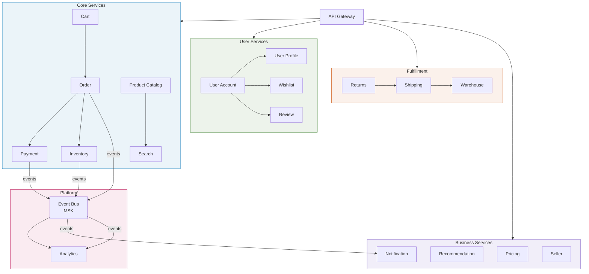
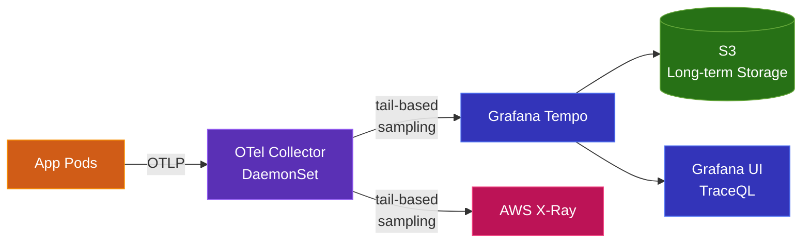

# Multi-Region Shopping Mall Platform

AWS 기반 멀티 리전 쇼핑몰 플랫폼. Amazon.com 규모의 글로벌 커머스 아키텍처를 구현합니다.

## Architecture Overview



### Design Pattern

- **US (us-east-1 ↔ us-west-2)**: Write-Primary / Read-Local 패턴. Aurora Global Write Forwarding으로 us-east-1에서 쓰기, 각 리전 Read Replica에서 읽기 (sub-10ms). MSK Replicator로 크로스 리전 이벤트 동기화.
- **Korea (ap-northeast-2)**: 모든 데이터 스토어가 **독립 Primary**. US와 Global Cluster를 공유하지 않음. 각 AZ별 Reader endpoint 분리 (write → cluster writer, read → nearest AZ instance).

## Tech Stack

| Layer | Technology | Purpose |
|-------|-----------|---------|
| **Edge** | CloudFront, WAF, Route 53 | CDN, DDoS 보호, 지연 시간 기반 라우팅 |
| **Compute** | EKS (Kubernetes), Karpenter | 컨테이너 오케스트레이션, 오토스케일링 |
| **RDBMS** | Aurora PostgreSQL Global | 주문, 결제, 사용자 (ACID 트랜잭션) |
| **Document DB** | DocumentDB Global | 상품 카탈로그, 리뷰, 프로필 |
| **Cache** | ElastiCache (Valkey) Global | 세션, 장바구니, 실시간 재고 |
| **Search** | OpenSearch | 상품 검색 (한국어 nori 분석기) |
| **Event Streaming** | MSK (Kafka) | 이벤트 기반 아키텍처 (35개 토픽) |
| **Object Storage** | S3 (Cross-Region Replication) | 정적 자산, 분석 데이터 |
| **Observability** | Prometheus, Grafana, Tempo, X-Ray | 메트릭, 로그, 분산 트레이싱 |
| **GitOps** | ArgoCD ApplicationSet | 멀티 리전 K8s 배포 자동화 |
| **IaC** | Terraform | 인프라 프로비저닝 (260+ 리소스/리전) |
| **Security** | KMS, Secrets Manager, IRSA | 암호화, 시크릿 관리, Pod IAM |

## Microservices (20 Services)

5개 도메인 그룹으로 구성된 20개의 마이크로서비스:



### Core Services (6)
| Service | Language | DB | Description |
|---------|----------|-----|-------------|
| `product-catalog` | Python | DocumentDB | 상품 정보, 카테고리, 브랜드 관리 |
| `search` | Go | OpenSearch | 상품 검색 (nori 한국어 분석기) |
| `cart` | Go | ElastiCache | 장바구니 관리 (TTL 7일) |
| `order` | Java | Aurora PostgreSQL | 주문 생성, 상태 관리 |
| `payment` | Java | Aurora PostgreSQL | 결제 처리 (카카오페이, 네이버페이, 토스) |
| `inventory` | Go | Aurora PostgreSQL | 재고 관리, 예약, 입고 |

### User Services (4)
| Service | DB | Description |
|---------|-----|-------------|
| `user-account` | Aurora PostgreSQL | 회원가입, 인증, 계정 관리 |
| `user-profile` | DocumentDB | 프로필, 선호도, 등급 관리 |
| `wishlist` | DocumentDB | 위시리스트 관리 |
| `review` | DocumentDB | 상품 리뷰, 평점 관리 |

### Fulfillment Services (3)
| Service | DB | Description |
|---------|-----|-------------|
| `shipping` | Aurora PostgreSQL | 배송 추적 (CJ대한통운, 한진택배 등) |
| `warehouse` | Aurora PostgreSQL | 창고 관리, 출고 처리 |
| `returns` | Aurora PostgreSQL | 반품/환불 처리 |

### Business Services (4)
| Service | DB | Description |
|---------|-----|-------------|
| `notification` | DocumentDB + MSK | 알림 (Push, Email, SMS, 카카오) |
| `pricing` | ElastiCache | 가격 정책, 할인, 쿠폰 |
| `recommendation` | DocumentDB | 추천 엔진 |
| `seller` | Aurora PostgreSQL | 셀러 관리 |

### Platform Services (4)
| Service | Language | DB | Description |
|---------|----------|-----|-------------|
| `api-gateway` | Go | - | API 라우팅, 인증, Rate Limiting |
| `event-bus` | Go | MSK | 이벤트 라우팅, Saga 오케스트레이션 |
| `analytics` | Python | OpenSearch + S3 | 분석, 이벤트 집계 |
| `synthetic-monitor` | Python | - | 합성 모니터링 (CronJob, 2분 주기) |

## Project Structure

```
multi-region-architecture/
├── terraform/                          # Infrastructure as Code
│   ├── environments/
│   │   └── production/
│   │       ├── us-east-1/              # Primary region (260 resources)
│   │       ├── us-west-2/              # Secondary region
│   │       └── ap-northeast-2/         # Korea (shared, eks-mgmt, eks-az-a, eks-az-c)
│   └── modules/
│       ├── networking/                 # VPC, Transit Gateway, Security Groups
│       ├── compute/                    # EKS, ALB Controller
│       ├── data/                       # Aurora, DocumentDB, ElastiCache, MSK, OpenSearch, S3
│       ├── edge/                       # CloudFront, WAF, Route53
│       ├── security/                   # KMS, Secrets Manager, IAM
│       └── observability/              # CloudWatch, X-Ray, Tempo Storage
│
├── k8s/                                # Kubernetes Manifests
│   ├── base/                           # Common resources (namespaces, RBAC)
│   ├── services/                       # 20 microservice deployments
│   │   ├── core/                       # api-gateway, product-catalog, search, cart, order, payment, inventory
│   │   ├── user/                       # user-account, user-profile, wishlist, review
│   │   ├── fulfillment/               # shipping, warehouse, returns
│   │   ├── business/                  # notification, pricing, recommendation, seller
│   │   └── platform/                  # analytics, api-gateway, event-bus
│   ├── infra/                          # Infrastructure components
│   │   ├── argocd/                    # ArgoCD ApplicationSets (US)
│   │   ├── argocd-korea/             # ArgoCD ApplicationSets (Korea, from mgmt)
│   │   ├── prometheus-stack/          # Prometheus + Grafana
│   │   ├── tempo/                     # Grafana Tempo (distributed tracing)
│   │   ├── otel-collector/            # OpenTelemetry Collector
│   │   ├── clickhouse/                # Trace/log analytics storage
│   │   ├── karpenter/                 # Node autoscaling
│   │   ├── external-secrets/          # AWS Secrets Manager sync
│   │   └── keda/                      # Event-driven autoscaling
│   └── overlays/                       # Region-specific patches
│       ├── us-east-1/                 # Primary config + real endpoints
│       ├── us-west-2/                 # Secondary config + real endpoints
│       ├── ap-northeast-2-az-a/       # Korea AZ-A (independent data stores)
│       └── ap-northeast-2-az-c/       # Korea AZ-C
│
├── src/                                # Application source code (20 services)
│
├── scripts/
│   └── seed-data/                     # Mock data for all data stores
│       ├── seed-aurora.sql            # 50 users, 200 orders, payments, inventory
│       ├── seed-documentdb.js         # 1000 products (crawled), profiles, wishlists, reviews
│       ├── seed-opensearch.sh         # Product search index (nori analyzer)
│       ├── seed-kafka-topics.sh       # 35 event topics
│       ├── seed-redis.sh             # Cache, sessions, carts, leaderboards
│       └── run-seed.sh              # Master orchestrator
│
└── docs/                              # Architecture documentation
    ├── architecture/
    │   └── architecture-design.md     # Detailed architecture design
    ├── deployment-design.md           # Deployment strategy
    ├── deployment-execution-plan.md   # Step-by-step deployment guide
    ├── argocd-gitops-design.md       # GitOps workflow design
    └── otel-tracing-design.md        # Distributed tracing design
```

## Quick Start

### Prerequisites

- AWS Account with appropriate permissions
- Terraform >= 1.9
- kubectl
- AWS CLI v2
- helm

### 1. Infrastructure Deployment

```bash
# State backend 생성
cd terraform/environments/production/us-east-1
terraform init
terraform apply

# Secondary region
cd ../us-west-2
terraform init
terraform apply
```

### 2. EKS Cluster Access

```bash
aws eks update-kubeconfig --name multi-region-mall --region us-east-1
aws eks update-kubeconfig --name multi-region-mall --region us-west-2
```

### 3. ArgoCD Deployment

```bash
kubectl apply -k k8s/infra/argocd/
```

ArgoCD가 ApplicationSet을 통해 모든 인프라 컴포넌트와 서비스를 자동 배포합니다.

### 4. Seed Data

```bash
cd scripts/seed-data
export AURORA_ENDPOINT="production-aurora-global-us-east-1.cluster-xxx.us-east-1.rds.amazonaws.com"
export DOCUMENTDB_URI="mongodb://docdb_admin:<YOUR_PASSWORD>@production-docdb-global-us-east-1.cluster-xxx.us-east-1.docdb.amazonaws.com:27017"
export OPENSEARCH_ENDPOINT="https://vpc-production-os-use1-xxx.us-east-1.es.amazonaws.com"
export MSK_BOOTSTRAP="b-1.productionmskuseast1.xxx.kafka.us-east-1.amazonaws.com:9096"
export ELASTICACHE_ENDPOINT="clustercfg.production-elasticache-us-east-1.xxx.use1.cache.amazonaws.com"

bash run-seed.sh
```

## Observability

### Distributed Tracing (OTel + Tempo)



- **Tail-based Sampling**: 에러 100%, 지연(>500ms) 100%, 기본 10%
- **Dual Export**: Tempo (Grafana) + X-Ray (AWS Console) 동시 전송
- **Service Map**: Prometheus metrics_generator로 RED 메트릭 자동 생성

### Monitoring Stack

- **Prometheus**: 메트릭 수집 + 알림 규칙
- **Grafana**: 대시보드, Tempo/Prometheus/CloudWatch 통합
- **OTel Collector**: 로그 수집 (filelog receiver → ClickHouse + CloudWatch). Fluent Bit를 대체.
- **ClickHouse**: Trace/Log 분석 스토리지 (`otel` database, 30일 TTL)
- **CloudWatch**: 인프라 알림 (Aurora lag, MSK under-replicated, error rate)

## Event-Driven Architecture

35개 Kafka 토픽으로 구성된 이벤트 기반 아키텍처:

| Domain | Topics | Key Events |
|--------|--------|-----------|
| Order | 4 | created, confirmed, cancelled, status-changed |
| Payment | 4 | initiated, completed, failed, refunded |
| Inventory | 4 | reserved, released, low-stock, restocked |
| Shipping | 4 | dispatched, in-transit, delivered, returned |
| Notification | 4 | email, push, sms, kakao |
| User | 3 | registered, profile-updated, login |
| Product | 4 | created, updated, price-changed, viewed |
| Analytics | 3 | search query, page-view, click |
| Infra | 2 | DLQ, saga orchestrator |

## Disaster Recovery

| Metric | Target |
|--------|--------|
| RPO (Recovery Point Objective) | < 1 second (Aurora/DocumentDB global replication) |
| RTO (Recovery Time Objective) | < 5 minutes (automated failover) |
| Availability SLA | 99.99% |

### Failover Strategy

1. **Aurora/DocumentDB**: Global Database → promote secondary to primary
2. **ElastiCache**: Global Datastore → automatic failover
3. **MSK**: MSK Replicator → consumer failover to local cluster
4. **Route 53**: Health check failure → automatic DNS failover
5. **CloudFront**: Origin failover group → secondary ALB

## Cost Estimate (Monthly)

| Component | us-east-1 | us-west-2 | Total |
|-----------|-----------|-----------|-------|
| EKS + EC2 (Karpenter) | ~$2,500 | ~$2,500 | $5,000 |
| Aurora PostgreSQL (r6g.2xlarge) | ~$2,800 | ~$1,900 | $4,700 |
| DocumentDB (r6g.2xlarge) | ~$2,400 | ~$1,600 | $4,000 |
| ElastiCache (r7g.xlarge) | ~$1,800 | ~$1,800 | $3,600 |
| MSK (m5.2xlarge × 6) | ~$3,200 | ~$3,200 | $6,400 |
| OpenSearch | ~$2,000 | ~$2,000 | $4,000 |
| CloudFront + WAF | ~$500 | - | $500 |
| Tempo (S3) | ~$185 | ~$185 | $370 |
| Other (NAT, TGW, etc.) | ~$800 | ~$800 | $1,600 |
| **Total** | **~$16,185** | **~$13,985** | **~$30,170** |

## Documentation

| Document | Description |
|----------|-------------|
| [Architecture Design](docs/architecture/architecture-design.md) | 전체 아키텍처 상세 설계 |
| [Deployment Design](docs/deployment-design.md) | 배포 전략 및 파이프라인 |
| [Deployment Execution Plan](docs/deployment-execution-plan.md) | 단계별 배포 가이드 |
| [ArgoCD GitOps Design](docs/argocd-gitops-design.md) | GitOps 워크플로우 설계 |
| [OTel Tracing Design](docs/otel-tracing-design.md) | 분산 트레이싱 설계 |
| [Data Architecture](docs/data-architecture.md) | 데이터 아키텍처 및 스키마 |
| [Network Architecture](docs/network-architecture.md) | 네트워크 토폴로지 및 보안 |

## License

Internal use only.
