# Multi-Region Shopping Mall Architecture Design

## Document Information

| Attribute | Value |
|-----------|-------|
| Version | 1.0 |
| Last Updated | 2026-03-15 |
| Status | Draft |
| Classification | Internal |

---

## Table of Contents

1. [Overview](#1-overview)
2. [Network Architecture](#2-network-architecture)
3. [Traffic Flow](#3-traffic-flow)
4. [EKS Cluster Design](#4-eks-cluster-design)
5. [Data Architecture](#5-data-architecture)
6. [Event Architecture](#6-event-architecture)
7. [Disaster Recovery & Failover](#7-disaster-recovery--failover)
8. [Observability](#8-observability)
9. [Security](#9-security)
10. [CI/CD Pipeline](#10-cicd-pipeline)
11. [Cost Estimate](#11-cost-estimate)

---

## 1. Overview

### 1.1 Executive Summary

This document describes the architecture for a global-scale shopping mall platform modeled after Amazon.com's infrastructure patterns. The platform is designed to handle millions of concurrent users across multiple geographic regions while maintaining high availability, low latency, and strong consistency for critical operations.

### 1.2 System Goals

- **Global Reach**: Serve customers worldwide with sub-100ms latency for read operations
- **High Availability**: 99.99% uptime SLA with automated failover capabilities
- **Scalability**: Handle 10x traffic spikes during peak events (Black Friday, Prime Day equivalents)
- **Data Consistency**: Strong consistency for financial transactions, eventual consistency for catalog data
- **Security**: PCI-DSS compliant payment processing, GDPR-ready data handling

### 1.3 Architecture Pattern

The platform implements a **Write-Primary/Read-Local** pattern:

```
┌─────────────────────────────────────────────────────────────────────────────┐
│                         WRITE-PRIMARY / READ-LOCAL                          │
├─────────────────────────────────────────────────────────────────────────────┤
│                                                                             │
│   us-east-1 (PRIMARY)                    us-west-2 (SECONDARY)              │
│   ┌─────────────────────┐                ┌─────────────────────┐            │
│   │  ● All WRITE ops    │  ──────────►   │  ● READ-only ops    │            │
│   │  ● READ ops         │   Replication  │  ● Write forwarding │            │
│   │  ● Primary DBs      │  ◄──────────   │  ● Replica DBs      │            │
│   └─────────────────────┘                └─────────────────────┘            │
│                                                                             │
└─────────────────────────────────────────────────────────────────────────────┘
```

- **Primary Region (us-east-1)**: Handles all write operations, serves as the source of truth
- **Secondary Region (us-west-2)**: Handles read operations locally, forwards writes to primary

### 1.4 Service Inventory

The platform consists of 20 microservices organized into 5 domains:

| Domain | Services | Count |
|--------|----------|-------|
| Core | Product Catalog, Search, Cart, Order, Payment, Inventory | 6 |
| User | User Account, User Profile, Wishlist, Review & Rating | 4 |
| Fulfillment | Shipping, Warehouse, Returns | 3 |
| Business | Pricing, Recommendation, Notification, Seller | 4 |
| Platform | API Gateway, Event Bus, Analytics | 3 |

### 1.5 Regional Deployment

```
┌──────────────────────────────────────────────────────────────────────────────┐
│                           GLOBAL INFRASTRUCTURE                              │
├──────────────────────────────────────────────────────────────────────────────┤
│                                                                              │
│   ┌────────────┐    ┌────────────┐    ┌────────────────────────────────┐    │
│   │ CloudFront │───►│  Route 53  │───►│  Regional Load Balancers       │    │
│   │   (Edge)   │    │ (Latency)  │    │  us-east-1 | us-west-2         │    │
│   └────────────┘    └────────────┘    └────────────────────────────────┘    │
│                                                                              │
│   ┌─────────────────────────────┐    ┌─────────────────────────────────┐    │
│   │       us-east-1             │    │       us-west-2                 │    │
│   │  ┌───────────────────────┐  │    │  ┌───────────────────────┐      │    │
│   │  │     EKS Cluster       │  │    │  │     EKS Cluster       │      │    │
│   │  │   (20 MSA Services)   │  │    │  │   (20 MSA Services)   │      │    │
│   │  └───────────────────────┘  │    │  └───────────────────────┘      │    │
│   │                             │    │                                 │    │
│   │  Aurora (Writer)            │    │  Aurora (Reader)                │    │
│   │  DocumentDB (Primary)       │    │  DocumentDB (Replica)           │    │
│   │  ElastiCache (Primary)      │    │  ElastiCache (Replica)          │    │
│   │  MSK (6 brokers)            │    │  MSK (6 brokers)                │    │
│   │  OpenSearch                 │    │  OpenSearch                     │    │
│   └─────────────────────────────┘    └─────────────────────────────────┘    │
│                                                                              │
└──────────────────────────────────────────────────────────────────────────────┘
```

---

## 2. Network Architecture

### 2.1 VPC Design

Each region operates an independent VPC with identical architecture patterns but non-overlapping CIDR ranges to enable cross-region connectivity.

#### 2.1.1 CIDR Allocation

```
┌─────────────────────────────────────────────────────────────────────────────┐
│                            VPC CIDR ALLOCATION                              │
├─────────────────────────────────────────────────────────────────────────────┤
│                                                                             │
│   us-east-1: 10.0.0.0/16 (65,536 IPs)                                       │
│   us-west-2: 10.1.0.0/16 (65,536 IPs)                                       │
│                                                                             │
└─────────────────────────────────────────────────────────────────────────────┘
```

#### 2.1.2 Subnet Architecture

Each VPC implements a 3-tier subnet architecture across 3 Availability Zones:

**us-east-1 Subnets:**

| Tier | Purpose | AZ-a | AZ-b | AZ-c | IPs per Subnet |
|------|---------|------|------|------|----------------|
| Public | ALB, NAT Gateway, Bastion | 10.0.1.0/24 | 10.0.2.0/24 | 10.0.3.0/24 | 254 |
| Private | EKS Worker Nodes | 10.0.11.0/24 | 10.0.12.0/24 | 10.0.13.0/24 | 254 |
| Data | RDS, DocumentDB, ElastiCache | 10.0.21.0/24 | 10.0.22.0/24 | 10.0.23.0/24 | 254 |

**us-west-2 Subnets:**

| Tier | Purpose | AZ-a | AZ-b | AZ-c | IPs per Subnet |
|------|---------|------|------|------|----------------|
| Public | ALB, NAT Gateway, Bastion | 10.1.1.0/24 | 10.1.2.0/24 | 10.1.3.0/24 | 254 |
| Private | EKS Worker Nodes | 10.1.11.0/24 | 10.1.12.0/24 | 10.1.13.0/24 | 254 |
| Data | RDS, DocumentDB, ElastiCache | 10.1.21.0/24 | 10.1.22.0/24 | 10.1.23.0/24 | 254 |

#### 2.1.3 Subnet Diagram

```
┌─────────────────────────────────────────────────────────────────────────────┐
│                         us-east-1 VPC (10.0.0.0/16)                         │
├─────────────────────────────────────────────────────────────────────────────┤
│                                                                             │
│   ┌───────────────────┬───────────────────┬───────────────────┐            │
│   │      AZ-a         │       AZ-b        │       AZ-c        │            │
│   ├───────────────────┼───────────────────┼───────────────────┤            │
│   │                   │                   │                   │            │
│   │ ┌───────────────┐ │ ┌───────────────┐ │ ┌───────────────┐ │            │
│   │ │    PUBLIC     │ │ │    PUBLIC     │ │ │    PUBLIC     │ │            │
│   │ │  10.0.1.0/24  │ │ │  10.0.2.0/24  │ │ │  10.0.3.0/24  │ │            │
│   │ │  ALB, NAT GW  │ │ │  ALB, NAT GW  │ │ │  ALB, NAT GW  │ │            │
│   │ └───────────────┘ │ └───────────────┘ │ └───────────────┘ │            │
│   │                   │                   │                   │            │
│   │ ┌───────────────┐ │ ┌───────────────┐ │ ┌───────────────┐ │            │
│   │ │    PRIVATE    │ │ │    PRIVATE    │ │ │    PRIVATE    │ │            │
│   │ │ 10.0.11.0/24  │ │ │ 10.0.12.0/24  │ │ │ 10.0.13.0/24  │ │            │
│   │ │  EKS Nodes    │ │ │  EKS Nodes    │ │ │  EKS Nodes    │ │            │
│   │ └───────────────┘ │ └───────────────┘ │ └───────────────┘ │            │
│   │                   │                   │                   │            │
│   │ ┌───────────────┐ │ ┌───────────────┐ │ ┌───────────────┐ │            │
│   │ │     DATA      │ │ │     DATA      │ │ │     DATA      │ │            │
│   │ │ 10.0.21.0/24  │ │ │ 10.0.22.0/24  │ │ │ 10.0.23.0/24  │ │            │
│   │ │  RDS, Cache   │ │ │  RDS, Cache   │ │ │  RDS, Cache   │ │            │
│   │ └───────────────┘ │ └───────────────┘ │ └───────────────┘ │            │
│   │                   │                   │                   │            │
│   └───────────────────┴───────────────────┴───────────────────┘            │
│                                                                             │
└─────────────────────────────────────────────────────────────────────────────┘
```

### 2.2 Transit Gateway

AWS Transit Gateway connects the two regional VPCs, enabling:

- Cross-region database replication traffic
- Service-to-service communication during failover scenarios
- Centralized network management

#### 2.2.1 Transit Gateway Configuration

```
┌─────────────────────────────────────────────────────────────────────────────┐
│                         TRANSIT GATEWAY PEERING                             │
├─────────────────────────────────────────────────────────────────────────────┤
│                                                                             │
│   us-east-1                                        us-west-2                │
│   ┌─────────────────────┐                ┌─────────────────────┐            │
│   │                     │                │                     │            │
│   │  Transit Gateway    │◄──────────────►│  Transit Gateway    │            │
│   │  (tgw-east-1)       │   TGW Peering  │  (tgw-west-2)       │            │
│   │                     │   Attachment   │                     │            │
│   └──────────┬──────────┘                └──────────┬──────────┘            │
│              │                                      │                       │
│              ▼                                      ▼                       │
│   ┌─────────────────────┐                ┌─────────────────────┐            │
│   │  VPC Attachment     │                │  VPC Attachment     │            │
│   │  10.0.0.0/16        │                │  10.1.0.0/16        │            │
│   └─────────────────────┘                └─────────────────────┘            │
│                                                                             │
└─────────────────────────────────────────────────────────────────────────────┘
```

#### 2.2.2 Route Tables

**us-east-1 Transit Gateway Route Table:**

| Destination | Target | Description |
|-------------|--------|-------------|
| 10.0.0.0/16 | VPC Attachment | Local VPC |
| 10.1.0.0/16 | TGW Peering Attachment | us-west-2 VPC |

**us-west-2 Transit Gateway Route Table:**

| Destination | Target | Description |
|-------------|--------|-------------|
| 10.1.0.0/16 | VPC Attachment | Local VPC |
| 10.0.0.0/16 | TGW Peering Attachment | us-east-1 VPC |

### 2.3 VPC Endpoints

VPC Endpoints eliminate the need for internet-bound traffic to reach AWS services, improving security and reducing data transfer costs.

#### 2.3.1 Gateway Endpoints

| Service | Type | Purpose |
|---------|------|---------|
| S3 | Gateway | ECR image layers, application assets, logs |
| DynamoDB | Gateway | Session state (if used) |

#### 2.3.2 Interface Endpoints

| Service | Type | Purpose |
|---------|------|---------|
| ECR API | Interface | Container image pull authentication |
| ECR DKR | Interface | Container image layer download |
| STS | Interface | IAM role assumption for IRSA |
| CloudWatch Logs | Interface | Application and container logs |
| Secrets Manager | Interface | Database credentials retrieval |
| KMS | Interface | Encryption key operations |

#### 2.3.3 Endpoint Configuration

```
┌─────────────────────────────────────────────────────────────────────────────┐
│                           VPC ENDPOINT LAYOUT                               │
├─────────────────────────────────────────────────────────────────────────────┤
│                                                                             │
│   Private Subnets                                                           │
│   ┌─────────────────────────────────────────────────────────────────────┐  │
│   │                                                                     │  │
│   │   EKS Nodes ────► Interface Endpoints                               │  │
│   │                   ├── com.amazonaws.region.ecr.api                  │  │
│   │                   ├── com.amazonaws.region.ecr.dkr                  │  │
│   │                   ├── com.amazonaws.region.sts                      │  │
│   │                   ├── com.amazonaws.region.logs                     │  │
│   │                   ├── com.amazonaws.region.secretsmanager           │  │
│   │                   └── com.amazonaws.region.kms                      │  │
│   │                                                                     │  │
│   │   EKS Nodes ────► Gateway Endpoints                                 │  │
│   │                   ├── com.amazonaws.region.s3                       │  │
│   │                   └── com.amazonaws.region.dynamodb                 │  │
│   │                                                                     │  │
│   └─────────────────────────────────────────────────────────────────────┘  │
│                                                                             │
└─────────────────────────────────────────────────────────────────────────────┘
```

### 2.4 NAT Gateway Configuration

Each AZ has a dedicated NAT Gateway for high availability:

| Region | AZ | NAT Gateway | Elastic IP |
|--------|-----|-------------|------------|
| us-east-1 | a | nat-east-1a | eip-east-1a |
| us-east-1 | b | nat-east-1b | eip-east-1b |
| us-east-1 | c | nat-east-1c | eip-east-1c |
| us-west-2 | a | nat-west-2a | eip-west-2a |
| us-west-2 | b | nat-west-2b | eip-west-2b |
| us-west-2 | c | nat-west-2c | eip-west-2c |

---

## 3. Traffic Flow

### 3.1 Global Traffic Distribution



Route 53 resolves `*.atomai.click` via CNAME to the CloudFront distribution, which then uses a second Route 53 latency-based record to route to the nearest regional ALB.

```
┌─────────────────────────────────────────────────────────────────────────────┐
│                         GLOBAL TRAFFIC FLOW                                 │
├─────────────────────────────────────────────────────────────────────────────┤
│                                                                             │
│   User Request (*.atomai.click)                                             │
│       │                                                                     │
│       ▼                                                                     │
│   ┌─────────────────────────────────────────────────────────────────────┐  │
│   │                     Route 53 (DNS CNAME)                            │  │
│   │   • *.atomai.click → dXXXXXXXXXXXXX.cloudfront.net                  │  │
│   │   • DNS resolution to nearest CloudFront POP                        │  │
│   └────────────────────────────┬────────────────────────────────────────┘  │
│                                │                                           │
│                                ▼                                           │
│   ┌─────────────────────────────────────────────────────────────────────┐  │
│   │                     CloudFront + WAF (Edge)                         │  │
│   │   • 400+ edge locations worldwide                                   │  │
│   │   • TLS termination at edge                                         │  │
│   │   • HTTP/2 and HTTP/3 support                                       │  │
│   │   • Origin Shield: us-east-1                                        │  │
│   │   • WAF: rate limiting, geo-blocking, SQL injection protection      │  │
│   └────────────────────────────┬────────────────────────────────────────┘  │
│                                │                                           │
│                                ▼                                           │
│   ┌─────────────────────────────────────────────────────────────────────┐  │
│   │                Route 53 (Latency-Based Origin)                      │  │
│   │   • api-internal.atomai.click → nearest ALB                         │  │
│   │   • Health check: /health endpoint (interval: 10s, threshold: 3)    │  │
│   └───────────────────┬─────────────────────┬───────────────────────────┘  │
│                       │                     │                              │
│                       ▼                     ▼                              │
│   ┌─────────────────────────┐   ┌─────────────────────────┐               │
│   │   ALB (us-east-1)       │   │   ALB (us-west-2)       │               │
│   │   Primary Region        │   │   Secondary Region      │               │
│   └───────────┬─────────────┘   └───────────┬─────────────┘               │
│               │                             │                              │
│               ▼                             ▼                              │
│   ┌─────────────────────────┐   ┌─────────────────────────┐               │
│   │   EKS Cluster           │   │   EKS Cluster           │               │
│   │   (20 Services)         │   │   (20 Services)         │               │
│   └─────────────────────────┘   └─────────────────────────┘               │
│                                                                             │
└─────────────────────────────────────────────────────────────────────────────┘
```

### 3.2 Request Routing Rules

CloudFront behaviors route traffic based on URL path patterns:

#### 3.2.1 Static Content

```
Path Pattern: /static/*
Origin: S3 bucket (static assets)
Cache Policy: CachingOptimized (TTL: 86400s)
Compress: true (gzip, brotli)
```

**Configuration:**

| Setting | Value |
|---------|-------|
| Origin | s3://mall-static-assets-{region} |
| Cache Policy | Managed-CachingOptimized |
| TTL (Default) | 86400 seconds (24 hours) |
| TTL (Max) | 604800 seconds (7 days) |
| Compress | Enabled (gzip, brotli) |
| Viewer Protocol | HTTPS Only |

#### 3.2.2 Dynamic API

```
Path Pattern: /api/*
Origin: Route 53 latency-based endpoint
Cache Policy: CachingDisabled
Origin Request Policy: AllViewer
```

**Configuration:**

| Setting | Value |
|---------|-------|
| Origin | api.mall.example.com (Route 53) |
| Cache Policy | Managed-CachingDisabled |
| Origin Request Policy | Managed-AllViewer |
| Compress | Enabled |
| Viewer Protocol | HTTPS Only |
| Allowed Methods | GET, HEAD, OPTIONS, PUT, POST, PATCH, DELETE |

#### 3.2.3 SPA (Single Page Application)

```
Path Pattern: /* (default)
Origin: S3 bucket (SPA bundle)
Cache Policy: CachingOptimized
Error Pages: 403, 404 -> /index.html (SPA routing)
```

**Configuration:**

| Setting | Value |
|---------|-------|
| Origin | s3://mall-spa-{region} |
| Cache Policy | Managed-CachingOptimized |
| Default Root Object | index.html |
| Custom Error Response | 403 -> /index.html, 200, 0s |
| Custom Error Response | 404 -> /index.html, 200, 0s |

### 3.3 Origin Shield

Origin Shield provides an additional caching layer between CloudFront edge locations and origins:

```
┌─────────────────────────────────────────────────────────────────────────────┐
│                           ORIGIN SHIELD FLOW                                │
├─────────────────────────────────────────────────────────────────────────────┤
│                                                                             │
│   Edge Locations (Global)                                                   │
│   ┌─────────────────────────────────────────────────────────────────────┐  │
│   │  Tokyo  │  Sydney  │  Frankfurt  │  London  │  Sao Paulo  │  etc.  │  │
│   └────────────────────────────┬────────────────────────────────────────┘  │
│                                │                                           │
│                                ▼                                           │
│   ┌─────────────────────────────────────────────────────────────────────┐  │
│   │                   Origin Shield (us-east-1)                         │  │
│   │   • Reduces origin load by 50-90%                                   │  │
│   │   • Single point of cache population                                │  │
│   │   • Improves cache hit ratio                                        │  │
│   └────────────────────────────┬────────────────────────────────────────┘  │
│                                │                                           │
│                                ▼                                           │
│   ┌─────────────────────────────────────────────────────────────────────┐  │
│   │                         Origins                                     │  │
│   │   • S3 (static assets)                                              │  │
│   │   • ALB (dynamic API)                                               │  │
│   └─────────────────────────────────────────────────────────────────────┘  │
│                                                                             │
└─────────────────────────────────────────────────────────────────────────────┘
```

### 3.4 Protocol Support

| Protocol | Support | Configuration |
|----------|---------|---------------|
| HTTP/1.1 | Enabled | Fallback for legacy clients |
| HTTP/2 | Enabled | Default for modern browsers |
| HTTP/3 (QUIC) | Enabled | Opt-in for supported clients |
| TLS 1.2 | Enabled | Minimum version |
| TLS 1.3 | Enabled | Preferred version |

### 3.5 Compression

| Content Type | Compression | Algorithm |
|--------------|-------------|-----------|
| text/html | Enabled | gzip, brotli |
| text/css | Enabled | gzip, brotli |
| text/javascript | Enabled | gzip, brotli |
| application/json | Enabled | gzip, brotli |
| application/javascript | Enabled | gzip, brotli |
| image/* | Disabled | Pre-optimized |

---

## 4. EKS Cluster Design

### 4.1 Cluster Configuration



Each region runs an independent EKS cluster with identical configurations:

| Setting | Value |
|---------|-------|
| Kubernetes Version | 1.35 |
| OIDC Provider | Enabled |
| Control Plane Logging | api, audit, authenticator, controllerManager, scheduler |
| Encryption | KMS (envelope encryption for secrets) |
| Endpoint Access | Private + Public (restricted) |

### 4.2 Karpenter Autoscaler

Karpenter provides fast, flexible node provisioning based on workload requirements.

#### 4.2.1 NodePool: General

For standard workloads with cost optimization via Spot instances:

```yaml
apiVersion: karpenter.sh/v1
kind: NodePool
metadata:
  name: general
spec:
  template:
    spec:
      requirements:
        - key: kubernetes.io/arch
          operator: In
          values: ["amd64", "arm64"]
        - key: karpenter.sh/capacity-type
          operator: In
          values: ["spot", "on-demand"]
        - key: node.kubernetes.io/instance-type
          operator: In
          values:
            - m6i.large
            - m6i.xlarge
            - m6i.2xlarge
            - m6g.large
            - m6g.xlarge
            - m6g.2xlarge
            - c6i.large
            - c6i.xlarge
            - c6i.2xlarge
            - c6g.large
            - c6g.xlarge
            - c6g.2xlarge
            - r6i.large
            - r6i.xlarge
            - r6g.large
            - r6g.xlarge
      nodeClassRef:
        name: default
  limits:
    cpu: 1000
    memory: 2000Gi
  disruption:
    consolidationPolicy: WhenUnderutilized
    consolidateAfter: 30s
  weight: 100
```

**Instance Distribution:**

| Capacity Type | Percentage | Use Case |
|---------------|------------|----------|
| Spot | 70% | Cost optimization, fault-tolerant workloads |
| On-Demand | 30% | Baseline capacity, Spot fallback |

#### 4.2.2 NodePool: Critical

For business-critical services requiring On-Demand stability:

```yaml
apiVersion: karpenter.sh/v1
kind: NodePool
metadata:
  name: critical
spec:
  template:
    spec:
      requirements:
        - key: kubernetes.io/arch
          operator: In
          values: ["amd64"]
        - key: karpenter.sh/capacity-type
          operator: In
          values: ["on-demand"]
        - key: node.kubernetes.io/instance-type
          operator: In
          values:
            - m6i.large
            - m6i.xlarge
            - m6i.2xlarge
            - m6i.4xlarge
            - r6i.large
            - r6i.xlarge
            - r6i.2xlarge
            - r6i.4xlarge
      nodeClassRef:
        name: default
      taints:
        - key: workload-type
          value: critical
          effect: NoSchedule
  limits:
    cpu: 500
    memory: 1000Gi
  disruption:
    consolidationPolicy: WhenEmpty
    consolidateAfter: 1h
  weight: 50
```

**Critical Services:**

| Service | Reason for Critical |
|---------|---------------------|
| Order | Financial transactions |
| Payment | PCI-DSS compliance |
| Inventory | Stock consistency |
| User Account | Authentication/Authorization |
| API Gateway | Single entry point |
| Event Bus | System backbone |

#### 4.2.3 EC2NodeClass

```yaml
apiVersion: karpenter.k8s.aws/v1
kind: EC2NodeClass
metadata:
  name: default
spec:
  amiFamily: AL2023
  subnetSelectorTerms:
    - tags:
        karpenter.sh/discovery: "true"
        Tier: private
  securityGroupSelectorTerms:
    - tags:
        karpenter.sh/discovery: "true"
  blockDeviceMappings:
    - deviceName: /dev/xvda
      ebs:
        volumeSize: 100Gi
        volumeType: gp3
        iops: 3000
        throughput: 125
        encrypted: true
        kmsKeyId: alias/eks-node-ebs
  instanceProfile: KarpenterNodeInstanceProfile
  tags:
    Environment: production
    ManagedBy: karpenter
```

### 4.3 EKS Addons

| Addon | Version | Configuration |
|-------|---------|---------------|
| VPC CNI | v1.21.1-eksbuild.3 | NetworkPolicy enabled, prefix delegation |
| CoreDNS | v1.13.2-eksbuild.3 | 3 replicas, node anti-affinity |
| kube-proxy | v1.35.0-eksbuild.2 | IPVS mode |
| EBS CSI Driver | v1.56.0-eksbuild.1 | Encryption enabled, gp3 default |
| EFS CSI Driver | v2.3.0-eksbuild.2 | For shared storage needs |

#### 4.3.1 VPC CNI Configuration

```yaml
apiVersion: v1
kind: ConfigMap
metadata:
  name: amazon-vpc-cni
  namespace: kube-system
data:
  enable-network-policy-controller: "true"
  enable-prefix-delegation: "true"
  warm-prefix-target: "1"
  minimum-ip-target: "3"
  warm-ip-target: "1"
```

### 4.4 IRSA Configuration

Each service has a dedicated IAM role with least-privilege permissions:

| Service | IAM Role | Key Permissions |
|---------|----------|-----------------|
| Product Catalog | role-product-catalog | DocumentDB, S3, Valkey |
| Search | role-search | OpenSearch, Valkey, MSK |
| Cart | role-cart | Valkey |
| Order | role-order | Aurora, MSK, SQS |
| Payment | role-payment | Aurora, KMS, Secrets Manager |
| Inventory | role-inventory | Aurora, Valkey, MSK |
| User Account | role-user-account | Aurora, Valkey, Cognito |
| User Profile | role-user-profile | DocumentDB |
| Wishlist | role-wishlist | DocumentDB, Valkey |
| Review | role-review | DocumentDB, MSK |
| Shipping | role-shipping | DocumentDB, Valkey, MSK |
| Warehouse | role-warehouse | Aurora, MSK |
| Returns | role-returns | Aurora, MSK |
| Pricing | role-pricing | Aurora, Valkey |
| Recommendation | role-recommendation | DocumentDB, Valkey, MSK |
| Notification | role-notification | SNS, SES, MSK |
| Seller | role-seller | Aurora, S3 |
| API Gateway | role-api-gateway | Valkey, CloudWatch |
| Event Bus | role-event-bus | MSK, CloudWatch |
| Analytics | role-analytics | S3, Athena, MSK |

---

## 5. Data Architecture

### 5.1 Service Data Matrix

| # | Service | Primary DB | Cache | MSK Role | Node Pool |
|---|---------|------------|-------|----------|-----------|
| 1 | Product Catalog | DocumentDB | Valkey (15m TTL) | Producer: catalog.* | general |
| 2 | Search | OpenSearch | Valkey (5m TTL) | Consumer: catalog.* | general |
| 3 | Cart | Valkey (primary) | - | - | general |
| 4 | Order | Aurora PostgreSQL | - | Producer: orders.* | critical |
| 5 | Payment | Aurora PostgreSQL | - | Producer: payments.* | critical |
| 6 | Inventory | Aurora PostgreSQL | Valkey | Producer: inventory.* | critical |
| 7 | User Account | Aurora PostgreSQL | Valkey (session) | Producer: user.* | critical |
| 8 | User Profile | DocumentDB | - | - | general |
| 9 | Wishlist | DocumentDB | Valkey (1h TTL) | - | general |
| 10 | Review & Rating | DocumentDB | - | Producer: reviews.* | general |
| 11 | Shipping | DocumentDB | Valkey | Consumer: orders.confirmed | general |
| 12 | Warehouse | Aurora PostgreSQL | - | Consumer: orders.* | general |
| 13 | Returns | Aurora PostgreSQL | - | Producer: returns.* | general |
| 14 | Pricing | Aurora PostgreSQL | Valkey (5m TTL) | - | general |
| 15 | Recommendation | DocumentDB | Valkey (1h TTL) | Consumer: user.activity | general |
| 16 | Notification | - | - | Consumer: multi-topic | general |
| 17 | Seller | Aurora PostgreSQL | - | - | general |
| 18 | API Gateway | - | Valkey (rate limit) | - | critical |
| 19 | Event Bus | - | - | MSK orchestrator | critical |
| 20 | Analytics | S3 (data lake) | - | Consumer: all topics | general |

### 5.2 Aurora PostgreSQL Global Database



#### 5.2.1 Architecture

```
┌─────────────────────────────────────────────────────────────────────────────┐
│                      AURORA GLOBAL DATABASE                                 │
├─────────────────────────────────────────────────────────────────────────────┤
│                                                                             │
│   us-east-1 (Primary)                      us-west-2 (Secondary)            │
│   ┌─────────────────────────┐              ┌─────────────────────────┐      │
│   │                         │              │                         │      │
│   │  Writer Instance        │              │  Reader Instance        │      │
│   │  db.r6g.2xlarge         │   Storage    │  db.r6g.2xlarge         │      │
│   │                         │──Replication─│                         │      │
│   │  ┌─────────────────┐    │    (<1s)     │  ┌─────────────────┐    │      │
│   │  │ Reader Instance │    │              │  │ Reader Instance │    │      │
│   │  │ db.r6g.xlarge   │    │              │  │ db.r6g.xlarge   │    │      │
│   │  └─────────────────┘    │              │  └─────────────────┘    │      │
│   │                         │              │                         │      │
│   │  ┌─────────────────┐    │              │  ┌─────────────────┐    │      │
│   │  │ Reader Instance │    │              │  │ Reader Instance │    │      │
│   │  │ db.r6g.xlarge   │    │              │  │ db.r6g.xlarge   │    │      │
│   │  └─────────────────┘    │              │  └─────────────────┘    │      │
│   │                         │              │                         │      │
│   └─────────────────────────┘              └─────────────────────────┘      │
│                                                                             │
│   Write Forwarding: Enabled                                                 │
│   Backup Retention: 35 days                                                 │
│   Encryption: KMS CMK                                                       │
│                                                                             │
└─────────────────────────────────────────────────────────────────────────────┘
```

#### 5.2.2 Configuration

| Setting | Primary (us-east-1) | Secondary (us-west-2) |
|---------|---------------------|------------------------|
| Role | Writer + Readers | Readers only |
| Engine Version | Aurora PostgreSQL 17.7 | Aurora PostgreSQL 17.7 |
| Writer Instance | db.r6g.2xlarge | db.r6g.2xlarge (promoted on failover) |
| Reader Instances | 2x db.r6g.xlarge | 2x db.r6g.xlarge |
| Storage | Aurora storage (auto-scaling) | Aurora storage (replicated) |
| Encryption | KMS CMK (aurora-key) | KMS CMK (aurora-key) |
| Backup Retention | 35 days | N/A (inherits from primary) |
| Write Forwarding | N/A | Enabled |
| Replication Lag | N/A | < 1 second (typically ~100ms) |

#### 5.2.3 Database Schema Allocation

| Service | Database | Tables |
|---------|----------|--------|
| Order | mall_orders | orders, order_items, order_history |
| Payment | mall_payments | payments, transactions, refunds |
| Inventory | mall_inventory | inventory, reservations, stock_movements |
| User Account | mall_users | users, sessions, credentials |
| Warehouse | mall_warehouse | locations, allocations, shipment_items |
| Returns | mall_returns | returns, return_items, refund_requests |
| Pricing | mall_pricing | prices, price_history, discounts |
| Seller | mall_sellers | sellers, products, commissions |

### 5.3 DocumentDB Global Cluster

#### 5.3.1 Architecture

```
┌─────────────────────────────────────────────────────────────────────────────┐
│                      DOCUMENTDB GLOBAL CLUSTER                              │
├─────────────────────────────────────────────────────────────────────────────┤
│                                                                             │
│   us-east-1 (Primary)                      us-west-2 (Secondary)            │
│   ┌─────────────────────────┐              ┌─────────────────────────┐      │
│   │                         │              │                         │      │
│   │  Primary Instance       │   Cluster    │  Replica Instance       │      │
│   │  db.r6g.2xlarge         │──Replication─│  db.r6g.2xlarge         │      │
│   │                         │              │                         │      │
│   │  ┌─────────────────┐    │              │  ┌─────────────────┐    │      │
│   │  │ Replica Instance│    │              │  │ Replica Instance│    │      │
│   │  │ db.r6g.xlarge   │    │              │  │ db.r6g.xlarge   │    │      │
│   │  └─────────────────┘    │              │  └─────────────────┘    │      │
│   │                         │              │                         │      │
│   │  ┌─────────────────┐    │              │  ┌─────────────────┐    │      │
│   │  │ Replica Instance│    │              │  │ Replica Instance│    │      │
│   │  │ db.r6g.xlarge   │    │              │  │ db.r6g.xlarge   │    │      │
│   │  └─────────────────┘    │              │  └─────────────────┘    │      │
│   │                         │              │                         │      │
│   └─────────────────────────┘              └─────────────────────────┘      │
│                                                                             │
│   Engine: 8.0 (MongoDB 8.0 compatible)                                      │
│   TLS: Required                                                             │
│   Encryption: KMS CMK                                                       │
│                                                                             │
└─────────────────────────────────────────────────────────────────────────────┘
```

#### 5.3.2 Configuration

| Setting | Primary (us-east-1) | Secondary (us-west-2) |
|---------|---------------------|------------------------|
| Role | Primary + Replicas | Replicas only |
| Primary Instance | db.r6g.2xlarge | db.r6g.2xlarge (promoted on failover) |
| Replica Instances | 2x db.r6g.xlarge | 2x db.r6g.xlarge |
| Engine Version | 8.0 | 8.0 |
| TLS | Required | Required |
| Encryption | KMS CMK (docdb-key) | KMS CMK (docdb-key) |

#### 5.3.3 Collection Allocation

| Service | Database | Collections |
|---------|----------|-------------|
| Product Catalog | mall_catalog | products, categories, attributes |
| User Profile | mall_profiles | profiles, preferences, addresses |
| Wishlist | mall_wishlist | wishlists, wishlist_items |
| Review & Rating | mall_reviews | reviews, ratings, helpful_votes |
| Shipping | mall_shipping | shipments, tracking, carriers |
| Recommendation | mall_recommendations | user_preferences, item_similarities |

### 5.4 ElastiCache for Valkey Global Datastore

#### 5.4.1 Architecture

```
┌─────────────────────────────────────────────────────────────────────────────┐
│                    ELASTICACHE VALKEY GLOBAL DATASTORE                      │
├─────────────────────────────────────────────────────────────────────────────┤
│                                                                             │
│   us-east-1 (Primary)                      us-west-2 (Secondary)            │
│   ┌─────────────────────────┐              ┌─────────────────────────┐      │
│   │                         │              │                         │      │
│   │  Global Datastore       │──Replication─│  Global Datastore       │      │
│   │  (Primary)              │    (<1s)     │  (Read-Only)            │      │
│   │                         │              │                         │      │
│   │  Shards: 3              │              │  Shards: 3              │      │
│   │  Replicas/Shard: 2      │              │  Replicas/Shard: 2      │      │
│   │                         │              │                         │      │
│   │  ┌─────┐ ┌─────┐ ┌─────┐│              │  ┌─────┐ ┌─────┐ ┌─────┐│      │
│   │  │Shard│ │Shard│ │Shard││              │  │Shard│ │Shard│ │Shard││      │
│   │  │  1  │ │  2  │ │  3  ││              │  │  1  │ │  2  │ │  3  ││      │
│   │  └─────┘ └─────┘ └─────┘│              │  └─────┘ └─────┘ └─────┘│      │
│   │                         │              │                         │      │
│   └─────────────────────────┘              └─────────────────────────┘      │
│                                                                             │
│   Node Type: cache.r7g.xlarge                                               │
│   Cluster Mode: Enabled                                                     │
│   TLS: Enabled                                                              │
│   Encryption: KMS CMK                                                       │
│                                                                             │
└─────────────────────────────────────────────────────────────────────────────┘
```

#### 5.4.2 Configuration

| Setting | Value |
|---------|-------|
| Engine | Valkey 7.x |
| Node Type | cache.r7g.xlarge |
| Shards | 3 |
| Replicas per Shard | 2 |
| Cluster Mode | Enabled |
| TLS | In-transit encryption enabled |
| At-Rest Encryption | KMS CMK (valkey-key) |
| Automatic Failover | Enabled |
| Multi-AZ | Enabled |

#### 5.4.3 Cache Usage Patterns

| Service | Key Pattern | TTL | Purpose |
|---------|------------|-----|---------|
| Product Catalog | `catalog:{product_id}` | 15 minutes | Product details cache |
| Search | `search:{query_hash}` | 5 minutes | Search results cache |
| Cart | `cart:{user_id}` | 7 days | Cart state (primary store) |
| Inventory | `inv:{sku}` | 30 seconds | Stock level cache |
| User Account | `session:{session_id}` | 24 hours | Session data |
| Wishlist | `wishlist:{user_id}` | 1 hour | Wishlist cache |
| Shipping | `tracking:{tracking_id}` | 5 minutes | Tracking status cache |
| Pricing | `price:{product_id}` | 5 minutes | Price cache |
| Recommendation | `rec:{user_id}` | 1 hour | Recommendation cache |
| API Gateway | `ratelimit:{ip}:{endpoint}` | 5 minutes | Rate limiting counters |

### 5.5 Amazon MSK (Managed Streaming for Apache Kafka)

#### 5.5.1 Architecture

```
┌─────────────────────────────────────────────────────────────────────────────┐
│                         MSK CLUSTER ARCHITECTURE                            │
├─────────────────────────────────────────────────────────────────────────────┤
│                                                                             │
│   us-east-1                                us-west-2                        │
│   ┌─────────────────────────┐              ┌─────────────────────────┐      │
│   │                         │              │                         │      │
│   │  MSK Cluster            │              │  MSK Cluster            │      │
│   │  6 Brokers (2/AZ)       │──Replicator──│  6 Brokers (2/AZ)       │      │
│   │  kafka.m5.2xlarge       │  (Bidirect)  │  kafka.m5.2xlarge       │      │
│   │                         │              │                         │      │
│   │  ┌─────┬─────┬─────┐    │              │  ┌─────┬─────┬─────┐    │      │
│   │  │ AZ-a│ AZ-b│ AZ-c│    │              │  │ AZ-a│ AZ-b│ AZ-c│    │      │
│   │  │ 2   │  2  │  2  │    │              │  │ 2   │  2  │  2  │    │      │
│   │  └─────┴─────┴─────┘    │              │  └─────┴─────┴─────┘    │      │
│   │                         │              │                         │      │
│   └─────────────────────────┘              └─────────────────────────┘      │
│                                                                             │
│   Authentication: SASL/SCRAM                                                │
│   Encryption: TLS in-transit, KMS at-rest                                   │
│   MSK Replicator: Bidirectional for critical topics                         │
│                                                                             │
└─────────────────────────────────────────────────────────────────────────────┘
```

#### 5.5.2 Configuration

| Setting | Value |
|---------|-------|
| Broker Type | kafka.m5.2xlarge |
| Brokers per AZ | 2 |
| Total Brokers | 6 (per region) |
| Storage | 1000 GiB per broker |
| Apache Kafka Version | 3.5.x |
| Authentication | SASL/SCRAM-SHA-512 |
| Encryption In-Transit | TLS |
| Encryption At-Rest | KMS CMK (msk-key) |
| Enhanced Monitoring | PER_TOPIC_PER_BROKER |

#### 5.5.3 Topic Configuration

| Topic | Partitions | Replication Factor | Retention | Replicated |
|-------|------------|-------------------|-----------|------------|
| orders.created | 24 | 3 | 7 days | Yes |
| orders.confirmed | 24 | 3 | 7 days | Yes |
| orders.cancelled | 12 | 3 | 7 days | Yes |
| payments.completed | 24 | 3 | 30 days | Yes |
| payments.failed | 12 | 3 | 30 days | Yes |
| catalog.updated | 12 | 3 | 3 days | Yes |
| catalog.price-changed | 6 | 3 | 3 days | Yes |
| inventory.reserved | 24 | 3 | 3 days | Yes |
| inventory.released | 24 | 3 | 3 days | Yes |
| user.registered | 6 | 3 | 30 days | Yes |
| user.activity | 24 | 3 | 7 days | Yes |
| reviews.created | 6 | 3 | 7 days | No |

#### 5.5.4 MSK Replicator Configuration

Bidirectional replication for critical topics:

| Topic Pattern | Direction | Reason |
|---------------|-----------|--------|
| orders.* | East <-> West | Order processing in both regions |
| payments.* | East <-> West | Payment status synchronization |
| catalog.* | East <-> West | Product data consistency |
| user.* | East <-> West | User activity tracking |

### 5.6 Amazon OpenSearch Service

#### 5.6.1 Architecture

```
┌─────────────────────────────────────────────────────────────────────────────┐
│                      OPENSEARCH CLUSTER ARCHITECTURE                        │
├─────────────────────────────────────────────────────────────────────────────┤
│                                                                             │
│   us-east-1                                us-west-2                        │
│   ┌─────────────────────────┐              ┌─────────────────────────┐      │
│   │                         │              │                         │      │
│   │  Master Nodes (3)       │              │  Master Nodes (3)       │      │
│   │  r6g.large.search       │              │  r6g.large.search       │      │
│   │                         │              │                         │      │
│   │  Data Nodes (6)         │              │  Data Nodes (6)         │      │
│   │  r6g.xlarge.search      │              │  r6g.xlarge.search      │      │
│   │                         │              │                         │      │
│   │  UltraWarm Nodes        │              │  UltraWarm Nodes        │      │
│   │  (Cold storage tier)    │              │  (Cold storage tier)    │      │
│   │                         │              │                         │      │
│   └─────────────────────────┘              └─────────────────────────┘      │
│                                                                             │
│   Index Sync: MSK consumer-based                                            │
│   Cross-cluster replication: Not used (eventual consistency acceptable)     │
│                                                                             │
└─────────────────────────────────────────────────────────────────────────────┘
```

#### 5.6.2 Configuration

| Setting | Value |
|---------|-------|
| OpenSearch Version | 2.11 |
| Master Nodes | 3x r6g.large.search |
| Data Nodes | 6x r6g.xlarge.search |
| UltraWarm | Enabled |
| Storage per Data Node | 500 GiB gp3 |
| Zone Awareness | Enabled (3 AZs) |
| Encryption At-Rest | KMS CMK |
| Encryption In-Transit | TLS |
| Fine-Grained Access Control | Enabled |

#### 5.6.3 Index Configuration

| Index | Shards | Replicas | Purpose |
|-------|--------|----------|---------|
| products | 6 | 1 | Product catalog search |
| products-autocomplete | 3 | 1 | Search suggestions |
| sellers | 3 | 1 | Seller search |
| reviews | 6 | 1 | Review search |
| orders-analytics | 12 | 1 | Order analytics (UltraWarm after 30 days) |

---

## 6. Event Architecture

### 6.1 Event-Driven Patterns

The platform uses event-driven architecture for decoupled, scalable communication:

```
┌─────────────────────────────────────────────────────────────────────────────┐
│                         EVENT-DRIVEN ARCHITECTURE                           │
├─────────────────────────────────────────────────────────────────────────────┤
│                                                                             │
│   ┌─────────────┐    ┌─────────────┐    ┌─────────────┐                    │
│   │   Order     │───►│    MSK      │───►│  Inventory  │                    │
│   │   Service   │    │   Topic:    │    │   Service   │                    │
│   │             │    │  orders.*   │    │             │                    │
│   └─────────────┘    └──────┬──────┘    └─────────────┘                    │
│                             │                                               │
│                             ▼                                               │
│                      ┌─────────────┐                                       │
│                      │  Payment    │                                       │
│                      │  Service    │                                       │
│                      └─────────────┘                                       │
│                                                                             │
└─────────────────────────────────────────────────────────────────────────────┘
```

### 6.2 MSK Topics

#### 6.2.1 Topic Inventory

| Topic | Producer | Consumers |
|-------|----------|-----------|
| orders.created | Order | Payment, Inventory, Notification, Analytics |
| orders.confirmed | Order | Shipping, Warehouse, Notification, Analytics |
| orders.cancelled | Order | Inventory, Payment, Notification, Analytics |
| payments.completed | Payment | Order, Notification, Analytics |
| payments.failed | Payment | Order, Notification, Analytics |
| catalog.updated | Product Catalog | Search, Recommendation, Analytics |
| catalog.price-changed | Product Catalog | Search, Pricing, Analytics |
| inventory.reserved | Inventory | Order, Analytics |
| inventory.released | Inventory | Order, Analytics |
| user.registered | User Account | Notification, Recommendation, Analytics |
| user.activity | User Account | Recommendation, Analytics |
| reviews.created | Review | Product Catalog, Analytics |

### 6.3 Event Schemas

#### 6.3.1 Order Created Event

```json
{
  "eventId": "uuid",
  "eventType": "orders.created",
  "timestamp": "2026-03-15T10:30:00Z",
  "version": "1.0",
  "source": "order-service",
  "data": {
    "orderId": "ORD-123456",
    "userId": "USR-789",
    "items": [
      {
        "productId": "PROD-001",
        "quantity": 2,
        "price": 29.99
      }
    ],
    "totalAmount": 59.98,
    "currency": "USD",
    "shippingAddress": {
      "country": "US",
      "state": "CA",
      "city": "San Francisco",
      "zipCode": "94102"
    }
  },
  "metadata": {
    "correlationId": "uuid",
    "region": "us-east-1",
    "traceId": "x-ray-trace-id"
  }
}
```

### 6.4 Saga Pattern: Order Processing

```
┌─────────────────────────────────────────────────────────────────────────────┐
│                         ORDER PROCESSING SAGA                               │
├─────────────────────────────────────────────────────────────────────────────┤
│                                                                             │
│   1. Order Created                                                          │
│      │                                                                      │
│      ▼                                                                      │
│   2. Inventory Reserved ─────────────────────────────────────────┐          │
│      │                                                           │          │
│      ▼                                                    (Compensation)    │
│   3. Payment Processed ──────────────────────────────────────────┤          │
│      │                                           │               │          │
│      │                                  Payment Failed           │          │
│      │                                           │               │          │
│      │                                           ▼               │          │
│      │                                  4. Release Inventory ────┘          │
│      │                                           │                          │
│      ▼                                           ▼                          │
│   5. Order Confirmed                    6. Order Cancelled                  │
│      │                                                                      │
│      ▼                                                                      │
│   7. Shipping Initiated                                                     │
│                                                                             │
└─────────────────────────────────────────────────────────────────────────────┘
```

**Saga Steps:**

| Step | Service | Action | Compensation |
|------|---------|--------|--------------|
| 1 | Order | Create order record | Delete order |
| 2 | Inventory | Reserve stock | Release stock |
| 3 | Payment | Process payment | Refund payment |
| 4 | Order | Confirm order | N/A |
| 5 | Shipping | Create shipment | Cancel shipment |

### 6.5 CQRS Pattern: Catalog to Search

```
┌─────────────────────────────────────────────────────────────────────────────┐
│                            CQRS PATTERN                                     │
├─────────────────────────────────────────────────────────────────────────────┤
│                                                                             │
│   Write Side                              Read Side                         │
│   ┌─────────────────────┐                 ┌─────────────────────┐          │
│   │                     │                 │                     │          │
│   │  Product Catalog    │                 │  Search Service     │          │
│   │  (DocumentDB)       │                 │  (OpenSearch)       │          │
│   │                     │                 │                     │          │
│   │  ┌───────────────┐  │                 │  ┌───────────────┐  │          │
│   │  │ Create/Update │  │                 │  │ Search/Query  │  │          │
│   │  │ Product       │──┼──catalog.*──────┼─►│ Products      │  │          │
│   │  └───────────────┘  │    (MSK)        │  └───────────────┘  │          │
│   │                     │                 │                     │          │
│   └─────────────────────┘                 └─────────────────────┘          │
│                                                                             │
│   Eventual Consistency: ~100ms - 1s latency                                │
│                                                                             │
└─────────────────────────────────────────────────────────────────────────────┘
```

### 6.6 User Activity Stream

```
┌─────────────────────────────────────────────────────────────────────────────┐
│                         USER ACTIVITY STREAM                                │
├─────────────────────────────────────────────────────────────────────────────┤
│                                                                             │
│   User Actions                                                              │
│   ┌─────────────────────┐                                                  │
│   │ • Page View         │                                                  │
│   │ • Product View      │                                                  │
│   │ • Add to Cart       │────► user.activity ────┐                         │
│   │ • Search            │         (MSK)          │                         │
│   │ • Purchase          │                        │                         │
│   └─────────────────────┘                        │                         │
│                                                  ▼                         │
│                                    ┌─────────────────────┐                 │
│                                    │  Recommendation     │                 │
│                                    │  Service            │                 │
│                                    │                     │                 │
│                                    │  • Update user      │                 │
│                                    │    preferences      │                 │
│                                    │  • Compute similar  │                 │
│                                    │    items            │                 │
│                                    │  • Generate         │                 │
│                                    │    recommendations  │                 │
│                                    └─────────────────────┘                 │
│                                                                             │
└─────────────────────────────────────────────────────────────────────────────┘
```

---

## 7. Disaster Recovery & Failover

### 7.1 Recovery Objectives

| Metric | Target | Description |
|--------|--------|-------------|
| RPO (Recovery Point Objective) | < 1 second | Maximum data loss in case of failure |
| RTO (Recovery Time Objective) | < 10 minutes | Maximum time to restore service |

### 7.2 Data Replication Lag

| Data Store | Replication Type | Typical Lag | Maximum Lag |
|------------|------------------|-------------|-------------|
| Aurora Global | Storage-level | ~100ms | < 1 second |
| DocumentDB Global | Cluster-level | ~500ms | < 2 seconds |
| ElastiCache Global | Async | ~1 second | < 5 seconds |
| MSK Replicator | Async | ~500ms | < 2 seconds |

### 7.3 Route 53 Health Checks

```
┌─────────────────────────────────────────────────────────────────────────────┐
│                         ROUTE 53 HEALTH CHECKS                              │
├─────────────────────────────────────────────────────────────────────────────┤
│                                                                             │
│   Health Check Configuration                                                │
│   ┌─────────────────────────────────────────────────────────────────────┐  │
│   │                                                                     │  │
│   │  Endpoint: https://api.mall.example.com/health                      │  │
│   │  Protocol: HTTPS                                                    │  │
│   │  Interval: 10 seconds                                               │  │
│   │  Failure Threshold: 3 (unhealthy after 30 seconds)                  │  │
│   │  Success Threshold: 2 (healthy after 20 seconds)                    │  │
│   │                                                                     │  │
│   │  Health Check Response Requirements:                                │  │
│   │  • HTTP 200 status code                                             │  │
│   │  • Response body contains "status": "healthy"                       │  │
│   │  • Response time < 4 seconds                                        │  │
│   │                                                                     │  │
│   └─────────────────────────────────────────────────────────────────────┘  │
│                                                                             │
└─────────────────────────────────────────────────────────────────────────────┘
```

### 7.4 Failover Sequence

```
┌─────────────────────────────────────────────────────────────────────────────┐
│                         AUTOMATED FAILOVER SEQUENCE                         │
├─────────────────────────────────────────────────────────────────────────────┤
│                                                                             │
│   Time    Event                                                             │
│   ─────   ──────────────────────────────────────────────────────────────   │
│                                                                             │
│   T+0s    Primary region failure detected                                   │
│           │                                                                 │
│           ▼                                                                 │
│   T+10s   Route 53 health check fails (1st failure)                        │
│           │                                                                 │
│           ▼                                                                 │
│   T+20s   Route 53 health check fails (2nd failure)                        │
│           │                                                                 │
│           ▼                                                                 │
│   T+30s   Route 53 health check fails (3rd failure)                        │
│           Region marked unhealthy                                           │
│           │                                                                 │
│           ▼                                                                 │
│   T+30s   Route 53 removes us-east-1 from DNS                              │
│           All traffic routed to us-west-2                                   │
│           │                                                                 │
│           ▼                                                                 │
│   T+60s   Initiate Aurora Global Database failover                         │
│           │                                                                 │
│           ▼                                                                 │
│   T+120s  Aurora secondary promoted to writer                              │
│           │                                                                 │
│           ▼                                                                 │
│   T+180s  DocumentDB Global Cluster failover initiated                     │
│           │                                                                 │
│           ▼                                                                 │
│   T+240s  DocumentDB secondary promoted to primary                         │
│           │                                                                 │
│           ▼                                                                 │
│   T+300s  ElastiCache Global Datastore failover                            │
│           │                                                                 │
│           ▼                                                                 │
│   T+360s  Verify MSK consumers reconnected                                 │
│           │                                                                 │
│           ▼                                                                 │
│   T+600s  Full service restoration verified (RTO target: 10 min)           │
│                                                                             │
└─────────────────────────────────────────────────────────────────────────────┘
```

### 7.5 Failover Runbook

#### Step 1: Route 53 Traffic Shift

```bash
# Automatic: Route 53 removes unhealthy endpoint from DNS
# Manual override (if needed):
aws route53 change-resource-record-sets \
  --hosted-zone-id ZXXXXX \
  --change-batch '{
    "Changes": [{
      "Action": "UPSERT",
      "ResourceRecordSet": {
        "Name": "api.mall.example.com",
        "Type": "A",
        "SetIdentifier": "us-east-1",
        "Weight": 0,
        ...
      }
    }]
  }'
```

#### Step 2: Aurora Global Database Failover

```bash
# Promote secondary cluster to standalone
aws rds failover-global-cluster \
  --global-cluster-identifier mall-aurora-global \
  --target-db-cluster-identifier mall-aurora-west-2

# Verify new writer endpoint
aws rds describe-db-clusters \
  --db-cluster-identifier mall-aurora-west-2 \
  --query 'DBClusters[0].Endpoint'
```

#### Step 3: DocumentDB Global Cluster Failover

```bash
# Remove secondary cluster from global cluster and promote
aws docdb modify-global-cluster \
  --global-cluster-identifier mall-docdb-global \
  --new-global-cluster-identifier mall-docdb-global-failover

aws docdb remove-from-global-cluster \
  --global-cluster-identifier mall-docdb-global \
  --db-cluster-identifier mall-docdb-west-2

# Secondary becomes standalone primary
```

#### Step 4: ElastiCache Global Datastore Failover

```bash
# Promote secondary to primary
aws elasticache failover-global-replication-group \
  --global-replication-group-id mall-valkey-global \
  --primary-region us-west-2 \
  --primary-replication-group-id mall-valkey-west-2
```

#### Step 5: Verify MSK Consumers

```bash
# Check consumer group lag
kafka-consumer-groups.sh \
  --bootstrap-server $MSK_WEST_BROKERS \
  --describe \
  --all-groups
```

### 7.6 Failback Procedure

After primary region recovery:

1. **Verify Primary Region Health**: Ensure all infrastructure is operational
2. **Re-establish Replication**: Add primary back as secondary to global clusters
3. **Sync Data**: Allow replication to catch up (monitor lag metrics)
4. **Planned Failback**: During maintenance window, reverse failover steps
5. **Verify Service**: Run smoke tests against primary region
6. **Restore Traffic**: Update Route 53 weights to restore normal routing

---

## 8. Observability

### 8.1 CloudWatch Alarms

#### 8.1.1 Application Alarms

| Alarm Name | Metric | Threshold | Period | Action |
|------------|--------|-----------|--------|--------|
| HighErrorRate | 5xx error rate | > 1% | 5 minutes | SNS -> PagerDuty |
| HighLatency | P99 latency | > 2000ms | 5 minutes | SNS -> Slack |
| LowRequestRate | Request count | < 100/min | 5 minutes | SNS -> Slack |
| HighCPUUtilization | CPU utilization | > 80% | 5 minutes | SNS -> Slack |

#### 8.1.2 Database Alarms

| Alarm Name | Metric | Threshold | Period | Action |
|------------|--------|-----------|--------|--------|
| AuroraReplicationLag | AuroraReplicaLag | > 1000ms | 1 minute | SNS -> PagerDuty |
| AuroraHighCPU | CPUUtilization | > 80% | 5 minutes | SNS -> Slack |
| AuroraLowFreeableMemory | FreeableMemory | < 1GB | 5 minutes | SNS -> Slack |
| DocDBReplicationLag | DBClusterReplicaLagMaximum | > 2000ms | 1 minute | SNS -> PagerDuty |
| ValkeyCacheHitRate | CacheHitRate | < 80% | 5 minutes | SNS -> Slack |
| ValkeyEvictions | Evictions | > 1000/min | 5 minutes | SNS -> Slack |

#### 8.1.3 Kafka Alarms

| Alarm Name | Metric | Threshold | Period | Action |
|------------|--------|-----------|--------|--------|
| KafkaUnderReplicatedPartitions | UnderReplicatedPartitions | > 0 | 1 minute | SNS -> PagerDuty |
| KafkaHighLag | MaxOffsetLag | > 10000 | 5 minutes | SNS -> Slack |
| KafkaBrokerDown | ActiveControllerCount | < 1 | 1 minute | SNS -> PagerDuty |
| KafkaDiskUsage | KafkaDataLogsDiskUsed | > 85% | 5 minutes | SNS -> Slack |

### 8.2 AWS X-Ray Tracing

#### 8.2.1 Sampling Rules

| Rule Name | Service | HTTP Method | URL Path | Rate |
|-----------|---------|-------------|----------|------|
| Default | * | * | * | 5% |
| OrderCreation | order-service | POST | /api/v1/orders | 100% |
| PaymentProcessing | payment-service | POST | /api/v1/payments | 100% |
| Errors | * | * | * | 100% (status >= 400) |
| HighLatency | * | * | * | 100% (duration > 2s) |

#### 8.2.2 Service Map

```
┌─────────────────────────────────────────────────────────────────────────────┐
│                         X-RAY SERVICE MAP                                   │
├─────────────────────────────────────────────────────────────────────────────┤
│                                                                             │
│   Client ──► API Gateway ──┬──► Product Catalog ──► DocumentDB             │
│                            │                                                │
│                            ├──► Search ──► OpenSearch                       │
│                            │                                                │
│                            ├──► Cart ──► Valkey                             │
│                            │                                                │
│                            ├──► Order ──┬──► Aurora                         │
│                            │            └──► MSK ──► Payment                │
│                            │                        └──► Inventory          │
│                            │                                                │
│                            └──► User Account ──► Aurora                     │
│                                                                             │
│   Annotations:                                                              │
│   • user_id: Customer identifier                                            │
│   • order_id: Order identifier                                              │
│   • region: AWS region                                                      │
│                                                                             │
│   Metadata:                                                                 │
│   • request_size: Payload size in bytes                                     │
│   • response_size: Response size in bytes                                   │
│   • cache_hit: Whether response was cached                                  │
│                                                                             │
└─────────────────────────────────────────────────────────────────────────────┘
```

### 8.3 Prometheus + Grafana

#### 8.3.1 kube-prometheus-stack Components

| Component | Purpose | Configuration |
|-----------|---------|---------------|
| Prometheus | Metrics collection | 15s scrape interval, 15d retention |
| Alertmanager | Alert routing | PagerDuty, Slack integrations |
| Grafana | Visualization | SSO via Cognito, 30d dashboard retention |
| Node Exporter | Node metrics | DaemonSet on all nodes |
| kube-state-metrics | Kubernetes object metrics | Deployment |
| Prometheus Adapter | Custom metrics HPA | Deployment |

#### 8.3.2 Key Dashboards

| Dashboard | Metrics | Use Case |
|-----------|---------|----------|
| Service Overview | Request rate, error rate, latency | SRE daily monitoring |
| Pod Resources | CPU, memory, network by pod | Capacity planning |
| Node Resources | CPU, memory, disk by node | Infrastructure health |
| Kafka Metrics | Broker health, topic lag | Event pipeline monitoring |
| Database Metrics | Connections, queries, replication | Database health |

### 8.4 Fluent Bit Log Collection

#### 8.4.1 Log Pipeline

```
┌─────────────────────────────────────────────────────────────────────────────┐
│                         LOG COLLECTION PIPELINE                             │
├─────────────────────────────────────────────────────────────────────────────┤
│                                                                             │
│   Application Pods                                                          │
│   ┌─────────────────────┐                                                  │
│   │ stdout/stderr       │──┐                                               │
│   │ (JSON formatted)    │  │                                               │
│   └─────────────────────┘  │                                               │
│                            │                                               │
│   ┌─────────────────────┐  │    ┌─────────────────────┐                    │
│   │ Application logs    │──┼───►│   Fluent Bit        │                    │
│   │ (/var/log/app/)     │  │    │   (DaemonSet)       │                    │
│   └─────────────────────┘  │    │                     │                    │
│                            │    │ • Parse JSON        │                    │
│   ┌─────────────────────┐  │    │ • Add K8s metadata  │                    │
│   │ Kubernetes logs     │──┘    │ • Filter/transform  │                    │
│   │ (/var/log/pods/)    │       │                     │                    │
│   └─────────────────────┘       └──────────┬──────────┘                    │
│                                            │                               │
│                                            ▼                               │
│                               ┌─────────────────────┐                      │
│                               │  CloudWatch Logs    │                      │
│                               │                     │                      │
│                               │  Log Groups:        │                      │
│                               │  • /mall/app/{svc}  │                      │
│                               │  • /mall/k8s/pods   │                      │
│                               │  • /mall/k8s/nodes  │                      │
│                               └─────────────────────┘                      │
│                                                                             │
└─────────────────────────────────────────────────────────────────────────────┘
```

#### 8.4.2 Log Format

All applications output structured JSON logs:

```json
{
  "timestamp": "2026-03-15T10:30:00.123Z",
  "level": "INFO",
  "service": "order-service",
  "version": "1.2.3",
  "traceId": "1-65f4a1b2-abc123def456",
  "spanId": "abc123def456",
  "message": "Order created successfully",
  "orderId": "ORD-123456",
  "userId": "USR-789",
  "duration_ms": 45,
  "region": "us-east-1"
}
```

#### 8.4.3 CloudWatch Log Groups

| Log Group | Retention | Purpose |
|-----------|-----------|---------|
| /mall/app/{service-name} | 30 days | Application logs |
| /mall/k8s/pods | 7 days | Kubernetes pod logs |
| /mall/k8s/nodes | 7 days | Node-level logs |
| /mall/eks/controlplane | 90 days | EKS control plane logs |
| /mall/data/aurora | 90 days | Aurora database logs |
| /mall/data/docdb | 90 days | DocumentDB logs |
| /mall/data/msk | 30 days | MSK broker logs |

---

## 9. Security

### 9.1 AWS WAF Configuration

#### 9.1.1 Web ACL Rules

```
┌─────────────────────────────────────────────────────────────────────────────┐
│                         WAF WEB ACL CONFIGURATION                           │
├─────────────────────────────────────────────────────────────────────────────┤
│                                                                             │
│   Rule Priority Order (evaluated top to bottom):                            │
│                                                                             │
│   1. AWS-AWSManagedRulesCommonRuleSet                                       │
│      • Cross-site scripting (XSS)                                           │
│      • Size restrictions                                                    │
│      • Common exploits                                                      │
│                                                                             │
│   2. AWS-AWSManagedRulesKnownBadInputsRuleSet                               │
│      • Log4j exploits                                                       │
│      • Known bad patterns                                                   │
│                                                                             │
│   3. AWS-AWSManagedRulesSQLiRuleSet                                         │
│      • SQL injection attacks                                                │
│                                                                             │
│   4. AWS-AWSManagedRulesBotControlRuleSet                                   │
│      • Bot detection and mitigation                                         │
│      • Verified bots allowed                                                │
│                                                                             │
│   5. RateLimitRule (Custom)                                                 │
│      • 2000 requests per 5 minutes per IP                                   │
│      • Action: Block                                                        │
│                                                                             │
│   6. GeoBlockRule (Custom)                                                  │
│      • Block specific countries (configurable)                              │
│      • Default: Allow all                                                   │
│                                                                             │
│   Default Action: Allow                                                     │
│                                                                             │
└─────────────────────────────────────────────────────────────────────────────┘
```

#### 9.1.2 Rate Limiting Configuration

| Endpoint Pattern | Rate Limit | Window | Action |
|------------------|------------|--------|--------|
| /api/* | 2000 requests | 5 minutes | Block |
| /api/v1/auth/login | 20 requests | 5 minutes | Block + CAPTCHA |
| /api/v1/orders | 50 requests | 5 minutes | Block |
| /api/v1/payments | 20 requests | 5 minutes | Block |

### 9.2 KMS Configuration

#### 9.2.1 Customer Managed Keys

| Key Alias | Purpose | Rotation | Services |
|-----------|---------|----------|----------|
| alias/aurora-key | Aurora encryption | Automatic (yearly) | Aurora Global |
| alias/docdb-key | DocumentDB encryption | Automatic (yearly) | DocumentDB Global |
| alias/valkey-key | ElastiCache encryption | Automatic (yearly) | ElastiCache Global |
| alias/msk-key | MSK encryption | Automatic (yearly) | MSK |
| alias/opensearch-key | OpenSearch encryption | Automatic (yearly) | OpenSearch |
| alias/s3-key | S3 encryption | Automatic (yearly) | S3 buckets |
| alias/eks-secrets-key | EKS secrets encryption | Automatic (yearly) | EKS |
| alias/eks-node-ebs | EKS node EBS encryption | Automatic (yearly) | Karpenter nodes |

#### 9.2.2 Key Policy Example

```json
{
  "Version": "2012-10-17",
  "Statement": [
    {
      "Sid": "Enable IAM policies",
      "Effect": "Allow",
      "Principal": {
        "AWS": "arn:aws:iam::ACCOUNT_ID:root"
      },
      "Action": "kms:*",
      "Resource": "*"
    },
    {
      "Sid": "Allow Aurora to use the key",
      "Effect": "Allow",
      "Principal": {
        "Service": "rds.amazonaws.com"
      },
      "Action": [
        "kms:Encrypt",
        "kms:Decrypt",
        "kms:GenerateDataKey*"
      ],
      "Resource": "*",
      "Condition": {
        "StringEquals": {
          "kms:CallerAccount": "ACCOUNT_ID",
          "kms:ViaService": "rds.us-east-1.amazonaws.com"
        }
      }
    }
  ]
}
```

### 9.3 IRSA (IAM Roles for Service Accounts)

Each Kubernetes service account is mapped to an IAM role with least-privilege permissions:

```
┌─────────────────────────────────────────────────────────────────────────────┐
│                         IRSA CONFIGURATION                                  │
├─────────────────────────────────────────────────────────────────────────────┤
│                                                                             │
│   Kubernetes Service Account          IAM Role                              │
│   ──────────────────────────          ────────                              │
│                                                                             │
│   sa/order-service          ─────►    role/mall-order-service               │
│   (namespace: mall)                   • rds:Connect (Aurora)                │
│                                       • kafka:* (MSK topics: orders.*)      │
│                                       • secretsmanager:GetSecretValue       │
│                                       • kms:Decrypt (aurora-key)            │
│                                                                             │
│   sa/payment-service        ─────►    role/mall-payment-service             │
│   (namespace: mall)                   • rds:Connect (Aurora)                │
│                                       • kafka:* (MSK topics: payments.*)    │
│                                       • secretsmanager:GetSecretValue       │
│                                       • kms:Decrypt (aurora-key)            │
│                                                                             │
│   Trust Policy:                                                             │
│   {                                                                         │
│     "Effect": "Allow",                                                      │
│     "Principal": {                                                          │
│       "Federated": "arn:aws:iam::ACCOUNT:oidc-provider/..."                │
│     },                                                                      │
│     "Action": "sts:AssumeRoleWithWebIdentity",                              │
│     "Condition": {                                                          │
│       "StringEquals": {                                                     │
│         "oidc:sub": "system:serviceaccount:mall:order-service"             │
│       }                                                                     │
│     }                                                                       │
│   }                                                                         │
│                                                                             │
└─────────────────────────────────────────────────────────────────────────────┘
```

### 9.4 Security Groups

#### 9.4.1 Security Group Hierarchy

```
┌─────────────────────────────────────────────────────────────────────────────┐
│                         SECURITY GROUP HIERARCHY                            │
├─────────────────────────────────────────────────────────────────────────────┤
│                                                                             │
│   Internet                                                                  │
│       │                                                                     │
│       ▼                                                                     │
│   ┌─────────────────────┐                                                  │
│   │ sg-alb              │  Inbound: 443 from 0.0.0.0/0                     │
│   │ (Application LB)    │  Outbound: All to sg-eks                         │
│   └──────────┬──────────┘                                                  │
│              │                                                              │
│              ▼                                                              │
│   ┌─────────────────────┐                                                  │
│   │ sg-eks-nodes        │  Inbound: All from sg-alb, sg-eks-nodes          │
│   │ (EKS Worker Nodes)  │  Outbound: All to sg-aurora, sg-docdb,           │
│   │                     │           sg-valkey, sg-msk, sg-opensearch       │
│   └──────────┬──────────┘                                                  │
│              │                                                              │
│              ▼                                                              │
│   ┌──────────┴──────────┬─────────────┬─────────────┬─────────────┐       │
│   │                     │             │             │             │       │
│   ▼                     ▼             ▼             ▼             ▼       │
│ ┌───────────┐     ┌───────────┐ ┌───────────┐ ┌───────────┐ ┌───────────┐│
│ │sg-aurora  │     │sg-docdb   │ │sg-valkey  │ │sg-msk     │ │sg-opensrch││
│ │Port: 5432 │     │Port: 27017│ │Port: 6379 │ │Port: 9094 │ │Port: 443  ││
│ │From: EKS  │     │From: EKS  │ │From: EKS  │ │From: EKS  │ │From: EKS  ││
│ └───────────┘     └───────────┘ └───────────┘ └───────────┘ └───────────┘│
│                                                                             │
└─────────────────────────────────────────────────────────────────────────────┘
```

#### 9.4.2 Security Group Rules

| Security Group | Direction | Protocol | Port | Source/Destination | Description |
|----------------|-----------|----------|------|-------------------|-------------|
| sg-alb | Inbound | HTTPS | 443 | 0.0.0.0/0 | Public HTTPS traffic |
| sg-alb | Outbound | TCP | 8080 | sg-eks-nodes | To EKS pods |
| sg-eks-nodes | Inbound | TCP | 8080 | sg-alb | From ALB |
| sg-eks-nodes | Inbound | All | All | sg-eks-nodes | Inter-node communication |
| sg-eks-nodes | Outbound | TCP | 5432 | sg-aurora | To Aurora |
| sg-eks-nodes | Outbound | TCP | 27017 | sg-docdb | To DocumentDB |
| sg-eks-nodes | Outbound | TCP | 6379 | sg-valkey | To ElastiCache |
| sg-eks-nodes | Outbound | TCP | 9094 | sg-msk | To MSK (TLS) |
| sg-eks-nodes | Outbound | HTTPS | 443 | sg-opensearch | To OpenSearch |
| sg-aurora | Inbound | TCP | 5432 | sg-eks-nodes | From EKS |
| sg-docdb | Inbound | TCP | 27017 | sg-eks-nodes | From EKS |
| sg-valkey | Inbound | TCP | 6379 | sg-eks-nodes | From EKS |
| sg-msk | Inbound | TCP | 9094 | sg-eks-nodes | From EKS (TLS) |
| sg-opensearch | Inbound | HTTPS | 443 | sg-eks-nodes | From EKS |

### 9.5 Secrets Manager

#### 9.5.1 Secret Organization

| Secret Name | Content | Rotation | Consumers |
|-------------|---------|----------|-----------|
| mall/aurora/admin | Master credentials | 30 days | Terraform, DBA |
| mall/aurora/app/{service} | Service credentials | 30 days | Application pods |
| mall/docdb/admin | Master credentials | 30 days | Terraform, DBA |
| mall/docdb/app/{service} | Service credentials | 30 days | Application pods |
| mall/msk/sasl | SASL/SCRAM credentials | Manual | Application pods |
| mall/opensearch/admin | Admin credentials | 30 days | Terraform, Admin |
| mall/opensearch/app | Application credentials | 30 days | Search service |

#### 9.5.2 Secret Rotation

```
┌─────────────────────────────────────────────────────────────────────────────┐
│                         SECRET ROTATION FLOW                                │
├─────────────────────────────────────────────────────────────────────────────┤
│                                                                             │
│   Secrets Manager                Lambda Rotation Function                   │
│   ┌─────────────────────┐       ┌─────────────────────┐                    │
│   │                     │       │                     │                    │
│   │  Secret             │──────►│  1. Create new      │                    │
│   │  (30-day rotation)  │       │     credential      │                    │
│   │                     │       │                     │                    │
│   │                     │◄──────│  2. Set credential  │                    │
│   │                     │       │     in database     │                    │
│   │                     │       │                     │                    │
│   │                     │──────►│  3. Test connection │                    │
│   │                     │       │                     │                    │
│   │                     │◄──────│  4. Finish rotation │                    │
│   │                     │       │                     │                    │
│   └─────────────────────┘       └─────────────────────┘                    │
│                                                                             │
│   Application pods use External Secrets Operator to sync secrets           │
│   to Kubernetes Secrets, with 1-hour refresh interval.                     │
│                                                                             │
└─────────────────────────────────────────────────────────────────────────────┘
```

---

## 10. CI/CD Pipeline

### 10.1 GitHub Actions Workflow

#### 10.1.1 Infrastructure Pipeline

```
┌─────────────────────────────────────────────────────────────────────────────┐
│                    TERRAFORM CI/CD PIPELINE                                 │
├─────────────────────────────────────────────────────────────────────────────┤
│                                                                             │
│   Pull Request                            Main Branch                       │
│   ────────────                            ───────────                       │
│                                                                             │
│   ┌─────────────┐                         ┌─────────────┐                  │
│   │  Checkout   │                         │  Checkout   │                  │
│   └──────┬──────┘                         └──────┬──────┘                  │
│          │                                       │                         │
│          ▼                                       ▼                         │
│   ┌─────────────┐                         ┌─────────────┐                  │
│   │   tflint    │                         │   tflint    │                  │
│   └──────┬──────┘                         └──────┬──────┘                  │
│          │                                       │                         │
│          ▼                                       ▼                         │
│   ┌─────────────┐                         ┌─────────────┐                  │
│   │   Checkov   │                         │   Checkov   │                  │
│   │   (SAST)    │                         │   (SAST)    │                  │
│   └──────┬──────┘                         └──────┬──────┘                  │
│          │                                       │                         │
│          ▼                                       ▼                         │
│   ┌─────────────┐                         ┌─────────────────────────────┐  │
│   │  Validate   │                         │    Plan (Parallel)          │  │
│   │  (fmt/init/ │                         │  ┌─────────┐ ┌─────────┐    │  │
│   │   validate) │                         │  │us-east-1│ │us-west-2│    │  │
│   └──────┬──────┘                         │  └─────────┘ └─────────┘    │  │
│          │                                └──────┬──────────────────────┘  │
│          ▼                                       │                         │
│   ┌─────────────────────────────┐                ▼                         │
│   │    Plan (Parallel)          │         ┌─────────────────────────────┐  │
│   │  ┌─────────┐ ┌─────────┐    │         │   Apply (Sequential)        │  │
│   │  │us-east-1│ │us-west-2│    │         │                             │  │
│   │  └─────────┘ └─────────┘    │         │  1. us-east-1 (Primary)     │  │
│   └──────┬──────────────────────┘         │       │                     │  │
│          │                                │       ▼                     │  │
│          ▼                                │  2. us-west-2 (Secondary)   │  │
│   ┌─────────────┐                         │                             │  │
│   │ Plan Review │                         └─────────────────────────────┘  │
│   │  (Comment)  │                                                          │
│   └─────────────┘                                                          │
│                                                                             │
└─────────────────────────────────────────────────────────────────────────────┘
```

#### 10.1.2 Terraform Workflow Steps

```yaml
# .github/workflows/terraform.yml
name: Terraform

on:
  pull_request:
    paths:
      - 'terraform/**'
  push:
    branches: [main]
    paths:
      - 'terraform/**'

jobs:
  lint:
    runs-on: ubuntu-latest
    steps:
      - uses: actions/checkout@v4
      - uses: terraform-linters/setup-tflint@v4
      - run: tflint --init && tflint

  security:
    runs-on: ubuntu-latest
    steps:
      - uses: actions/checkout@v4
      - uses: bridgecrewio/checkov-action@v12
        with:
          directory: terraform/
          framework: terraform

  plan:
    needs: [lint, security]
    strategy:
      matrix:
        region: [us-east-1, us-west-2]
    runs-on: ubuntu-latest
    steps:
      - uses: actions/checkout@v4
      - uses: hashicorp/setup-terraform@v3
      - run: |
          cd terraform/environments/production/${{ matrix.region }}
          terraform init
          terraform plan -out=tfplan

  apply:
    if: github.ref == 'refs/heads/main'
    needs: [plan]
    runs-on: ubuntu-latest
    steps:
      # Apply us-east-1 first (primary)
      - run: |
          cd terraform/environments/production/us-east-1
          terraform apply tfplan
      # Then apply us-west-2 (secondary)
      - run: |
          cd terraform/environments/production/us-west-2
          terraform apply tfplan
```

### 10.2 Application Pipeline

#### 10.2.1 Deployment Flow

```
┌─────────────────────────────────────────────────────────────────────────────┐
│                    APPLICATION CI/CD PIPELINE                               │
├─────────────────────────────────────────────────────────────────────────────┤
│                                                                             │
│   Pull Request                            Main Branch                       │
│   ────────────                            ───────────                       │
│                                                                             │
│   ┌─────────────┐                         ┌─────────────┐                  │
│   │   Build     │                         │   Build     │                  │
│   │   & Test    │                         │   & Test    │                  │
│   └──────┬──────┘                         └──────┬──────┘                  │
│          │                                       │                         │
│          ▼                                       ▼                         │
│   ┌─────────────┐                         ┌─────────────┐                  │
│   │   Lint      │                         │   Push ECR  │                  │
│   │   & SAST    │                         │   (both     │                  │
│   │             │                         │   regions)  │                  │
│   └─────────────┘                         └──────┬──────┘                  │
│                                                  │                         │
│                                                  ▼                         │
│                                           ┌─────────────┐                  │
│                                           │ Deploy      │                  │
│                                           │ us-east-1   │                  │
│                                           │ (Primary)   │                  │
│                                           └──────┬──────┘                  │
│                                                  │                         │
│                                                  ▼                         │
│                                           ┌─────────────┐                  │
│                                           │ Health      │                  │
│                                           │ Check       │                  │
│                                           │ (5 min)     │                  │
│                                           └──────┬──────┘                  │
│                                                  │                         │
│                                                  ▼                         │
│                                           ┌─────────────┐                  │
│                                           │ Deploy      │                  │
│                                           │ us-west-2   │                  │
│                                           │ (Secondary) │                  │
│                                           └──────┬──────┘                  │
│                                                  │                         │
│                                                  ▼                         │
│                                           ┌─────────────┐                  │
│                                           │ Smoke       │                  │
│                                           │ Tests       │                  │
│                                           └─────────────┘                  │
│                                                                             │
└─────────────────────────────────────────────────────────────────────────────┘
```

#### 10.2.2 Application Workflow

```yaml
# .github/workflows/app-deploy.yml
name: Application Deploy

on:
  push:
    branches: [main]
    paths:
      - 'services/**'
      - 'k8s/**'

jobs:
  build:
    runs-on: ubuntu-latest
    strategy:
      matrix:
        service: [product-catalog, search, cart, order, payment, ...]
    steps:
      - uses: actions/checkout@v4
      - name: Build and test
        run: |
          cd services/${{ matrix.service }}
          make test
          make build
      - name: Push to ECR
        run: |
          # Push to both regions
          docker push $ECR_EAST/${{ matrix.service }}:${{ github.sha }}
          docker push $ECR_WEST/${{ matrix.service }}:${{ github.sha }}

  deploy-primary:
    needs: build
    runs-on: ubuntu-latest
    steps:
      - name: Deploy to us-east-1
        run: |
          kubectl --context eks-east apply -k k8s/overlays/us-east-1
      - name: Wait for rollout
        run: |
          kubectl --context eks-east rollout status deployment --all -n mall
      - name: Health check
        run: |
          for i in {1..30}; do
            curl -sf https://api-east.mall.example.com/health && exit 0
            sleep 10
          done
          exit 1

  deploy-secondary:
    needs: deploy-primary
    runs-on: ubuntu-latest
    steps:
      - name: Deploy to us-west-2
        run: |
          kubectl --context eks-west apply -k k8s/overlays/us-west-2
      - name: Wait for rollout
        run: |
          kubectl --context eks-west rollout status deployment --all -n mall

  smoke-test:
    needs: deploy-secondary
    runs-on: ubuntu-latest
    steps:
      - name: Run smoke tests
        run: |
          # Test both regions
          ./scripts/smoke-test.sh https://api-east.mall.example.com
          ./scripts/smoke-test.sh https://api-west.mall.example.com
```

### 10.3 Security Scanning

| Tool | Stage | Purpose | Fail Threshold |
|------|-------|---------|----------------|
| tflint | PR | Terraform linting | Any error |
| Checkov | PR | IaC security scanning | HIGH or CRITICAL |
| Trivy | Build | Container image scanning | HIGH or CRITICAL |
| OWASP Dependency Check | Build | Dependency vulnerabilities | HIGH or CRITICAL |
| SonarQube | PR | Code quality and security | Quality gate failure |

---

## 11. Cost Estimate

### 11.1 Monthly Cost Summary

| Category | Service | Configuration | Monthly Cost (USD) |
|----------|---------|---------------|-------------------|
| **Compute** | EKS Control Plane | 2 clusters | $146 |
| | EC2 (Karpenter Spot) | ~100 nodes avg | $8,000 |
| | EC2 (Karpenter On-Demand) | ~40 nodes avg | $6,000 |
| **Database** | Aurora Global | 2 writers + 4 readers | $7,500 |
| | DocumentDB Global | 2 primary + 4 replicas | $4,500 |
| | ElastiCache Global | 18 nodes (3 shards x 2 replicas x 2 regions + primary) | $5,400 |
| | OpenSearch | 6 masters + 12 data nodes | $4,200 |
| **Streaming** | MSK | 12 brokers (6 x 2 regions) | $5,000 |
| | MSK Replicator | Cross-region replication | $500 |
| **Network** | CloudFront | 10TB egress | $850 |
| | NAT Gateway | 6 gateways + data processing | $1,200 |
| | Transit Gateway | 2 attachments + data | $300 |
| | ALB | 2 ALBs + LCU | $200 |
| **Storage** | S3 | 5TB storage + requests | $150 |
| | EBS (gp3) | 10TB total | $800 |
| **Security** | WAF | 2 Web ACLs + rules | $200 |
| | KMS | 8 CMKs + requests | $100 |
| | Secrets Manager | 50 secrets | $50 |
| **Observability** | CloudWatch | Logs, metrics, alarms | $800 |
| | X-Ray | Traces | $200 |
| | | | |
| **TOTAL** | | | **~$44,250** |

### 11.2 Cost Optimization Opportunities

| Strategy | Potential Savings | Implementation |
|----------|-------------------|----------------|
| Reserved Instances (1-year) | 30-40% | Commit to baseline capacity |
| Savings Plans (Compute) | 20-30% | Commit to hourly spend |
| Spot Instance Optimization | 60-80% | Already using 70% Spot |
| S3 Intelligent Tiering | 10-20% | Enable for analytics data |
| Aurora I/O-Optimized | Varies | Evaluate for high I/O workloads |
| OpenSearch UltraWarm | 50-70% | Move cold indices |

### 11.3 Cost by Region

| Region | Monthly Cost | Percentage |
|--------|-------------|------------|
| us-east-1 (Primary) | $26,550 | 60% |
| us-west-2 (Secondary) | $14,700 | 33% |
| Global (CloudFront, Route53) | $3,000 | 7% |
| **Total** | **$44,250** | **100%** |

### 11.4 Cost Scaling Factors

| Scale Factor | Impact | Mitigation |
|--------------|--------|------------|
| Traffic 2x | Compute +30%, Network +50% | Autoscaling, caching |
| Data 2x | Storage +50%, DB +20% | Tiering, archival |
| Users 2x | All categories +30-50% | Efficiency optimization |

---

## Appendix A: Reference Architecture Diagram

```
┌─────────────────────────────────────────────────────────────────────────────────────────────────────────┐
│                                    MULTI-REGION SHOPPING MALL ARCHITECTURE                              │
├─────────────────────────────────────────────────────────────────────────────────────────────────────────┤
│                                                                                                         │
│   ┌───────────────────────────────────────────────────────────────────────────────────────────────┐    │
│   │                                        EDGE LAYER                                              │    │
│   │   ┌─────────────┐    ┌─────────────┐    ┌─────────────┐                                       │    │
│   │   │ CloudFront  │───►│   Route 53  │───►│    WAF      │                                       │    │
│   │   │   (CDN)     │    │  (Latency)  │    │  (Security) │                                       │    │
│   │   └─────────────┘    └─────────────┘    └─────────────┘                                       │    │
│   └───────────────────────────────────────────────────────────────────────────────────────────────┘    │
│                                              │                                                          │
│               ┌──────────────────────────────┴──────────────────────────────┐                          │
│               │                                                              │                          │
│               ▼                                                              ▼                          │
│   ┌───────────────────────────────────────┐          ┌───────────────────────────────────────┐        │
│   │           us-east-1 (PRIMARY)          │          │          us-west-2 (SECONDARY)        │        │
│   │                                        │          │                                        │        │
│   │   ┌────────────────────────────────┐  │          │  ┌────────────────────────────────┐   │        │
│   │   │             ALB                │  │          │  │             ALB                │   │        │
│   │   └───────────────┬────────────────┘  │          │  └───────────────┬────────────────┘   │        │
│   │                   │                    │          │                  │                    │        │
│   │   ┌───────────────▼────────────────┐  │          │  ┌───────────────▼────────────────┐   │        │
│   │   │         EKS CLUSTER            │  │          │  │         EKS CLUSTER            │   │        │
│   │   │  ┌─────────────────────────┐   │  │          │  │  ┌─────────────────────────┐   │   │        │
│   │   │  │    20 MSA Services      │   │  │          │  │  │    20 MSA Services      │   │   │        │
│   │   │  │  ┌─────┐ ┌─────┐ ┌────┐ │   │  │          │  │  │  ┌─────┐ ┌─────┐ ┌────┐ │   │   │        │
│   │   │  │  │Order│ │ Pay │ │Cart│ │   │  │          │  │  │  │Order│ │ Pay │ │Cart│ │   │   │        │
│   │   │  │  └─────┘ └─────┘ └────┘ │   │  │          │  │  │  └─────┘ └─────┘ └────┘ │   │   │        │
│   │   │  │  ┌─────┐ ┌─────┐ ┌────┐ │   │  │          │  │  │  ┌─────┐ ┌─────┐ ┌────┐ │   │   │        │
│   │   │  │  │Catlg│ │Srch │ │User│ │   │  │          │  │  │  │Catlg│ │Srch │ │User│ │   │   │        │
│   │   │  │  └─────┘ └─────┘ └────┘ │   │  │          │  │  │  └─────┘ └─────┘ └────┘ │   │   │        │
│   │   │  │         ...             │   │  │          │  │  │         ...             │   │   │        │
│   │   │  └─────────────────────────┘   │  │          │  │  └─────────────────────────┘   │   │        │
│   │   └────────────────────────────────┘  │          │  └────────────────────────────────┘   │        │
│   │                                        │          │                                        │        │
│   │   ┌────────────────────────────────┐  │          │  ┌────────────────────────────────┐   │        │
│   │   │         DATA LAYER             │  │          │  │         DATA LAYER             │   │        │
│   │   │                                │  │          │  │                                │   │        │
│   │   │  ┌──────────┐  ┌──────────┐   │  │  Storage  │  │  ┌──────────┐  ┌──────────┐   │   │        │
│   │   │  │ Aurora   │  │DocumentDB│   │◄─┼──Repl────►┼──│  │ Aurora   │  │DocumentDB│   │   │        │
│   │   │  │ (Writer) │  │(Primary) │   │  │  (<1s)    │  │  │ (Reader) │  │(Replica) │   │   │        │
│   │   │  └──────────┘  └──────────┘   │  │          │  │  └──────────┘  └──────────┘   │   │        │
│   │   │                                │  │          │  │                                │   │        │
│   │   │  ┌──────────┐  ┌──────────┐   │  │          │  │  ┌──────────┐  ┌──────────┐   │   │        │
│   │   │  │ Valkey   │  │   MSK    │   │◄─┼─────────►┼──│  │ Valkey   │  │   MSK    │   │   │        │
│   │   │  │(Primary) │  │(6 broker)│   │  │ Replicat │  │  │(Replica) │  │(6 broker)│   │   │        │
│   │   │  └──────────┘  └──────────┘   │  │          │  │  └──────────┘  └──────────┘   │   │        │
│   │   │                                │  │          │  │                                │   │        │
│   │   │  ┌──────────┐                  │  │          │  │  ┌──────────┐                  │   │        │
│   │   │  │OpenSearch│                  │  │          │  │  │OpenSearch│                  │   │        │
│   │   │  └──────────┘                  │  │          │  │  └──────────┘                  │   │        │
│   │   └────────────────────────────────┘  │          │  └────────────────────────────────┘   │        │
│   │                                        │          │                                        │        │
│   └────────────────────────────────────────┘          └────────────────────────────────────────┘        │
│                                                                                                         │
│   ┌───────────────────────────────────────────────────────────────────────────────────────────────┐    │
│   │                                      OBSERVABILITY                                             │    │
│   │   ┌─────────────┐    ┌─────────────┐    ┌─────────────┐    ┌─────────────┐                    │    │
│   │   │ CloudWatch  │    │   X-Ray     │    │ Prometheus  │    │  Fluent Bit │                    │    │
│   │   │   Alarms    │    │   Tracing   │    │  + Grafana  │    │    Logs     │                    │    │
│   │   └─────────────┘    └─────────────┘    └─────────────┘    └─────────────┘                    │    │
│   └───────────────────────────────────────────────────────────────────────────────────────────────┘    │
│                                                                                                         │
└─────────────────────────────────────────────────────────────────────────────────────────────────────────┘
```

---

## Appendix B: Service Dependencies Matrix

| Service | Depends On | Depended By |
|---------|------------|-------------|
| API Gateway | Valkey | All services |
| Product Catalog | DocumentDB, Valkey, MSK | Search, Cart, Order |
| Search | OpenSearch, Valkey, MSK | API Gateway |
| Cart | Valkey | Order |
| Order | Aurora, MSK, Cart, Inventory, Payment | Shipping, Warehouse, Analytics |
| Payment | Aurora, MSK, KMS | Order |
| Inventory | Aurora, Valkey, MSK | Order |
| User Account | Aurora, Valkey, MSK | All authenticated services |
| User Profile | DocumentDB | Recommendation |
| Wishlist | DocumentDB, Valkey | - |
| Review | DocumentDB, MSK | Product Catalog, Search |
| Shipping | DocumentDB, Valkey, MSK | - |
| Warehouse | Aurora, MSK | - |
| Returns | Aurora, MSK | - |
| Pricing | Aurora, Valkey | Product Catalog |
| Recommendation | DocumentDB, Valkey, MSK | - |
| Notification | SNS, SES, MSK | - |
| Seller | Aurora | Product Catalog |
| Event Bus | MSK | All event-driven services |
| Analytics | S3, MSK, Athena | - |

---

## Appendix C: Glossary

| Term | Definition |
|------|------------|
| Aurora Global | Amazon Aurora with cross-region replication |
| CQRS | Command Query Responsibility Segregation |
| DocumentDB | Amazon's MongoDB-compatible document database |
| EKS | Amazon Elastic Kubernetes Service |
| IRSA | IAM Roles for Service Accounts |
| Karpenter | Kubernetes cluster autoscaler |
| MSK | Amazon Managed Streaming for Apache Kafka |
| MSK Replicator | Cross-region Kafka replication |
| OpenSearch | Amazon's Elasticsearch-compatible search service |
| RPO | Recovery Point Objective |
| RTO | Recovery Time Objective |
| Saga | Distributed transaction pattern |
| Valkey | Open-source Redis-compatible cache (ElastiCache) |
| WAF | Web Application Firewall |
| Write Forwarding | Aurora feature to forward writes from secondary to primary |

---

*Document maintained by Platform Engineering Team*
*Last reviewed: 2026-03-15*
