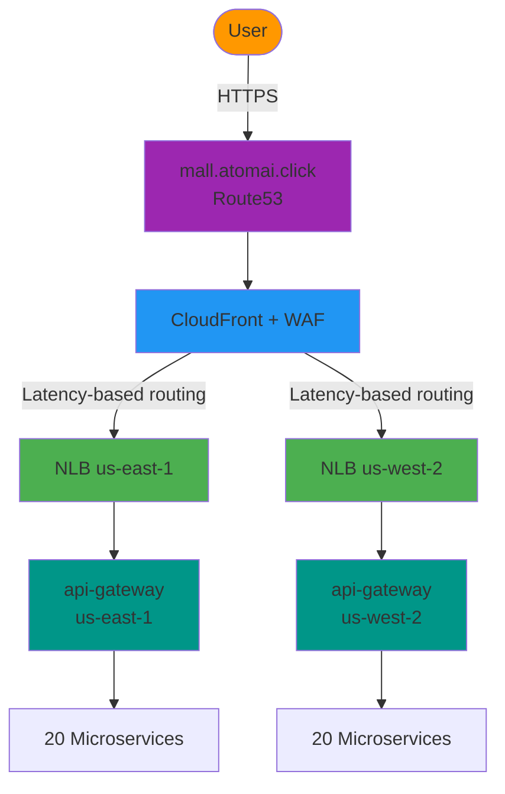
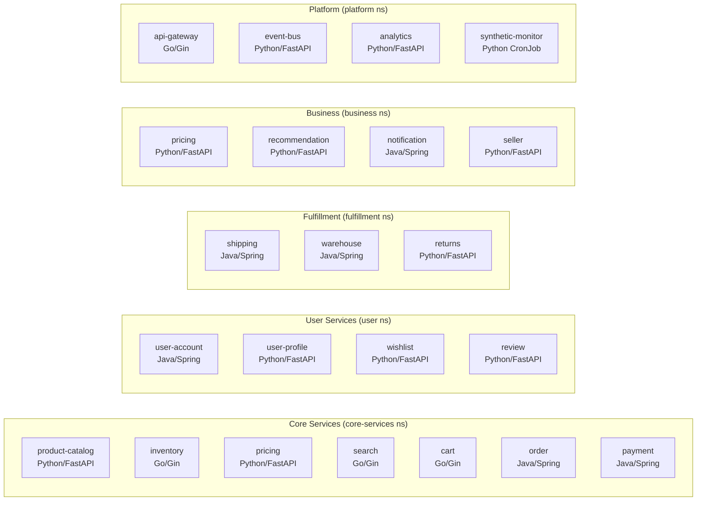
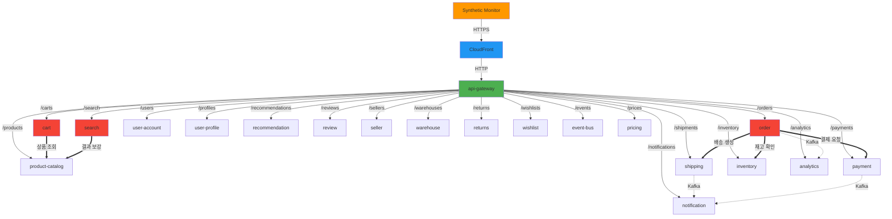
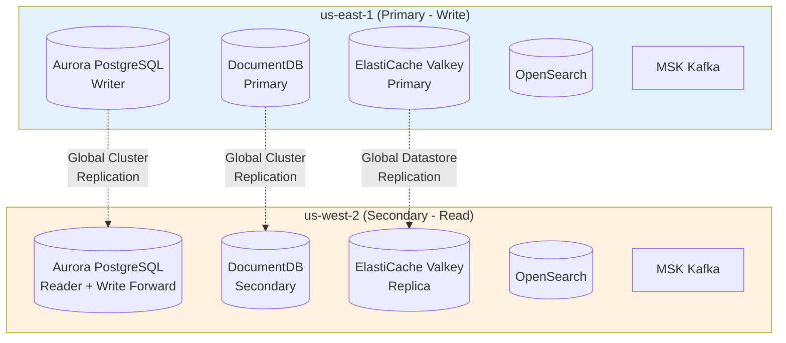
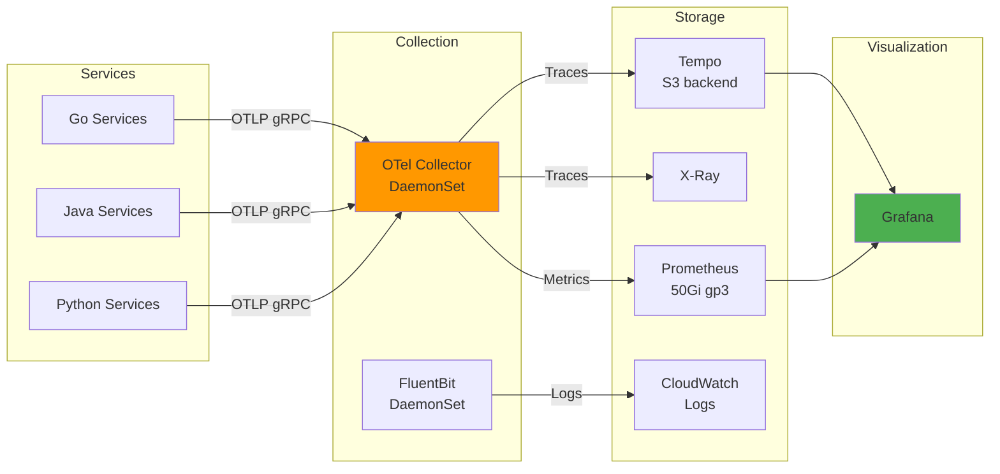

# Shopping Mall Application Architecture

Multi-region shopping mall platform: 20 microservices across 5 domains, deployed on EKS in us-east-1 (primary) and us-west-2 (secondary).

## Traffic Flow



## Domain Architecture

### 5 Domains, 20 Services



## Inter-Service Communication (Distributed Tracing)

Services make internal HTTP calls with W3C Trace Context propagation (`traceparent`/`tracestate` headers). The OTel Collector captures and exports traces to Tempo.

### Cascading Call Chains



**Legend:**
- **Solid thick arrows (==>)**: Inter-service HTTP calls with trace propagation
- **Dashed arrows (-.->)**: Async Kafka events (planned)
- **Thin arrows (-->)**: API gateway routing

### Call Chain Details

| Source Service | Target Service | Endpoint | Purpose | Trace Propagation |
|---|---|---|---|---|
| **order** (Java) | inventory | `GET /api/v1/inventory/{productId}` | 주문 시 재고 확인 | OTel Javaagent auto + manual traceparent |
| **order** (Java) | payment | `POST /api/v1/payments` | 결제 처리 요청 | OTel Javaagent auto + manual traceparent |
| **order** (Java) | shipping | `POST /api/v1/shipments` | 배송 생성 | OTel Javaagent auto + manual traceparent |
| **cart** (Go) | product-catalog | `GET /api/v1/products/{id}` | 장바구니 추가 시 상품 정보 조회 | OTel HTTP transport (otelhttp) |
| **search** (Go) | product-catalog | `GET /api/v1/products` | 검색 결과 보강 | OTel HTTP transport (otelhttp) |

### Expected Trace Waterfall (Tempo)

```
synthetic-monitor                    [=====================================]
  └─ CloudFront → api-gateway        [==================================]
       └─ POST /api/v1/orders (order)   [============================]
            ├─ GET /inventory/{id}         [========]  (inventory)
            ├─ POST /payments              [==========]  (payment)
            └─ POST /shipments             [========]  (shipping)

synthetic-monitor                    [=====================================]
  └─ CloudFront → api-gateway        [==================================]
       └─ POST /api/v1/carts (cart)     [========================]
            └─ GET /products/{id}          [========]  (product-catalog)

synthetic-monitor                    [=====================================]
  └─ CloudFront → api-gateway        [==================================]
       └─ GET /api/v1/search (search)   [========================]
            └─ GET /products               [========]  (product-catalog)
```

## Service Details

### Technology Stack

| Language | Framework | Services | OTel Instrumentation |
|---|---|---|---|
| **Go 1.22** | Gin | product-catalog(proxy), inventory, search, cart, api-gateway | `otelgin` middleware + `otelhttp` transport |
| **Java 21** | Spring Boot 3.2 | order, payment, shipping, user-account, warehouse, notification | OTel Javaagent v2.11.0 (auto-instrumentation) |
| **Python 3.13** | FastAPI | product-catalog, pricing, user-profile, wishlist, review, seller, returns, event-bus, analytics, recommendation | `opentelemetry-instrumentation-fastapi` |

### Service DNS (Cluster Internal)

All services are accessible via `<service-name>.<namespace>.svc.cluster.local:80`.

| Namespace | Services |
|---|---|
| `core-services` | product-catalog, inventory, pricing, search, cart, order, payment |
| `user` | user-account, user-profile, wishlist, review |
| `fulfillment` | shipping, warehouse, returns |
| `business` | pricing, recommendation, notification, seller |
| `platform` | api-gateway, event-bus, analytics, synthetic-monitor |

### Container Configuration

- **Image Registry**: `123456789012.dkr.ecr.us-east-1.amazonaws.com/shopping-mall/<service>:latest`
- **Container Port**: 8080
- **Service Port**: 80 → targetPort 8080
- **Health Probes**: `/health/ready`, `/health/live`, `/health/startup` (port 8080)
- **imagePullPolicy**: Always

## Data Architecture



**Data Pattern**: Write-Primary / Read-Local
- us-east-1 handles all writes
- us-west-2 reads locally, writes forwarded to primary via Aurora Global Write Forwarding

## Observability Stack



- **Traces**: OTel Collector → Tempo (S3 backend) + X-Ray
- **Metrics**: OTel Collector → Prometheus (kube-prometheus-stack)
- **Logs**: FluentBit → CloudWatch Logs
- **Visualization**: Grafana (Tempo + Prometheus datasources)
- **Tail-based sampling**: errors=100%, slow>500ms=100%, default=10%

## EKS & Compute

- **Cluster**: `multi-region-mall` (EKS v1.35) in both regions
- **Bootstrap Nodes**: 2x m5.large (system workloads: Karpenter, ArgoCD, CoreDNS)
- **Application Nodes**: Karpenter v1.9 with 6 NodePools:
  - `general`: default workloads (c5, m5, r5)
  - `critical`: order, payment, shipping (c5, m5 on-demand)
  - `api-tier`: api-gateway, search (c5, m5)
  - `worker-tier`: event-bus, analytics (m5, r5 spot)
  - `batch-tier`: synthetic-monitor, batch jobs (m5 spot)
  - `memory-tier`: recommendation, cache-heavy (r5, r6i)

## Synthetic Monitor

CronJob (`*/2 * * * *`) running 7 E2E scenarios every 2 minutes in both regions:

| Scenario | Services Touched | Inter-Service Chains |
|---|---|---|
| S1: Browse & Search | product-catalog, search, pricing, review, recommendation | search → product-catalog |
| S2: User Registration | user-account, user-profile, notification | - |
| S3: Shopping Cart | product-catalog, inventory, cart, pricing, recommendation, wishlist | cart → product-catalog |
| S4: Purchase Flow | order, payment, shipping | order → inventory → payment → shipping |
| S5: Seller & Warehouse | seller, warehouse, inventory | - |
| S6: Post-Purchase | review, returns, notification | - |
| S7: Platform & Analytics | event-bus, analytics, recommendation | - |

### Grafana Dashboard

- **Stat panels**: Total traces, East/West breakdown, Error count
- **Scenario tables**: Per-scenario trace list with clickable Trace ID → Explore waterfall
- **Latency comparison**: East vs West timeseries
- **Heatmap**: Latency distribution
- **Trace Explorer**: Recent traces per region
- **Service Map**: Node graph showing service relationships
