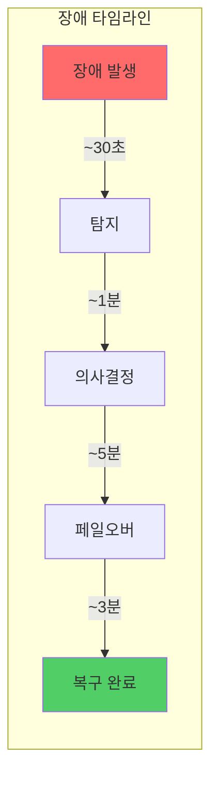
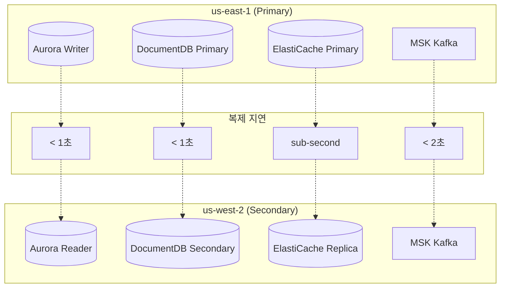
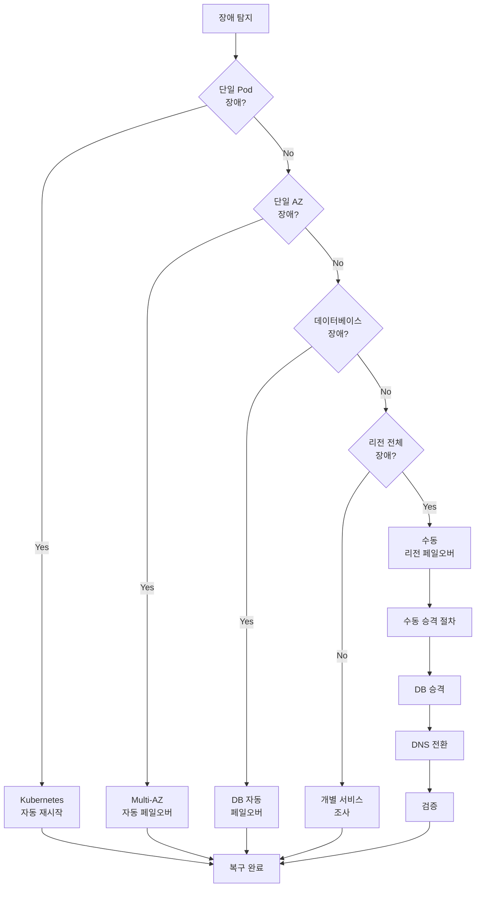
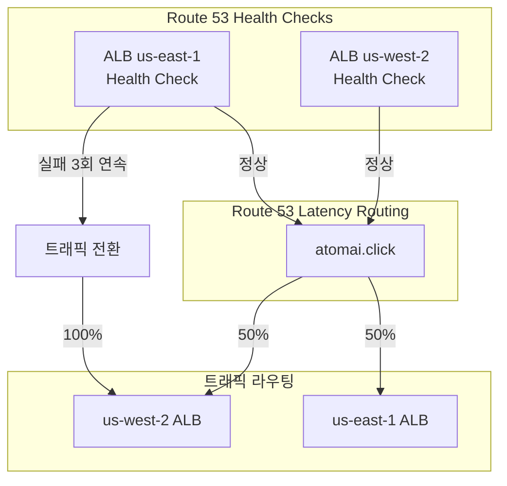
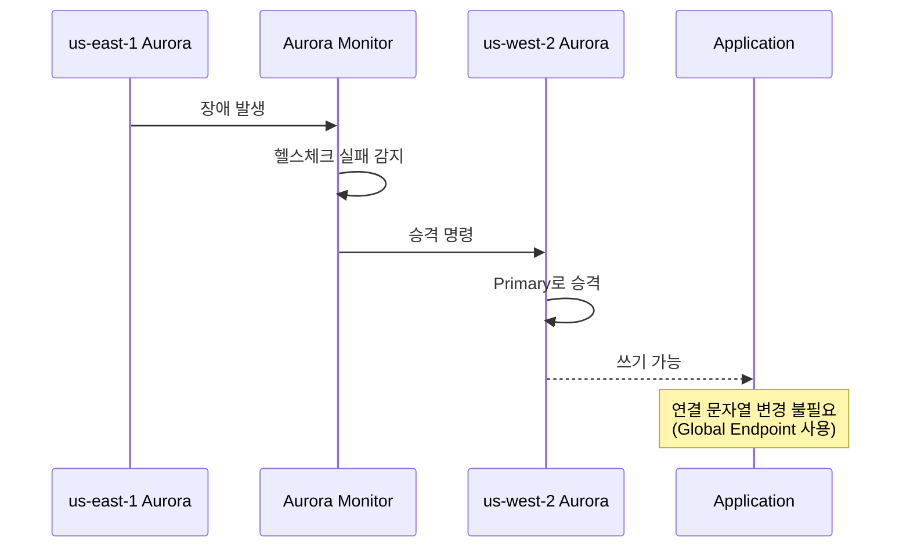
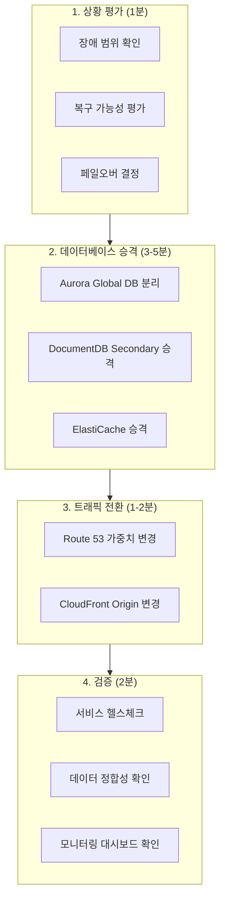
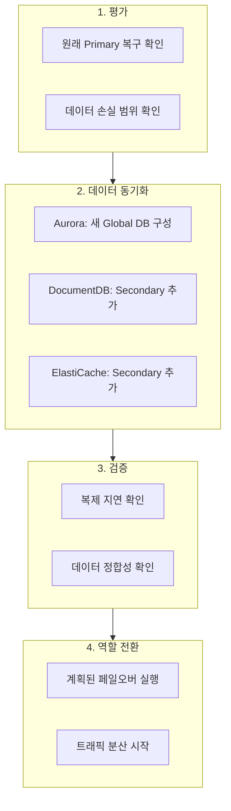

# 재해 복구

Multi-Region Shopping Mall은 **RPO < 1초, RTO < 10분**을 목표로 재해 복구(DR) 전략을 구현합니다. 이 문서에서는 데이터 복제 지연, 페일오버 절차, 그리고 복구 프로세스를 상세히 설명합니다.

## DR 목표

| 지표 | 목표 | 설명 |
|------|------|------|
| **RPO** (Recovery Point Objective) | < 1초 | 데이터 손실 허용 범위 |
| **RTO** (Recovery Time Objective) | < 10분 | 서비스 복구 시간 |
| **가용성** | 99.99% | 연간 다운타임 52분 이하 |



## 데이터 복제 지연

### 데이터 스토어별 복제 지연

| 데이터 스토어 | 복제 방식 | 평균 지연 | 최대 지연 | RPO 준수 |
|--------------|-----------|----------|----------|----------|
| **Aurora PostgreSQL** | Global Database | < 100ms | < 1초 | O |
| **DocumentDB** | Global Cluster | < 100ms | < 1초 | O |
| **ElastiCache Valkey** | Global Datastore | < 50ms | < 500ms | O |
| **MSK Kafka** | MSK Replicator | < 500ms | < 2초 | O |
| **OpenSearch** | 없음 (리전별) | N/A | N/A | N/A |



### 복제 지연 모니터링

```sql
-- Aurora Global Database 복제 지연 확인
SELECT
    server_id,
    session_id,
    replica_lag_in_msec,
    last_update_timestamp
FROM aurora_global_db_instance_status()
WHERE session_id = 'GLOBAL';
```

```bash
# ElastiCache Global Datastore 지연 확인
aws elasticache describe-global-replication-groups \
    --global-replication-group-id production-global-datastore \
    --query 'GlobalReplicationGroups[0].Members[*].{Region:ReplicationGroupRegion,Lag:GlobalReplicationGroupMemberRole}'

# CloudWatch 메트릭
aws cloudwatch get-metric-statistics \
    --namespace AWS/RDS \
    --metric-name AuroraGlobalDBReplicationLag \
    --dimensions Name=DBClusterIdentifier,Value=production-aurora-global-us-west-2 \
    --start-time $(date -d '1 hour ago' -u +%Y-%m-%dT%H:%M:%SZ) \
    --end-time $(date -u +%Y-%m-%dT%H:%M:%SZ) \
    --period 60 \
    --statistics Average
```

## 페일오버 결정 매트릭스

### 장애 유형별 대응

| 장애 유형 | 영향 범위 | 탐지 방법 | 페일오버 유형 | 예상 RTO |
|-----------|-----------|-----------|--------------|----------|
| **단일 EC2/Pod 장애** | 서비스 일부 | EKS Health Check | 자동 (Kubernetes) | < 30초 |
| **단일 AZ 장애** | AZ 내 리소스 | Route 53 Health Check | 자동 (Multi-AZ) | < 1분 |
| **Aurora Primary 장애** | 쓰기 작업 | Aurora Auto-failover | 자동 (Aurora) | 1-2분 |
| **EKS 클러스터 장애** | 리전 서비스 | ALB Health Check | 자동 (Route 53) | < 2분 |
| **전체 리전 장애** | 모든 서비스 | 수동 확인 | **수동** | 5-10분 |

### 페일오버 결정 흐름도



## 자동 페일오버

### Route 53 Health Check 기반



### Terraform 구성

```hcl
# Route 53 Health Check
resource "aws_route53_health_check" "alb_use1" {
  fqdn              = aws_lb.use1.dns_name
  port              = 443
  type              = "HTTPS"
  resource_path     = "/health"
  failure_threshold = 3
  request_interval  = 10

  tags = {
    Name = "alb-us-east-1-health-check"
  }
}

resource "aws_route53_health_check" "alb_usw2" {
  fqdn              = aws_lb.usw2.dns_name
  port              = 443
  type              = "HTTPS"
  resource_path     = "/health"
  failure_threshold = 3
  request_interval  = 10

  tags = {
    Name = "alb-us-west-2-health-check"
  }
}

# Latency-based routing with health check
resource "aws_route53_record" "api_use1" {
  zone_id = aws_route53_zone.main.zone_id
  name    = "api.atomai.click"
  type    = "A"

  alias {
    name                   = aws_lb.use1.dns_name
    zone_id                = aws_lb.use1.zone_id
    evaluate_target_health = true
  }

  latency_routing_policy {
    region = "us-east-1"
  }

  set_identifier  = "us-east-1"
  health_check_id = aws_route53_health_check.alb_use1.id
}

resource "aws_route53_record" "api_usw2" {
  zone_id = aws_route53_zone.main.zone_id
  name    = "api.atomai.click"
  type    = "A"

  alias {
    name                   = aws_lb.usw2.dns_name
    zone_id                = aws_lb.usw2.zone_id
    evaluate_target_health = true
  }

  latency_routing_policy {
    region = "us-west-2"
  }

  set_identifier  = "us-west-2"
  health_check_id = aws_route53_health_check.alb_usw2.id
}
```

### Aurora 자동 페일오버

Aurora Global Database는 Primary 클러스터 장애 시 자동으로 Secondary를 승격합니다.



## 수동 페일오버 절차

### 전체 리전 페일오버

전체 리전 장애 시 수동으로 Secondary를 Primary로 승격해야 합니다.



### 상세 절차

#### Step 1: Aurora Global Database 분리 및 승격

```bash
#!/bin/bash
# aurora-failover.sh

# 1. Global Database에서 Secondary 클러스터 분리
aws rds remove-from-global-cluster \
    --global-cluster-identifier production-aurora-global \
    --db-cluster-identifier production-aurora-global-us-west-2 \
    --region us-west-2

# 2. 분리된 클러스터가 standalone으로 전환될 때까지 대기
aws rds wait db-cluster-available \
    --db-cluster-identifier production-aurora-global-us-west-2 \
    --region us-west-2

# 3. 새 Primary 클러스터 확인
aws rds describe-db-clusters \
    --db-cluster-identifier production-aurora-global-us-west-2 \
    --region us-west-2 \
    --query 'DBClusters[0].{Status:Status,Endpoint:Endpoint}'

echo "Aurora failover completed. New primary: us-west-2"
```

#### Step 2: DocumentDB Global Cluster 승격

```bash
#!/bin/bash
# documentdb-failover.sh

# 1. Secondary 클러스터를 Primary로 승격
aws docdb failover-global-cluster \
    --global-cluster-identifier production-docdb-global \
    --target-db-cluster-identifier production-docdb-global-us-west-2 \
    --region us-west-2

# 2. 승격 완료 대기
aws docdb wait db-cluster-available \
    --db-cluster-identifier production-docdb-global-us-west-2 \
    --region us-west-2

echo "DocumentDB failover completed. New primary: us-west-2"
```

#### Step 3: ElastiCache Global Datastore 승격

```bash
#!/bin/bash
# elasticache-failover.sh

# 1. Global Datastore에서 us-west-2를 Primary로 승격
aws elasticache failover-global-replication-group \
    --global-replication-group-id production-global-datastore \
    --primary-region us-west-2 \
    --primary-replication-group-id production-elasticache-us-west-2

# 2. 상태 확인
aws elasticache describe-global-replication-groups \
    --global-replication-group-id production-global-datastore \
    --query 'GlobalReplicationGroups[0].Members'

echo "ElastiCache failover completed. New primary: us-west-2"
```

#### Step 4: DNS 및 트래픽 전환

```bash
#!/bin/bash
# dns-failover.sh

# 1. Route 53 레코드 가중치 변경 (us-east-1: 0, us-west-2: 100)
aws route53 change-resource-record-sets \
    --hosted-zone-id Z1234567890 \
    --change-batch '{
        "Changes": [
            {
                "Action": "UPSERT",
                "ResourceRecordSet": {
                    "Name": "api.atomai.click",
                    "Type": "A",
                    "SetIdentifier": "us-east-1",
                    "Weight": 0,
                    "AliasTarget": {
                        "HostedZoneId": "Z35SXDOTRQ7X7K",
                        "DNSName": "alb-use1.us-east-1.elb.amazonaws.com",
                        "EvaluateTargetHealth": false
                    }
                }
            },
            {
                "Action": "UPSERT",
                "ResourceRecordSet": {
                    "Name": "api.atomai.click",
                    "Type": "A",
                    "SetIdentifier": "us-west-2",
                    "Weight": 100,
                    "AliasTarget": {
                        "HostedZoneId": "Z1H1FL5HABSF5",
                        "DNSName": "alb-usw2.us-west-2.elb.amazonaws.com",
                        "EvaluateTargetHealth": false
                    }
                }
            }
        ]
    }'

echo "DNS failover completed. All traffic routed to us-west-2"
```

## 복구 절차 (Failback)

### 원래 Primary 복구 후 Failback



### Failback 스크립트

```bash
#!/bin/bash
# failback-to-use1.sh

echo "=== Step 1: Verify us-east-1 is healthy ==="
# 인프라 상태 확인
aws ec2 describe-availability-zones --region us-east-1

echo "=== Step 2: Re-establish Aurora Global DB ==="
# 새 Global DB 생성 (us-west-2가 현재 Primary)
aws rds create-global-cluster \
    --global-cluster-identifier production-aurora-global-v2 \
    --source-db-cluster-identifier production-aurora-us-west-2 \
    --region us-west-2

# us-east-1에 Secondary 클러스터 추가
aws rds create-db-cluster \
    --db-cluster-identifier production-aurora-us-east-1-v2 \
    --global-cluster-identifier production-aurora-global-v2 \
    --engine aurora-postgresql \
    --engine-version 15.4 \
    --region us-east-1

echo "=== Step 3: Wait for sync ==="
# 복제 지연이 0에 가까워질 때까지 대기
while true; do
    lag=$(aws rds describe-db-clusters \
        --db-cluster-identifier production-aurora-us-east-1-v2 \
        --region us-east-1 \
        --query 'DBClusters[0].GlobalWriteForwardingStatus' \
        --output text)
    if [ "$lag" == "enabled" ]; then
        break
    fi
    sleep 10
done

echo "=== Step 4: Planned failover to us-east-1 ==="
aws rds failover-global-cluster \
    --global-cluster-identifier production-aurora-global-v2 \
    --target-db-cluster-identifier production-aurora-us-east-1-v2

echo "=== Step 5: Gradually shift traffic ==="
# 10% -> 50% -> 100% 점진적 트래픽 이동
for weight in 10 50 100; do
    echo "Setting us-east-1 weight to $weight%"
    # Route 53 가중치 업데이트
    sleep 300  # 5분 모니터링
done

echo "Failback completed!"
```

## 모니터링 및 알림

### CloudWatch 알람

```hcl
# Aurora 복제 지연 알람
resource "aws_cloudwatch_metric_alarm" "aurora_replication_lag" {
  alarm_name          = "aurora-global-replication-lag-high"
  comparison_operator = "GreaterThanThreshold"
  evaluation_periods  = 3
  metric_name         = "AuroraGlobalDBReplicationLag"
  namespace           = "AWS/RDS"
  period              = 60
  statistic           = "Average"
  threshold           = 1000  # 1초

  dimensions = {
    DBClusterIdentifier = "production-aurora-global-us-west-2"
  }

  alarm_actions = [aws_sns_topic.alerts.arn]
  ok_actions    = [aws_sns_topic.alerts.arn]

  alarm_description = "Aurora Global DB replication lag exceeds 1 second"
}

# Route 53 Health Check 알람
resource "aws_cloudwatch_metric_alarm" "route53_health_use1" {
  alarm_name          = "route53-health-us-east-1-unhealthy"
  comparison_operator = "LessThanThreshold"
  evaluation_periods  = 1
  metric_name         = "HealthCheckStatus"
  namespace           = "AWS/Route53"
  period              = 60
  statistic           = "Minimum"
  threshold           = 1

  dimensions = {
    HealthCheckId = aws_route53_health_check.alb_use1.id
  }

  alarm_actions = [aws_sns_topic.alerts.arn]

  alarm_description = "us-east-1 ALB health check failing"
}
```

### DR 대시보드

```json
{
  "widgets": [
    {
      "title": "Aurora Global DB Replication Lag",
      "type": "metric",
      "properties": {
        "metrics": [
          ["AWS/RDS", "AuroraGlobalDBReplicationLag", "DBClusterIdentifier", "production-aurora-global-us-west-2"]
        ],
        "period": 60,
        "stat": "Average",
        "region": "us-west-2"
      }
    },
    {
      "title": "Route 53 Health Check Status",
      "type": "metric",
      "properties": {
        "metrics": [
          ["AWS/Route53", "HealthCheckStatus", "HealthCheckId", "health-check-use1"],
          ["AWS/Route53", "HealthCheckStatus", "HealthCheckId", "health-check-usw2"]
        ],
        "period": 60,
        "stat": "Minimum"
      }
    },
    {
      "title": "Cross-Region Latency",
      "type": "metric",
      "properties": {
        "metrics": [
          ["Custom/MultiRegion", "CrossRegionLatency", "SourceRegion", "us-east-1", "TargetRegion", "us-west-2"]
        ],
        "period": 60
      }
    }
  ]
}
```

## DR 테스트

### 정기 DR 훈련

| 훈련 유형 | 주기 | 범위 | 영향 |
|-----------|------|------|------|
| **테이블탑 훈련** | 월 1회 | 절차 검토 | 없음 |
| **컴포넌트 페일오버** | 분기 1회 | 개별 DB | 최소 |
| **전체 리전 페일오버** | 연 1회 | 전체 스택 | 계획된 다운타임 |

### 테스트 체크리스트

- [ ] Route 53 Health Check 동작 확인
- [ ] Aurora 자동 페일오버 테스트
- [ ] DocumentDB Secondary 승격 테스트
- [ ] ElastiCache Global Datastore 페일오버 테스트
- [ ] MSK Replicator 복제 지연 확인
- [ ] 애플리케이션 연결 문자열 자동 전환 확인
- [ ] 모니터링 알림 수신 확인
- [ ] Runbook 최신화 확인

## 다음 단계

- [보안](./security) - 보안 아키텍처 및 규정 준수
- [멀티리전 설계](./multi-region-design) - 리전 역할 및 트래픽 라우팅
