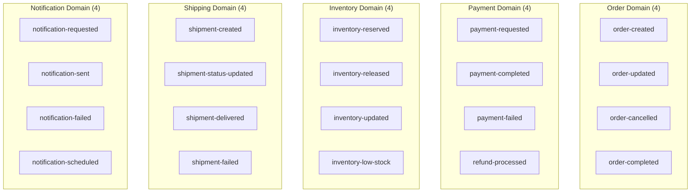
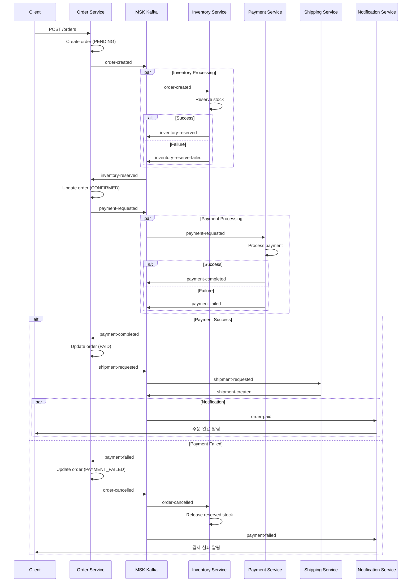
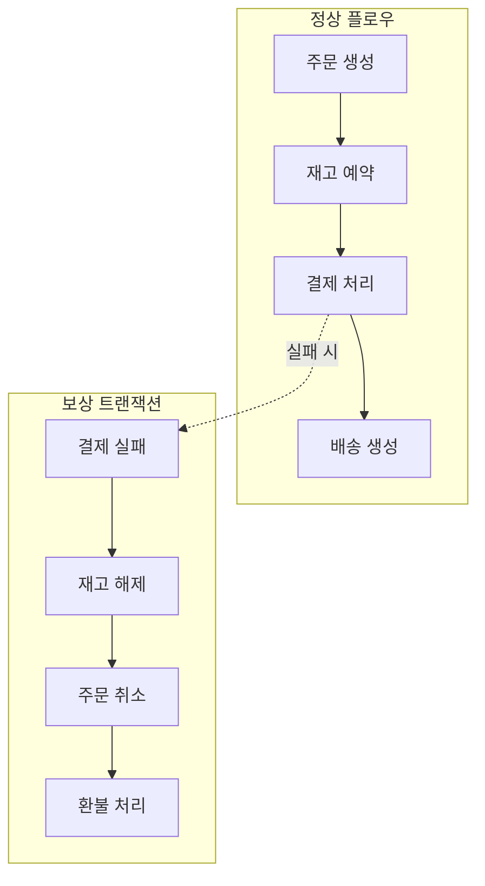
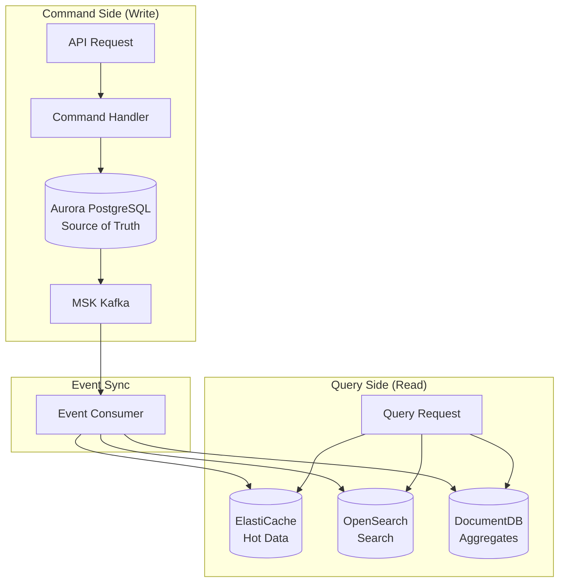
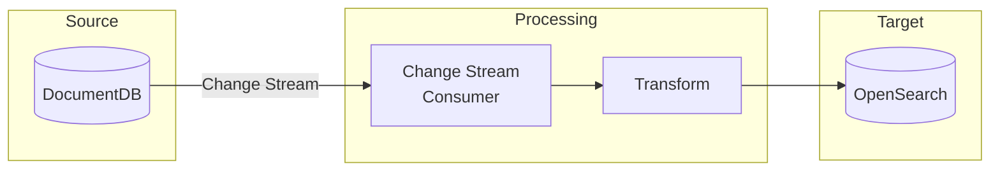
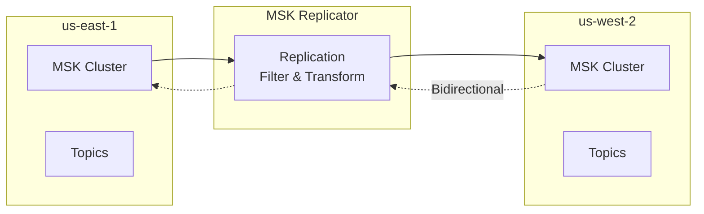
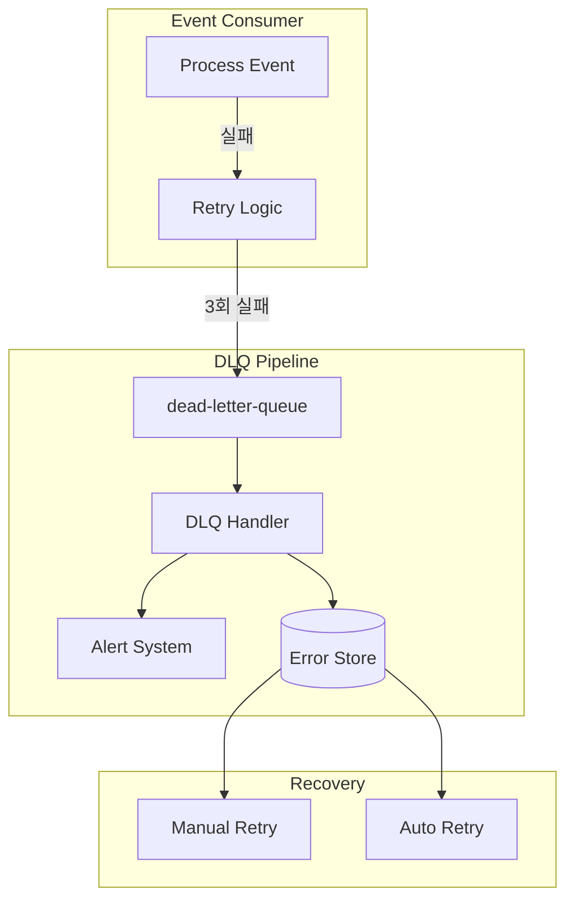

# 이벤트 기반 아키텍처

Multi-Region Shopping Mall은 **MSK Kafka**를 중심으로 한 이벤트 기반 아키텍처(EDA)를 구현합니다. 이를 통해 서비스 간 느슨한 결합, 비동기 처리, 그리고 SAGA 패턴 기반의 분산 트랜잭션을 지원합니다.

## MSK Kafka 토픽 구성

### 토픽 개요

총 **35개의 Kafka 토픽**이 도메인별로 구성되어 있습니다.



### 도메인별 토픽 상세

#### Order Domain (4 Topics)

| 토픽 | 파티션 | Producer | Consumer | 설명 |
|------|--------|----------|----------|------|
| `order-created` | 6 | Order Service | Payment, Inventory, Notification | 주문 생성 이벤트 |
| `order-updated` | 6 | Order Service | Analytics, Notification | 주문 상태 변경 |
| `order-cancelled` | 3 | Order Service | Payment, Inventory, Notification | 주문 취소 |
| `order-completed` | 3 | Order Service | Analytics, Recommendation | 주문 완료 |

```json
// order-created 이벤트 스키마
{
  "eventId": "evt-uuid-123",
  "eventType": "ORDER_CREATED",
  "timestamp": "2024-03-10T14:30:00Z",
  "version": "1.0",
  "source": "order-service",
  "correlationId": "corr-uuid-456",
  "payload": {
    "orderId": "ORD-12345",
    "userId": "USER-001",
    "items": [
      {
        "productId": "PROD-001",
        "sku": "S24U-256-BLK",
        "quantity": 1,
        "unitPrice": 1550000
      }
    ],
    "totalAmount": 1550000,
    "currency": "KRW",
    "shippingAddressId": "ADDR-001",
    "paymentMethod": "CREDIT_CARD"
  }
}
```

#### Payment Domain (4 Topics)

| 토픽 | 파티션 | Producer | Consumer | 설명 |
|------|--------|----------|----------|------|
| `payment-requested` | 6 | Payment Service | Payment Processor | 결제 요청 |
| `payment-completed` | 6 | Payment Service | Order, Inventory, Notification | 결제 완료 |
| `payment-failed` | 3 | Payment Service | Order, Notification | 결제 실패 |
| `refund-processed` | 3 | Payment Service | Order, Notification, Analytics | 환불 처리 완료 |

#### Inventory Domain (4 Topics)

| 토픽 | 파티션 | Producer | Consumer | 설명 |
|------|--------|----------|----------|------|
| `inventory-reserved` | 6 | Inventory Service | Order | 재고 예약 완료 |
| `inventory-released` | 3 | Inventory Service | Analytics | 재고 예약 해제 |
| `inventory-updated` | 6 | Inventory Service | Product Catalog, Search | 재고 수량 변경 |
| `inventory-low-stock` | 3 | Inventory Service | Notification, Seller | 재고 부족 알림 |

#### Shipping Domain (4 Topics)

| 토픽 | 파티션 | Producer | Consumer | 설명 |
|------|--------|----------|----------|------|
| `shipment-created` | 6 | Shipping Service | Order, Notification | 배송 생성 |
| `shipment-status-updated` | 6 | Shipping Service | Order, Notification | 배송 상태 변경 |
| `shipment-delivered` | 3 | Shipping Service | Order, Notification, Analytics | 배송 완료 |
| `shipment-failed` | 3 | Shipping Service | Order, Notification, Returns | 배송 실패 |

#### Notification Domain (4 Topics)

| 토픽 | 파티션 | Producer | Consumer | 설명 |
|------|--------|----------|----------|------|
| `notification-requested` | 6 | Various Services | Notification Service | 알림 요청 |
| `notification-sent` | 3 | Notification Service | Analytics | 알림 발송 완료 |
| `notification-failed` | 3 | Notification Service | Analytics, Retry Handler | 알림 발송 실패 |
| `notification-scheduled` | 3 | Notification Service | Scheduler | 예약 알림 |

#### User Domain (3 Topics)

| 토픽 | 파티션 | Producer | Consumer | 설명 |
|------|--------|----------|----------|------|
| `user-registered` | 3 | User Account | Notification, Analytics | 회원 가입 |
| `user-profile-updated` | 3 | User Profile | Recommendation | 프로필 변경 |
| `user-preferences-changed` | 3 | User Profile | Notification, Recommendation | 설정 변경 |

#### Product Domain (4 Topics)

| 토픽 | 파티션 | Producer | Consumer | 설명 |
|------|--------|----------|----------|------|
| `product-created` | 6 | Product Catalog | Search, Notification | 상품 등록 |
| `product-updated` | 6 | Product Catalog | Search, Cache Invalidator | 상품 수정 |
| `product-price-changed` | 6 | Pricing Service | Search, Notification, Wishlist | 가격 변경 |
| `product-discontinued` | 3 | Product Catalog | Search, Wishlist, Cart | 판매 중단 |

#### Review Domain (2 Topics)

| 토픽 | 파티션 | Producer | Consumer | 설명 |
|------|--------|----------|----------|------|
| `review-created` | 6 | Review Service | Product Catalog, Search, Notification | 리뷰 등록 |
| `review-moderated` | 3 | Review Service | Notification | 리뷰 검토 완료 |

#### Analytics Domain (3 Topics)

| 토픽 | 파티션 | Producer | Consumer | 설명 |
|------|--------|----------|----------|------|
| `analytics-page-view` | 12 | API Gateway | Analytics | 페이지 조회 |
| `analytics-user-action` | 12 | Various Services | Analytics | 사용자 행동 |
| `analytics-conversion` | 6 | Order Service | Analytics | 전환 이벤트 |

#### Infrastructure Domain (2 Topics)

| 토픽 | 파티션 | Producer | Consumer | 설명 |
|------|--------|----------|----------|------|
| `system-health` | 3 | All Services | Monitoring | 헬스체크 |
| `dead-letter-queue` | 6 | All Consumers | DLQ Handler | 처리 실패 이벤트 |

## SAGA 패턴 - 주문 플로우

### SAGA Orchestration

주문 생성은 여러 서비스의 협업이 필요한 분산 트랜잭션입니다. SAGA 패턴을 통해 이를 관리합니다.



### 보상 트랜잭션 (Compensating Transaction)



| 단계 | 정상 액션 | 보상 액션 | 트리거 이벤트 |
|------|-----------|-----------|--------------|
| 1 | 주문 생성 | 주문 취소 | `order-cancelled` |
| 2 | 재고 예약 | 재고 해제 | `inventory-released` |
| 3 | 결제 처리 | 환불 처리 | `refund-processed` |
| 4 | 배송 생성 | 배송 취소 | `shipment-cancelled` |

## CQRS 패턴

### Command와 Query 분리



### Write Model vs Read Model

| 측면 | Write Model | Read Model |
|------|-------------|------------|
| **목적** | 비즈니스 규칙 적용 | 빠른 조회 |
| **데이터** | 정규화 | 비정규화 (Denormalized) |
| **저장소** | Aurora PostgreSQL | ElastiCache, OpenSearch |
| **일관성** | Strong | Eventual |
| **스키마** | 트랜잭션 중심 | 조회 패턴 최적화 |

### 예시: 상품 상세 조회

```python
# Command Side - 상품 업데이트
@app.post("/products/{product_id}")
async def update_product(product_id: str, request: ProductUpdateRequest):
    # 1. DocumentDB에 저장 (Source of Truth)
    await docdb.products.update_one(
        {"productId": product_id},
        {"$set": request.dict()}
    )

    # 2. 이벤트 발행
    await kafka.send("product-updated", {
        "eventType": "PRODUCT_UPDATED",
        "productId": product_id,
        "changes": request.dict(),
        "timestamp": datetime.utcnow().isoformat()
    })

    return {"status": "updated"}

# Event Consumer - Read Model 동기화
async def handle_product_updated(event):
    product = await docdb.products.find_one({"productId": event["productId"]})

    # 1. OpenSearch 업데이트 (검색용)
    await opensearch.index(
        index="products",
        id=event["productId"],
        body=transform_for_search(product)
    )

    # 2. ElastiCache 무효화 (캐시)
    await cache.delete(f"product:{event['productId']}")

    # 3. 가격 변경 시 위시리스트 사용자 알림
    if "pricing" in event["changes"]:
        await notify_wishlist_users(event["productId"], product["pricing"])

# Query Side - 상품 조회
@app.get("/products/{product_id}")
async def get_product(product_id: str):
    # 1. 캐시 확인
    cached = await cache.get(f"product:{product_id}")
    if cached:
        return json.loads(cached)

    # 2. DocumentDB 조회
    product = await docdb.products.find_one({"productId": product_id})

    # 3. 캐시 저장
    await cache.set(
        f"product:{product_id}",
        json.dumps(product),
        ex=3600  # 1시간
    )

    return product
```

## DocumentDB Change Stream → OpenSearch 동기화

### 아키텍처



### 구현

```go
// Go - Change Stream Consumer
package main

import (
    "context"
    "encoding/json"
    "log"

    "go.mongodb.org/mongo-driver/bson"
    "go.mongodb.org/mongo-driver/mongo"
    "go.mongodb.org/mongo-driver/mongo/options"
    "github.com/opensearch-project/opensearch-go"
)

type ChangeStreamConsumer struct {
    docdbClient *mongo.Client
    osClient    *opensearch.Client
}

func (c *ChangeStreamConsumer) WatchProducts(ctx context.Context) error {
    collection := c.docdbClient.Database("mall").Collection("products")

    pipeline := mongo.Pipeline{
        {{"$match", bson.D{
            {"operationType", bson.D{{"$in", bson.A{"insert", "update", "replace", "delete"}}}},
        }}},
    }

    opts := options.ChangeStream().SetFullDocument(options.UpdateLookup)
    stream, err := collection.Watch(ctx, pipeline, opts)
    if err != nil {
        return err
    }
    defer stream.Close(ctx)

    for stream.Next(ctx) {
        var change bson.M
        if err := stream.Decode(&change); err != nil {
            log.Printf("Error decoding change: %v", err)
            continue
        }

        if err := c.processChange(ctx, change); err != nil {
            log.Printf("Error processing change: %v", err)
            // DLQ로 전송
            c.sendToDLQ(change)
        }
    }

    return stream.Err()
}

func (c *ChangeStreamConsumer) processChange(ctx context.Context, change bson.M) error {
    operationType := change["operationType"].(string)

    switch operationType {
    case "insert", "update", "replace":
        fullDoc := change["fullDocument"].(bson.M)
        return c.indexProduct(ctx, fullDoc)
    case "delete":
        docKey := change["documentKey"].(bson.M)
        productId := docKey["productId"].(string)
        return c.deleteProduct(ctx, productId)
    }

    return nil
}

func (c *ChangeStreamConsumer) indexProduct(ctx context.Context, doc bson.M) error {
    // OpenSearch 문서로 변환
    searchDoc := map[string]interface{}{
        "productId":   doc["productId"],
        "name":        doc["name"],
        "brand":       doc["brand"],
        "category":    doc["category"],
        "description": doc["description"].(bson.M)["short"],
        "tags":        doc["tags"],
        "price":       doc["pricing"].(bson.M)["listPrice"],
        "salePrice":   doc["pricing"].(bson.M)["salePrice"],
        "rating":      doc["ratings"].(bson.M)["average"],
        "reviewCount": doc["ratings"].(bson.M)["count"],
        "sellerId":    doc["seller"].(bson.M)["sellerId"],
        "status":      doc["status"],
        "updatedAt":   doc["updatedAt"],
    }

    body, _ := json.Marshal(searchDoc)

    _, err := c.osClient.Index(
        "products",
        bytes.NewReader(body),
        c.osClient.Index.WithDocumentID(doc["productId"].(string)),
        c.osClient.Index.WithRefresh("true"),
    )

    return err
}
```

## Cross-Region MSK Replicator

### 구성



### 복제 토픽 설정

| 토픽 | 복제 방향 | 이유 |
|------|-----------|------|
| `order-*` | Primary → Secondary | 주문 이벤트는 Primary에서 생성 |
| `payment-*` | Primary → Secondary | 결제는 Primary에서만 처리 |
| `inventory-*` | Bidirectional | 재고 정보는 양쪽에서 필요 |
| `product-*` | Bidirectional | 상품 정보 동기화 |
| `notification-*` | Primary → Secondary | 알림은 Primary에서 조율 |
| `analytics-*` | Both → Primary | 분석 데이터는 Primary로 집계 |

### Terraform 설정

```hcl
resource "aws_msk_replicator" "cross_region" {
  replicator_name = "cross-region-replicator"
  description     = "Replicate events between us-east-1 and us-west-2"

  service_execution_role_arn = aws_iam_role.msk_replicator.arn

  kafka_cluster {
    amazon_msk_cluster {
      msk_cluster_arn = aws_msk_cluster.use1.arn
    }
    vpc_config {
      security_groups_to_add = [aws_security_group.msk_use1.id]
      subnet_ids             = aws_subnet.use1_private[*].id
    }
  }

  kafka_cluster {
    amazon_msk_cluster {
      msk_cluster_arn = aws_msk_cluster.usw2.arn
    }
    vpc_config {
      security_groups_to_add = [aws_security_group.msk_usw2.id]
      subnet_ids             = aws_subnet.usw2_private[*].id
    }
  }

  replication_info_list {
    source_kafka_cluster_arn = aws_msk_cluster.use1.arn
    target_kafka_cluster_arn = aws_msk_cluster.usw2.arn

    topic_replication {
      topics_to_replicate = ["order-*", "payment-*", "product-*", "inventory-*"]
      copy_topic_configurations = true
      copy_access_control_lists_for_topics = true
      detect_and_copy_new_topics = true
    }

    consumer_group_replication {
      consumer_groups_to_replicate = [".*"]
      synchronise_consumer_group_offsets = true
    }

    target_compression_type = "GZIP"
  }
}
```

## Dead Letter Queue (DLQ) 전략

### DLQ 아키텍처



### DLQ 메시지 스키마

```json
{
  "dlqId": "dlq-uuid-123",
  "originalTopic": "order-created",
  "originalKey": "ORD-12345",
  "originalEvent": {
    "eventId": "evt-uuid-123",
    "eventType": "ORDER_CREATED",
    "payload": { }
  },
  "error": {
    "type": "ProcessingException",
    "message": "Inventory service unavailable",
    "stackTrace": "...",
    "consumerGroup": "inventory-consumer"
  },
  "retryCount": 3,
  "firstFailedAt": "2024-03-10T14:30:00Z",
  "lastFailedAt": "2024-03-10T14:35:00Z",
  "status": "PENDING"  // PENDING, RETRYING, RESOLVED, DISCARDED
}
```

### Consumer Group 설계

| Consumer Group | 서비스 | 구독 토픽 | 인스턴스 |
|----------------|--------|-----------|----------|
| `order-payment-consumer` | Payment | `order-created` | 3 |
| `order-inventory-consumer` | Inventory | `order-created`, `order-cancelled` | 3 |
| `order-notification-consumer` | Notification | `order-*` | 2 |
| `payment-order-consumer` | Order | `payment-*` | 3 |
| `shipment-order-consumer` | Order | `shipment-*` | 2 |
| `product-search-consumer` | Search | `product-*` | 3 |
| `analytics-consumer` | Analytics | `analytics-*` | 6 |

## 이벤트 처리 보장

### At-Least-Once 처리

```java
// Java Spring Kafka Consumer
@KafkaListener(
    topics = "order-created",
    groupId = "payment-order-consumer",
    containerFactory = "kafkaListenerContainerFactory"
)
public void handleOrderCreated(
    @Payload OrderCreatedEvent event,
    @Header(KafkaHeaders.RECEIVED_KEY) String key,
    Acknowledgment ack
) {
    try {
        // 멱등성 체크 (이미 처리된 이벤트인지 확인)
        if (processedEventRepository.exists(event.getEventId())) {
            log.info("Event already processed: {}", event.getEventId());
            ack.acknowledge();
            return;
        }

        // 비즈니스 로직 처리
        paymentService.initiatePayment(event);

        // 처리 완료 기록
        processedEventRepository.save(new ProcessedEvent(
            event.getEventId(),
            Instant.now()
        ));

        // 수동 커밋
        ack.acknowledge();

    } catch (RetryableException e) {
        // 재시도 가능한 오류 - 커밋하지 않음
        throw e;
    } catch (Exception e) {
        // 재시도 불가능한 오류 - DLQ로 전송
        dlqProducer.send(event, e);
        ack.acknowledge();
    }
}
```

### 멱등성 (Idempotency) 보장

```python
# Python - 멱등성 처리
class IdempotentEventHandler:
    def __init__(self, redis_client, handler_func):
        self.redis = redis_client
        self.handler = handler_func

    async def handle(self, event: dict):
        event_id = event["eventId"]
        lock_key = f"event_lock:{event_id}"
        processed_key = f"event_processed:{event_id}"

        # 1. 이미 처리된 이벤트인지 확인
        if await self.redis.exists(processed_key):
            logger.info(f"Event {event_id} already processed, skipping")
            return

        # 2. 분산 락 획득
        lock_acquired = await self.redis.set(
            lock_key, "1",
            ex=30,  # 30초 타임아웃
            nx=True  # 이미 존재하면 실패
        )

        if not lock_acquired:
            logger.info(f"Event {event_id} is being processed by another instance")
            return

        try:
            # 3. 이벤트 처리
            await self.handler(event)

            # 4. 처리 완료 기록 (7일 유지)
            await self.redis.set(processed_key, "1", ex=604800)

        finally:
            # 5. 락 해제
            await self.redis.delete(lock_key)
```

## 다음 단계

- [재해 복구](./disaster-recovery) - 이벤트 기반 복구 절차
- [데이터 아키텍처](./data) - 데이터 스토어 동기화
