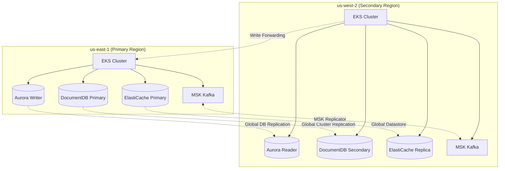
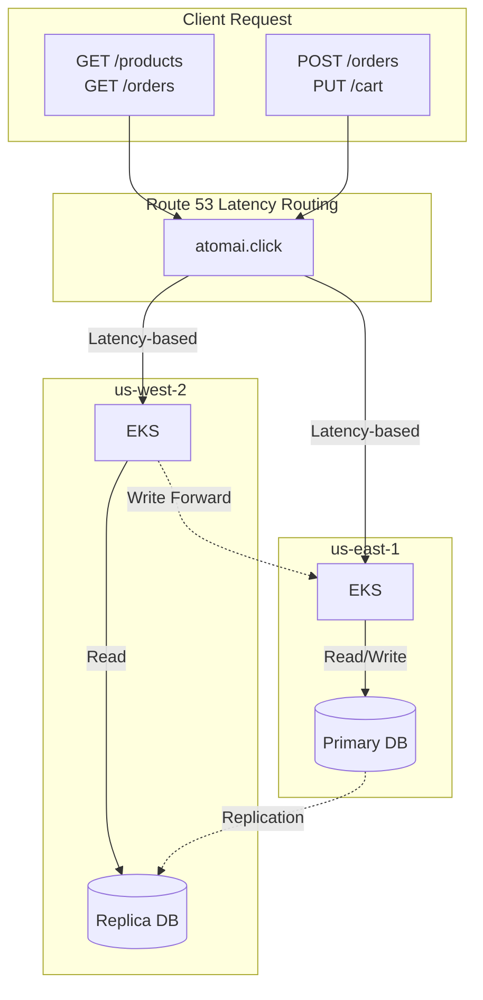
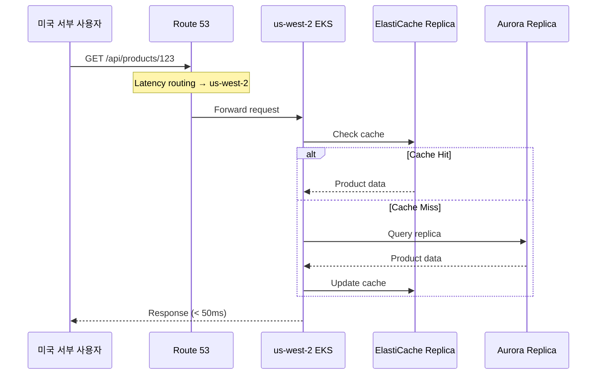
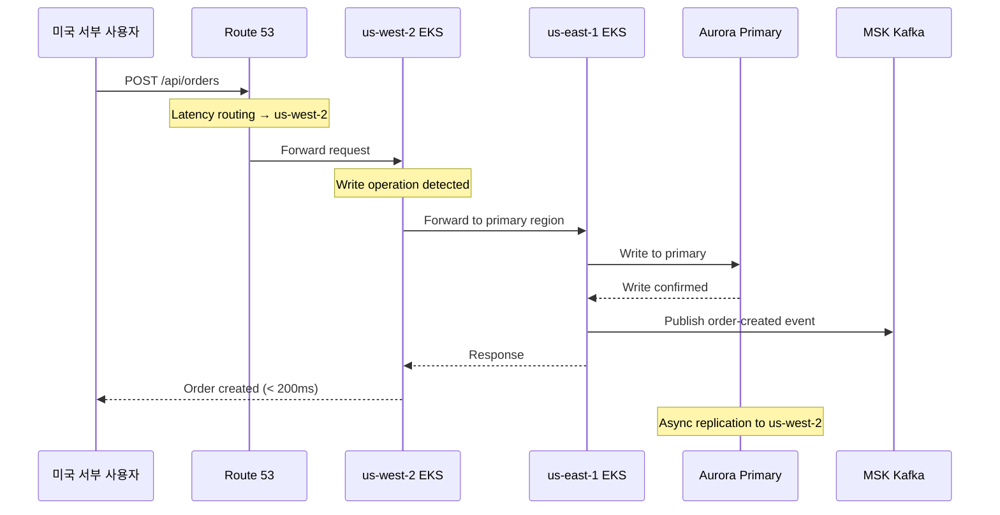
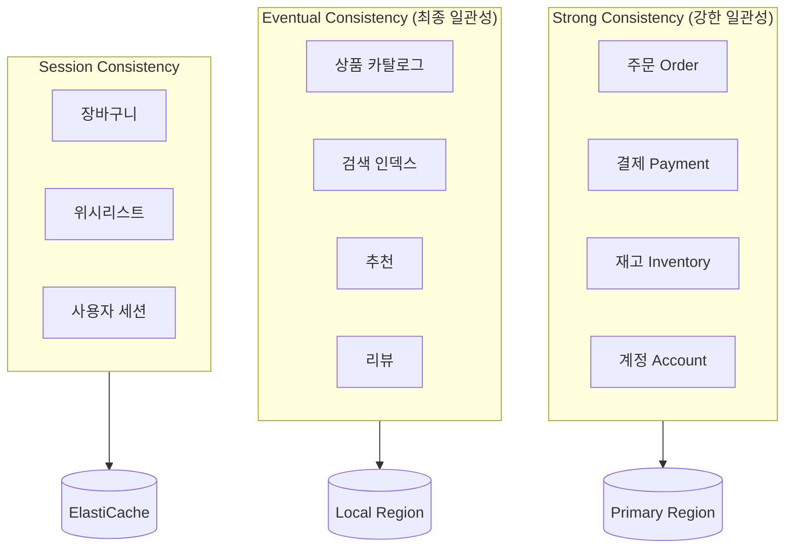
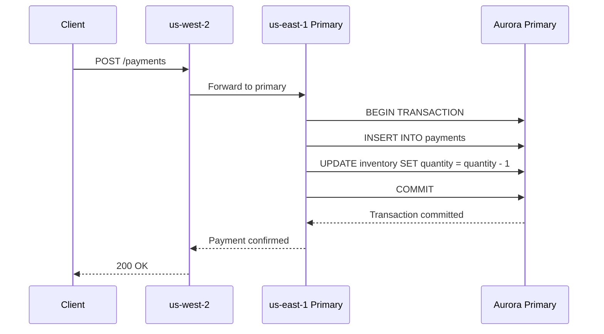
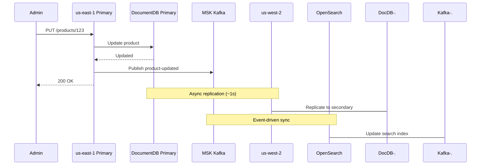
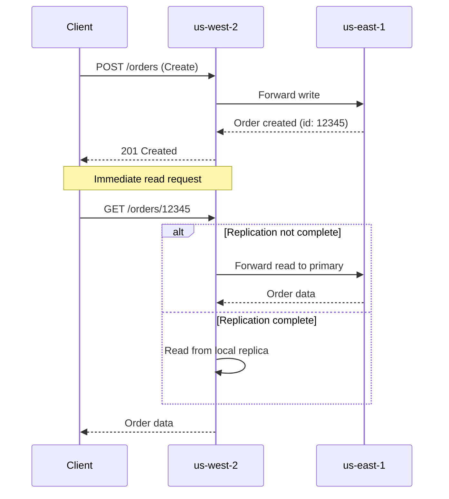
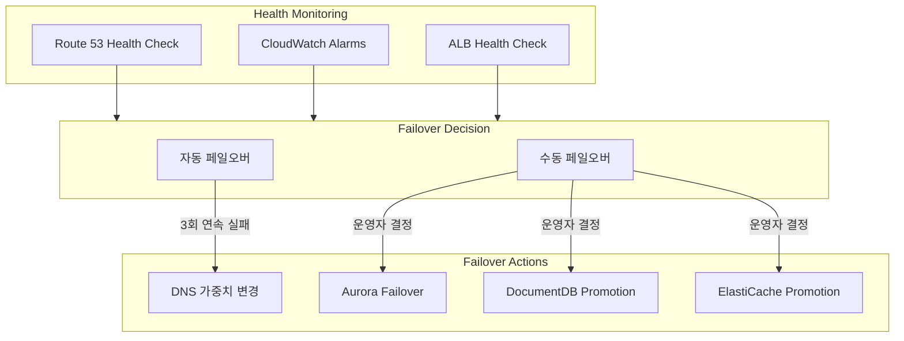

# 멀티리전 설계

Multi-Region Shopping Mall은 **Write-Primary/Read-Local** 패턴을 기반으로 한 Active-Active 멀티리전 아키텍처를 구현합니다. 이 문서에서는 왜 이 패턴을 선택했는지, 어떻게 동작하는지, 그리고 일관성 모델에 대해 상세히 설명합니다.

## 리전 역할 할당

| 리전 | 역할 | 책임 |
|------|------|------|
| **us-east-1** | Primary | 모든 쓰기 작업, 글로벌 데이터 마스터 |
| **us-west-2** | Secondary | 읽기 작업, 쓰기 전달, 장애 시 승격 가능 |



## Why Active-Active?

### 비교: Active-Passive vs Active-Active

| 항목 | Active-Passive | Active-Active |
|------|----------------|---------------|
| **리소스 활용** | Secondary 유휴 상태 | 양쪽 리전 모두 활용 |
| **읽기 지연시간** | 단일 리전 의존 | 사용자 근처 리전에서 처리 |
| **페일오버 시간** | DNS 전파 대기 (수 분) | 즉시 (이미 트래픽 처리 중) |
| **비용 효율성** | 낮음 (대기 리소스) | 높음 (평상시 부하 분산) |
| **구현 복잡도** | 낮음 | 높음 (데이터 일관성 관리) |

### Active-Active 선택 이유

1. **99.99% 가용성 목표**: 단일 리전 장애에도 서비스 지속
2. **글로벌 사용자 경험**: 사용자에게 가장 가까운 리전에서 응답
3. **비용 최적화**: 양쪽 리전 리소스를 평상시에도 활용
4. **점진적 페일오버**: 트래픽이 이미 분산되어 있어 전환이 매끄러움

## Write-Primary / Read-Local 패턴

### 패턴 개요



### Read Path (로컬 읽기)



**Read Path 특징:**
- 사용자에게 가장 가까운 리전에서 처리
- ElastiCache를 먼저 확인하여 지연시간 최소화
- Aurora/DocumentDB 로컬 복제본에서 읽기
- 평균 응답 시간: 30-50ms

### Write Path (Primary 전달)



**Write Path 특징:**
- Secondary 리전에서 받은 쓰기 요청은 Primary로 전달
- Primary에서 트랜잭션 처리 후 응답
- 이벤트는 MSK Kafka로 발행
- 데이터는 비동기로 Secondary에 복제
- 평균 응답 시간: 150-200ms

## Write Forwarding 메커니즘

### 서비스 레벨 구현

```go
// Go 서비스 예시 (Order Service)
func (h *OrderHandler) CreateOrder(c *gin.Context) {
    region := os.Getenv("AWS_REGION")
    primaryRegion := os.Getenv("PRIMARY_REGION") // "us-east-1"

    if region != primaryRegion {
        // Secondary 리전이면 Primary로 전달
        resp, err := h.forwardToPrimary(c.Request)
        if err != nil {
            c.JSON(500, gin.H{"error": "Primary region unavailable"})
            return
        }
        c.Data(resp.StatusCode, "application/json", resp.Body)
        return
    }

    // Primary 리전에서 직접 처리
    order, err := h.orderService.Create(c.Request.Context(), orderRequest)
    // ...
}
```

```java
// Java 서비스 예시 (Payment Service)
@Service
public class PaymentService {

    @Value("${aws.region}")
    private String currentRegion;

    @Value("${primary.region}")
    private String primaryRegion;

    public PaymentResponse processPayment(PaymentRequest request) {
        if (!currentRegion.equals(primaryRegion)) {
            return forwardToPrimary(request);
        }

        // Primary 리전에서 직접 처리
        return executePayment(request);
    }
}
```

### Aurora Global Database Write Forwarding

Aurora Global Database는 네이티브 Write Forwarding을 지원합니다.

```sql
-- Secondary 리전에서 실행
-- Aurora가 자동으로 Primary로 전달
INSERT INTO orders (user_id, total_amount, status)
VALUES ('user-123', 150000, 'PENDING');

-- Write Forwarding 활성화 확인
SELECT * FROM aurora_global_db_status();
```

```hcl
# Terraform 설정
resource "aws_rds_cluster" "secondary" {
  # ...
  enable_global_write_forwarding = true
}
```

## 일관성 모델

### 데이터 유형별 일관성 전략



| 일관성 수준 | 적용 대상 | 이유 | 복제 지연 허용 |
|-------------|-----------|------|---------------|
| **Strong** | 주문, 결제, 재고, 계정 | 금융 트랜잭션, 중복 방지 필수 | 0 (동기) |
| **Eventual** | 상품 카탈로그, 검색, 추천, 리뷰 | 약간의 지연 허용, 읽기 성능 중시 | 1-2초 |
| **Session** | 장바구니, 위시리스트, 세션 | 사용자별 격리, 즉각적 반영 필요 | N/A (캐시) |

### Strong Consistency 구현

금융 트랜잭션은 반드시 Primary 리전에서 처리합니다.



### Eventual Consistency 구현

카탈로그, 검색 데이터는 최종 일관성으로 처리합니다.



## Read-After-Write 일관성

사용자가 쓰기 직후 자신의 데이터를 읽을 때 일관성을 보장합니다.



### 구현 전략

```python
# Python 서비스 예시
class OrderService:
    def get_order(self, order_id: str, user_id: str) -> Order:
        # 1. 로컬 캐시 확인
        cached = self.cache.get(f"order:{order_id}")
        if cached:
            return cached

        # 2. 최근 쓰기 여부 확인 (Session sticky)
        recent_write = self.cache.get(f"recent_write:{user_id}:{order_id}")

        if recent_write:
            # Primary에서 읽기 (강한 일관성)
            return self.read_from_primary(order_id)
        else:
            # Local replica에서 읽기 (성능 우선)
            return self.read_from_local(order_id)
```

## 리전 페일오버

### 자동 페일오버 조건



### 페일오버 시나리오

| 장애 유형 | 영향 범위 | 자동/수동 | 예상 복구 시간 |
|-----------|-----------|-----------|---------------|
| 단일 AZ 장애 | 해당 AZ 서비스 | 자동 (EKS) | 30초 |
| EKS 클러스터 장애 | 리전 서비스 | 자동 (Route 53) | 1분 |
| Aurora Primary 장애 | 쓰기 작업 | 자동 (Aurora) | 1-2분 |
| 전체 리전 장애 | 모든 서비스 | 수동 (승격 필요) | 5-10분 |

## 다음 단계

- [네트워크 아키텍처](./network) - VPC 설계 및 리전 간 연결
- [데이터 아키텍처](./data) - 데이터 스토어별 복제 전략
- [재해 복구](./disaster-recovery) - 상세 페일오버 절차
