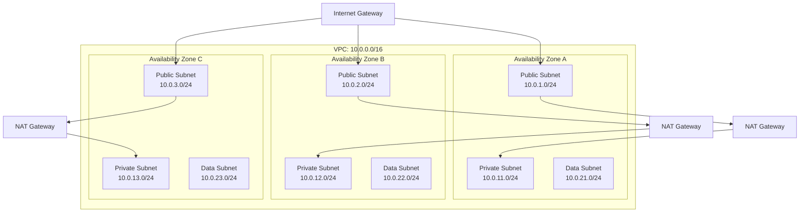
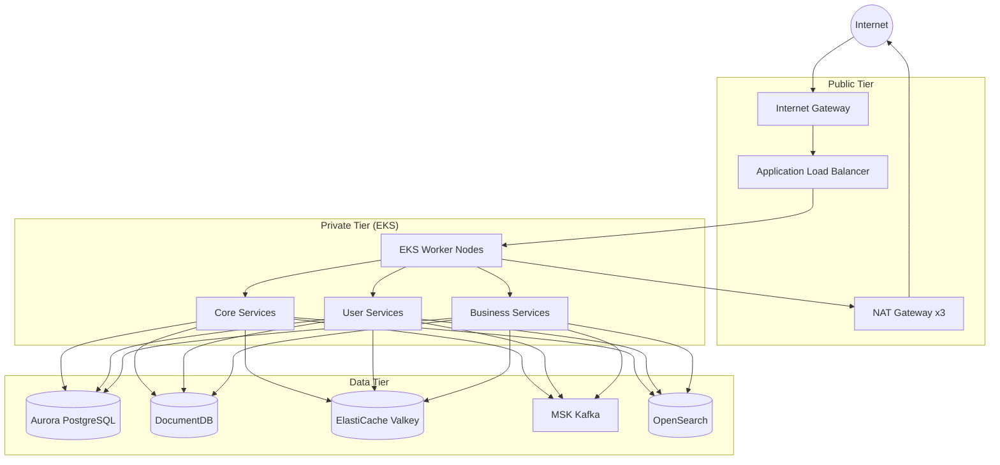
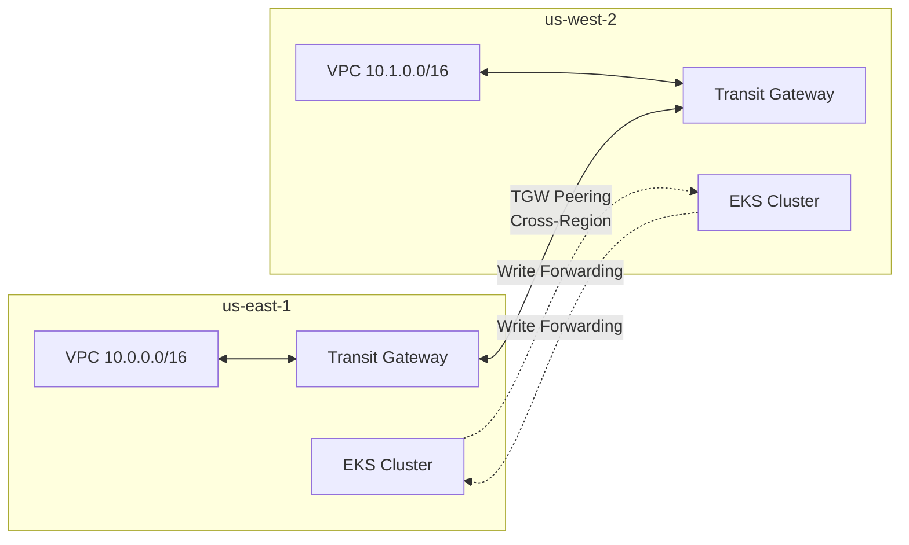
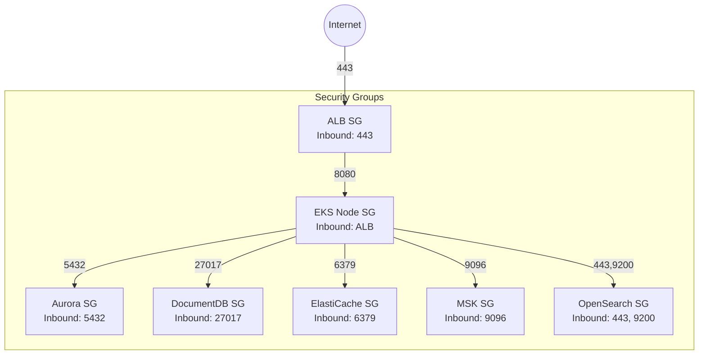
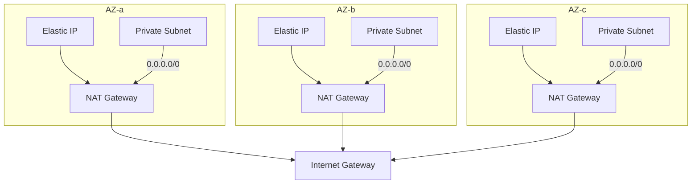
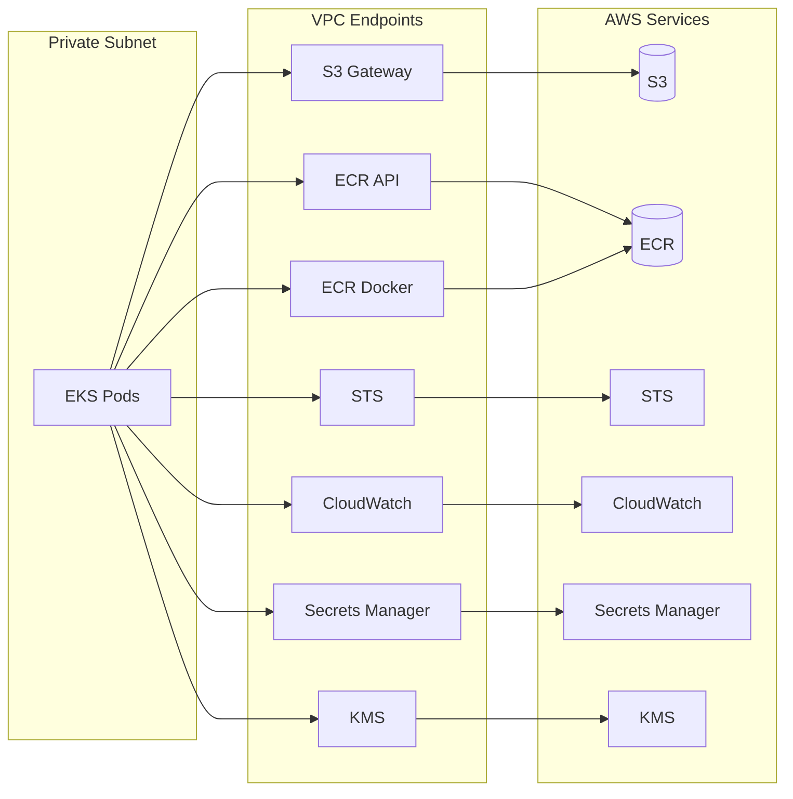
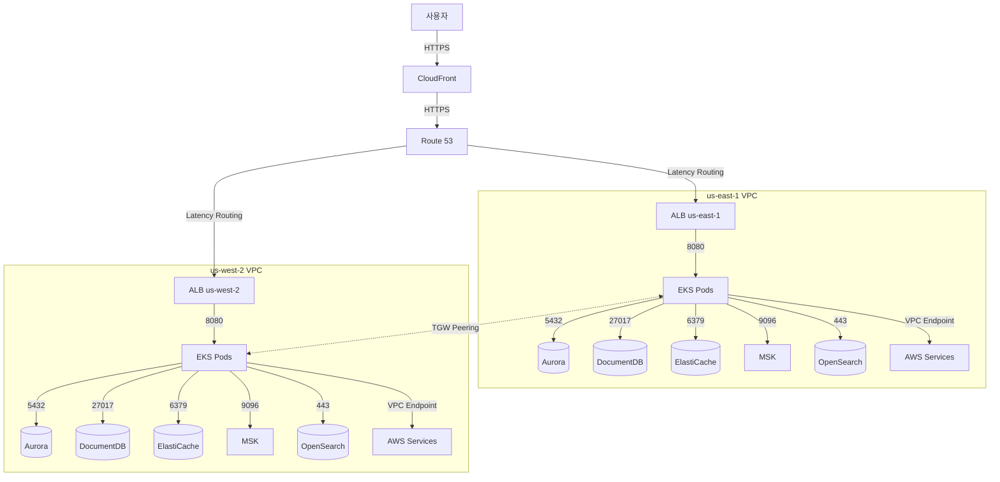

# 네트워크 아키텍처

Multi-Region Shopping Mall의 네트워크는 3-tier VPC 아키텍처를 기반으로 설계되었습니다. 각 리전은 독립적인 VPC를 가지며, Transit Gateway Peering을 통해 리전 간 통신을 수행합니다.

## VPC 설계

### CIDR 블록 할당

| 리전 | VPC CIDR | 용도 |
|------|----------|------|
| us-east-1 | 10.0.0.0/16 | Primary Region |
| us-west-2 | 10.1.0.0/16 | Secondary Region |

### us-east-1 서브넷 구성



| Tier | AZ-a | AZ-b | AZ-c | 용도 |
|------|------|------|------|------|
| **Public** | 10.0.1.0/24 | 10.0.2.0/24 | 10.0.3.0/24 | ALB, NAT Gateway |
| **Private** | 10.0.11.0/24 | 10.0.12.0/24 | 10.0.13.0/24 | EKS Worker Nodes |
| **Data** | 10.0.21.0/24 | 10.0.22.0/24 | 10.0.23.0/24 | Aurora, DocumentDB, ElastiCache, MSK, OpenSearch |

### us-west-2 서브넷 구성

| Tier | AZ-a | AZ-b | AZ-c | 용도 |
|------|------|------|------|------|
| **Public** | 10.1.1.0/24 | 10.1.2.0/24 | 10.1.3.0/24 | ALB, NAT Gateway |
| **Private** | 10.1.11.0/24 | 10.1.12.0/24 | 10.1.13.0/24 | EKS Worker Nodes |
| **Data** | 10.1.21.0/24 | 10.1.22.0/24 | 10.1.23.0/24 | Aurora, DocumentDB, ElastiCache, MSK, OpenSearch |

## 3-Tier 아키텍처



### Tier별 역할

| Tier | 구성 요소 | 인터넷 접근 | 인바운드 트래픽 |
|------|-----------|------------|----------------|
| **Public** | ALB, NAT Gateway | Direct | Internet → ALB |
| **Private** | EKS Nodes, Pods | NAT Gateway 경유 | ALB → EKS |
| **Data** | 모든 데이터 스토어 | 없음 | EKS → Data stores |

## Transit Gateway Peering

리전 간 통신을 위해 Transit Gateway Peering을 사용합니다.



### Transit Gateway 라우팅 테이블

**us-east-1 TGW Route Table:**

| Destination | Target | 용도 |
|-------------|--------|------|
| 10.0.0.0/16 | VPC Attachment | 로컬 VPC |
| 10.1.0.0/16 | Peering Attachment | us-west-2 VPC |

**us-west-2 TGW Route Table:**

| Destination | Target | 용도 |
|-------------|--------|------|
| 10.1.0.0/16 | VPC Attachment | 로컬 VPC |
| 10.0.0.0/16 | Peering Attachment | us-east-1 VPC |

### Terraform 구성

```hcl
# us-east-1 Transit Gateway
resource "aws_ec2_transit_gateway" "use1" {
  provider = aws.us-east-1

  description                     = "Multi-region TGW us-east-1"
  default_route_table_association = "enable"
  default_route_table_propagation = "enable"

  tags = {
    Name = "multi-region-tgw-use1"
  }
}

# us-west-2 Transit Gateway
resource "aws_ec2_transit_gateway" "usw2" {
  provider = aws.us-west-2

  description                     = "Multi-region TGW us-west-2"
  default_route_table_association = "enable"
  default_route_table_propagation = "enable"

  tags = {
    Name = "multi-region-tgw-usw2"
  }
}

# Transit Gateway Peering
resource "aws_ec2_transit_gateway_peering_attachment" "use1_usw2" {
  provider = aws.us-east-1

  peer_region             = "us-west-2"
  peer_transit_gateway_id = aws_ec2_transit_gateway.usw2.id
  transit_gateway_id      = aws_ec2_transit_gateway.use1.id

  tags = {
    Name = "tgw-peering-use1-usw2"
  }
}
```

## Security Groups

### 서비스별 Security Group 구성



### Security Group 상세

#### ALB Security Group

| 방향 | 프로토콜 | 포트 | 소스/대상 | 용도 |
|------|----------|------|-----------|------|
| Inbound | TCP | 443 | 0.0.0.0/0 | HTTPS 트래픽 |
| Inbound | TCP | 80 | 0.0.0.0/0 | HTTP (리다이렉트) |
| Outbound | TCP | 8080 | EKS SG | 서비스 포워딩 |

#### EKS Node Security Group

| 방향 | 프로토콜 | 포트 | 소스/대상 | 용도 |
|------|----------|------|-----------|------|
| Inbound | TCP | 8080 | ALB SG | 서비스 트래픽 |
| Inbound | TCP | 443 | EKS Control Plane | API Server |
| Inbound | TCP | 10250 | EKS Control Plane | Kubelet |
| Inbound | All | All | Self | Pod 간 통신 |
| Outbound | TCP | 5432 | Aurora SG | PostgreSQL |
| Outbound | TCP | 27017 | DocumentDB SG | MongoDB |
| Outbound | TCP | 6379 | ElastiCache SG | Redis/Valkey |
| Outbound | TCP | 9096 | MSK SG | Kafka SASL |
| Outbound | TCP | 443 | OpenSearch SG | OpenSearch HTTPS |
| Outbound | TCP | 443 | 0.0.0.0/0 | AWS APIs, ECR |

#### Aurora PostgreSQL Security Group

| 방향 | 프로토콜 | 포트 | 소스/대상 | 용도 |
|------|----------|------|-----------|------|
| Inbound | TCP | 5432 | EKS SG | Application 접속 |
| Inbound | TCP | 5432 | 10.0.0.0/16 | 리전 내 접속 |
| Inbound | TCP | 5432 | 10.1.0.0/16 | Cross-region 복제 |

#### DocumentDB Security Group

| 방향 | 프로토콜 | 포트 | 소스/대상 | 용도 |
|------|----------|------|-----------|------|
| Inbound | TCP | 27017 | EKS SG | Application 접속 |
| Inbound | TCP | 27017 | 10.0.0.0/16 | 리전 내 접속 |
| Inbound | TCP | 27017 | 10.1.0.0/16 | Cross-region 복제 |

#### ElastiCache Valkey Security Group

| 방향 | 프로토콜 | 포트 | 소스/대상 | 용도 |
|------|----------|------|-----------|------|
| Inbound | TCP | 6379 | EKS SG | Application 접속 |
| Inbound | TCP | 6379 | Self | 클러스터 내 통신 |

#### MSK Kafka Security Group

| 방향 | 프로토콜 | 포트 | 소스/대상 | 용도 |
|------|----------|------|-----------|------|
| Inbound | TCP | 9096 | EKS SG | SASL/SCRAM 인증 |
| Inbound | TCP | 9092 | EKS SG | Plaintext (내부) |
| Inbound | TCP | 2181 | EKS SG | Zookeeper |
| Inbound | TCP | 9096 | 10.0.0.0/16 | 리전 내 접속 |
| Inbound | TCP | 9096 | 10.1.0.0/16 | MSK Replicator |

#### OpenSearch Security Group

| 방향 | 프로토콜 | 포트 | 소스/대상 | 용도 |
|------|----------|------|-----------|------|
| Inbound | TCP | 443 | EKS SG | HTTPS API |
| Inbound | TCP | 9200 | EKS SG | REST API |
| Inbound | TCP | 9300 | Self | 노드 간 통신 |

## NAT Gateway

각 AZ에 독립적인 NAT Gateway를 배치하여 고가용성을 확보합니다.



### NAT Gateway 장점

| 구성 | 장점 | 단점 |
|------|------|------|
| AZ당 1개 NAT | AZ 장애 격리, Cross-AZ 트래픽 없음 | 비용 증가 (3x) |
| 단일 NAT | 비용 절감 | Single Point of Failure |

현재 구성: **AZ당 1개 NAT Gateway** (고가용성 우선)

## VPC Endpoints

Private 서브넷에서 AWS 서비스에 접근하기 위한 VPC Endpoints를 구성합니다.



### Endpoint 유형

| Endpoint | 유형 | 서비스 | 용도 |
|----------|------|--------|------|
| S3 | **Gateway** | com.amazonaws.region.s3 | 오브젝트 스토리지 |
| ECR API | Interface | com.amazonaws.region.ecr.api | 이미지 메타데이터 |
| ECR DKR | Interface | com.amazonaws.region.ecr.dkr | 이미지 다운로드 |
| STS | Interface | com.amazonaws.region.sts | IAM 역할 수임 |
| CloudWatch Logs | Interface | com.amazonaws.region.logs | 로그 전송 |
| Secrets Manager | Interface | com.amazonaws.region.secretsmanager | 시크릿 조회 |
| KMS | Interface | com.amazonaws.region.kms | 암호화 키 |

### Gateway vs Interface Endpoint

| 특성 | Gateway Endpoint | Interface Endpoint |
|------|-----------------|-------------------|
| **비용** | 무료 | 시간당 + 데이터 처리 |
| **지원 서비스** | S3, DynamoDB만 | 대부분의 AWS 서비스 |
| **네트워크** | 라우팅 테이블 수정 | ENI 생성 (Private IP) |
| **DNS** | 퍼블릭 DNS 사용 | Private DNS 지원 |

### Terraform 구성

```hcl
# S3 Gateway Endpoint
resource "aws_vpc_endpoint" "s3" {
  vpc_id            = aws_vpc.main.id
  service_name      = "com.amazonaws.${var.region}.s3"
  vpc_endpoint_type = "Gateway"

  route_table_ids = [
    aws_route_table.private_a.id,
    aws_route_table.private_b.id,
    aws_route_table.private_c.id,
  ]

  tags = {
    Name = "s3-gateway-endpoint"
  }
}

# ECR API Interface Endpoint
resource "aws_vpc_endpoint" "ecr_api" {
  vpc_id              = aws_vpc.main.id
  service_name        = "com.amazonaws.${var.region}.ecr.api"
  vpc_endpoint_type   = "Interface"
  private_dns_enabled = true

  subnet_ids = [
    aws_subnet.private_a.id,
    aws_subnet.private_b.id,
    aws_subnet.private_c.id,
  ]

  security_group_ids = [aws_security_group.vpc_endpoints.id]

  tags = {
    Name = "ecr-api-endpoint"
  }
}

# Secrets Manager Interface Endpoint
resource "aws_vpc_endpoint" "secrets_manager" {
  vpc_id              = aws_vpc.main.id
  service_name        = "com.amazonaws.${var.region}.secretsmanager"
  vpc_endpoint_type   = "Interface"
  private_dns_enabled = true

  subnet_ids = [
    aws_subnet.private_a.id,
    aws_subnet.private_b.id,
    aws_subnet.private_c.id,
  ]

  security_group_ids = [aws_security_group.vpc_endpoints.id]

  tags = {
    Name = "secrets-manager-endpoint"
  }
}
```

## 네트워크 흐름 요약



## 다음 단계

- [데이터 아키텍처](./data) - 데이터 스토어별 네트워크 설정
- [보안](./security) - WAF, Security Group 상세 규칙
