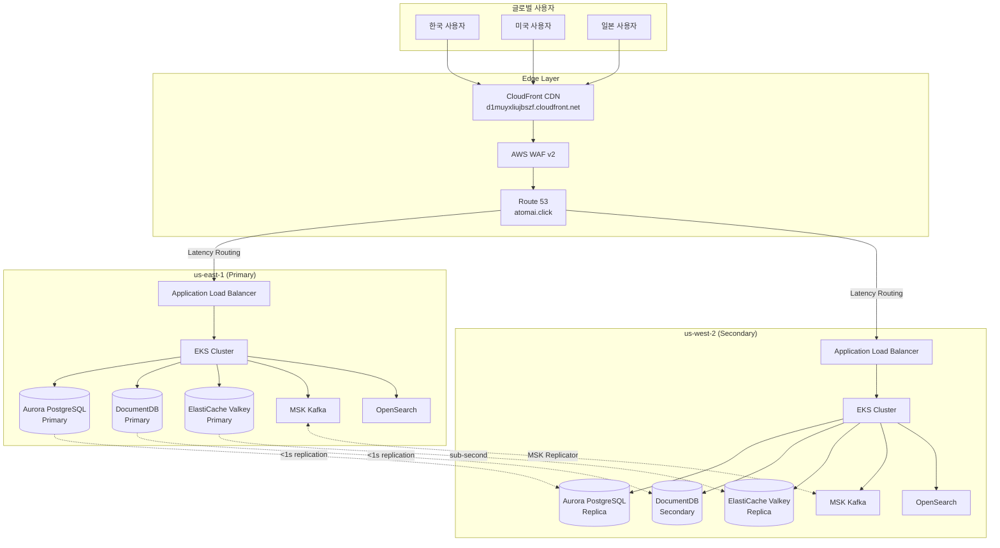
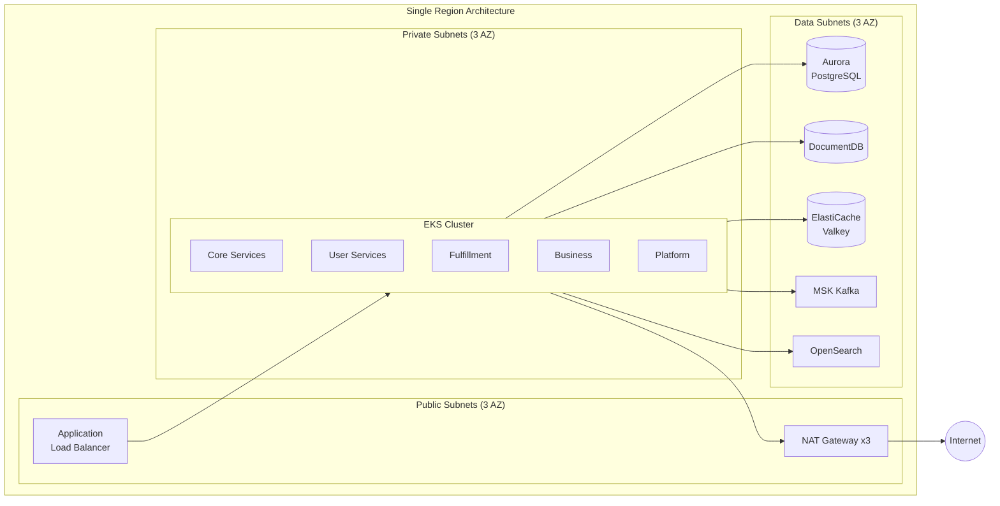
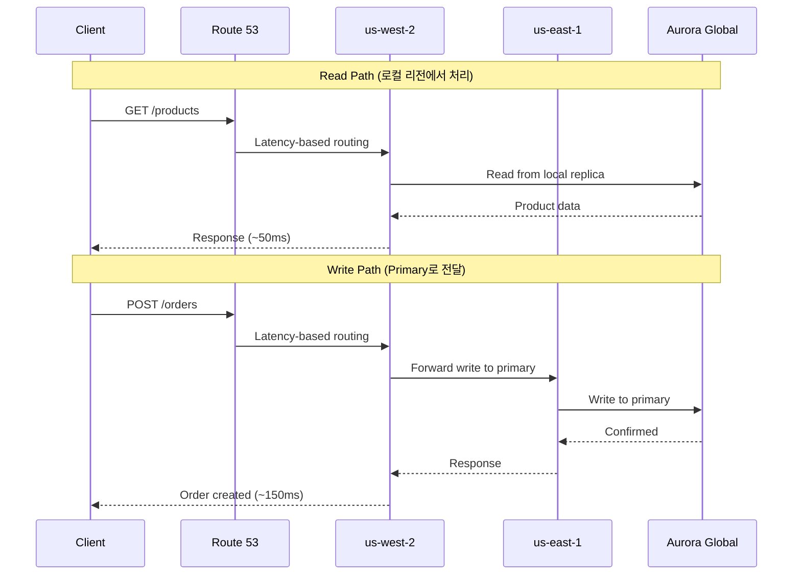
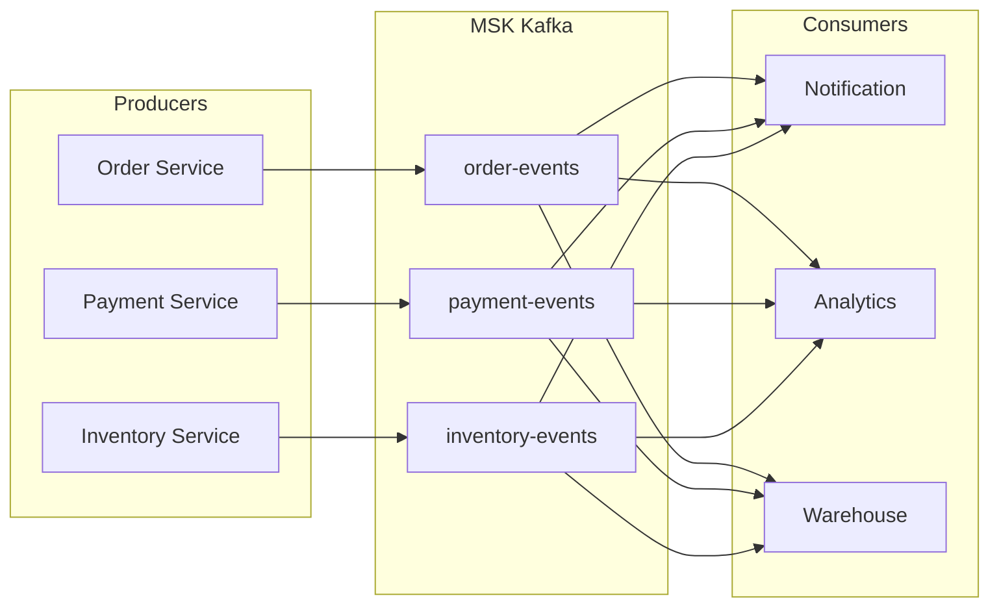
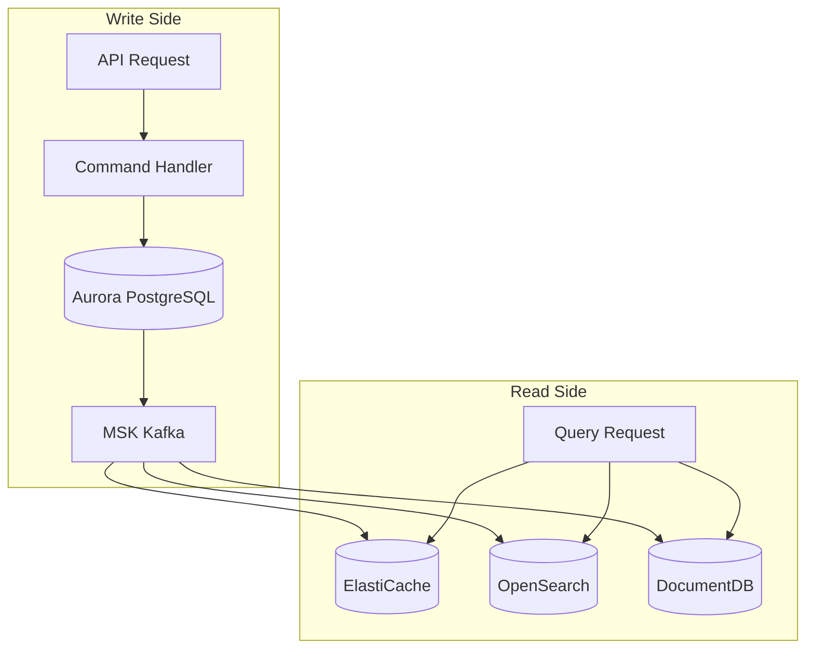

# 아키텍처 개요

Multi-Region Shopping Mall은 AWS 기반의 글로벌 규모 이커머스 플랫폼입니다. **us-east-1** (Primary)과 **us-west-2** (Secondary) 두 리전에 걸쳐 Active-Active 구성으로 운영되며, Write-Primary/Read-Local 패턴을 통해 강력한 일관성과 낮은 지연시간을 동시에 달성합니다.

## 설계 목표

| 목표 | 타겟 | 달성 방법 |
|------|------|-----------|
| **가용성** | 99.99% uptime | 멀티리전 Active-Active, 자동 페일오버 |
| **읽기 지연시간** | sub-100ms | Read-Local 패턴, ElastiCache, CloudFront CDN |
| **쓰기 일관성** | Strong consistency | Write-Primary 패턴, Aurora Global DB |
| **확장성** | 10x spike handling | EKS + Karpenter 자동 스케일링, MSK 파티셔닝 |
| **복구** | RPO &lt;1s, RTO &lt;10m | 글로벌 데이터 복제, 자동화된 DR 절차 |

## 글로벌 트래픽 플로우

## 리전별 배포 아키텍처

## 서비스 도메인 구성

20개의 마이크로서비스는 5개의 도메인으로 분류됩니다.

```mermaid
graph TB
    subgraph Core["Core Domain (6 Services)"]
        direction TB
        AG[API Gateway<br/>Go/Gin<br/>라우팅, 인증]
        PC[Product Catalog<br/>Python/FastAPI<br/>상품 관리]
        SR[Search<br/>Go/Gin<br/>검색 엔진]
        CT[Cart<br/>Go/Gin<br/>장바구니]
        OD[Order<br/>Java/Spring<br/>주문 처리]
        PM[Payment<br/>Java/Spring<br/>결제 처리]
        IV[Inventory<br/>Go/Gin<br/>재고 관리]
    end

    subgraph User["User Domain (4 Services)"]
        direction TB
        UA[User Account<br/>Java/Spring<br/>계정 관리]
        UP[User Profile<br/>Python/FastAPI<br/>프로필 관리]
        WL[Wishlist<br/>Python/FastAPI<br/>위시리스트]
        RV[Review<br/>Python/FastAPI<br/>리뷰/평점]
    end

    subgraph Fulfillment["Fulfillment Domain (3 Services)"]
        direction TB
        SH[Shipping<br/>Python/FastAPI<br/>배송 관리]
        WH[Warehouse<br/>Java/Spring<br/>창고 관리]
        RT[Returns<br/>Java/Spring<br/>반품 처리]
    end

    subgraph Business["Business Domain (4 Services)"]
        direction TB
        PR[Pricing<br/>Java/Spring<br/>가격 정책]
        RC[Recommendation<br/>Python/FastAPI<br/>추천 엔진]
        NF[Notification<br/>Python/FastAPI<br/>알림 발송]
        SL[Seller<br/>Java/Spring<br/>판매자 관리]
    end

    subgraph Platform["Platform Domain (3 Services)"]
        direction TB
        EB[Event Bus<br/>Go/Gin<br/>이벤트 라우팅]
        AN[Analytics<br/>Python/FastAPI<br/>분석/리포팅]
    end
```

### 서비스별 기술 스택

| 도메인 | 서비스 | 언어/프레임워크 | 주요 데이터 스토어 |
|--------|--------|-----------------|-------------------|
| **Core** | API Gateway | Go/Gin | ElastiCache (세션) |
| | Product Catalog | Python/FastAPI | DocumentDB, OpenSearch |
| | Search | Go/Gin | OpenSearch |
| | Cart | Go/Gin | ElastiCache |
| | Order | Java/Spring | Aurora PostgreSQL |
| | Payment | Java/Spring | Aurora PostgreSQL |
| | Inventory | Go/Gin | Aurora PostgreSQL, ElastiCache |
| **User** | User Account | Java/Spring | Aurora PostgreSQL |
| | User Profile | Python/FastAPI | DocumentDB |
| | Wishlist | Python/FastAPI | DocumentDB |
| | Review | Python/FastAPI | DocumentDB, OpenSearch |
| **Fulfillment** | Shipping | Python/FastAPI | Aurora PostgreSQL |
| | Warehouse | Java/Spring | Aurora PostgreSQL |
| | Returns | Java/Spring | Aurora PostgreSQL |
| **Business** | Pricing | Java/Spring | Aurora PostgreSQL, ElastiCache |
| | Recommendation | Python/FastAPI | DocumentDB, ElastiCache |
| | Notification | Python/FastAPI | DocumentDB, MSK |
| | Seller | Java/Spring | Aurora PostgreSQL, DocumentDB |
| **Platform** | Event Bus | Go/Gin | MSK Kafka |
| | Analytics | Python/FastAPI | OpenSearch, Aurora PostgreSQL |

## 핵심 아키텍처 패턴

### 1. Write-Primary / Read-Local

### 2. Event-Driven Architecture

### 3. CQRS (Command Query Responsibility Segregation)

## 인프라 리소스 요약

| 리소스 | us-east-1 | us-west-2 | 역할 |
|--------|-----------|-----------|------|
| VPC | 10.0.0.0/16 | 10.1.0.0/16 | 네트워크 격리 |
| Subnets | 9 (3 tier x 3 AZ) | 9 (3 tier x 3 AZ) | 계층별 분리 |
| EKS Nodes | Karpenter 관리 | Karpenter 관리 | 워크로드 실행 |
| Aurora | Primary Writer | Read Replica | 관계형 데이터 |
| DocumentDB | Primary | Secondary | 문서 데이터 |
| ElastiCache | Primary | Replica | 캐시/세션 |
| MSK | 3 brokers | 3 brokers | 이벤트 스트리밍 |
| OpenSearch | 3 nodes | 3 nodes | 검색/로깅 |

## 다음 단계

- [멀티리전 설계](./multi-region-design) - Write-Primary/Read-Local 패턴 상세
- [네트워크 아키텍처](./network) - VPC 설계 및 보안 그룹
- [데이터 아키텍처](./data) - 데이터 스토어별 스키마 및 패턴
- [이벤트 기반 아키텍처](./event-driven) - MSK Kafka 토픽 및 SAGA 패턴
