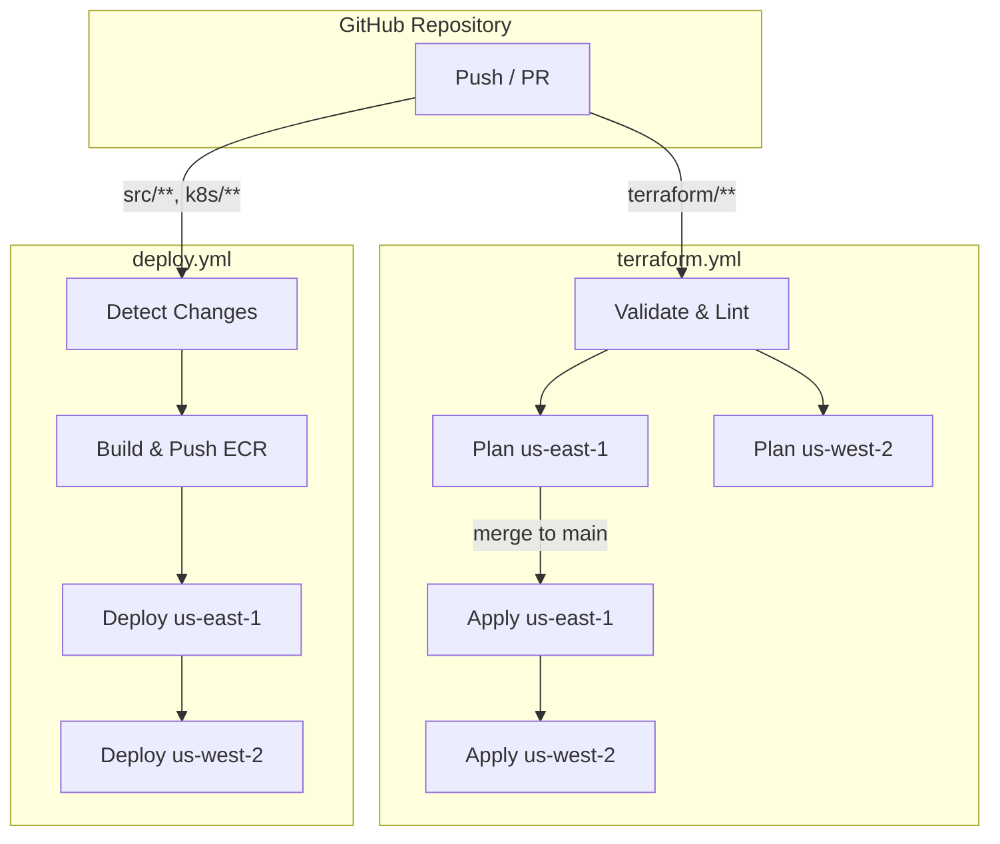
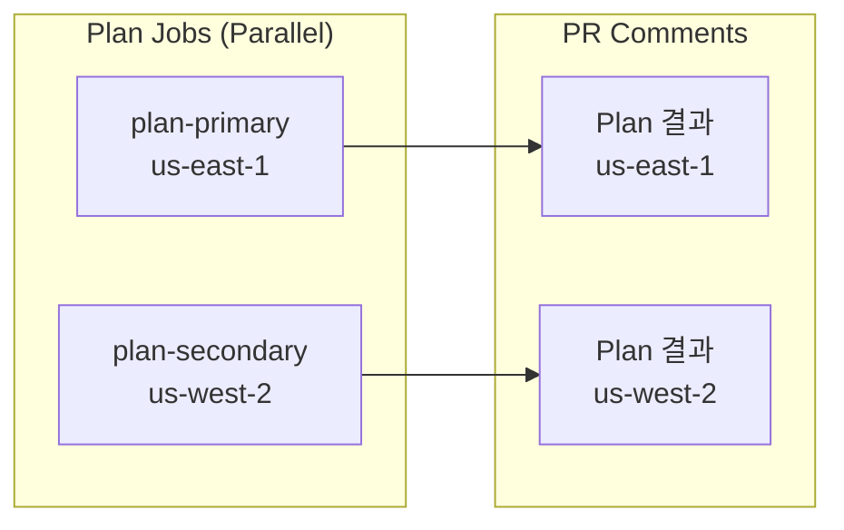
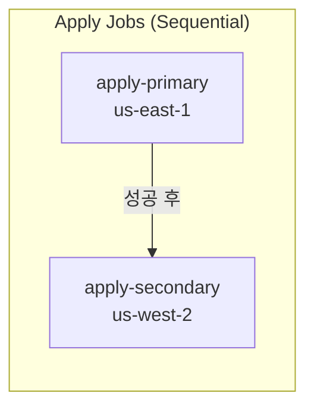
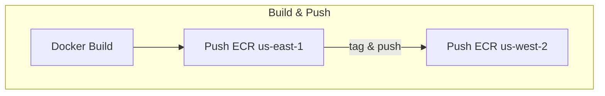

# CI/CD 파이프라인

멀티 리전 쇼핑몰 플랫폼은 **GitHub Actions**를 사용하여 CI/CD 파이프라인을 구성합니다. 인프라 변경은 `terraform.yml`, 애플리케이션 배포는 `deploy.yml` 워크플로우가 담당합니다.

## 워크플로우 구조



## Terraform 워크플로우 (terraform.yml)

### 트리거 조건

```yaml
name: Terraform Infrastructure

on:
  push:
    branches: [main]
    paths: ['terraform/**']
  pull_request:
    branches: [main]
    paths: ['terraform/**']

permissions:
  contents: read
  pull-requests: write
  id-token: write

env:
  TF_VERSION: '1.7.0'
  AWS_PRIMARY_REGION: 'us-east-1'
  AWS_SECONDARY_REGION: 'us-west-2'
```

### 검증 단계 (Validate & Lint)

```yaml
jobs:
  validate:
    name: Validate & Lint
    runs-on: ubuntu-latest
    steps:
    - uses: actions/checkout@v4
    - uses: hashicorp/setup-terraform@v3
      with:
        terraform_version: ${{ env.TF_VERSION }}

    - name: Terraform Format Check
      run: terraform fmt -check -recursive terraform/

    - name: Install tflint
      uses: terraform-linters/setup-tflint@v4

    - name: Run tflint
      run: |
        cd terraform
        tflint --recursive

    - name: Install Checkov
      run: pip install checkov

    - name: Run Checkov Security Scan
      run: |
        checkov -d terraform/ \
          --framework terraform \
          --output github_failed_only \
          --soft-fail

    - name: Validate Global Modules
      run: |
        for dir in terraform/global/*/; do
          echo "Validating $dir"
          cd "$dir"
          terraform init -backend=false
          terraform validate
          cd -
        done

    - name: Validate Reusable Modules
      run: |
        for dir in terraform/modules/*/*/; do
          echo "Validating $dir"
          cd "$dir"
          terraform init -backend=false
          terraform validate
          cd -
        done
```

### Plan 단계 (PR 시)



```yaml
  plan-primary:
    name: Plan Primary (us-east-1)
    needs: validate
    runs-on: ubuntu-latest
    if: github.event_name == 'pull_request'
    steps:
    - uses: actions/checkout@v4
    - uses: hashicorp/setup-terraform@v3
      with:
        terraform_version: ${{ env.TF_VERSION }}

    - name: Configure AWS Credentials
      uses: aws-actions/configure-aws-credentials@v4
      with:
        role-to-assume: ${{ secrets.AWS_ROLE_ARN }}
        aws-region: ${{ env.AWS_PRIMARY_REGION }}

    - name: Terraform Init
      working-directory: terraform/environments/production/us-east-1
      run: terraform init

    - name: Terraform Plan
      working-directory: terraform/environments/production/us-east-1
      id: plan-east
      run: |
        terraform plan -no-color -out=tfplan 2>&1 | tee plan-output.txt
      continue-on-error: true

    - name: Upload Plan
      uses: actions/upload-artifact@v4
      with:
        name: tfplan-us-east-1
        path: terraform/environments/production/us-east-1/tfplan

    - name: Comment PR with Plan
      uses: actions/github-script@v7
      with:
        script: |
          const fs = require('fs');
          const plan = fs.readFileSync('terraform/environments/production/us-east-1/plan-output.txt', 'utf8');
          const truncated = plan.length > 60000 ? plan.substring(0, 60000) + '\n... (truncated)' : plan;
          github.rest.issues.createComment({
            issue_number: context.issue.number,
            owner: context.repo.owner,
            repo: context.repo.repo,
            body: `## Terraform Plan - us-east-1 (Primary)\n\n<details><summary>Show Plan</summary>\n\n\`\`\`\n${truncated}\n\`\`\`\n\n</details>`
          });
```

### Apply 단계 (main 머지 시)



```yaml
  apply-primary:
    name: Apply Primary (us-east-1)
    needs: validate
    runs-on: ubuntu-latest
    if: github.ref == 'refs/heads/main' && github.event_name == 'push'
    environment: production-us-east-1
    steps:
    - uses: actions/checkout@v4
    - uses: hashicorp/setup-terraform@v3
      with:
        terraform_version: ${{ env.TF_VERSION }}

    - name: Configure AWS Credentials
      uses: aws-actions/configure-aws-credentials@v4
      with:
        role-to-assume: ${{ secrets.AWS_ROLE_ARN }}
        aws-region: ${{ env.AWS_PRIMARY_REGION }}

    - name: Terraform Init
      working-directory: terraform/environments/production/us-east-1
      run: terraform init

    - name: Terraform Apply
      working-directory: terraform/environments/production/us-east-1
      run: terraform apply -auto-approve

  apply-secondary:
    name: Apply Secondary (us-west-2)
    needs: apply-primary  # us-east-1 완료 후 실행
    runs-on: ubuntu-latest
    if: github.ref == 'refs/heads/main' && github.event_name == 'push'
    environment: production-us-west-2
    steps:
    # ... (similar to apply-primary)
```

## 애플리케이션 배포 워크플로우 (deploy.yml)

### 트리거 조건

```yaml
name: Application Deployment

on:
  push:
    branches: [main]
    paths:
    - 'k8s/**'
    - 'src/**'
  workflow_dispatch:
    inputs:
      service:
        description: 'Service to deploy (or "all")'
        required: true
        default: 'all'
      region:
        description: 'Target region (or "all")'
        required: true
        default: 'all'
        type: choice
        options: ['all', 'us-east-1', 'us-west-2']

permissions:
  contents: read
  id-token: write

env:
  AWS_PRIMARY_REGION: 'us-east-1'
  AWS_SECONDARY_REGION: 'us-west-2'
  ECR_REGISTRY: ${{ secrets.AWS_ACCOUNT_ID }}.dkr.ecr
  EKS_CLUSTER_NAME: 'multi-region-mall'
```

### 변경 감지 단계

```yaml
jobs:
  detect-changes:
    name: Detect Changed Services
    runs-on: ubuntu-latest
    outputs:
      services: ${{ steps.changes.outputs.services }}
      matrix: ${{ steps.matrix.outputs.matrix }}
    steps:
    - uses: actions/checkout@v4
      with:
        fetch-depth: 2
    - name: Detect changed services
      id: changes
      run: |
        if [ "${{ github.event.inputs.service }}" = "all" ] || [ -z "${{ github.event.inputs.service }}" ]; then
          SERVICES=$(git diff --name-only HEAD~1 HEAD | grep -oP 'k8s/services/\w+/[\w-]+' | sed 's|k8s/services/\w*/||' | sort -u | jq -R -s 'split("\n") | map(select(length > 0))' )
          if [ "$SERVICES" = "[]" ] || [ -z "$SERVICES" ]; then
            SERVICES='["all"]'
          fi
        else
          SERVICES='["${{ github.event.inputs.service }}"]'
        fi
        echo "services=$SERVICES" >> $GITHUB_OUTPUT
    - name: Build matrix
      id: matrix
      run: echo 'matrix={"service":${{ steps.changes.outputs.services }}}' >> $GITHUB_OUTPUT
```

### 빌드 및 푸시 단계



```yaml
  build-and-push:
    name: Build & Push to ECR
    needs: detect-changes
    runs-on: ubuntu-latest
    strategy:
      matrix: ${{ fromJson(needs.detect-changes.outputs.matrix) }}
    steps:
    - uses: actions/checkout@v4

    - name: Configure AWS Credentials (Primary)
      uses: aws-actions/configure-aws-credentials@v4
      with:
        role-to-assume: ${{ secrets.AWS_ROLE_ARN }}
        aws-region: ${{ env.AWS_PRIMARY_REGION }}

    - name: Login to ECR (Primary)
      uses: aws-actions/amazon-ecr-login@v2

    - name: Build and Push Docker Image
      run: |
        IMAGE_TAG="${{ github.sha }}"
        SERVICE="${{ matrix.service }}"

        # Build
        docker build -t ${ECR_REGISTRY}.${{ env.AWS_PRIMARY_REGION }}.amazonaws.com/${SERVICE}:${IMAGE_TAG} \
                     -t ${ECR_REGISTRY}.${{ env.AWS_PRIMARY_REGION }}.amazonaws.com/${SERVICE}:latest \
                     -f src/${SERVICE}/Dockerfile src/${SERVICE}/

        # Push to primary region ECR
        docker push ${ECR_REGISTRY}.${{ env.AWS_PRIMARY_REGION }}.amazonaws.com/${SERVICE} --all-tags

    - name: Configure AWS Credentials (Secondary)
      uses: aws-actions/configure-aws-credentials@v4
      with:
        role-to-assume: ${{ secrets.AWS_ROLE_ARN }}
        aws-region: ${{ env.AWS_SECONDARY_REGION }}

    - name: Login to ECR (Secondary)
      uses: aws-actions/amazon-ecr-login@v2

    - name: Push to Secondary Region ECR
      run: |
        IMAGE_TAG="${{ github.sha }}"
        SERVICE="${{ matrix.service }}"

        docker tag ${ECR_REGISTRY}.${{ env.AWS_PRIMARY_REGION }}.amazonaws.com/${SERVICE}:${IMAGE_TAG} \
                   ${ECR_REGISTRY}.${{ env.AWS_SECONDARY_REGION }}.amazonaws.com/${SERVICE}:${IMAGE_TAG}
        docker tag ${ECR_REGISTRY}.${{ env.AWS_PRIMARY_REGION }}.amazonaws.com/${SERVICE}:latest \
                   ${ECR_REGISTRY}.${{ env.AWS_SECONDARY_REGION }}.amazonaws.com/${SERVICE}:latest

        docker push ${ECR_REGISTRY}.${{ env.AWS_SECONDARY_REGION }}.amazonaws.com/${SERVICE} --all-tags
```

### 배포 단계

```yaml
  deploy-primary:
    name: Deploy to Primary (us-east-1)
    needs: build-and-push
    runs-on: ubuntu-latest
    environment: production-us-east-1
    steps:
    - uses: actions/checkout@v4

    - name: Configure AWS Credentials
      uses: aws-actions/configure-aws-credentials@v4
      with:
        role-to-assume: ${{ secrets.AWS_ROLE_ARN }}
        aws-region: ${{ env.AWS_PRIMARY_REGION }}

    - name: Update kubeconfig
      run: aws eks update-kubeconfig --name ${{ env.EKS_CLUSTER_NAME }} --region ${{ env.AWS_PRIMARY_REGION }}

    - name: Deploy with Kustomize
      run: |
        kubectl apply -k k8s/overlays/us-east-1/

    - name: Wait for rollout
      run: |
        for ns in core-services user-services fulfillment business-services platform; do
          for deploy in $(kubectl get deployments -n $ns -o name); do
            kubectl rollout status $deploy -n $ns --timeout=300s
          done
        done

    - name: Health Check
      run: |
        sleep 30
        FAILED=$(kubectl get pods --all-namespaces -l app.kubernetes.io/part-of=shopping-mall --field-selector=status.phase!=Running,status.phase!=Succeeded 2>/dev/null | grep -v "^NAMESPACE" | wc -l)
        if [ "$FAILED" -gt 0 ]; then
          echo "::error::$FAILED pods not in Running state in us-east-1"
          kubectl get pods --all-namespaces -l app.kubernetes.io/part-of=shopping-mall --field-selector=status.phase!=Running,status.phase!=Succeeded
          exit 1
        fi
        echo "All pods healthy in us-east-1"

  deploy-secondary:
    name: Deploy to Secondary (us-west-2)
    needs: deploy-primary  # us-east-1 완료 후 실행
    runs-on: ubuntu-latest
    environment: production-us-west-2
    # ... (similar steps)
```

## GitHub Environments

### 환경 설정

| 환경 | 설명 | 보호 규칙 |
|------|------|----------|
| `production-us-east-1` | 프라이머리 리전 | 수동 승인 (선택) |
| `production-us-west-2` | 세컨더리 리전 | 수동 승인 (선택) |

### 필요한 Secrets

| Secret | 설명 |
|--------|------|
| `AWS_ROLE_ARN` | GitHub OIDC용 IAM 역할 ARN |
| `AWS_ACCOUNT_ID` | AWS 계정 ID |

## 수동 배포 (workflow_dispatch)

GitHub Actions UI에서 수동으로 배포를 트리거할 수 있습니다:

```bash
# 특정 서비스만 배포
Service: order
Region: us-east-1

# 전체 배포
Service: all
Region: all
```

## 워크플로우 모니터링

### GitHub Actions 대시보드

- **Actions** 탭에서 실행 상태 확인
- 각 Job의 로그 확인
- 실패 시 알림 설정 가능

### Slack 알림 (선택)

```yaml
- name: Notify Slack on Failure
  if: failure()
  uses: slackapi/slack-github-action@v1
  with:
    payload: |
      {
        "text": "Deployment failed for ${{ github.repository }}",
        "blocks": [
          {
            "type": "section",
            "text": {
              "type": "mrkdwn",
              "text": "Deployment *failed* for `${{ matrix.service }}` in `${{ env.AWS_PRIMARY_REGION }}`"
            }
          }
        ]
      }
  env:
    SLACK_WEBHOOK_URL: ${{ secrets.SLACK_WEBHOOK_URL }}
```

## 다음 단계

- [Kustomize 오버레이](/deployment/kustomize-overlays) - 리전별 구성
- [롤아웃 전략](/deployment/rollout-strategy) - 배포 및 롤백 전략
