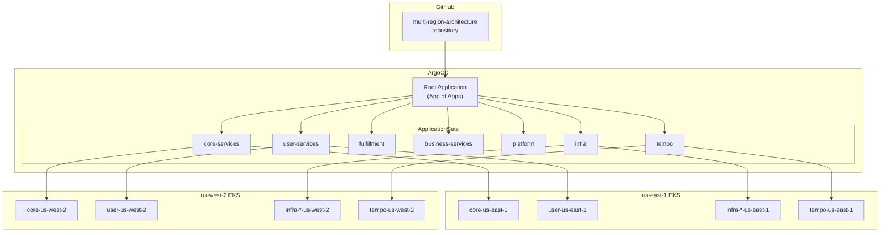
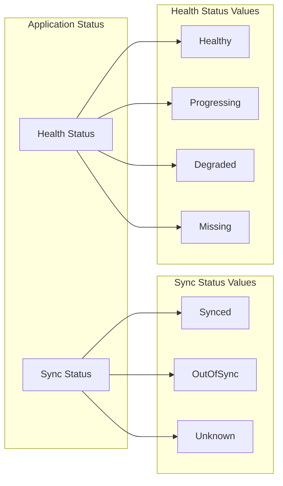

# GitOps - ArgoCD

멀티 리전 쇼핑몰 플랫폼은 **ArgoCD**를 사용하여 Kubernetes 리소스를 GitOps 방식으로 관리합니다. **App-of-ApplicationSets** 패턴을 사용하여 여러 리전과 서비스를 효율적으로 관리합니다.

## 아키텍처



## ApplicationSet 구성

### 디렉토리 구조

```
k8s/infra/argocd/
├── kustomization.yaml
├── namespace.yaml
└── apps/
    ├── kustomization.yaml
    ├── root-app.yaml            # App of Apps
    ├── appset-core.yaml         # core-services
    ├── appset-user.yaml         # user-services
    ├── appset-fulfillment.yaml  # fulfillment
    ├── appset-business.yaml     # business-services
    ├── appset-platform.yaml     # platform
    ├── appset-infra.yaml        # 인프라 컴포넌트
    └── appset-tempo.yaml        # Tempo (IRSA 패치용)
```

### Root Application (App of Apps)

```yaml
apiVersion: argoproj.io/v1alpha1
kind: Application
metadata:
  name: root
  namespace: argocd
spec:
  project: default
  source:
    repoURL: https://github.com/Atom-oh/multi-region-architecture.git
    targetRevision: main
    path: k8s/infra/argocd/apps
  destination:
    server: https://kubernetes.default.svc
    namespace: argocd
  syncPolicy:
    automated:
      prune: true
      selfHeal: true
```

### 서비스 ApplicationSet

각 서비스 도메인별로 ApplicationSet을 구성합니다. **Cluster Generator**를 사용하여 등록된 모든 클러스터에 자동으로 Application을 생성합니다.

```yaml
# appset-core.yaml
apiVersion: argoproj.io/v1alpha1
kind: ApplicationSet
metadata:
  name: core-services
  namespace: argocd
spec:
  generators:
    - clusters:
        selector:
          matchExpressions:
            - key: region
              operator: Exists
  template:
    metadata:
      name: 'core-{{metadata.labels.region}}'
    spec:
      project: default
      source:
        repoURL: https://github.com/Atom-oh/multi-region-architecture.git
        targetRevision: main
        path: 'k8s/overlays/{{metadata.labels.region}}/core'
      destination:
        server: '{{server}}'
        namespace: core-services
      syncPolicy:
        automated:
          prune: true
          selfHeal: true
        syncOptions:
          - CreateNamespace=true
        retry:
          limit: 5
          backoff:
            duration: 5s
            factor: 2
            maxDuration: 3m
```

### 인프라 ApplicationSet (Matrix Generator)

인프라 컴포넌트는 **Matrix Generator**를 사용하여 클러스터 x 컴포넌트 조합으로 Application을 생성합니다.

```yaml
# appset-infra.yaml
apiVersion: argoproj.io/v1alpha1
kind: ApplicationSet
metadata:
  name: infra
  namespace: argocd
spec:
  generators:
    - matrix:
        generators:
          - clusters:
              selector:
                matchExpressions:
                  - key: region
                    operator: Exists
          - list:
              elements:
                - component: karpenter
                  path: k8s/infra/karpenter
                  namespace: kube-system
                - component: fluent-bit
                  path: k8s/infra/fluent-bit
                  namespace: logging
                - component: external-secrets
                  path: k8s/infra/external-secrets
                  namespace: external-secrets
                - component: prometheus-stack
                  path: k8s/infra/prometheus-stack
                  namespace: monitoring
                - component: otel-collector
                  path: k8s/infra/otel-collector
                  namespace: platform
  template:
    metadata:
      name: 'infra-{{component}}-{{metadata.labels.region}}'
    spec:
      project: default
      source:
        repoURL: https://github.com/Atom-oh/multi-region-architecture.git
        targetRevision: main
        path: '{{path}}'
      destination:
        server: '{{server}}'
        namespace: '{{namespace}}'
      syncPolicy:
        automated:
          prune: true
          selfHeal: true
        syncOptions:
          - CreateNamespace=true
        retry:
          limit: 5
          backoff:
            duration: 5s
            factor: 2
            maxDuration: 3m
```

### Tempo ApplicationSet (IRSA 패치)

Tempo는 리전별 IRSA 역할이 필요하므로 별도의 ApplicationSet으로 관리하며, **Kustomize 패치**를 사용하여 ServiceAccount에 리전별 IAM 역할 ARN을 주입합니다.

```yaml
# appset-tempo.yaml
apiVersion: argoproj.io/v1alpha1
kind: ApplicationSet
metadata:
  name: tempo
  namespace: argocd
spec:
  generators:
    - clusters:
        selector:
          matchExpressions:
            - key: region
              operator: Exists
  template:
    metadata:
      name: 'infra-tempo-{{metadata.labels.region}}'
    spec:
      project: default
      source:
        repoURL: https://github.com/Atom-oh/multi-region-architecture.git
        targetRevision: main
        path: k8s/infra/tempo
        kustomize:
          patches:
            - target:
                kind: ServiceAccount
                name: tempo
              patch: |-
                - op: replace
                  path: /metadata/annotations/eks.amazonaws.com~1role-arn
                  value: "arn:aws:iam::123456789012:role/production-tempo-{{metadata.labels.region}}"
      destination:
        server: '{{server}}'
        namespace: observability
      syncPolicy:
        automated:
          prune: true
          selfHeal: true
        syncOptions:
          - CreateNamespace=true
        retry:
          limit: 5
          backoff:
            duration: 5s
            factor: 2
            maxDuration: 3m
```

## 클러스터 등록

ArgoCD에 멀티 리전 EKS 클러스터를 등록합니다.

```bash
# us-east-1 클러스터 등록
argocd cluster add arn:aws:eks:us-east-1:123456789012:cluster/multi-region-mall \
  --name multi-region-mall-us-east-1 \
  --label region=us-east-1

# us-west-2 클러스터 등록
argocd cluster add arn:aws:eks:us-west-2:123456789012:cluster/multi-region-mall \
  --name multi-region-mall-us-west-2 \
  --label region=us-west-2
```

### 클러스터 레이블

ApplicationSet의 Cluster Generator가 `region` 레이블을 사용합니다:

| 클러스터 | 레이블 |
|---------|--------|
| multi-region-mall-us-east-1 | `region=us-east-1` |
| multi-region-mall-us-west-2 | `region=us-west-2` |

## Sync Policy

### 자동 동기화

```yaml
syncPolicy:
  automated:
    prune: true      # Git에서 삭제된 리소스 제거
    selfHeal: true   # 클러스터 변경 시 자동 복구
```

### 재시도 정책

```yaml
syncPolicy:
  retry:
    limit: 5
    backoff:
      duration: 5s
      factor: 2
      maxDuration: 3m
```

### Sync Options

```yaml
syncPolicy:
  syncOptions:
    - CreateNamespace=true     # 네임스페이스 자동 생성
    - PruneLast=true           # 삭제를 마지막에 수행
    - ApplyOutOfSyncOnly=true  # 변경된 리소스만 적용
```

## 동기화 상태 확인

### ArgoCD CLI

```bash
# 모든 Application 상태 확인
argocd app list

# 특정 Application 상세 정보
argocd app get core-us-east-1

# 동기화 수행
argocd app sync core-us-east-1

# 동기화 상태 확인
argocd app wait core-us-east-1
```

### ArgoCD UI



## 생성되는 Application 목록

ApplicationSet에 의해 자동으로 생성되는 Application 목록:

| ApplicationSet | us-east-1 | us-west-2 |
|----------------|-----------|-----------|
| core-services | core-us-east-1 | core-us-west-2 |
| user-services | user-us-east-1 | user-us-west-2 |
| fulfillment | fulfillment-us-east-1 | fulfillment-us-west-2 |
| business-services | business-us-east-1 | business-us-west-2 |
| platform | platform-us-east-1 | platform-us-west-2 |
| infra (karpenter) | infra-karpenter-us-east-1 | infra-karpenter-us-west-2 |
| infra (fluent-bit) | infra-fluent-bit-us-east-1 | infra-fluent-bit-us-west-2 |
| infra (external-secrets) | infra-external-secrets-us-east-1 | infra-external-secrets-us-west-2 |
| infra (prometheus-stack) | infra-prometheus-stack-us-east-1 | infra-prometheus-stack-us-west-2 |
| infra (otel-collector) | infra-otel-collector-us-east-1 | infra-otel-collector-us-west-2 |
| tempo | infra-tempo-us-east-1 | infra-tempo-us-west-2 |

## 트러블슈팅

### 동기화 실패 시

```bash
# 동기화 오류 확인
argocd app get <app-name> --show-operation

# 리소스 상세 정보
argocd app resources <app-name>

# 강제 동기화
argocd app sync <app-name> --force
```

### 일반적인 문제

| 문제 | 원인 | 해결책 |
|------|------|--------|
| OutOfSync 상태 유지 | 리소스 변경 감지 | `argocd app sync` |
| Degraded 상태 | Pod 시작 실패 | `kubectl describe pod` 확인 |
| Unknown 상태 | 클러스터 연결 문제 | 클러스터 연결 확인 |
| Sync 실패 | 매니페스트 오류 | Git 저장소 확인 |

## 다음 단계

- [CI/CD 파이프라인](/deployment/ci-cd-pipeline) - GitHub Actions 워크플로우
- [Kustomize 오버레이](/deployment/kustomize-overlays) - 리전별 구성
