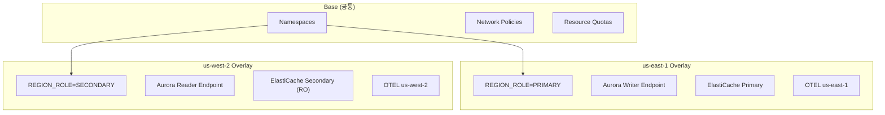

# Kustomize 오버레이

멀티 리전 쇼핑몰 플랫폼은 **Kustomize**를 사용하여 Kubernetes 매니페스트를 관리합니다. 공통 설정은 `base`에, 리전별 차이는 `overlays`에서 관리합니다.

## 디렉토리 구조

```
k8s/
├── base/                           # 공통 설정
│   ├── kustomization.yaml
│   ├── namespaces.yaml
│   ├── network-policies/
│   │   ├── default-deny.yaml
│   │   ├── allow-dns.yaml
│   │   ├── allow-alb-ingress.yaml
│   │   └── allow-inter-namespace.yaml
│   └── resource-quotas/
│       ├── core-services.yaml
│       ├── user-services.yaml
│       ├── fulfillment.yaml
│       ├── business-services.yaml
│       └── platform.yaml
├── services/                       # 서비스별 배포
│   ├── core/
│   ├── user/
│   ├── fulfillment/
│   ├── business/
│   └── platform/
├── overlays/                       # 리전별 오버레이
│   ├── us-east-1/
│   │   └── kustomization.yaml
│   └── us-west-2/
│       └── kustomization.yaml
└── infra/                          # 인프라 컴포넌트
    ├── argocd/
    ├── karpenter/
    ├── otel-collector/
    └── tempo/
```

## Base 구성

### kustomization.yaml

```yaml
apiVersion: kustomize.config.k8s.io/v1beta1
kind: Kustomization

resources:
  - namespaces.yaml
  - network-policies/default-deny.yaml
  - network-policies/allow-dns.yaml
  - network-policies/allow-alb-ingress.yaml
  - network-policies/allow-inter-namespace.yaml
  - resource-quotas/core-services.yaml
  - resource-quotas/user-services.yaml
  - resource-quotas/fulfillment.yaml
  - resource-quotas/business-services.yaml
  - resource-quotas/platform.yaml

commonLabels:
  app.kubernetes.io/managed-by: kustomize
```

### 네임스페이스 정의

```yaml
# namespaces.yaml
apiVersion: v1
kind: Namespace
metadata:
  name: core-services
  labels:
    istio-injection: enabled
---
apiVersion: v1
kind: Namespace
metadata:
  name: user-services
  labels:
    istio-injection: enabled
---
apiVersion: v1
kind: Namespace
metadata:
  name: fulfillment
  labels:
    istio-injection: enabled
---
apiVersion: v1
kind: Namespace
metadata:
  name: business-services
  labels:
    istio-injection: enabled
---
apiVersion: v1
kind: Namespace
metadata:
  name: platform
  labels:
    istio-injection: enabled
```

### 네트워크 정책

```yaml
# network-policies/default-deny.yaml
apiVersion: networking.k8s.io/v1
kind: NetworkPolicy
metadata:
  name: default-deny-all
spec:
  podSelector: {}
  policyTypes:
    - Ingress
    - Egress
---
# network-policies/allow-dns.yaml
apiVersion: networking.k8s.io/v1
kind: NetworkPolicy
metadata:
  name: allow-dns
spec:
  podSelector: {}
  policyTypes:
    - Egress
  egress:
    - to:
        - namespaceSelector:
            matchLabels:
              kubernetes.io/metadata.name: kube-system
      ports:
        - protocol: UDP
          port: 53
        - protocol: TCP
          port: 53
```

### 리소스 쿼터

```yaml
# resource-quotas/core-services.yaml
apiVersion: v1
kind: ResourceQuota
metadata:
  name: core-services-quota
  namespace: core-services
spec:
  hard:
    requests.cpu: "20"
    requests.memory: 40Gi
    limits.cpu: "40"
    limits.memory: 80Gi
    pods: "100"
```

## 리전별 오버레이

### us-east-1 (Primary)

```yaml
# overlays/us-east-1/kustomization.yaml
apiVersion: kustomize.config.k8s.io/v1beta1
kind: Kustomization

resources:
  - ../../base
  - ../../services/core
  - ../../services/user
  - ../../services/fulfillment
  - ../../services/business
  - ../../services/platform
  - ../../infra/karpenter
  - ../../infra/otel-collector

namespace: ""

patches:
  - target:
      kind: Deployment
    patch: |-
      - op: add
        path: /spec/template/spec/containers/0/env/-
        value:
          name: REGION_ROLE
          value: "PRIMARY"
      - op: add
        path: /spec/template/spec/containers/0/env/-
        value:
          name: AWS_REGION
          value: "us-east-1"
      - op: add
        path: /spec/template/spec/containers/0/env/-
        value:
          name: OTEL_EXPORTER_OTLP_ENDPOINT
          value: "http://otel-collector.platform.svc.cluster.local:4317"
      - op: add
        path: /spec/template/spec/containers/0/env/-
        value:
          name: OTEL_RESOURCE_ATTRIBUTES
          value: "deployment.environment=production,aws.region=us-east-1"

configMapGenerator:
  - name: region-config
    namespace: platform
    literals:
      - REGION=us-east-1
      - REGION_ROLE=PRIMARY
      - AURORA_ENDPOINT=production-aurora-global-us-east-1.cluster-c4pe2u8kgt26.us-east-1.rds.amazonaws.com
      - AURORA_READER_ENDPOINT=production-aurora-global-us-east-1.cluster-ro-c4pe2u8kgt26.us-east-1.rds.amazonaws.com
      - DOCUMENTDB_ENDPOINT=production-docdb-global-us-east-1.cluster-c4pe2u8kgt26.us-east-1.docdb.amazonaws.com
      - VALKEY_ENDPOINT=clustercfg.production-elasticache-us-east-1.hedavb.use1.cache.amazonaws.com
      - MSK_BROKERS=b-1.productionmskuseast1.qtmqnz.c17.kafka.us-east-1.amazonaws.com:9096,b-2.productionmskuseast1.qtmqnz.c17.kafka.us-east-1.amazonaws.com:9096,b-3.productionmskuseast1.qtmqnz.c17.kafka.us-east-1.amazonaws.com:9096
      - OPENSEARCH_ENDPOINT=https://vpc-production-os-use1-kpvt3o2c36ru7kyikdx6qoluk4.us-east-1.es.amazonaws.com
  - name: tempo-region-config
    namespace: observability
    literals:
      - TEMPO_S3_BUCKET=production-mall-tempo-traces-us-east-1
      - TEMPO_ROLE_ARN=arn:aws:iam::180294183052:role/production-tempo-us-east-1

commonLabels:
  region: us-east-1
  region-role: primary

commonAnnotations:
  region.kubernetes.io/name: us-east-1
  region.kubernetes.io/role: primary
```

### us-west-2 (Secondary)

```yaml
# overlays/us-west-2/kustomization.yaml
apiVersion: kustomize.config.k8s.io/v1beta1
kind: Kustomization

resources:
  - ../../base
  - ../../services/core
  - ../../services/user
  - ../../services/fulfillment
  - ../../services/business
  - ../../services/platform
  - ../../infra/karpenter
  - ../../infra/otel-collector

namespace: ""

patches:
  - target:
      kind: Deployment
    patch: |-
      - op: add
        path: /spec/template/spec/containers/0/env/-
        value:
          name: REGION_ROLE
          value: "SECONDARY"
      - op: add
        path: /spec/template/spec/containers/0/env/-
        value:
          name: AWS_REGION
          value: "us-west-2"
      - op: add
        path: /spec/template/spec/containers/0/env/-
        value:
          name: OTEL_EXPORTER_OTLP_ENDPOINT
          value: "http://otel-collector.platform.svc.cluster.local:4317"
      - op: add
        path: /spec/template/spec/containers/0/env/-
        value:
          name: OTEL_RESOURCE_ATTRIBUTES
          value: "deployment.environment=production,aws.region=us-west-2"

configMapGenerator:
  - name: region-config
    namespace: platform
    literals:
      - REGION=us-west-2
      - REGION_ROLE=SECONDARY
      - AURORA_ENDPOINT=production-aurora-global-us-west-2.cluster-cj00m0aai7ry.us-west-2.rds.amazonaws.com
      - AURORA_READER_ENDPOINT=production-aurora-global-us-west-2.cluster-ro-cj00m0aai7ry.us-west-2.rds.amazonaws.com
      - DOCUMENTDB_ENDPOINT=production-docdb-global-us-west-2.cluster-cj00m0aai7ry.us-west-2.docdb.amazonaws.com
      - VALKEY_ENDPOINT=clustercfg.production-elasticache-us-west-2.0udeym.usw2.cache.amazonaws.com
      - MSK_BROKERS=b-1.productionmskuswest2.nckvxn.c3.kafka.us-west-2.amazonaws.com:9096
      - OPENSEARCH_ENDPOINT=https://vpc-production-os-usw2-pgtswpgymfnk6lsxmn7oxn3gzi.us-west-2.es.amazonaws.com
  - name: tempo-region-config
    namespace: observability
    literals:
      - TEMPO_S3_BUCKET=production-mall-tempo-traces-us-west-2
      - TEMPO_ROLE_ARN=arn:aws:iam::180294183052:role/production-tempo-us-west-2

commonLabels:
  region: us-west-2
  region-role: secondary

commonAnnotations:
  region.kubernetes.io/name: us-west-2
  region.kubernetes.io/role: secondary
```

## 리전별 차이점



### 환경 변수 비교

| 환경 변수 | us-east-1 | us-west-2 |
|----------|-----------|-----------|
| `REGION_ROLE` | PRIMARY | SECONDARY |
| `AWS_REGION` | us-east-1 | us-west-2 |
| `AURORA_ENDPOINT` | Writer 엔드포인트 | Reader 엔드포인트 |
| `VALKEY_ENDPOINT` | Primary (R/W) | Secondary (RO) |
| `MSK_BROKERS` | 3개 브로커 | 1개 브로커 |
| `OPENSEARCH_ENDPOINT` | use1 도메인 | usw2 도메인 |

## ConfigMap 사용

서비스에서 ConfigMap을 참조하여 리전별 설정을 사용합니다:

```yaml
apiVersion: apps/v1
kind: Deployment
metadata:
  name: order-service
spec:
  template:
    spec:
      containers:
        - name: order-service
          envFrom:
            - configMapRef:
                name: region-config
          env:
            - name: DB_HOST
              valueFrom:
                configMapKeyRef:
                  name: region-config
                  key: AURORA_ENDPOINT
```

## Kustomize 빌드 확인

로컬에서 최종 매니페스트를 확인할 수 있습니다:

```bash
# us-east-1 오버레이 빌드
kustomize build k8s/overlays/us-east-1/

# us-west-2 오버레이 빌드
kustomize build k8s/overlays/us-west-2/

# 차이점 비교
diff <(kustomize build k8s/overlays/us-east-1/) \
     <(kustomize build k8s/overlays/us-west-2/)
```

## 패치 전략

### Strategic Merge Patch

기존 필드를 수정할 때 사용:

```yaml
patches:
  - patch: |-
      apiVersion: apps/v1
      kind: Deployment
      metadata:
        name: order-service
      spec:
        replicas: 5  # 리전별 복제본 수 조정
    target:
      kind: Deployment
      name: order-service
```

### JSON 6902 Patch

새 필드를 추가하거나 정밀한 제어가 필요할 때:

```yaml
patches:
  - target:
      kind: Deployment
    patch: |-
      - op: add
        path: /spec/template/spec/containers/0/env/-
        value:
          name: NEW_ENV_VAR
          value: "new-value"
```

## 레이블 및 어노테이션

### commonLabels

모든 리소스에 적용되는 레이블:

```yaml
commonLabels:
  region: us-east-1
  region-role: primary
  app.kubernetes.io/part-of: shopping-mall
```

### commonAnnotations

모든 리소스에 적용되는 어노테이션:

```yaml
commonAnnotations:
  region.kubernetes.io/name: us-east-1
  region.kubernetes.io/role: primary
```

## 다음 단계

- [롤아웃 전략](/deployment/rollout-strategy) - 배포 및 롤백 전략
- [GitOps - ArgoCD](/deployment/gitops-argocd) - ArgoCD 구성
