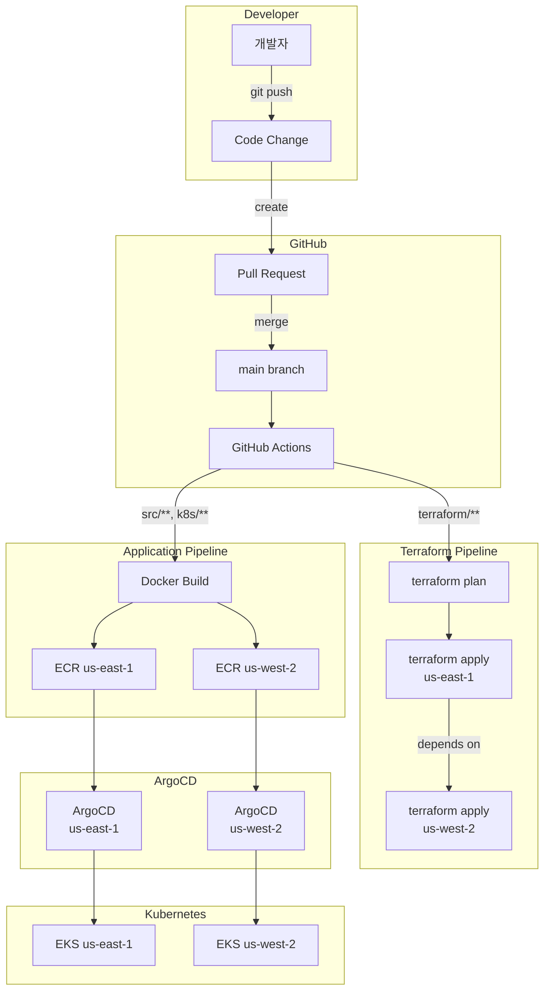
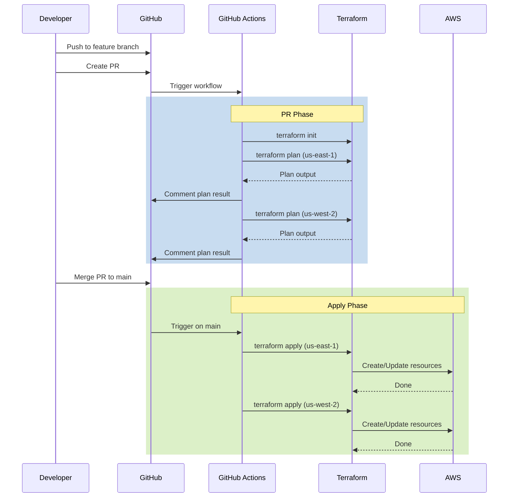
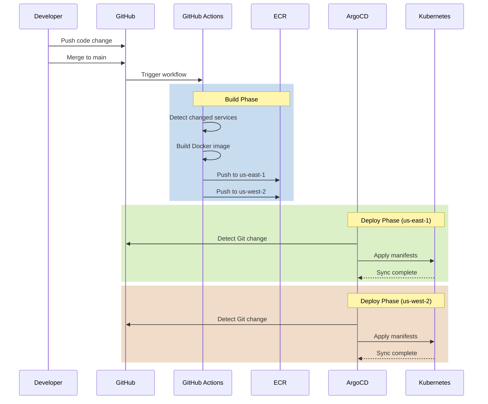
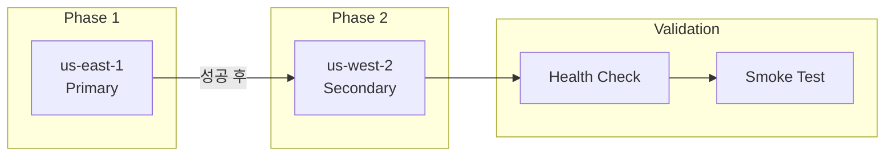
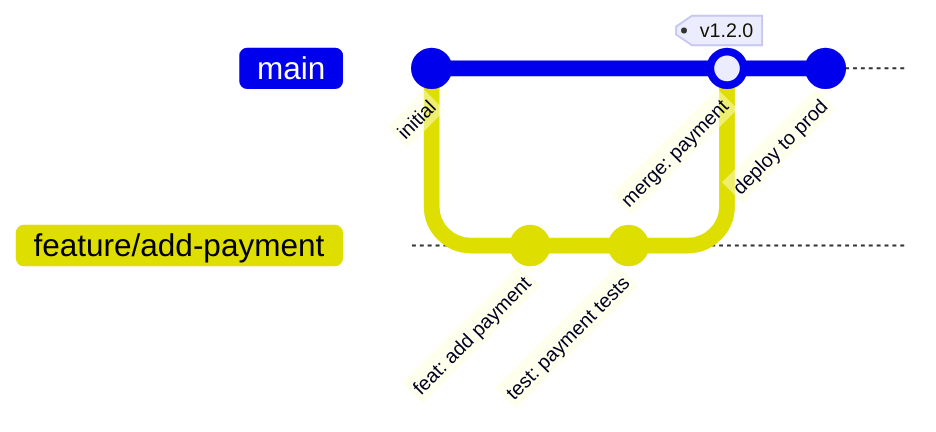

# 배포 개요

멀티 리전 쇼핑몰 플랫폼은 **GitOps** 패러다임을 채택하여 Git 저장소를 단일 진실 공급원(Single Source of Truth)으로 사용합니다. 인프라 변경은 **Terraform**으로, 애플리케이션 배포는 **ArgoCD**와 **Kustomize**로 관리합니다.

## 배포 파이프라인 개요



## GitOps 원칙

### 1. 선언적 구성 (Declarative)

모든 인프라와 애플리케이션 상태는 코드로 선언됩니다:

```
multi-region-architecture/
├── terraform/                    # 인프라 코드
│   ├── environments/
│   │   └── production/
│   │       ├── us-east-1/       # 프라이머리 리전
│   │       └── us-west-2/       # 세컨더리 리전
│   └── modules/                  # 재사용 모듈
├── k8s/                          # Kubernetes 매니페스트
│   ├── base/                     # 공통 설정
│   ├── services/                 # 서비스별 배포
│   ├── overlays/                 # 리전별 오버레이
│   │   ├── us-east-1/
│   │   └── us-west-2/
│   └── infra/                    # 인프라 컴포넌트
└── .github/workflows/            # CI/CD 파이프라인
```

### 2. 버전 관리 (Versioned)

- 모든 변경사항은 Git 커밋으로 추적
- Pull Request를 통한 변경 리뷰
- 롤백은 Git revert로 수행

### 3. 자동화 (Automated)

- PR 생성 시 자동 Plan/Preview
- main 브랜치 머지 시 자동 배포
- ArgoCD가 Git 상태와 클러스터 상태를 지속적으로 동기화

### 4. 감사 가능 (Auditable)

- Git 히스토리로 변경 이력 추적
- GitHub Actions 로그로 배포 기록 확인
- ArgoCD 동기화 히스토리

## 배포 흐름

### 인프라 변경 (Terraform)



### 애플리케이션 변경



## 환경 구성

### 리전별 역할

| 리전 | 역할 | 배포 순서 | 데이터베이스 모드 |
|------|------|----------|-----------------|
| **us-east-1** | Primary | 1번째 | Writer |
| **us-west-2** | Secondary | 2번째 (us-east-1 완료 후) | Reader / Failover |

### 배포 순서



:::caution 배포 순서 중요
인프라 변경 시 반드시 us-east-1(Primary)을 먼저 배포해야 합니다. 글로벌 데이터베이스의 경우 Primary 리전에서 글로벌 클러스터가 생성된 후 Secondary가 조인합니다.
:::

## 도구 스택

| 도구 | 용도 | 버전 |
|------|------|------|
| **Terraform** | 인프라 프로비저닝 | 1.7.0 |
| **ArgoCD** | Kubernetes GitOps | 2.10.x |
| **Kustomize** | Kubernetes 매니페스트 관리 | 5.x |
| **GitHub Actions** | CI/CD 파이프라인 | - |
| **Docker** | 컨테이너 이미지 빌드 | - |
| **ECR** | 컨테이너 레지스트리 | - |

## 브랜치 전략



### 브랜치 규칙

| 브랜치 | 용도 | 보호 규칙 |
|--------|------|----------|
| `main` | 프로덕션 배포 | PR 필수, 리뷰 1명 이상, CI 통과 |
| `feature/*` | 기능 개발 | - |
| `fix/*` | 버그 수정 | - |
| `hotfix/*` | 긴급 수정 | main에서 분기, 바로 머지 가능 |

## 롤백 전략

### 인프라 롤백

```bash
# Git에서 이전 상태로 되돌리기
git revert <commit-hash>
git push origin main

# 또는 특정 버전으로 직접 롤백
cd terraform/environments/production/us-east-1
terraform plan -target=module.eks
terraform apply -target=module.eks
```

### 애플리케이션 롤백

```bash
# ArgoCD CLI 사용
argocd app rollback <app-name> <revision>

# 또는 Git revert
git revert <commit-hash>
git push origin main
# ArgoCD가 자동으로 이전 상태로 동기화
```

## 다음 단계

- [GitOps - ArgoCD](/deployment/gitops-argocd) - ArgoCD ApplicationSet 상세
- [CI/CD 파이프라인](/deployment/ci-cd-pipeline) - GitHub Actions 워크플로우
- [Kustomize 오버레이](/deployment/kustomize-overlays) - 리전별 구성
- [롤아웃 전략](/deployment/rollout-strategy) - 배포 및 롤백 전략
