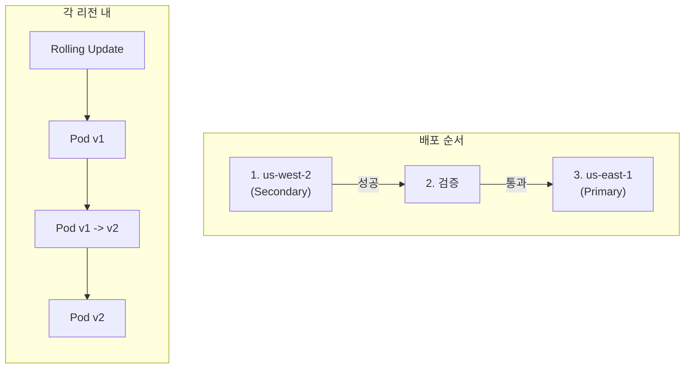
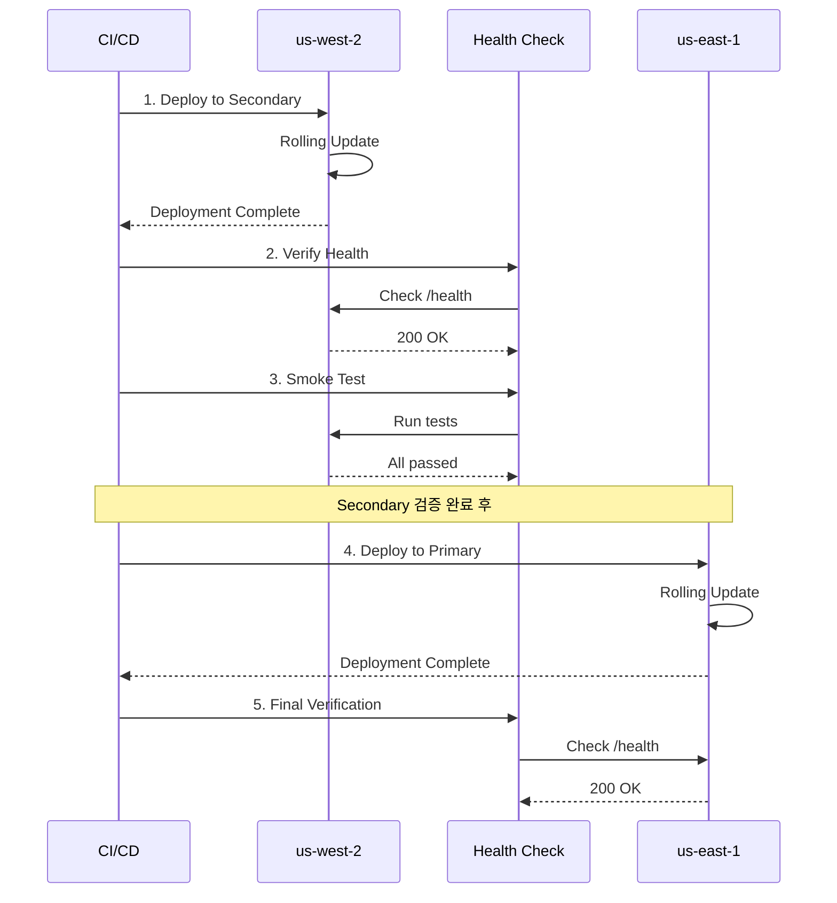
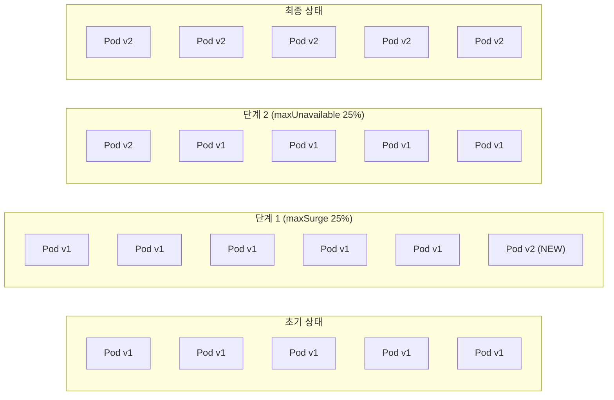
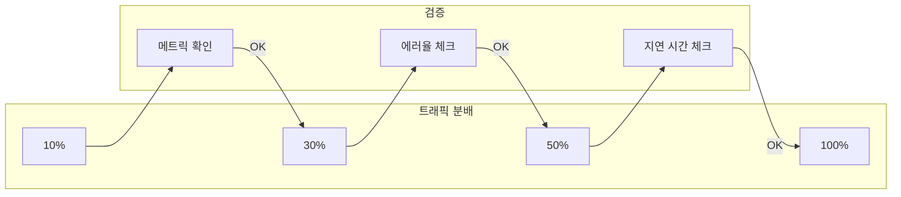
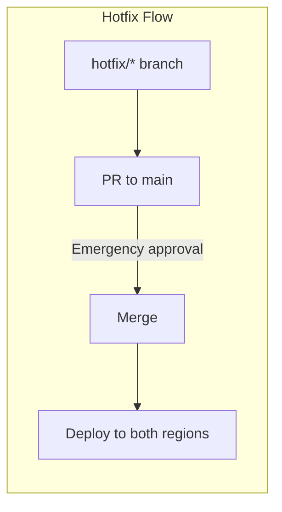

# 롤아웃 전략

멀티 리전 쇼핑몰 플랫폼은 안전한 배포를 위해 **Rolling Update** 전략을 기본으로 사용하며, 리전 간 **순차적 배포**를 통해 장애 영향을 최소화합니다.

## 배포 전략 개요



## 리전별 배포 순서

### Secondary First 전략

세컨더리 리전(us-west-2)에 먼저 배포하여 문제를 조기에 발견합니다:



### 배포 순서의 이유

| 순서 | 리전 | 이유 |
|------|------|------|
| 1 | us-west-2 (Secondary) | 트래픽이 적어 문제 발생 시 영향 최소화 |
| 2 | 검증 | 헬스 체크 및 스모크 테스트 |
| 3 | us-east-1 (Primary) | 검증 완료 후 메인 트래픽 리전에 배포 |

## Rolling Update 전략

### Deployment 설정

```yaml
apiVersion: apps/v1
kind: Deployment
metadata:
  name: order-service
spec:
  replicas: 5
  strategy:
    type: RollingUpdate
    rollingUpdate:
      maxSurge: 25%        # 최대 추가 Pod 수
      maxUnavailable: 25%  # 최대 불가용 Pod 수
  template:
    spec:
      containers:
        - name: order-service
          readinessProbe:
            httpGet:
              path: /health/ready
              port: 8080
            initialDelaySeconds: 10
            periodSeconds: 5
            failureThreshold: 3
          livenessProbe:
            httpGet:
              path: /health/live
              port: 8080
            initialDelaySeconds: 30
            periodSeconds: 10
            failureThreshold: 3
```

### Rolling Update 과정



## 카나리 배포 (고려사항)

현재는 Rolling Update를 사용하지만, 향후 **Argo Rollouts**를 통한 카나리 배포를 고려할 수 있습니다:

### Argo Rollouts 예시

```yaml
apiVersion: argoproj.io/v1alpha1
kind: Rollout
metadata:
  name: order-service
spec:
  replicas: 5
  strategy:
    canary:
      steps:
        - setWeight: 10
        - pause: { duration: 5m }
        - setWeight: 30
        - pause: { duration: 5m }
        - setWeight: 50
        - pause: { duration: 5m }
        - setWeight: 100
      trafficRouting:
        alb:
          ingress: order-service-ingress
          servicePort: 80
  selector:
    matchLabels:
      app: order-service
```

### 카나리 배포 흐름



## 롤백 절차

### 자동 롤백 (ArgoCD)

배포 실패 시 ArgoCD가 자동으로 이전 상태로 롤백합니다:

```yaml
syncPolicy:
  automated:
    prune: true
    selfHeal: true
  retry:
    limit: 5
    backoff:
      duration: 5s
      factor: 2
      maxDuration: 3m
```

### 수동 롤백

#### 방법 1: ArgoCD CLI

```bash
# 이전 버전으로 롤백
argocd app rollback order-service <revision>

# 특정 커밋으로 동기화
argocd app sync order-service --revision <commit-hash>
```

#### 방법 2: Git Revert

```bash
# 문제가 된 커밋 되돌리기
git revert <commit-hash>
git push origin main

# ArgoCD가 자동으로 변경 감지 및 동기화
```

#### 방법 3: kubectl 직접 롤백

```bash
# Deployment 롤백
kubectl rollout undo deployment/order-service -n core-services

# 특정 리비전으로 롤백
kubectl rollout undo deployment/order-service -n core-services --to-revision=2

# 롤백 상태 확인
kubectl rollout status deployment/order-service -n core-services
```

### 롤백 결정 기준

| 지표 | 임계값 | 조치 |
|------|--------|------|
| 에러율 | > 5% | 즉시 롤백 |
| P99 지연 시간 | > 2초 | 검토 후 롤백 |
| Pod 재시작 | > 3회/5분 | 즉시 롤백 |
| 헬스 체크 실패 | 연속 3회 | 자동 롤백 |

## 배포 검증

### 헬스 체크

```bash
# 모든 Pod 상태 확인
kubectl get pods -n core-services -l app=order-service

# Pod 준비 상태 확인
kubectl wait --for=condition=ready pod \
  -l app=order-service \
  -n core-services \
  --timeout=300s
```

### 스모크 테스트

```bash
# API 엔드포인트 테스트
curl -f https://api.atomai.click/health

# 주요 기능 테스트
curl -X POST https://api.atomai.click/api/v1/orders/validate \
  -H "Content-Type: application/json" \
  -d '{"test": true}'
```

### 메트릭 확인

```promql
# 에러율 확인
sum(rate(http_requests_total{status=~"5.."}[5m])) /
sum(rate(http_requests_total[5m])) * 100

# P99 지연 시간
histogram_quantile(0.99, sum(rate(http_request_duration_seconds_bucket[5m])) by (le))
```

## 긴급 배포 절차

### Hotfix 배포



### 긴급 배포 체크리스트

1. [ ] 문제 확인 및 핫픽스 브랜치 생성
2. [ ] 수정 사항 적용 및 테스트
3. [ ] PR 생성 및 긴급 리뷰
4. [ ] main 브랜치 머지
5. [ ] 배포 모니터링
6. [ ] 롤백 준비 (필요시)

## 배포 모니터링

### 실시간 모니터링

```bash
# 배포 상태 실시간 확인
kubectl rollout status deployment/order-service -n core-services -w

# Pod 이벤트 확인
kubectl get events -n core-services --sort-by='.lastTimestamp' | tail -20

# 로그 확인
kubectl logs -f deployment/order-service -n core-services
```

### Grafana 대시보드

- **Deployment Status**: 배포 진행 상황
- **Error Rate**: 에러율 추이
- **Latency**: 응답 시간 추이
- **Pod Status**: Pod 상태 변화

## 다음 단계

- [GitOps - ArgoCD](/deployment/gitops-argocd) - ArgoCD 구성
- [CI/CD 파이프라인](/deployment/ci-cd-pipeline) - GitHub Actions
- [관찰성](/observability/distributed-tracing) - 분산 추적
