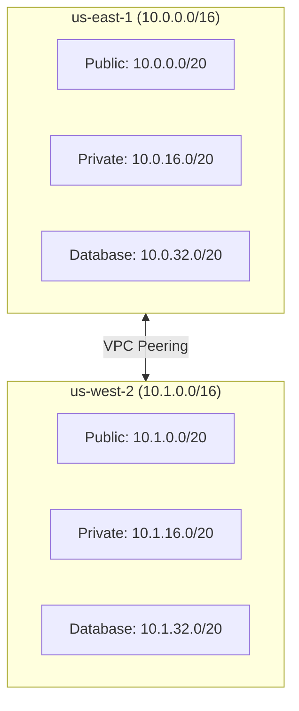

# 사전 요구사항

Multi-Region Shopping Mall 플랫폼을 배포하기 위한 사전 요구사항입니다.

## AWS 계정 요구사항

### 리전 접근 권한

두 개의 AWS 리전에 대한 전체 접근 권한이 필요합니다:

| 리전 | 역할 | 설명 |
|------|------|------|
| **us-east-1** | Primary | 주 리전, 쓰기 작업 처리 |
| **us-west-2** | Secondary | 보조 리전, 읽기 작업 및 장애 복구 |

### IAM 권한

배포에 필요한 최소 IAM 권한:

```json
{
  "Version": "2012-10-17",
  "Statement": [
    {
      "Effect": "Allow",
      "Action": [
        "eks:*",
        "ec2:*",
        "elasticache:*",
        "rds:*",
        "docdb:*",
        "es:*",
        "kafka:*",
        "s3:*",
        "cloudfront:*",
        "route53:*",
        "wafv2:*",
        "kms:*",
        "secretsmanager:*",
        "iam:*",
        "logs:*",
        "xray:*",
        "ecr:*"
      ],
      "Resource": "*"
    }
  ]
}
```

:::warning 프로덕션 환경
실제 프로덕션 환경에서는 최소 권한 원칙에 따라 리소스별로 세분화된 IAM 정책을 사용하세요.
:::

## 필수 도구

로컬 개발 환경에 다음 도구들이 설치되어 있어야 합니다:

### 인프라 도구

| 도구 | 최소 버전 | 설명 | 설치 확인 |
|------|-----------|------|-----------|
| **Terraform** | >= 1.7.0 | 인프라 프로비저닝 | `terraform version` |
| **kubectl** | >= 1.29 | Kubernetes 클러스터 관리 | `kubectl version --client` |
| **Helm** | >= 3.14 | Kubernetes 패키지 관리 | `helm version` |
| **AWS CLI** | v2 | AWS 리소스 관리 | `aws --version` |
| **Docker** | >= 24.0 | 컨테이너 빌드 | `docker --version` |

### 개발 언어 런타임

| 언어 | 버전 | 사용 서비스 | 설치 확인 |
|------|------|-------------|-----------|
| **Go** | 1.21+ | api-gateway, event-bus, cart, search, inventory | `go version` |
| **Java** | 17 (LTS) | order, payment, user-account, warehouse, returns, pricing, seller | `java -version` |
| **Python** | 3.11+ | product-catalog, shipping, user-profile, recommendation, wishlist, analytics, notification, review | `python3 --version` |
| **Node.js** | 20 (LTS) | 빌드 도구, 문서 사이트 | `node --version` |

### 설치 스크립트

```bash
# macOS (Homebrew)
brew install terraform kubectl helm awscli docker
brew install go openjdk@17 python@3.11 node@20

# Ubuntu/Debian
# Terraform
wget -O- https://apt.releases.hashicorp.com/gpg | sudo gpg --dearmor -o /usr/share/keyrings/hashicorp-archive-keyring.gpg
echo "deb [signed-by=/usr/share/keyrings/hashicorp-archive-keyring.gpg] https://apt.releases.hashicorp.com $(lsb_release -cs) main" | sudo tee /etc/apt/sources.list.d/hashicorp.list
sudo apt update && sudo apt install terraform

# kubectl
curl -LO "https://dl.k8s.io/release/$(curl -L -s https://dl.k8s.io/release/stable.txt)/bin/linux/amd64/kubectl"
sudo install -o root -g root -m 0755 kubectl /usr/local/bin/kubectl

# Helm
curl https://raw.githubusercontent.com/helm/helm/main/scripts/get-helm-3 | bash

# AWS CLI v2
curl "https://awscli.amazonaws.com/awscli-exe-linux-x86_64.zip" -o "awscliv2.zip"
unzip awscliv2.zip && sudo ./aws/install
```

## AWS 서비스 할당량

멀티리전 배포를 위해 다음 서비스 할당량이 충분한지 확인하세요:

### 컴퓨팅 및 네트워킹

| 서비스 | 할당량 항목 | 최소 필요량 (리전당) |
|--------|-------------|---------------------|
| **EKS** | Clusters per region | 2 |
| **VPC** | VPCs per region | 2 |
| **VPC** | NAT Gateways per AZ | 3 |
| **VPC** | Elastic IPs | 6 |
| **EC2** | Running On-Demand instances | 50 vCPU |
| **ALB** | Application Load Balancers | 2 |

### 데이터베이스

| 서비스 | 할당량 항목 | 최소 필요량 (리전당) |
|--------|-------------|---------------------|
| **Aurora** | DB clusters | 1 |
| **Aurora** | DB instances per cluster | 2 |
| **DocumentDB** | Clusters | 1 |
| **DocumentDB** | Instances per cluster | 2 |
| **ElastiCache** | Nodes | 4 |
| **ElastiCache** | Parameter groups | 2 |

### 검색 및 메시징

| 서비스 | 할당량 항목 | 최소 필요량 (리전당) |
|--------|-------------|---------------------|
| **OpenSearch** | Domains | 1 |
| **OpenSearch** | Instances per domain | 3 |
| **MSK** | Clusters | 1 |
| **MSK** | Brokers per cluster | 3 |

### 엣지 및 보안

| 서비스 | 할당량 항목 | 최소 필요량 |
|--------|-------------|-------------|
| **CloudFront** | Distributions | 1 |
| **WAF** | Web ACLs per region | 1 |
| **Route 53** | Hosted zones | 1 |
| **KMS** | Keys per region | 5 |
| **Secrets Manager** | Secrets per region | 20 |

### 할당량 확인 및 증가 요청

```bash
# 현재 할당량 확인
aws service-quotas list-service-quotas \
  --service-code eks \
  --region us-east-1

# 할당량 증가 요청
aws service-quotas request-service-quota-increase \
  --service-code eks \
  --quota-code L-1194D53C \
  --desired-value 5 \
  --region us-east-1
```

## 도메인 및 인증서

### Route 53 도메인

- 도메인: `atomai.click` (또는 사용자 도메인)
- Route 53 Hosted Zone이 생성되어 있어야 함
- NS 레코드가 도메인 등록 기관에 설정되어 있어야 함

### SSL/TLS 인증서

와일드카드 인증서가 필요합니다:

```
*.atomai.click
```

ACM에서 인증서 발급:
- **us-east-1**: CloudFront용 (필수 - CloudFront는 us-east-1 인증서만 사용)
- **us-west-2**: ALB용

## 네트워크 요구사항

### CIDR 블록 계획



### 필수 포트

| 포트 | 프로토콜 | 용도 |
|------|----------|------|
| 443 | HTTPS | API Gateway, 웹 트래픽 |
| 5432 | TCP | Aurora PostgreSQL |
| 27017 | TCP | DocumentDB |
| 6379 | TCP | ElastiCache Valkey |
| 9096 | TCP | MSK Kafka (SASL/SCRAM) |
| 443 | HTTPS | OpenSearch |

## 사전 체크리스트

배포 전 다음 항목을 확인하세요:

- [ ] AWS 계정에 us-east-1, us-west-2 접근 권한 확인
- [ ] IAM 사용자/역할에 필요한 권한 부여
- [ ] 모든 필수 도구 설치 및 버전 확인
- [ ] AWS 서비스 할당량 확인 (필요시 증가 요청)
- [ ] Route 53 Hosted Zone 생성 완료
- [ ] ACM 인증서 발급 완료 (us-east-1, us-west-2)
- [ ] VPC CIDR 블록 충돌 없음 확인

## 다음 단계

모든 사전 요구사항을 충족했다면, [빠른 시작 가이드](./quick-start)로 진행하세요.
