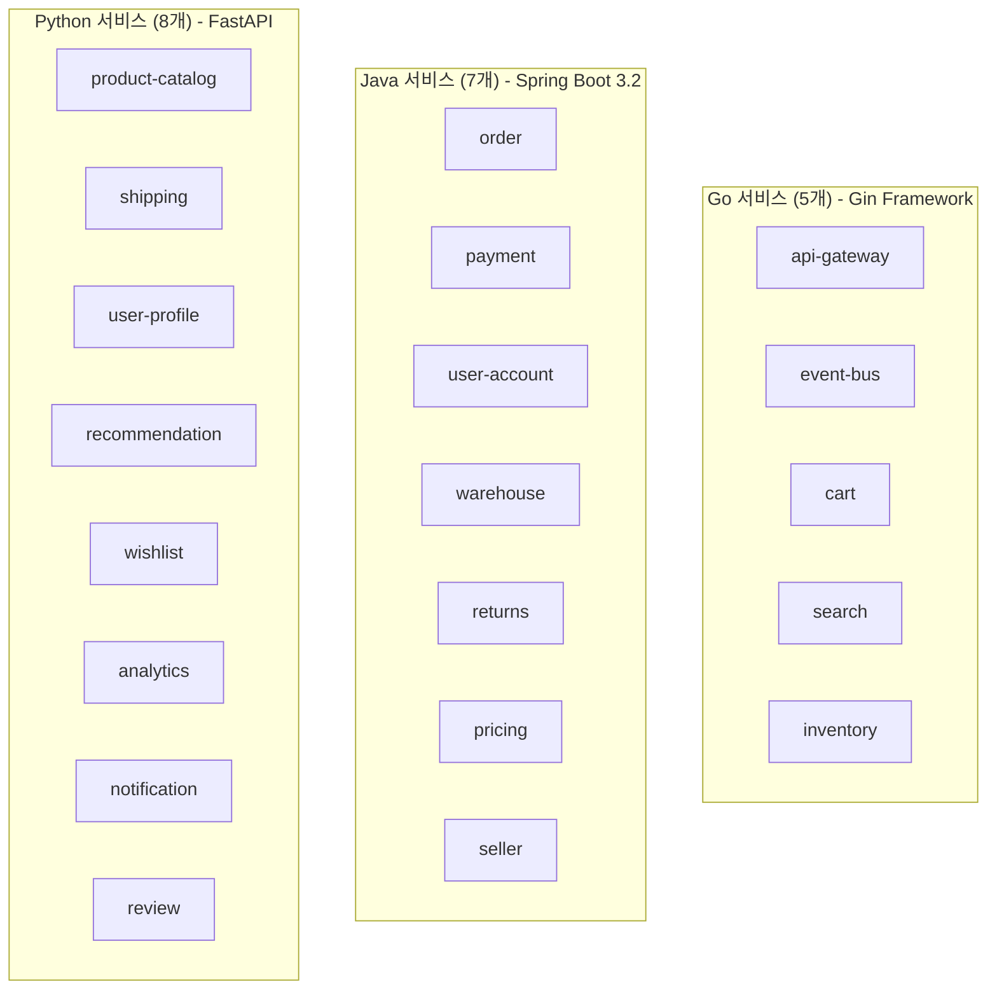
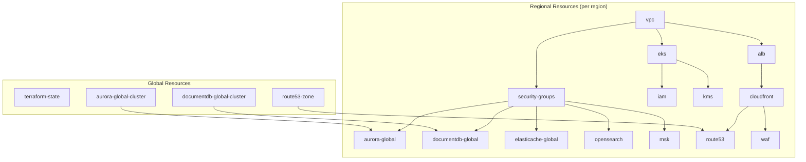
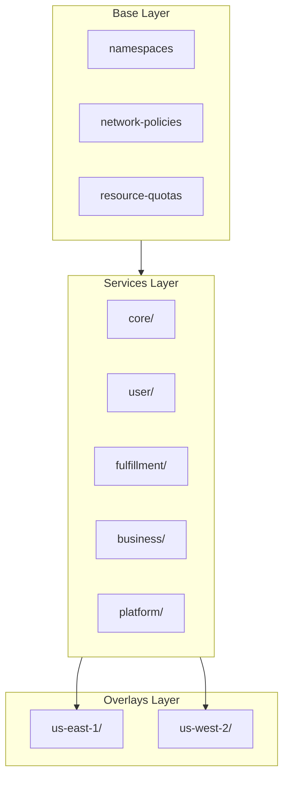
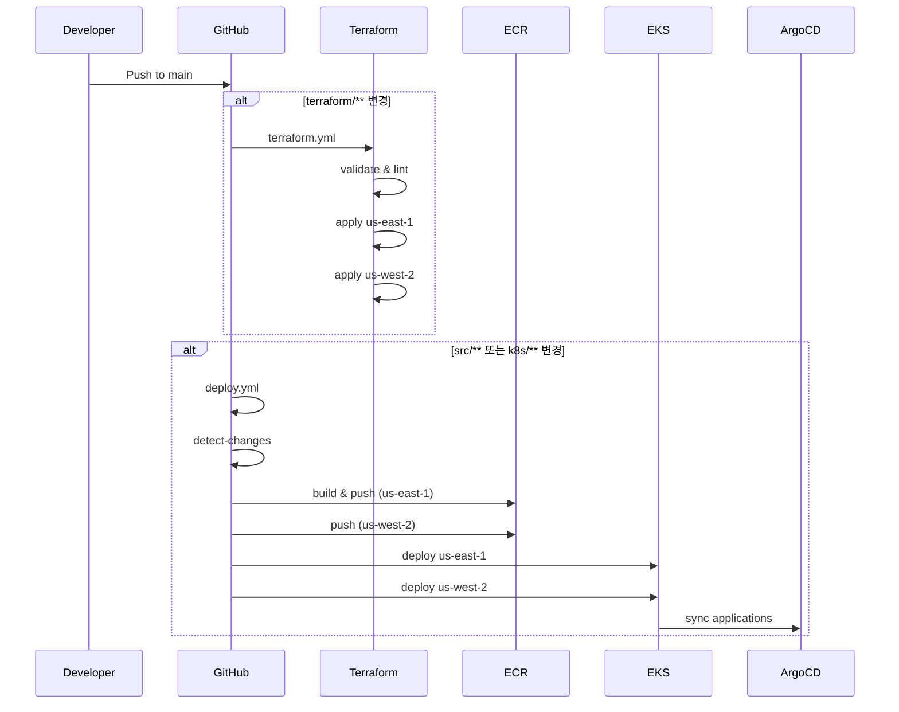

# 프로젝트 구조

Multi-Region Shopping Mall 프로젝트의 전체 디렉토리 구조와 각 구성 요소에 대한 설명입니다.

## 전체 구조 개요

```
multi-region-architecture/
├── src/                    # 마이크로서비스 소스 코드
├── terraform/              # 인프라 코드 (IaC)
├── k8s/                    # Kubernetes 매니페스트
├── scripts/                # 유틸리티 스크립트
├── docs/                   # 아키텍처 문서
├── webpage/                # Docusaurus 문서 사이트
└── .github/workflows/      # CI/CD 파이프라인
```

## src/ - 마이크로서비스

20개의 마이크로서비스가 도메인별로 구성되어 있습니다.

```
src/
├── shared/                 # 공유 라이브러리
│   ├── go/                 # Go 공통 패키지
│   │   └── pkg/
│   │       ├── kafka/      # Kafka 프로듀서/컨슈머
│   │       ├── region/     # 리전 인식 미들웨어
│   │       ├── tracing/    # OpenTelemetry 설정
│   │       └── health/     # 헬스체크 유틸리티
│   ├── java/               # Java 공통 라이브러리
│   │   └── mall-common/
│   │       └── src/main/java/com/mall/common/
│   │           ├── kafka/
│   │           ├── region/
│   │           └── tracing/
│   └── python/             # Python 공통 패키지
│       └── mall_common/
│           ├── kafka.py
│           ├── region.py
│           └── tracing.py
│
├── api-gateway/            # [Go] API 라우팅, 인증, 레이트 리미팅
├── event-bus/              # [Go] Kafka 이벤트 라우팅
├── cart/                   # [Go] 장바구니 (Valkey 캐시)
├── search/                 # [Go] 상품 검색 (OpenSearch)
├── inventory/              # [Go] 재고 관리 (Aurora)
│
├── order/                  # [Java] 주문 처리 (Saga 패턴)
├── payment/                # [Java] 결제 처리
├── user-account/           # [Java] 인증, 세션 관리
├── warehouse/              # [Java] 창고 할당
├── returns/                # [Java] 반품 처리
├── pricing/                # [Java] 동적 가격, 프로모션
├── seller/                 # [Java] 판매자 포털
│
├── product-catalog/        # [Python] 상품 CRUD (DocumentDB)
├── shipping/               # [Python] 배송 추적
├── user-profile/           # [Python] 사용자 프로필
├── recommendation/         # [Python] ML 추천
├── wishlist/               # [Python] 위시리스트 (Valkey)
├── analytics/              # [Python] 이벤트 분석
├── notification/           # [Python] 알림 (이메일, SMS, 푸시)
└── review/                 # [Python] 상품 리뷰
```

### 서비스별 언어 및 프레임워크



### 서비스 구조 패턴

#### Go 서비스 구조
```
src/cart/
├── cmd/
│   └── main.go                 # 엔트리 포인트
├── internal/
│   ├── handler/                # HTTP 핸들러
│   │   └── cart_handler.go
│   ├── service/                # 비즈니스 로직
│   │   └── cart_service.go
│   ├── repository/             # 데이터 액세스
│   │   └── cart_repository.go
│   └── middleware/             # 미들웨어
│       └── auth.go
├── go.mod
├── go.sum
├── Dockerfile
└── AGENTS.md
```

#### Java 서비스 구조
```
src/order/
├── src/main/java/com/mall/order/
│   ├── OrderApplication.java   # Spring Boot 메인
│   ├── controller/
│   │   └── OrderController.java
│   ├── service/
│   │   ├── OrderService.java
│   │   └── impl/
│   │       └── OrderServiceImpl.java
│   ├── repository/
│   │   └── OrderRepository.java
│   ├── entity/
│   │   └── Order.java
│   ├── dto/
│   │   ├── OrderRequest.java
│   │   └── OrderResponse.java
│   └── config/
│       └── KafkaConfig.java
├── src/main/resources/
│   └── application.yml
├── build.gradle
├── Dockerfile
└── AGENTS.md
```

#### Python 서비스 구조
```
src/product-catalog/
├── app/
│   ├── __init__.py
│   ├── main.py                 # FastAPI 앱
│   ├── api/
│   │   └── routes/
│   │       └── products.py
│   ├── core/
│   │   └── config.py
│   ├── models/
│   │   └── product.py
│   ├── services/
│   │   └── product_service.py
│   └── repositories/
│       └── product_repository.py
├── tests/
│   └── test_products.py
├── requirements.txt
├── Dockerfile
└── AGENTS.md
```

## terraform/ - 인프라 코드

Terraform 모듈 기반의 멀티리전 인프라 코드입니다.

```
terraform/
├── global/                     # 글로벌 리소스 (리전 독립)
│   ├── terraform-state/        # S3 + DynamoDB (상태 관리)
│   │   ├── main.tf
│   │   ├── variables.tf
│   │   └── outputs.tf
│   ├── route53-zone/           # Route 53 Hosted Zone
│   ├── aurora-global-cluster/  # Aurora Global Database
│   └── documentdb-global-cluster/
│
├── modules/                    # 재사용 가능한 모듈
│   ├── networking/
│   │   ├── vpc/                # VPC, 서브넷, NAT Gateway
│   │   ├── transit-gateway/    # 리전 간 연결
│   │   └── security-groups/    # 보안 그룹
│   │
│   ├── compute/
│   │   ├── eks/                # EKS 클러스터, 노드 그룹
│   │   └── alb/                # Application Load Balancer
│   │
│   ├── data/
│   │   ├── aurora-global/      # Aurora PostgreSQL (리전별)
│   │   ├── documentdb-global/  # DocumentDB (리전별)
│   │   ├── elasticache-global/ # ElastiCache Valkey
│   │   ├── opensearch/         # OpenSearch 도메인
│   │   ├── msk/                # MSK Kafka 클러스터
│   │   └── s3/                 # S3 버킷
│   │
│   ├── edge/
│   │   ├── cloudfront/         # CloudFront 배포
│   │   ├── route53/            # DNS 레코드
│   │   └── waf/                # WAF 규칙
│   │
│   ├── security/
│   │   ├── kms/                # KMS 키
│   │   ├── secrets-manager/    # 시크릿 관리
│   │   └── iam/                # IAM 역할, 정책
│   │
│   └── observability/
│       ├── cloudwatch/         # 로그 그룹, 메트릭
│       ├── xray/               # X-Ray 설정
│       └── tempo-storage/      # Tempo S3 백엔드
│
└── environments/               # 환경별 구성
    └── production/
        ├── us-east-1/          # Primary 리전
        │   ├── main.tf         # 모듈 조합
        │   ├── variables.tf
        │   ├── outputs.tf
        │   └── backend.tf      # S3 백엔드 설정
        └── us-west-2/          # Secondary 리전
            ├── main.tf
            ├── variables.tf
            ├── outputs.tf
            └── backend.tf
```

### Terraform 모듈 의존성



## k8s/ - Kubernetes 매니페스트

Kustomize 기반의 Kubernetes 매니페스트입니다.

```
k8s/
├── base/                       # 기본 리소스
│   ├── namespaces.yaml         # 네임스페이스 정의
│   ├── network-policies/       # 네트워크 정책
│   │   ├── default-deny.yaml
│   │   ├── allow-dns.yaml
│   │   ├── allow-alb-ingress.yaml
│   │   └── allow-inter-namespace.yaml
│   ├── resource-quotas/        # 리소스 쿼터
│   │   ├── core-services.yaml
│   │   ├── user-services.yaml
│   │   ├── fulfillment.yaml
│   │   ├── business-services.yaml
│   │   └── platform.yaml
│   └── kustomization.yaml
│
├── services/                   # 서비스 매니페스트
│   ├── core/                   # Core 도메인
│   │   ├── product-catalog/
│   │   │   └── deployment.yaml
│   │   ├── search/
│   │   ├── cart/
│   │   ├── order/
│   │   ├── payment/
│   │   ├── inventory/
│   │   └── kustomization.yaml
│   ├── user/                   # User 도메인
│   │   ├── user-account/
│   │   ├── user-profile/
│   │   ├── wishlist/
│   │   ├── review/
│   │   └── kustomization.yaml
│   ├── fulfillment/            # Fulfillment 도메인
│   │   ├── shipping/
│   │   ├── warehouse/
│   │   ├── returns/
│   │   └── kustomization.yaml
│   ├── business/               # Business 도메인
│   │   ├── pricing/
│   │   ├── recommendation/
│   │   ├── notification/
│   │   ├── seller/
│   │   └── kustomization.yaml
│   ├── platform/               # Platform 도메인
│   │   ├── api-gateway/
│   │   ├── event-bus/
│   │   ├── analytics/
│   │   └── kustomization.yaml
│   └── kustomization.yaml
│
├── infra/                      # 인프라 컴포넌트
│   ├── argocd/                 # ArgoCD
│   │   ├── namespace.yaml
│   │   ├── kustomization.yaml
│   │   └── apps/
│   │       ├── root-app.yaml
│   │       ├── appset-core.yaml
│   │       ├── appset-user.yaml
│   │       ├── appset-fulfillment.yaml
│   │       ├── appset-business.yaml
│   │       ├── appset-platform.yaml
│   │       ├── appset-infra.yaml
│   │       ├── appset-tempo.yaml
│   │       └── kustomization.yaml
│   ├── karpenter/              # Karpenter (노드 프로비저닝)
│   │   ├── ec2nodeclass.yaml
│   │   ├── general-nodepool.yaml
│   │   ├── critical-nodepool.yaml
│   │   └── nodepools/
│   │       ├── api-nodepool.yaml
│   │       ├── worker-nodepool.yaml
│   │       ├── memory-nodepool.yaml
│   │       └── batch-nodepool.yaml
│   ├── keda/                   # KEDA (이벤트 기반 스케일링)
│   │   ├── namespace.yaml
│   │   ├── keda-operator.yaml
│   │   └── scaledobjects/
│   ├── external-secrets/       # External Secrets Operator
│   │   ├── namespace.yaml
│   │   ├── cluster-secret-store.yaml
│   │   └── secrets/
│   ├── otel-collector/         # OpenTelemetry Collector
│   ├── tempo/                  # Grafana Tempo
│   ├── prometheus-stack/       # Prometheus + Grafana
│   ├── fluent-bit/             # Fluent Bit (로깅)
│   └── kustomization.yaml
│
└── overlays/                   # 리전별 오버레이
    ├── us-east-1/              # Primary 리전
    │   ├── core/
    │   │   └── kustomization.yaml
    │   ├── user/
    │   ├── fulfillment/
    │   ├── business/
    │   ├── platform/
    │   └── kustomization.yaml
    └── us-west-2/              # Secondary 리전
        ├── core/
        ├── user/
        ├── fulfillment/
        ├── business/
        ├── platform/
        └── kustomization.yaml
```

### Kustomize 구조



## scripts/ - 유틸리티 스크립트

```
scripts/
├── seed-data/                  # 시드 데이터
│   ├── seed-aurora.sql         # PostgreSQL 초기 데이터
│   ├── seed-documentdb.js      # MongoDB 초기 데이터
│   ├── seed-opensearch.sh      # OpenSearch 인덱스/데이터
│   ├── seed-kafka-topics.sh    # Kafka 토픽 생성
│   ├── seed-redis.sh           # Redis 초기 데이터
│   ├── run-seed.sh             # 전체 시드 실행
│   └── k8s/jobs/
│       └── seed-data-job.yaml  # K8s Job 매니페스트
├── build-and-push.sh           # Docker 이미지 빌드/푸시
└── AGENTS.md
```

## .github/workflows/ - CI/CD

```
.github/workflows/
├── terraform.yml               # Terraform CI/CD
│   # - PR: validate, lint, plan
│   # - main push: apply (primary -> secondary)
├── deploy.yml                  # 애플리케이션 배포
│   # - 변경 서비스 감지
│   # - Docker 빌드 및 ECR 푸시
│   # - EKS 배포 (primary -> secondary)
└── deploy-docs.yml             # 문서 사이트 배포
```

### CI/CD 파이프라인 흐름



## docs/ - 아키텍처 문서

```
docs/
├── architecture/
│   └── diagrams/
│       ├── multi-region-architecture.drawio
│       ├── multi-region-architecture.svg
│       ├── replication-architecture.drawio
│       └── replication-architecture.svg
├── data-architecture.md
└── network-architecture.md
```

## 네임스페이스 구조

Kubernetes 네임스페이스는 도메인 기반으로 구성됩니다:

| 네임스페이스 | 서비스 | 설명 |
|-------------|--------|------|
| `core-services` | product-catalog, search, cart, order, payment, inventory | 핵심 쇼핑 기능 |
| `user-services` | user-account, user-profile, wishlist, review | 사용자 관련 기능 |
| `fulfillment` | shipping, warehouse, returns | 주문 이행 |
| `business-services` | pricing, recommendation, notification, seller | 비즈니스 로직 |
| `platform` | api-gateway, event-bus, analytics | 플랫폼 공통 |
| `argocd` | ArgoCD | GitOps |
| `monitoring` | Prometheus, Grafana, Tempo | 모니터링 |
| `logging` | Fluent Bit | 로깅 |
| `keda` | KEDA | 오토스케일링 |
| `external-secrets` | ESO | 시크릿 관리 |
| `karpenter` | Karpenter | 노드 프로비저닝 |

## 다음 단계

- [아키텍처 개요](/architecture/overview)에서 시스템 설계 이해
- [서비스 문서](/services/overview)에서 각 마이크로서비스 상세 확인
- [인프라 문서](/infrastructure/overview)에서 AWS 리소스 구성 확인
