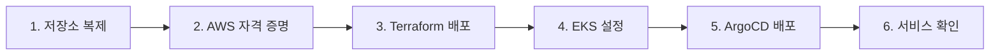

# 빠른 시작 가이드

Multi-Region Shopping Mall 플랫폼을 처음부터 배포하는 단계별 가이드입니다.

## 개요



## 1단계: 저장소 복제

```bash
# 저장소 복제
git clone https://github.com/Atom-oh/multi-region-architecture.git
cd multi-region-architecture

# 디렉토리 구조 확인
ls -la
# src/           - 20개 마이크로서비스
# terraform/     - 인프라 코드
# k8s/           - Kubernetes 매니페스트
# scripts/       - 유틸리티 스크립트
```

## 2단계: AWS 자격 증명 구성

두 리전에 대한 AWS 자격 증명을 구성합니다.

### AWS CLI 프로필 설정

```bash
# 기본 프로필 설정
aws configure
# AWS Access Key ID: [your-access-key]
# AWS Secret Access Key: [your-secret-key]
# Default region name: us-east-1
# Default output format: json

# 자격 증명 확인
aws sts get-caller-identity
```

### 멀티리전 프로필 (선택사항)

```bash
# ~/.aws/config
[profile mall-east]
region = us-east-1
output = json

[profile mall-west]
region = us-west-2
output = json

# ~/.aws/credentials
[mall-east]
aws_access_key_id = YOUR_ACCESS_KEY
aws_secret_access_key = YOUR_SECRET_KEY

[mall-west]
aws_access_key_id = YOUR_ACCESS_KEY
aws_secret_access_key = YOUR_SECRET_KEY
```

### 환경 변수 설정

```bash
# 필수 환경 변수
export AWS_ACCOUNT_ID=$(aws sts get-caller-identity --query Account --output text)
export AWS_DEFAULT_REGION=us-east-1
export TF_VAR_aws_account_id=$AWS_ACCOUNT_ID

# 확인
echo "AWS Account: $AWS_ACCOUNT_ID"
```

## 3단계: Terraform으로 인프라 배포

### 3.1 Terraform State 버킷 생성

```bash
cd terraform/global/terraform-state

# 초기화 및 적용
terraform init
terraform plan
terraform apply -auto-approve

# 출력 확인
# S3 버킷: multi-region-mall-terraform-state
# DynamoDB 테이블: multi-region-mall-terraform-locks
```

### 3.2 Global 리소스 배포

```bash
# Route 53 Hosted Zone
cd ../route53-zone
terraform init
terraform apply -auto-approve

# Aurora Global Cluster
cd ../aurora-global-cluster
terraform init
terraform apply -auto-approve

# DocumentDB Global Cluster
cd ../documentdb-global-cluster
terraform init
terraform apply -auto-approve
```

### 3.3 Primary 리전 (us-east-1) 배포

```bash
cd ../../environments/production/us-east-1

# 백엔드 초기화
terraform init

# 계획 확인
terraform plan -out=tfplan

# 적용 (약 30-45분 소요)
terraform apply tfplan
```

:::tip 배포 시간
Primary 리전 배포는 약 260개의 리소스를 생성하며, 30-45분이 소요됩니다.
특히 EKS 클러스터, RDS, OpenSearch 생성에 시간이 걸립니다.
:::

### 3.4 Secondary 리전 (us-west-2) 배포

```bash
cd ../us-west-2

# 백엔드 초기화
terraform init

# 계획 확인
terraform plan -out=tfplan

# 적용 (약 25-35분 소요)
terraform apply tfplan
```

### 3.5 배포 확인

```bash
# us-east-1 출력 확인
cd ../us-east-1
terraform output

# 주요 출력값:
# eks_cluster_endpoint = "https://xxx.eks.us-east-1.amazonaws.com"
# aurora_cluster_endpoint = "production-aurora-global-us-east-1.cluster-xxx.us-east-1.rds.amazonaws.com"
# documentdb_endpoint = "production-docdb-global-us-east-1.cluster-xxx.us-east-1.docdb.amazonaws.com"
# elasticache_endpoint = "clustercfg.production-elasticache-us-east-1.xxx.use1.cache.amazonaws.com"
# opensearch_endpoint = "vpc-production-os-use1-xxx.us-east-1.es.amazonaws.com"
```

## 4단계: kubectl 설정

### 4.1 EKS 클러스터 연결

```bash
# us-east-1 클러스터
aws eks update-kubeconfig \
  --name multi-region-mall \
  --region us-east-1 \
  --alias mall-east

# us-west-2 클러스터
aws eks update-kubeconfig \
  --name multi-region-mall \
  --region us-west-2 \
  --alias mall-west

# 컨텍스트 확인
kubectl config get-contexts
```

### 4.2 클러스터 상태 확인

```bash
# us-east-1 클러스터 확인
kubectl --context=mall-east get nodes
kubectl --context=mall-east get ns

# us-west-2 클러스터 확인
kubectl --context=mall-west get nodes
kubectl --context=mall-west get ns
```

### 4.3 Karpenter 노드 확인

```bash
# NodePool 상태 확인
kubectl --context=mall-east get nodepools
kubectl --context=mall-east get ec2nodeclasses

# 노드 프로비저닝 확인
kubectl --context=mall-east get nodes -L karpenter.sh/nodepool
```

## 5단계: ArgoCD 및 애플리케이션 배포

### 5.1 ArgoCD 설치

```bash
# us-east-1에 ArgoCD 설치
kubectl --context=mall-east apply -k k8s/infra/argocd/

# ArgoCD 서버 대기
kubectl --context=mall-east wait --for=condition=available \
  deployment/argocd-server -n argocd --timeout=300s

# 초기 비밀번호 확인
kubectl --context=mall-east -n argocd get secret argocd-initial-admin-secret \
  -o jsonpath="{.data.password}" | base64 -d
```

### 5.2 ArgoCD 접속

```bash
# 포트 포워딩
kubectl --context=mall-east port-forward svc/argocd-server -n argocd 8080:443

# 브라우저에서 접속: https://localhost:8080
# Username: admin
# Password: (위에서 확인한 비밀번호)
```

### 5.3 ApplicationSet 배포

```bash
# Root Application 배포 (모든 서비스 자동 배포)
kubectl --context=mall-east apply -f k8s/infra/argocd/apps/root-app.yaml

# ApplicationSet 상태 확인
kubectl --context=mall-east get applications -n argocd
```

### 5.4 인프라 컴포넌트 배포

```bash
# External Secrets Operator
kubectl --context=mall-east apply -k k8s/infra/external-secrets/

# KEDA (이벤트 기반 오토스케일링)
kubectl --context=mall-east apply -k k8s/infra/keda/

# Fluent Bit (로깅)
kubectl --context=mall-east apply -k k8s/infra/fluent-bit/

# OTel Collector + Tempo (분산 추적)
kubectl --context=mall-east apply -k k8s/infra/otel-collector/
kubectl --context=mall-east apply -k k8s/infra/tempo/

# Prometheus Stack
kubectl --context=mall-east apply -k k8s/infra/prometheus-stack/
```

## 6단계: 서비스 배포 및 확인

### 6.1 Kustomize로 서비스 배포

```bash
# us-east-1 전체 서비스 배포
kubectl --context=mall-east apply -k k8s/overlays/us-east-1/

# us-west-2 전체 서비스 배포
kubectl --context=mall-west apply -k k8s/overlays/us-west-2/
```

### 6.2 배포 상태 확인

```bash
# 네임스페이스별 Pod 상태 확인
for ns in core-services user-services fulfillment business-services platform; do
  echo "=== $ns ==="
  kubectl --context=mall-east get pods -n $ns
done
```

### 6.3 서비스 엔드포인트 확인

```bash
# API Gateway 엔드포인트
kubectl --context=mall-east get svc -n platform api-gateway

# ALB Ingress 확인
kubectl --context=mall-east get ingress -A
```

### 6.4 헬스 체크

```bash
# API Gateway 헬스 체크
curl -k https://api.atomai.click/health

# 개별 서비스 헬스 체크 (포트 포워딩 사용)
kubectl --context=mall-east port-forward svc/product-catalog -n core-services 8000:8000
curl http://localhost:8000/health
```

## 7단계: 시드 데이터 로드 (선택사항)

```bash
# 시드 데이터 Job 실행
kubectl --context=mall-east apply -f scripts/seed-data/k8s/jobs/seed-data-job.yaml

# Job 상태 확인
kubectl --context=mall-east get jobs -n core-services

# 로그 확인
kubectl --context=mall-east logs job/seed-data -n core-services
```

## 배포 검증 체크리스트

```bash
# 전체 시스템 상태 확인 스크립트
#!/bin/bash
echo "=== EKS Clusters ==="
aws eks describe-cluster --name multi-region-mall --region us-east-1 --query 'cluster.status'
aws eks describe-cluster --name multi-region-mall --region us-west-2 --query 'cluster.status'

echo "=== Aurora Global Cluster ==="
aws rds describe-global-clusters --query 'GlobalClusters[0].Status'

echo "=== DocumentDB Cluster ==="
aws docdb describe-db-clusters --region us-east-1 --query 'DBClusters[0].Status'

echo "=== ElastiCache ==="
aws elasticache describe-replication-groups --region us-east-1 --query 'ReplicationGroups[0].Status'

echo "=== OpenSearch ==="
aws opensearch describe-domain --domain-name production-os-use1 --region us-east-1 --query 'DomainStatus.Processing'

echo "=== Pods Status (us-east-1) ==="
kubectl --context=mall-east get pods -A | grep -v Running | grep -v Completed
```

## 문제 해결

### Terraform 상태 잠금 오류

```bash
# DynamoDB 잠금 해제
aws dynamodb delete-item \
  --table-name multi-region-mall-terraform-locks \
  --key '{"LockID": {"S": "multi-region-mall-terraform-state/production/us-east-1/terraform.tfstate"}}'
```

### EKS 연결 오류

```bash
# kubeconfig 재생성
aws eks update-kubeconfig --name multi-region-mall --region us-east-1 --alias mall-east

# IAM 인증 확인
aws eks get-token --cluster-name multi-region-mall --region us-east-1
```

### Pod CrashLoopBackOff

```bash
# 로그 확인
kubectl --context=mall-east logs <pod-name> -n <namespace> --previous

# 이벤트 확인
kubectl --context=mall-east describe pod <pod-name> -n <namespace>
```

## 다음 단계

- [로컬 개발 환경](./local-development) 설정
- [프로젝트 구조](./project-structure) 이해
- [아키텍처 개요](/architecture/overview) 학습
