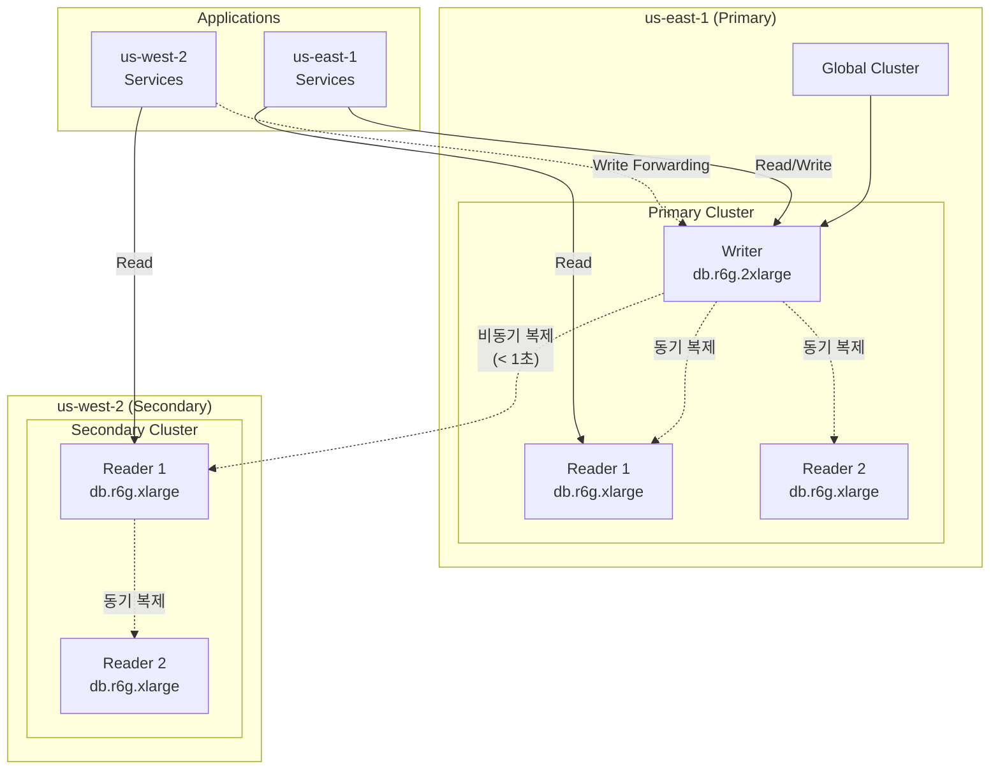

# Aurora Global Database

멀티 리전 쇼핑몰 플랫폼은 **Aurora PostgreSQL Global Database**를 사용하여 리전 간 데이터 복제를 구현합니다. us-east-1에 Writer 인스턴스가 있고, us-west-2는 Read Replica로 동작하며 **Write Forwarding**을 통해 쓰기 요청을 프라이머리로 전달합니다.

## 아키텍처



## 클러스터 사양

| 항목 | us-east-1 (Primary) | us-west-2 (Secondary) |
|------|---------------------|----------------------|
| 클러스터 ID | `production-aurora-global-us-east-1` | `production-aurora-global-us-west-2` |
| 엔진 | Aurora PostgreSQL 15.8 | Aurora PostgreSQL 15.8 |
| Writer 인스턴스 | db.r6g.2xlarge (1대) | - |
| Reader 인스턴스 | db.r6g.xlarge (2대) | db.r6g.xlarge (2대) |
| 복제 지연 | - | < 1초 |
| Write Forwarding | - | 활성화 |
| 암호화 | KMS (리전별 키) | KMS (리전별 키) |

## 연결 엔드포인트

### us-east-1

| 엔드포인트 유형 | 값 |
|---------------|-----|
| **Writer** | `production-aurora-global-us-east-1.cluster-c4pe2u8kgt26.us-east-1.rds.amazonaws.com` |
| **Reader** | `production-aurora-global-us-east-1.cluster-ro-c4pe2u8kgt26.us-east-1.rds.amazonaws.com` |
| 포트 | 5432 |

### us-west-2

| 엔드포인트 유형 | 값 |
|---------------|-----|
| **Reader** | `production-aurora-global-us-west-2.cluster-cj00m0aai7ry.us-west-2.rds.amazonaws.com` |
| **Reader (RO)** | `production-aurora-global-us-west-2.cluster-ro-cj00m0aai7ry.us-west-2.rds.amazonaws.com` |
| 포트 | 5432 |

## Terraform 구성

```hcl
resource "aws_rds_cluster" "this" {
  cluster_identifier        = "${var.environment}-aurora-global-${var.region}"
  global_cluster_identifier = var.is_primary ? null : var.global_cluster_identifier

  engine         = "aurora-postgresql"
  engine_version = "15.8"

  # Primary cluster credentials
  master_username = var.is_primary ? "mall_admin" : null
  master_password = var.is_primary ? var.master_password : null

  # Secondary cluster - Write Forwarding
  source_region                  = var.is_primary ? null : var.source_region
  enable_global_write_forwarding = var.is_primary ? null : var.enable_write_forwarding

  db_subnet_group_name   = aws_db_subnet_group.this.name
  vpc_security_group_ids = [var.security_group_id]

  storage_encrypted = true
  kms_key_id        = var.kms_key_arn

  backup_retention_period      = var.is_primary ? var.backup_retention_period : 1
  preferred_backup_window      = "03:00-04:00"
  preferred_maintenance_window = "sun:04:00-sun:05:00"

  enabled_cloudwatch_logs_exports = ["postgresql"]
  deletion_protection             = true
}

# Writer Instance (Primary only)
resource "aws_rds_cluster_instance" "writer" {
  count = var.is_primary ? 1 : 0

  identifier         = "${var.environment}-aurora-global-${var.region}-writer"
  cluster_identifier = aws_rds_cluster.this.id
  instance_class     = var.writer_instance_class  # db.r6g.2xlarge

  monitoring_interval             = 60
  performance_insights_enabled    = true
  performance_insights_kms_key_id = var.kms_key_arn
}

# Reader Instances
resource "aws_rds_cluster_instance" "readers" {
  count = var.reader_count  # 2

  identifier         = "${var.environment}-aurora-global-${var.region}-reader-${count.index + 1}"
  cluster_identifier = aws_rds_cluster.this.id
  instance_class     = var.reader_instance_class  # db.r6g.xlarge

  monitoring_interval             = 60
  performance_insights_enabled    = true
  performance_insights_kms_key_id = var.kms_key_arn
}
```

## 데이터베이스 스키마

Aurora PostgreSQL에는 다음 테이블이 저장됩니다:

### users 테이블

```sql
CREATE TABLE users (
    id UUID PRIMARY KEY DEFAULT gen_random_uuid(),
    email VARCHAR(255) UNIQUE NOT NULL,
    password_hash VARCHAR(255) NOT NULL,
    name VARCHAR(100) NOT NULL,
    phone VARCHAR(20),
    created_at TIMESTAMP DEFAULT CURRENT_TIMESTAMP,
    updated_at TIMESTAMP DEFAULT CURRENT_TIMESTAMP,
    last_login_at TIMESTAMP,
    status VARCHAR(20) DEFAULT 'active'
);

CREATE INDEX idx_users_email ON users(email);
CREATE INDEX idx_users_status ON users(status);
```

### orders 테이블

```sql
CREATE TABLE orders (
    id UUID PRIMARY KEY DEFAULT gen_random_uuid(),
    user_id UUID NOT NULL REFERENCES users(id),
    status VARCHAR(50) NOT NULL DEFAULT 'pending',
    total_amount DECIMAL(12, 2) NOT NULL,
    currency VARCHAR(3) DEFAULT 'KRW',
    shipping_address JSONB,
    created_at TIMESTAMP DEFAULT CURRENT_TIMESTAMP,
    updated_at TIMESTAMP DEFAULT CURRENT_TIMESTAMP,
    completed_at TIMESTAMP,
    region VARCHAR(20) NOT NULL
);

CREATE INDEX idx_orders_user_id ON orders(user_id);
CREATE INDEX idx_orders_status ON orders(status);
CREATE INDEX idx_orders_created_at ON orders(created_at);
CREATE INDEX idx_orders_region ON orders(region);
```

### payments 테이블

```sql
CREATE TABLE payments (
    id UUID PRIMARY KEY DEFAULT gen_random_uuid(),
    order_id UUID NOT NULL REFERENCES orders(id),
    amount DECIMAL(12, 2) NOT NULL,
    currency VARCHAR(3) DEFAULT 'KRW',
    method VARCHAR(50) NOT NULL,
    status VARCHAR(50) NOT NULL DEFAULT 'pending',
    provider VARCHAR(50),
    transaction_id VARCHAR(255),
    created_at TIMESTAMP DEFAULT CURRENT_TIMESTAMP,
    completed_at TIMESTAMP
);

CREATE INDEX idx_payments_order_id ON payments(order_id);
CREATE INDEX idx_payments_status ON payments(status);
```

### inventory 테이블

```sql
CREATE TABLE inventory (
    id UUID PRIMARY KEY DEFAULT gen_random_uuid(),
    product_id UUID NOT NULL,
    warehouse_id UUID NOT NULL,
    quantity INTEGER NOT NULL DEFAULT 0,
    reserved_quantity INTEGER NOT NULL DEFAULT 0,
    updated_at TIMESTAMP DEFAULT CURRENT_TIMESTAMP,
    UNIQUE(product_id, warehouse_id)
);

CREATE INDEX idx_inventory_product_id ON inventory(product_id);
CREATE INDEX idx_inventory_warehouse_id ON inventory(warehouse_id);
```

### shipments 테이블

```sql
CREATE TABLE shipments (
    id UUID PRIMARY KEY DEFAULT gen_random_uuid(),
    order_id UUID NOT NULL REFERENCES orders(id),
    carrier VARCHAR(50) NOT NULL,
    tracking_number VARCHAR(100),
    status VARCHAR(50) NOT NULL DEFAULT 'preparing',
    shipped_at TIMESTAMP,
    delivered_at TIMESTAMP,
    created_at TIMESTAMP DEFAULT CURRENT_TIMESTAMP
);

CREATE INDEX idx_shipments_order_id ON shipments(order_id);
CREATE INDEX idx_shipments_tracking_number ON shipments(tracking_number);
```

## Write Forwarding

세컨더리 리전의 애플리케이션이 쓰기 작업을 수행하면, Aurora는 자동으로 프라이머리 Writer로 요청을 전달합니다.

```mermaid
sequenceDiagram
    participant App as us-west-2 App
    participant Secondary as Secondary Reader
    participant Primary as Primary Writer

    App->>Secondary: INSERT INTO orders...
    Secondary->>Primary: Forward Write
    Primary->>Primary: Execute Write
    Primary-->>Secondary: Acknowledge
    Secondary-->>App: Success
    Primary-.>>Secondary: Async Replication
```

### Write Forwarding 고려사항

| 항목 | 설명 |
|------|------|
| 지연 시간 | 추가 네트워크 홉으로 인한 지연 (~50-100ms) |
| 트랜잭션 | 지원됨 (단일 리전 내에서만 권장) |
| 읽기 일관성 | SESSION, EVENTUAL, GLOBAL 중 선택 |
| 실패 처리 | 프라이머리 장애 시 쓰기 실패 |

## 모니터링

### CloudWatch 메트릭

```hcl
resource "aws_cloudwatch_metric_alarm" "aurora_cpu" {
  alarm_name          = "${var.environment}-aurora-cpu-high"
  comparison_operator = "GreaterThanThreshold"
  evaluation_periods  = 3
  metric_name         = "CPUUtilization"
  namespace           = "AWS/RDS"
  period              = 60
  statistic           = "Average"
  threshold           = 80
  alarm_description   = "Aurora CPU utilization is high"

  dimensions = {
    DBClusterIdentifier = aws_rds_cluster.this.cluster_identifier
  }
}

resource "aws_cloudwatch_metric_alarm" "aurora_replication_lag" {
  alarm_name          = "${var.environment}-aurora-replication-lag"
  comparison_operator = "GreaterThanThreshold"
  evaluation_periods  = 3
  metric_name         = "AuroraGlobalDBReplicationLag"
  namespace           = "AWS/RDS"
  period              = 60
  statistic           = "Average"
  threshold           = 1000  # 1초
  alarm_description   = "Aurora global replication lag is high"

  dimensions = {
    DBClusterIdentifier = aws_rds_cluster.this.cluster_identifier
  }
}
```

### Performance Insights

모든 인스턴스에서 Performance Insights가 활성화되어 있어 쿼리 성능을 분석할 수 있습니다:

- **Top SQL**: 가장 많은 리소스를 사용하는 쿼리
- **Wait Events**: 대기 이벤트 분석
- **DB Load**: 데이터베이스 부하 추이

## 장애 복구

### 자동 장애 조치

리전 내 Writer 장애 시 자동으로 Reader가 승격됩니다:

1. Writer 인스턴스 장애 감지 (~30초)
2. Reader 중 하나가 Writer로 승격
3. 엔드포인트 DNS 업데이트 (~30초)

### 리전 장애 복구

프라이머리 리전 전체 장애 시:

```bash
# 세컨더리를 프라이머리로 승격
aws rds failover-global-cluster \
  --global-cluster-identifier production-aurora-global \
  --target-db-cluster-identifier production-aurora-global-us-west-2
```

:::warning 주의
리전 장애 조치는 수동으로 수행해야 합니다. 자동 글로벌 장애 조치는 지원되지 않습니다.
:::

## 다음 단계

- [DocumentDB Global Cluster](/infrastructure/databases/documentdb-global) - MongoDB 호환 데이터베이스
- [ElastiCache Global Datastore](/infrastructure/databases/elasticache-global) - Redis 호환 캐시
