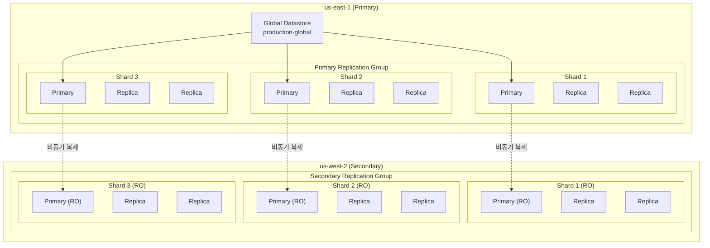
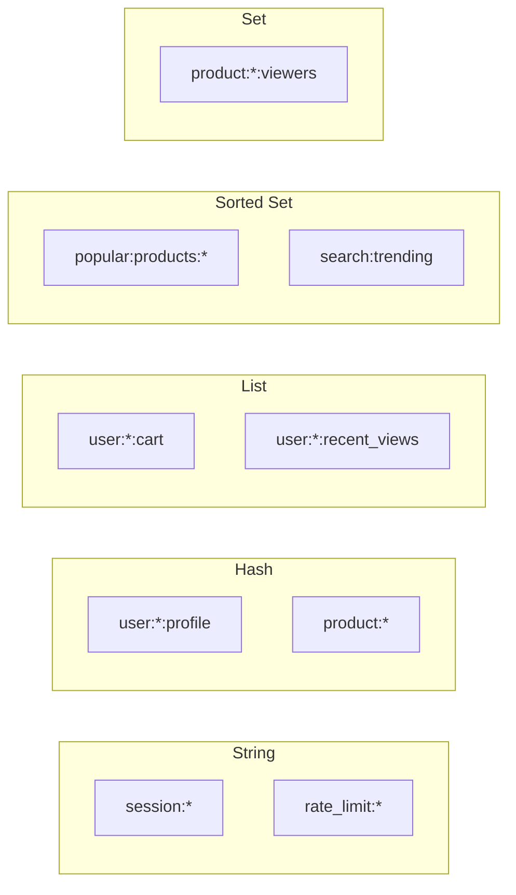

# ElastiCache Global Datastore

멀티 리전 쇼핑몰 플랫폼은 **ElastiCache for Valkey 7.2**를 사용하여 고성능 캐싱 레이어를 구현합니다. **Global Datastore**를 통해 us-east-1과 us-west-2 간 데이터를 자동으로 복제합니다.

## 아키텍처



## 클러스터 사양

| 항목 | us-east-1 (Primary) | us-west-2 (Secondary) |
|------|---------------------|----------------------|
| Replication Group ID | `production-elasticache-us-east-1` | `production-elasticache-us-west-2` |
| 엔진 | Valkey 7.2 | Valkey 7.2 |
| 노드 타입 | cache.r7g.xlarge | cache.r7g.xlarge |
| 샤드 수 | 3 | 3 |
| 샤드당 복제본 | 2 | 2 |
| 총 노드 수 | 9 (3 x 3) | 9 (3 x 3) |
| 읽기/쓰기 | Read/Write | **Read Only** |
| 암호화 | At-rest + In-transit | At-rest + In-transit |

## 연결 엔드포인트

### us-east-1

| 엔드포인트 유형 | 값 |
|---------------|-----|
| **Configuration** | `clustercfg.production-elasticache-us-east-1.hedavb.use1.cache.amazonaws.com:6379` |

### us-west-2

| 엔드포인트 유형 | 값 |
|---------------|-----|
| **Configuration** | `clustercfg.production-elasticache-us-west-2.0udeym.usw2.cache.amazonaws.com:6379` |

:::warning 중요
us-west-2는 **읽기 전용**입니다. 쓰기 작업은 us-east-1의 프라이머리 클러스터에서만 가능합니다.
:::

## Terraform 구성

```hcl
resource "aws_elasticache_subnet_group" "this" {
  name        = "${var.environment}-elasticache-global-${var.region}"
  description = "Subnet group for ElastiCache Global cluster in ${var.region}"
  subnet_ids  = var.data_subnet_ids
}

resource "aws_elasticache_parameter_group" "this" {
  name   = "${var.environment}-elasticache-global-${var.region}"
  family = "valkey7"

  parameter {
    name  = "maxmemory-policy"
    value = "volatile-lru"
  }
}

# Primary region creates the global replication group
resource "aws_elasticache_global_replication_group" "this" {
  count = var.is_primary ? 1 : 0

  global_replication_group_id_suffix = "${var.environment}-global"
  primary_replication_group_id       = aws_elasticache_replication_group.this.id

  global_replication_group_description = "Global replication group for ${var.environment}"
}

resource "aws_elasticache_replication_group" "this" {
  replication_group_id = "${var.environment}-elasticache-${var.region}"
  description          = "ElastiCache Global replication group in ${var.region}"

  # For secondary regions, join the global replication group
  global_replication_group_id = var.is_primary ? null : var.global_replication_group_id

  # Primary-only settings
  engine         = var.is_primary ? "valkey" : null
  engine_version = var.is_primary ? "7.2" : null
  node_type      = var.is_primary ? var.node_type : null  # cache.r7g.xlarge

  num_node_groups         = var.is_primary ? var.num_node_groups : null  # 3
  replicas_per_node_group = var.is_primary ? var.replicas_per_node_group : null  # 2

  automatic_failover_enabled = var.is_primary ? true : null
  multi_az_enabled           = var.is_primary ? true : null

  subnet_group_name  = aws_elasticache_subnet_group.this.name
  security_group_ids = [var.security_group_id]

  parameter_group_name = var.is_primary ? aws_elasticache_parameter_group.this.name : null

  at_rest_encryption_enabled = var.is_primary ? true : null
  kms_key_id                 = var.kms_key_arn
  transit_encryption_enabled = var.is_primary ? true : null

  snapshot_retention_limit = var.is_primary ? 7 : null
  snapshot_window          = var.is_primary ? "03:00-04:00" : null
  maintenance_window       = var.is_primary ? "sun:04:00-sun:05:00" : null
}
```

## 캐시 키 패턴

### 키 네이밍 컨벤션

```
{service}:{entity}:{identifier}:{field?}
```

### 캐시 키 목록

| 키 패턴 | 설명 | TTL | 예시 |
|--------|------|-----|------|
| `session:{sessionId}` | 사용자 세션 | 24h | `session:abc123` |
| `user:{userId}:profile` | 사용자 프로필 캐시 | 1h | `user:USER-001:profile` |
| `user:{userId}:cart` | 장바구니 | 7d | `user:USER-001:cart` |
| `product:{productId}` | 상품 상세 | 30m | `product:PROD-001` |
| `product:{productId}:inventory` | 재고 정보 | 1m | `product:PROD-001:inventory` |
| `category:{categoryId}:products` | 카테고리별 상품 목록 | 5m | `category:electronics:products` |
| `search:{queryHash}` | 검색 결과 캐시 | 10m | `search:a1b2c3d4` |
| `rate_limit:{ip}:{endpoint}` | Rate Limiting | 1m | `rate_limit:1.2.3.4:/api/orders` |
| `flash_sale:{saleId}:stock` | 플래시 세일 재고 | - | `flash_sale:SALE-001:stock` |
| `popular:products:{region}` | 인기 상품 | 15m | `popular:products:us-east-1` |

### 데이터 타입별 사용



### 캐시 패턴 예시

#### 세션 관리 (String)

```go
// 세션 저장
func SetSession(ctx context.Context, sessionID string, data []byte) error {
    return rdb.Set(ctx,
        fmt.Sprintf("session:%s", sessionID),
        data,
        24*time.Hour,
    ).Err()
}

// 세션 조회
func GetSession(ctx context.Context, sessionID string) ([]byte, error) {
    return rdb.Get(ctx, fmt.Sprintf("session:%s", sessionID)).Bytes()
}
```

#### 상품 캐시 (Hash)

```go
// 상품 정보 캐시
func CacheProduct(ctx context.Context, product *Product) error {
    key := fmt.Sprintf("product:%s", product.ID)

    return rdb.HSet(ctx, key, map[string]interface{}{
        "name":     product.Name,
        "price":    product.Price,
        "stock":    product.Stock,
        "category": product.Category,
    }).Err()
}

// TTL 설정
func SetProductTTL(ctx context.Context, productID string) error {
    return rdb.Expire(ctx,
        fmt.Sprintf("product:%s", productID),
        30*time.Minute,
    ).Err()
}
```

#### 장바구니 (List)

```go
// 장바구니에 추가
func AddToCart(ctx context.Context, userID, productID string, quantity int) error {
    key := fmt.Sprintf("user:%s:cart", userID)
    item := fmt.Sprintf("%s:%d", productID, quantity)

    return rdb.RPush(ctx, key, item).Err()
}

// 장바구니 조회
func GetCart(ctx context.Context, userID string) ([]string, error) {
    return rdb.LRange(ctx,
        fmt.Sprintf("user:%s:cart", userID),
        0, -1,
    ).Result()
}
```

#### 인기 상품 (Sorted Set)

```go
// 인기 상품 업데이트
func IncrementProductView(ctx context.Context, region, productID string) error {
    key := fmt.Sprintf("popular:products:%s", region)

    return rdb.ZIncrBy(ctx, key, 1, productID).Err()
}

// 인기 상품 Top 10 조회
func GetPopularProducts(ctx context.Context, region string) ([]string, error) {
    key := fmt.Sprintf("popular:products:%s", region)

    return rdb.ZRevRange(ctx, key, 0, 9).Result()
}
```

## 클러스터 모드 vs 논클러스터 모드

| 항목 | 클러스터 모드 (현재) | 논클러스터 모드 |
|------|-----------------|--------------|
| 샤딩 | 자동 (해시 슬롯) | 불가 |
| 확장성 | 수평 확장 가능 | 수직 확장만 |
| 키 분산 | 자동 | N/A |
| Multi-key 연산 | 동일 슬롯만 | 무제한 |
| Global Datastore | 지원 | 지원 |

:::tip 클러스터 모드 주의사항
Multi-key 연산(MGET, MSET 등)은 동일한 해시 슬롯에 있는 키들에만 사용할 수 있습니다. 관련 키들을 같은 슬롯에 배치하려면 해시 태그 `{tag}`를 사용하세요:

```
user:{USER-001}:profile
user:{USER-001}:cart
user:{USER-001}:session
```
:::

## 장애 복구

### 노드 장애

- 샤드 내 자동 장애 조치 (~30초)
- Multi-AZ 배포로 가용 영역 장애 대응

### 리전 장애 복구

```bash
# 세컨더리를 프라이머리로 승격
aws elasticache failover-global-replication-group \
  --global-replication-group-id production-global \
  --primary-region us-west-2 \
  --primary-replication-group-id production-elasticache-us-west-2
```

## 모니터링

### 주요 메트릭

| 메트릭 | 설명 | 알람 임계값 |
|--------|------|-----------|
| CPUUtilization | CPU 사용률 | > 75% |
| DatabaseMemoryUsagePercentage | 메모리 사용률 | > 80% |
| CacheHitRate | 캐시 히트율 | < 90% |
| ReplicationLag | 복제 지연 | > 1초 |
| CurrConnections | 현재 연결 수 | > 5000 |
| Evictions | 캐시 제거 수 | > 100/분 |

## 다음 단계

- [OpenSearch](/infrastructure/databases/opensearch) - 검색 엔진
- [MSK Kafka](/infrastructure/databases/msk) - 이벤트 스트리밍
