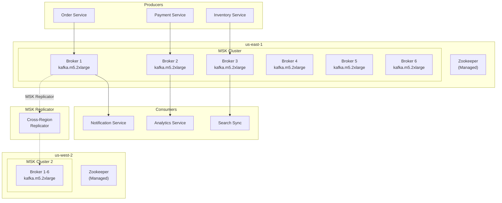
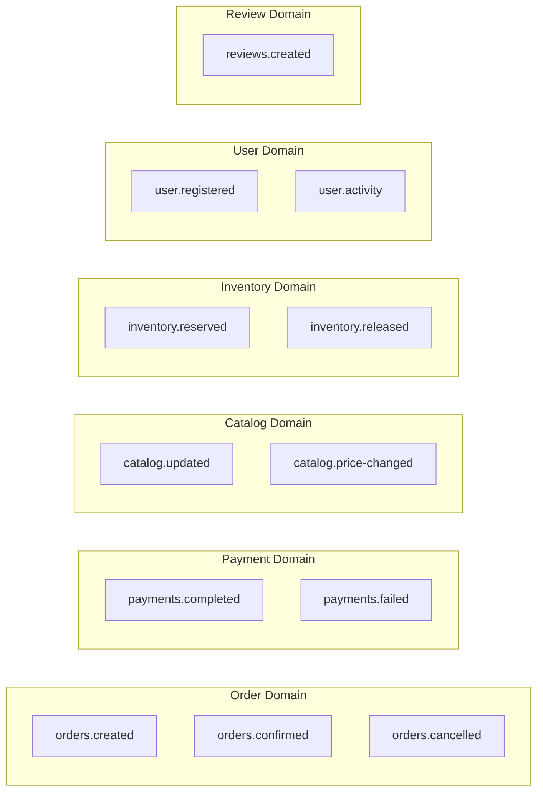

# MSK Kafka

멀티 리전 쇼핑몰 플랫폼은 **Amazon MSK (Managed Streaming for Apache Kafka)** 를 사용하여 마이크로서비스 간 이벤트 기반 통신을 구현합니다. **MSK Replicator**를 통해 두 리전 간 토픽을 복제합니다.

## 아키텍처



## 클러스터 사양

| 항목 | us-east-1 | us-west-2 |
|------|-----------|-----------|
| 클러스터 이름 | `production-msk-us-east-1` | `production-msk-us-west-2` |
| Kafka 버전 | 3.5.1 | 3.5.1 |
| 브로커 타입 | kafka.m5.2xlarge | kafka.m5.2xlarge |
| 브로커 수 | 6 (2 per AZ) | 6 (2 per AZ) |
| 스토리지 | 1TB EBS / 브로커 | 1TB EBS / 브로커 |
| 인증 | SASL/SCRAM | SASL/SCRAM |
| 암호화 | TLS + At-rest | TLS + At-rest |

## 연결 정보

### us-east-1

| 항목 | 값 |
|------|-----|
| **Bootstrap Servers (SASL)** | `b-1.productionmskuseast1.qtmqnz.c17.kafka.us-east-1.amazonaws.com:9096,b-2.productionmskuseast1.qtmqnz.c17.kafka.us-east-1.amazonaws.com:9096,b-3.productionmskuseast1.qtmqnz.c17.kafka.us-east-1.amazonaws.com:9096` |
| 포트 | 9096 (SASL/SCRAM) |

### us-west-2

| 항목 | 값 |
|------|-----|
| **Bootstrap Servers (SASL)** | `b-1.productionmskuswest2.nckvxn.c3.kafka.us-west-2.amazonaws.com:9096` |
| 포트 | 9096 (SASL/SCRAM) |

## Terraform 구성

```hcl
locals {
  topics = {
    "orders.created"        = { partitions = 12 }
    "orders.confirmed"      = { partitions = 12 }
    "orders.cancelled"      = { partitions = 6 }
    "payments.completed"    = { partitions = 12 }
    "payments.failed"       = { partitions = 6 }
    "catalog.updated"       = { partitions = 12 }
    "catalog.price-changed" = { partitions = 6 }
    "inventory.reserved"    = { partitions = 24 }
    "inventory.released"    = { partitions = 12 }
    "user.registered"       = { partitions = 6 }
    "user.activity"         = { partitions = 24 }
    "reviews.created"       = { partitions = 6 }
  }
}

resource "aws_msk_configuration" "this" {
  name           = "${var.environment}-msk-config-${var.region}"
  kafka_versions = [var.kafka_version]

  server_properties = <<PROPERTIES
auto.create.topics.enable=false
default.replication.factor=3
min.insync.replicas=2
num.partitions=6
log.retention.hours=168
PROPERTIES
}

resource "aws_msk_cluster" "this" {
  cluster_name           = "${var.environment}-msk-${var.region}"
  kafka_version          = var.kafka_version  # "3.5.1"
  number_of_broker_nodes = var.number_of_broker_nodes  # 6

  broker_node_group_info {
    instance_type   = var.broker_instance_type  # kafka.m5.2xlarge
    client_subnets  = var.data_subnet_ids
    security_groups = [var.security_group_id]

    storage_info {
      ebs_storage_info {
        volume_size = var.ebs_volume_size  # 1000
      }
    }
  }

  encryption_info {
    encryption_at_rest_kms_key_arn = var.kms_key_arn

    encryption_in_transit {
      client_broker = "TLS"
      in_cluster    = true
    }
  }

  client_authentication {
    sasl {
      scram = true
    }
  }

  open_monitoring {
    prometheus {
      jmx_exporter {
        enabled_in_broker = true
      }
      node_exporter {
        enabled_in_broker = true
      }
    }
  }

  logging_info {
    broker_logs {
      cloudwatch_logs {
        enabled   = true
        log_group = aws_cloudwatch_log_group.msk.name
      }
    }
  }

  configuration_info {
    arn      = aws_msk_configuration.this.arn
    revision = aws_msk_configuration.this.latest_revision
  }
}
```

## 토픽 설계

### 도메인별 토픽



### 토픽 상세

| 토픽 | 파티션 | 복제 팩터 | 보존 기간 | 설명 |
|------|--------|----------|----------|------|
| `orders.created` | 12 | 3 | 7일 | 주문 생성 이벤트 |
| `orders.confirmed` | 12 | 3 | 7일 | 주문 확정 이벤트 |
| `orders.cancelled` | 6 | 3 | 7일 | 주문 취소 이벤트 |
| `payments.completed` | 12 | 3 | 7일 | 결제 완료 이벤트 |
| `payments.failed` | 6 | 3 | 30일 (DLQ) | 결제 실패 이벤트 |
| `catalog.updated` | 12 | 3 | 7일 | 상품 정보 변경 |
| `catalog.price-changed` | 6 | 3 | 7일 | 가격 변경 이벤트 |
| `inventory.reserved` | 24 | 3 | 7일 | 재고 예약 이벤트 |
| `inventory.released` | 12 | 3 | 7일 | 재고 해제 이벤트 |
| `user.registered` | 6 | 3 | 7일 | 회원 가입 이벤트 |
| `user.activity` | 24 | 3 | 7일 | 사용자 활동 로그 |
| `reviews.created` | 6 | 3 | 7일 | 리뷰 작성 이벤트 |

### Dead Letter Queue (DLQ)

처리 실패한 메시지는 DLQ 토픽으로 이동합니다:

| DLQ 토픽 | 보존 기간 | 용도 |
|----------|----------|------|
| `dlq.orders` | 30일 | 주문 처리 실패 |
| `dlq.payments` | 30일 | 결제 처리 실패 |
| `dlq.inventory` | 30일 | 재고 처리 실패 |

## MSK Replicator

두 리전 간 토픽을 복제합니다.

```hcl
resource "aws_msk_replicator" "this" {
  count = var.enable_replicator ? 1 : 0

  replicator_name = "${var.environment}-msk-replicator-${var.region}"

  kafka_cluster {
    amazon_msk_cluster {
      msk_cluster_arn = var.source_cluster_arn
    }

    vpc_config {
      subnet_ids          = var.data_subnet_ids
      security_groups_ids = [var.security_group_id]
    }
  }

  kafka_cluster {
    amazon_msk_cluster {
      msk_cluster_arn = var.target_cluster_arn
    }

    vpc_config {
      subnet_ids          = var.data_subnet_ids
      security_groups_ids = [var.security_group_id]
    }
  }

  replication_info_list {
    source_kafka_cluster_arn = var.source_cluster_arn
    target_kafka_cluster_arn = var.target_cluster_arn
    target_compression_type  = "GZIP"

    topic_replication {
      topics_to_replicate = var.replicator_topics

      copy_access_control_lists_for_topics = true
      copy_topic_configurations            = true
      detect_and_copy_new_topics           = true
    }

    consumer_group_replication {
      consumer_groups_to_replicate        = [".*"]
      synchronise_consumer_group_offsets  = true
      detect_and_copy_new_consumer_groups = true
    }
  }

  service_execution_role_arn = aws_iam_role.msk_replicator[0].arn
}
```

### Replicator 설정

| 항목 | 값 |
|------|-----|
| 복제 방향 | us-east-1 -> us-west-2 |
| 복제 토픽 | 모든 주요 토픽 |
| Consumer Group 동기화 | 활성화 |
| 압축 | GZIP |
| 지연 시간 | < 1초 (일반적) |

## 이벤트 스키마

### OrderCreated 이벤트

```json
{
  "eventId": "evt-12345",
  "eventType": "OrderCreated",
  "timestamp": "2024-03-15T10:30:00Z",
  "source": "order-service",
  "region": "us-east-1",
  "data": {
    "orderId": "ORD-001",
    "userId": "USER-001",
    "items": [
      {
        "productId": "PROD-001",
        "quantity": 2,
        "price": 1650000
      }
    ],
    "totalAmount": 3300000,
    "currency": "KRW",
    "shippingAddress": {
      "zipCode": "06234",
      "address": "서울특별시 강남구..."
    }
  },
  "metadata": {
    "correlationId": "corr-12345",
    "traceId": "trace-12345"
  }
}
```

### PaymentCompleted 이벤트

```json
{
  "eventId": "evt-12346",
  "eventType": "PaymentCompleted",
  "timestamp": "2024-03-15T10:31:00Z",
  "source": "payment-service",
  "region": "us-east-1",
  "data": {
    "paymentId": "PAY-001",
    "orderId": "ORD-001",
    "amount": 3300000,
    "currency": "KRW",
    "method": "card",
    "provider": "toss",
    "transactionId": "txn-12345"
  },
  "metadata": {
    "correlationId": "corr-12345",
    "traceId": "trace-12345"
  }
}
```

## Producer/Consumer 설정

### Producer 설정 (Go)

```go
config := sarama.NewConfig()
config.Producer.RequiredAcks = sarama.WaitForAll  // acks=all
config.Producer.Retry.Max = 5
config.Producer.Return.Successes = true
config.Net.SASL.Enable = true
config.Net.SASL.Mechanism = sarama.SASLTypeSCRAMSHA512
config.Net.SASL.User = username
config.Net.SASL.Password = password
config.Net.TLS.Enable = true
```

### Consumer 설정 (Go)

```go
config := sarama.NewConfig()
config.Consumer.Group.Rebalance.Strategy = sarama.BalanceStrategyRoundRobin
config.Consumer.Offsets.Initial = sarama.OffsetOldest
config.Consumer.Offsets.AutoCommit.Enable = true
config.Consumer.Offsets.AutoCommit.Interval = 1 * time.Second
config.Net.SASL.Enable = true
config.Net.SASL.Mechanism = sarama.SASLTypeSCRAMSHA512
config.Net.TLS.Enable = true
```

## 모니터링

### 주요 메트릭

| 메트릭 | 설명 | 알람 임계값 |
|--------|------|-----------|
| MessagesInPerSec | 초당 메시지 수신 | 모니터링 |
| BytesInPerSec | 초당 바이트 수신 | > 100MB/s |
| UnderReplicatedPartitions | 복제 부족 파티션 | > 0 |
| OfflinePartitionsCount | 오프라인 파티션 | > 0 |
| ActiveControllerCount | 활성 컨트롤러 | != 1 |
| ConsumerLag | Consumer 지연 | > 10000 |
| KafkaDataLogsDiskUsed | 디스크 사용량 | > 80% |

### Prometheus 메트릭 (JMX Exporter)

```yaml
# prometheus-msk-config.yml
- job_name: 'msk'
  static_configs:
    - targets:
      - 'b-1.productionmskuseast1...:11001'
      - 'b-2.productionmskuseast1...:11001'
      - 'b-3.productionmskuseast1...:11001'
```

## 다음 단계

- [CloudFront & Edge](/infrastructure/edge-cloudfront) - CDN 구성
- [WAF & Route53](/infrastructure/edge-waf) - 보안 및 DNS
