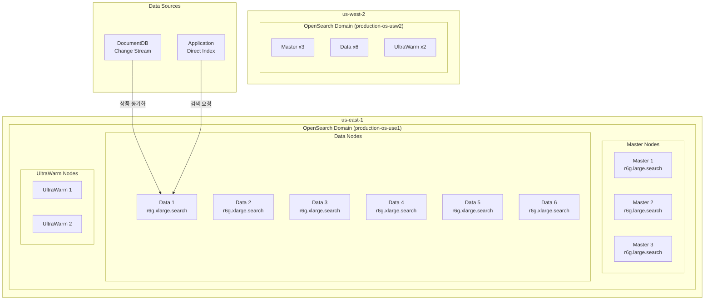
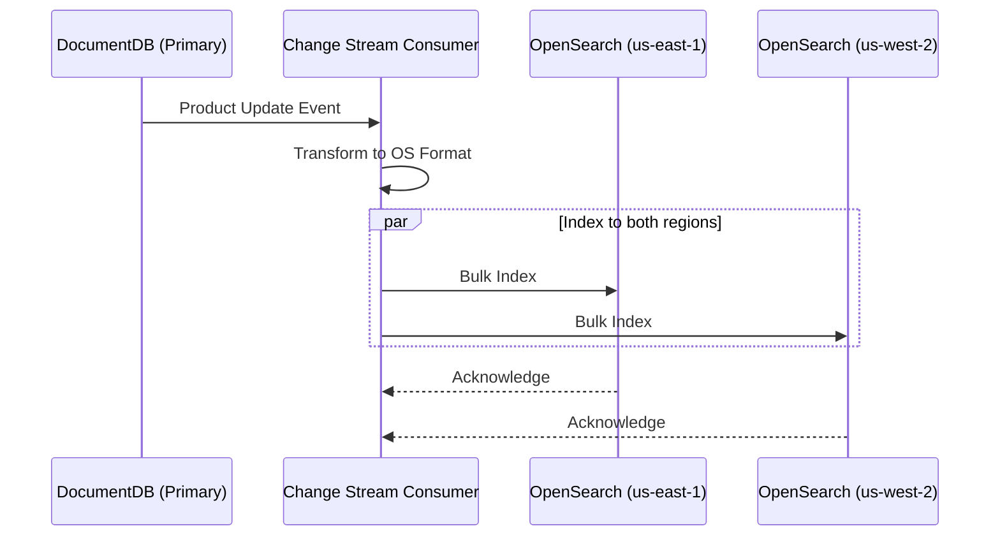

# OpenSearch

멀티 리전 쇼핑몰 플랫폼은 **Amazon OpenSearch Service 2.11**을 사용하여 상품 검색, 자동완성, 로그 분석 기능을 제공합니다. 한국어 검색을 위해 **nori 분석기**를 사용하며, 비용 최적화를 위해 **UltraWarm** 티어를 활성화합니다.

:::info 참고
OpenSearch는 Aurora, DocumentDB, ElastiCache와 달리 **글로벌 클러스터를 지원하지 않습니다**. 각 리전에 독립적인 도메인이 배포되며, 데이터 동기화는 애플리케이션 레벨에서 처리합니다.
:::

## 아키텍처



## 도메인 사양

| 항목 | us-east-1 | us-west-2 |
|------|-----------|-----------|
| 도메인 이름 | `production-os-use1` | `production-os-usw2` |
| 엔진 버전 | OpenSearch 2.11 | OpenSearch 2.11 |
| Master 노드 | r6g.large.search x 3 | r6g.large.search x 3 |
| Data 노드 | r6g.xlarge.search x 6 | r6g.xlarge.search x 6 |
| 스토리지 | 500GB gp3 / 노드 | 500GB gp3 / 노드 |
| UltraWarm | ultrawarm1.medium.search x 2 | ultrawarm1.medium.search x 2 |
| 가용 영역 | 3 | 3 |

:::note 도메인 이름 제한
OpenSearch 도메인 이름은 28자 이하여야 합니다. 따라서 리전 이름을 축약합니다:
- `us-east-1` -> `use1`
- `us-west-2` -> `usw2`
:::

## 연결 엔드포인트

| 리전 | 엔드포인트 |
|------|-----------|
| **us-east-1** | `https://vpc-production-os-use1-xxxxxxxxxxxxxxxxxxxxxxxxxxxx.us-east-1.es.amazonaws.com` |
| **us-west-2** | `https://vpc-production-os-usw2-yyyyyyyyyyyyyyyyyyyyyyyyyyyy.us-west-2.es.amazonaws.com` |

## Terraform 구성

```hcl
locals {
  # OpenSearch domain name must be <= 28 chars
  short_region = replace(replace(var.region, "us-east-", "use"), "us-west-", "usw")
  domain_name  = "${var.environment}-os-${local.short_region}"
}

resource "aws_opensearch_domain" "this" {
  domain_name    = local.domain_name
  engine_version = "OpenSearch_2.11"

  cluster_config {
    dedicated_master_enabled = true
    dedicated_master_type    = var.master_instance_type   # r6g.large.search
    dedicated_master_count   = var.master_instance_count  # 3

    instance_type  = var.data_instance_type   # r6g.xlarge.search
    instance_count = var.data_instance_count  # 6

    zone_awareness_enabled = true

    zone_awareness_config {
      availability_zone_count = 3
    }

    warm_enabled = var.enable_ultrawarm  # true
    warm_type    = var.enable_ultrawarm ? var.warm_instance_type : null
    warm_count   = var.enable_ultrawarm ? var.warm_count : null
  }

  ebs_options {
    ebs_enabled = true
    volume_type = "gp3"
    volume_size = var.ebs_volume_size  # 500
    iops        = 3000
    throughput  = 250
  }

  vpc_options {
    subnet_ids         = var.data_subnet_ids
    security_group_ids = [var.security_group_id]
  }

  encrypt_at_rest {
    enabled = true
  }

  node_to_node_encryption {
    enabled = true
  }

  domain_endpoint_options {
    enforce_https       = true
    tls_security_policy = "Policy-Min-TLS-1-2-PFS-2023-10"
  }

  advanced_security_options {
    enabled                        = true
    internal_user_database_enabled = true

    master_user_options {
      master_user_name     = "admin"
      master_user_password = var.master_user_password
    }
  }

  log_publishing_options {
    cloudwatch_log_group_arn = aws_cloudwatch_log_group.index_slow_logs.arn
    log_type                 = "INDEX_SLOW_LOGS"
  }

  log_publishing_options {
    cloudwatch_log_group_arn = aws_cloudwatch_log_group.search_slow_logs.arn
    log_type                 = "SEARCH_SLOW_LOGS"
  }

  log_publishing_options {
    cloudwatch_log_group_arn = aws_cloudwatch_log_group.es_application_logs.arn
    log_type                 = "ES_APPLICATION_LOGS"
  }
}
```

## 한국어 분석기 (Nori)

### 분석기 설정

```json
{
  "settings": {
    "analysis": {
      "analyzer": {
        "korean_analyzer": {
          "type": "custom",
          "tokenizer": "nori_tokenizer",
          "filter": [
            "nori_readingform",
            "lowercase",
            "nori_part_of_speech"
          ]
        },
        "korean_search_analyzer": {
          "type": "custom",
          "tokenizer": "nori_tokenizer",
          "filter": [
            "nori_readingform",
            "lowercase",
            "nori_part_of_speech",
            "edge_ngram_filter"
          ]
        }
      },
      "tokenizer": {
        "nori_tokenizer": {
          "type": "nori_tokenizer",
          "decompound_mode": "mixed",
          "discard_punctuation": "true"
        }
      },
      "filter": {
        "nori_part_of_speech": {
          "type": "nori_part_of_speech",
          "stoptags": [
            "E", "IC", "J", "MAG", "MAJ",
            "MM", "SP", "SSC", "SSO", "SC",
            "SE", "XPN", "XSA", "XSN", "XSV",
            "UNA", "NA", "VSV"
          ]
        },
        "edge_ngram_filter": {
          "type": "edge_ngram",
          "min_gram": 1,
          "max_gram": 20
        }
      }
    }
  }
}
```

### 인덱스 매핑 (products)

```json
{
  "mappings": {
    "properties": {
      "productId": {
        "type": "keyword"
      },
      "name": {
        "type": "text",
        "analyzer": "korean_analyzer",
        "search_analyzer": "korean_search_analyzer",
        "fields": {
          "keyword": {
            "type": "keyword"
          },
          "suggest": {
            "type": "completion",
            "analyzer": "korean_analyzer"
          }
        }
      },
      "description": {
        "type": "text",
        "analyzer": "korean_analyzer"
      },
      "category": {
        "type": "keyword"
      },
      "categoryPath": {
        "type": "keyword"
      },
      "brand": {
        "type": "keyword"
      },
      "price": {
        "type": "scaled_float",
        "scaling_factor": 100
      },
      "discountPercent": {
        "type": "integer"
      },
      "rating": {
        "type": "float"
      },
      "reviewCount": {
        "type": "integer"
      },
      "attributes": {
        "type": "nested",
        "properties": {
          "name": { "type": "keyword" },
          "value": { "type": "keyword" }
        }
      },
      "tags": {
        "type": "keyword"
      },
      "createdAt": {
        "type": "date"
      },
      "updatedAt": {
        "type": "date"
      },
      "popularity": {
        "type": "rank_feature"
      }
    }
  }
}
```

## 검색 쿼리 예시

### 기본 상품 검색

```json
{
  "query": {
    "bool": {
      "must": [
        {
          "multi_match": {
            "query": "삼성 갤럭시",
            "fields": ["name^3", "description", "brand^2"],
            "type": "best_fields",
            "fuzziness": "AUTO"
          }
        }
      ],
      "filter": [
        { "term": { "category": "smartphones" } },
        { "range": { "price": { "gte": 500000, "lte": 2000000 } } }
      ]
    }
  },
  "sort": [
    { "_score": "desc" },
    { "popularity": "desc" }
  ],
  "highlight": {
    "fields": {
      "name": {},
      "description": {}
    }
  }
}
```

### 자동완성 (Suggest)

```json
{
  "suggest": {
    "product-suggest": {
      "prefix": "갤럭시",
      "completion": {
        "field": "name.suggest",
        "size": 10,
        "skip_duplicates": true,
        "fuzzy": {
          "fuzziness": 1
        }
      }
    }
  }
}
```

### 집계 (Aggregations)

```json
{
  "query": {
    "match": { "name": "스마트폰" }
  },
  "aggs": {
    "brands": {
      "terms": { "field": "brand", "size": 20 }
    },
    "price_ranges": {
      "range": {
        "field": "price",
        "ranges": [
          { "to": 500000, "key": "50만원 미만" },
          { "from": 500000, "to": 1000000, "key": "50-100만원" },
          { "from": 1000000, "to": 1500000, "key": "100-150만원" },
          { "from": 1500000, "key": "150만원 이상" }
        ]
      }
    },
    "avg_rating": {
      "avg": { "field": "rating" }
    }
  }
}
```

## UltraWarm 티어

### 인덱스 수명 주기 정책 (ISM)

```json
{
  "policy": {
    "description": "Product index lifecycle policy",
    "default_state": "hot",
    "states": [
      {
        "name": "hot",
        "actions": [
          {
            "rollover": {
              "min_size": "50gb",
              "min_index_age": "7d"
            }
          }
        ],
        "transitions": [
          {
            "state_name": "warm",
            "conditions": {
              "min_index_age": "30d"
            }
          }
        ]
      },
      {
        "name": "warm",
        "actions": [
          {
            "warm_migration": {},
            "replica_count": {
              "number_of_replicas": 1
            }
          }
        ],
        "transitions": [
          {
            "state_name": "delete",
            "conditions": {
              "min_index_age": "365d"
            }
          }
        ]
      },
      {
        "name": "delete",
        "actions": [
          {
            "delete": {}
          }
        ]
      }
    ]
  }
}
```

## 리전 간 데이터 동기화

OpenSearch는 글로벌 클러스터를 지원하지 않으므로, DocumentDB Change Stream을 통해 양쪽 리전에 데이터를 동기화합니다.



## 모니터링

### 주요 메트릭

| 메트릭 | 설명 | 알람 임계값 |
|--------|------|-----------|
| ClusterStatus.red | 클러스터 상태 | = 1 |
| FreeStorageSpace | 남은 스토리지 | < 20GB |
| JVMMemoryPressure | JVM 메모리 압력 | > 85% |
| CPUUtilization | CPU 사용률 | > 80% |
| SearchLatency | 검색 지연 | > 200ms |
| IndexingLatency | 인덱싱 지연 | > 100ms |

## 다음 단계

- [MSK Kafka](/infrastructure/databases/msk) - 이벤트 스트리밍
- [CloudFront & Edge](/infrastructure/edge-cloudfront) - CDN 구성
