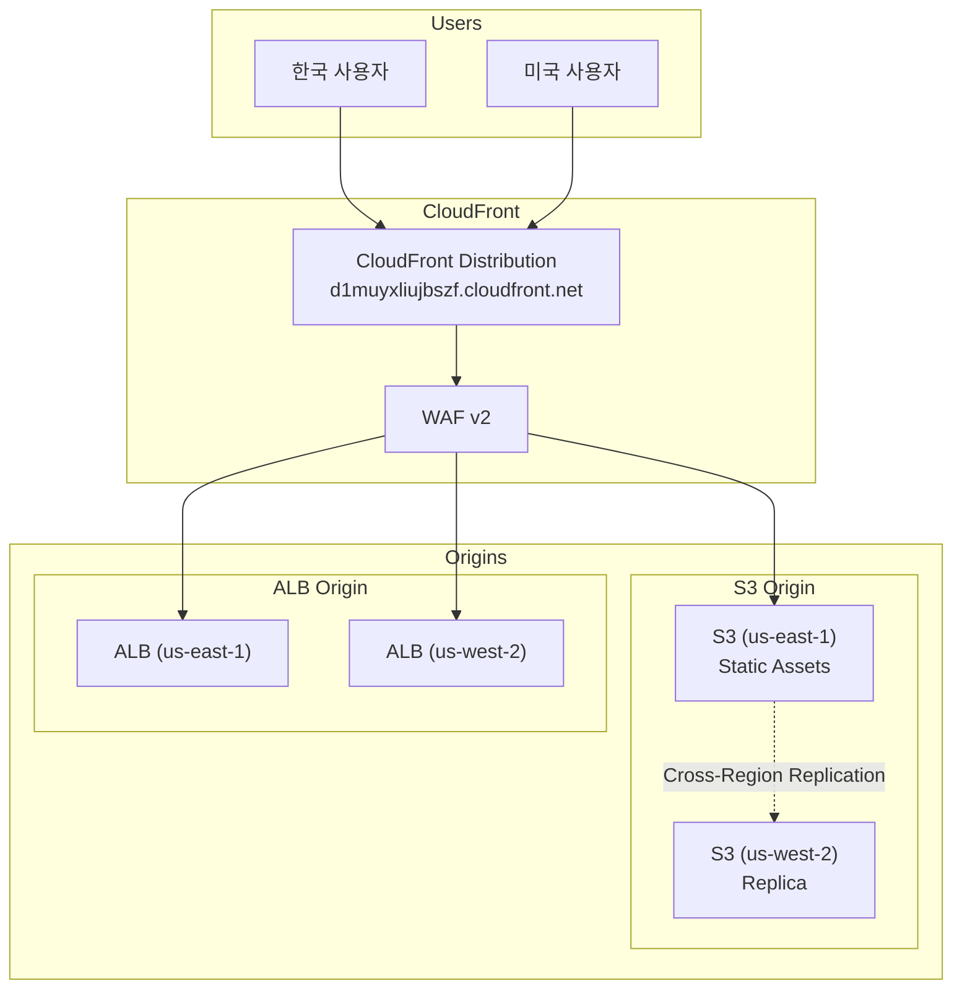
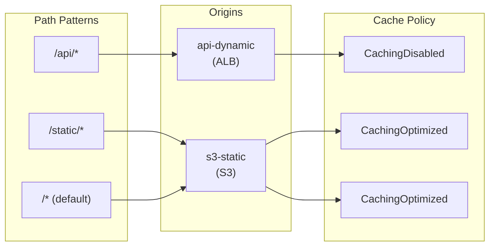
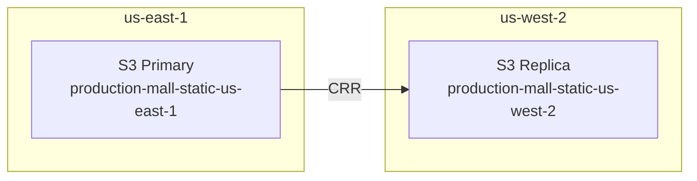

# CloudFront & CDN

멀티 리전 쇼핑몰 플랫폼은 **Amazon CloudFront**를 사용하여 전 세계 사용자에게 빠른 응답 속도를 제공합니다. 정적 자산은 S3에서 제공하고, 동적 API 요청은 리전별 ALB로 라우팅합니다.

## 아키텍처



## CloudFront 배포 구성

| 항목 | 값 |
|------|-----|
| Distribution ID | `d1muyxliujbszf.cloudfront.net` |
| 대체 도메인 (CNAME) | `www.atomai.click`, `mall.atomai.click` |
| Price Class | PriceClass_100 (전체 엣지 로케이션) |
| HTTP 버전 | HTTP/2 + HTTP/3 |
| 인증서 | ACM (`*.atomai.click`) |
| WAF | 연결됨 |
| IPv6 | 활성화 |

## Origin 구성

### S3 Origin (정적 자산)

```hcl
origin {
  domain_name              = var.static_assets_bucket_domain_name
  origin_access_control_id = aws_cloudfront_origin_access_control.s3.id
  origin_id                = "s3-static"
}

resource "aws_cloudfront_origin_access_control" "s3" {
  name                              = "${var.environment}-s3-oac"
  description                       = "Origin Access Control for S3 static assets"
  origin_access_control_origin_type = "s3"
  signing_behavior                  = "always"
  signing_protocol                  = "sigv4"
}
```

### API Origin (동적 콘텐츠)

```hcl
origin {
  domain_name = var.api_domain_name
  origin_id   = "api-dynamic"

  custom_origin_config {
    http_port              = 80
    https_port             = 443
    origin_protocol_policy = "https-only"
    origin_ssl_protocols   = ["TLSv1.2"]
  }

  origin_shield {
    enabled              = true
    origin_shield_region = "us-east-1"
  }
}
```

## Cache Behaviors



### Behavior 상세

| 경로 패턴 | Origin | 캐시 정책 | 허용 메서드 | 압축 |
|----------|--------|----------|-----------|------|
| `/api/*` | api-dynamic | CachingDisabled | ALL | - |
| `/static/*` | s3-static | CachingOptimized | GET, HEAD, OPTIONS | O |
| `/*` (default) | s3-static | CachingOptimized | GET, HEAD, OPTIONS | O |

### Terraform 구성

```hcl
resource "aws_cloudfront_distribution" "main" {
  enabled             = true
  is_ipv6_enabled     = true
  comment             = "${var.environment} CloudFront Distribution"
  default_root_object = "index.html"
  price_class         = "PriceClass_100"
  http_version        = "http2and3"
  web_acl_id          = var.waf_web_acl_id
  aliases             = ["www.${var.domain_name}", "mall.${var.domain_name}"]

  # Default cache behavior - S3 static content
  default_cache_behavior {
    target_origin_id       = "s3-static"
    viewer_protocol_policy = "redirect-to-https"
    compress               = true
    cache_policy_id        = data.aws_cloudfront_cache_policy.caching_optimized.id

    allowed_methods = ["GET", "HEAD", "OPTIONS"]
    cached_methods  = ["GET", "HEAD"]
  }

  # API paths - no caching
  ordered_cache_behavior {
    path_pattern             = "/api/*"
    target_origin_id         = "api-dynamic"
    viewer_protocol_policy   = "redirect-to-https"
    cache_policy_id          = data.aws_cloudfront_cache_policy.caching_disabled.id
    origin_request_policy_id = data.aws_cloudfront_origin_request_policy.all_viewer.id

    allowed_methods = ["DELETE", "GET", "HEAD", "OPTIONS", "PATCH", "POST", "PUT"]
    cached_methods  = ["GET", "HEAD"]
  }

  # Static assets - aggressive caching
  ordered_cache_behavior {
    path_pattern           = "/static/*"
    target_origin_id       = "s3-static"
    viewer_protocol_policy = "redirect-to-https"
    compress               = true
    cache_policy_id        = data.aws_cloudfront_cache_policy.caching_optimized.id

    allowed_methods = ["GET", "HEAD", "OPTIONS"]
    cached_methods  = ["GET", "HEAD"]
  }

  # TLS Certificate
  viewer_certificate {
    acm_certificate_arn      = var.acm_certificate_arn
    ssl_support_method       = "sni-only"
    minimum_protocol_version = "TLSv1.2_2021"
  }

  restrictions {
    geo_restriction {
      restriction_type = "none"
    }
  }
}
```

## S3 Cross-Region Replication (CRR)

정적 자산의 고가용성을 위해 S3 버킷 간 교차 리전 복제를 구성합니다.



### CRR 구성

```hcl
resource "aws_s3_bucket_replication_configuration" "static_assets" {
  bucket = aws_s3_bucket.static_assets.id
  role   = aws_iam_role.replication.arn

  rule {
    id     = "replicate-all"
    status = "Enabled"

    filter {
      prefix = ""
    }

    destination {
      bucket        = "arn:aws:s3:::production-mall-static-us-west-2"
      storage_class = "STANDARD"

      replication_time {
        status = "Enabled"
        time {
          minutes = 15
        }
      }

      metrics {
        status = "Enabled"
        event_threshold {
          minutes = 15
        }
      }
    }

    delete_marker_replication {
      status = "Enabled"
    }
  }
}
```

## 캐시 무효화

### CLI를 통한 무효화

```bash
# 특정 경로 무효화
aws cloudfront create-invalidation \
  --distribution-id E1234567890ABC \
  --paths "/static/css/*" "/static/js/*"

# 전체 무효화
aws cloudfront create-invalidation \
  --distribution-id E1234567890ABC \
  --paths "/*"
```

### CI/CD 배포 시 자동 무효화

```yaml
# GitHub Actions
- name: Invalidate CloudFront
  run: |
    aws cloudfront create-invalidation \
      --distribution-id ${{ secrets.CLOUDFRONT_DISTRIBUTION_ID }} \
      --paths "/*"
```

## 성능 최적화

### Origin Shield

Origin Shield를 활성화하여 오리진으로의 요청을 줄입니다:

```hcl
origin_shield {
  enabled              = true
  origin_shield_region = "us-east-1"
}
```

### HTTP/3 (QUIC)

HTTP/3를 활성화하여 연결 설정 시간을 단축합니다:

```hcl
http_version = "http2and3"
```

### Compression

Brotli 및 Gzip 압축을 활성화합니다:

```hcl
default_cache_behavior {
  compress = true
  # ...
}
```

## 모니터링

### CloudWatch 메트릭

| 메트릭 | 설명 |
|--------|------|
| Requests | 총 요청 수 |
| BytesDownloaded | 다운로드된 바이트 |
| BytesUploaded | 업로드된 바이트 |
| TotalErrorRate | 전체 에러율 |
| 4xxErrorRate | 4xx 에러율 |
| 5xxErrorRate | 5xx 에러율 |
| CacheHitRate | 캐시 히트율 |
| OriginLatency | 오리진 지연 시간 |

### Real-time Logs (선택)

```hcl
resource "aws_cloudfront_realtime_log_config" "main" {
  name          = "${var.environment}-realtime-logs"
  sampling_rate = 5  # 5% 샘플링

  endpoint {
    stream_type = "Kinesis"

    kinesis_stream_config {
      role_arn   = aws_iam_role.cloudfront_realtime_logs.arn
      stream_arn = aws_kinesis_stream.cloudfront_logs.arn
    }
  }

  fields = [
    "timestamp",
    "c-ip",
    "sc-status",
    "cs-uri-stem",
    "time-taken",
    "x-edge-location"
  ]
}
```

## 다음 단계

- [WAF & Route53](/infrastructure/edge-waf) - 보안 및 DNS 구성
- [배포 개요](/deployment/overview) - GitOps 배포 전략
