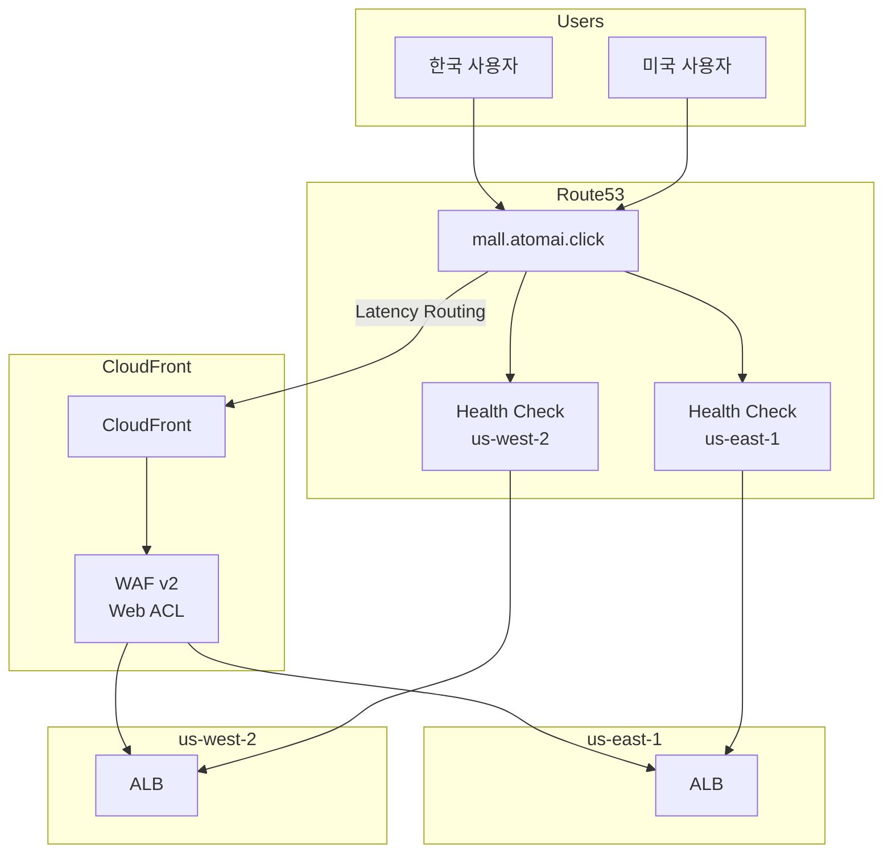
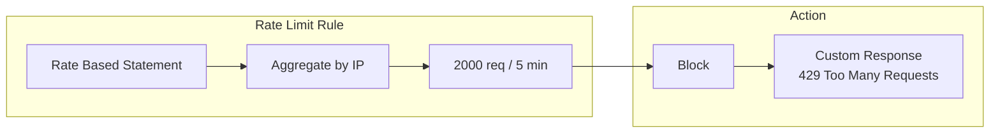
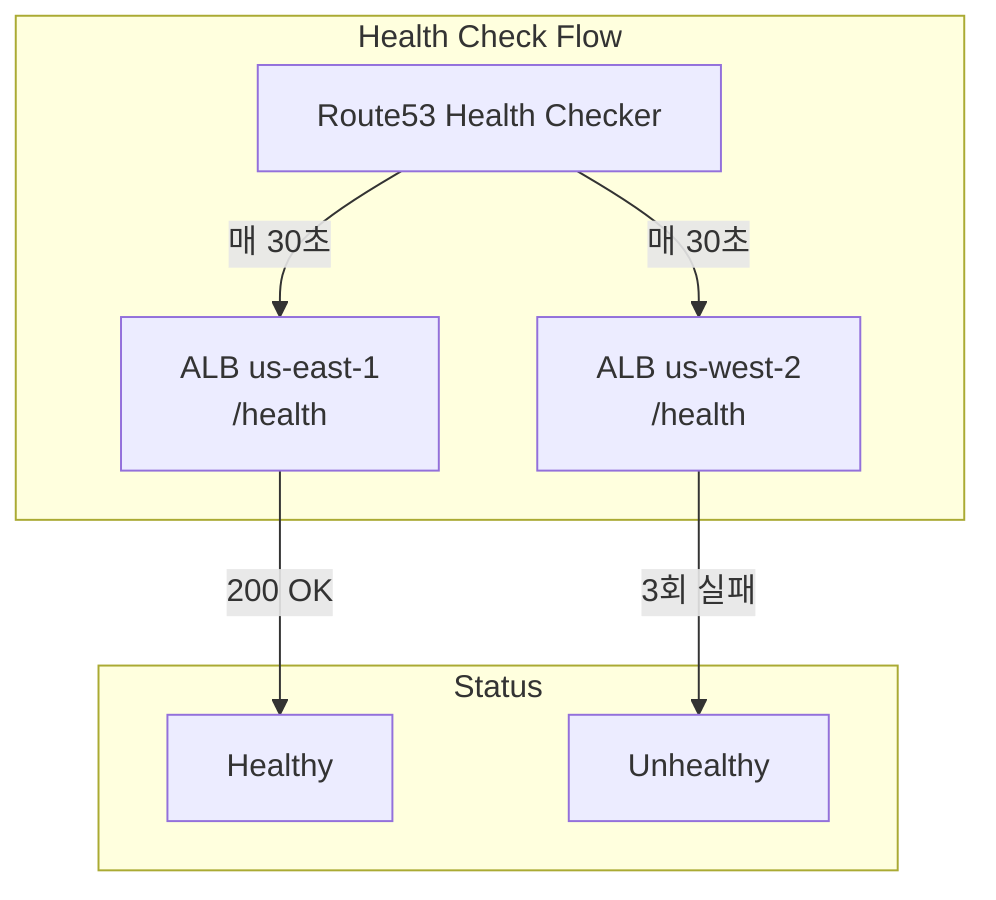
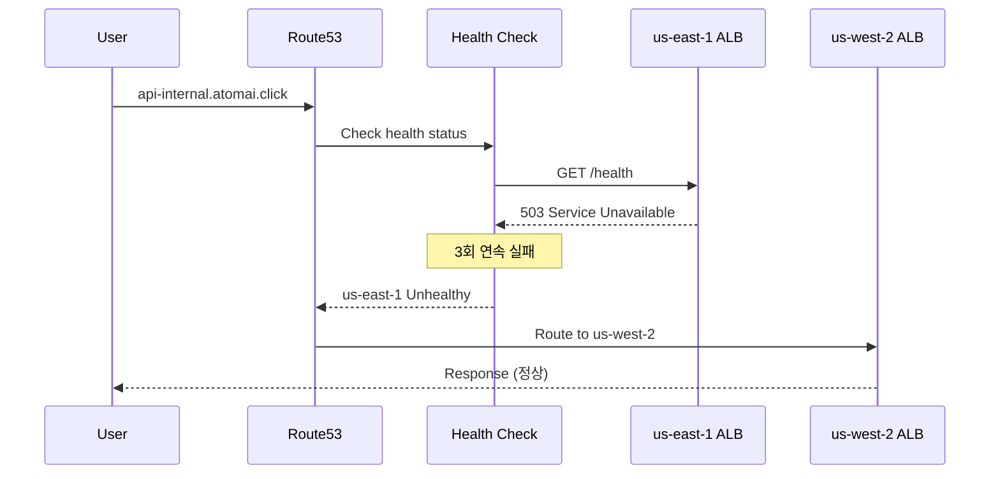

# WAF & Route53

멀티 리전 쇼핑몰 플랫폼은 **AWS WAF v2**로 웹 애플리케이션을 보호하고, **Route53**의 지연 기반 라우팅으로 사용자를 가장 가까운 리전으로 연결합니다.

## 아키텍처



## WAF v2 Web ACL

### 규칙 구성

| 우선순위 | 규칙 이름 | 유형 | 동작 | 설명 |
|---------|----------|------|------|------|
| 1 | AWSManagedRulesCommonRuleSet | Managed | Override | 일반적인 웹 취약점 방어 |
| 2 | AWSManagedRulesKnownBadInputsRuleSet | Managed | Override | 알려진 악성 입력 패턴 |
| 3 | AWSManagedRulesSQLiRuleSet | Managed | Override | SQL 인젝션 방어 |
| 4 | AWSManagedRulesBotControlRuleSet | Managed | Override | 봇 트래픽 제어 |
| 5 | RateLimit | Custom | Block | IP당 2000 req/5분 |
| 6 | GeoBlock | Custom | Block | 제재 국가 차단 |

### Terraform 구성

```hcl
resource "aws_wafv2_web_acl" "main" {
  name        = "${var.environment}-cloudfront-waf"
  description = "WAF Web ACL for CloudFront distribution"
  scope       = "CLOUDFRONT"  # CloudFront용은 us-east-1에만 생성

  default_action {
    allow {}
  }

  # Rule 1: AWS Managed Common Rule Set
  rule {
    name     = "AWSManagedRulesCommonRuleSet"
    priority = 1

    override_action {
      none {}
    }

    statement {
      managed_rule_group_statement {
        name        = "AWSManagedRulesCommonRuleSet"
        vendor_name = "AWS"
      }
    }

    visibility_config {
      cloudwatch_metrics_enabled = true
      metric_name                = "${var.environment}-common-rules"
      sampled_requests_enabled   = true
    }
  }

  # Rule 2: Known Bad Inputs
  rule {
    name     = "AWSManagedRulesKnownBadInputsRuleSet"
    priority = 2

    override_action {
      none {}
    }

    statement {
      managed_rule_group_statement {
        name        = "AWSManagedRulesKnownBadInputsRuleSet"
        vendor_name = "AWS"
      }
    }

    visibility_config {
      cloudwatch_metrics_enabled = true
      metric_name                = "${var.environment}-bad-inputs"
      sampled_requests_enabled   = true
    }
  }

  # Rule 3: SQL Injection
  rule {
    name     = "AWSManagedRulesSQLiRuleSet"
    priority = 3

    override_action {
      none {}
    }

    statement {
      managed_rule_group_statement {
        name        = "AWSManagedRulesSQLiRuleSet"
        vendor_name = "AWS"
      }
    }

    visibility_config {
      cloudwatch_metrics_enabled = true
      metric_name                = "${var.environment}-sqli"
      sampled_requests_enabled   = true
    }
  }

  # Rule 4: Bot Control
  rule {
    name     = "AWSManagedRulesBotControlRuleSet"
    priority = 4

    override_action {
      none {}
    }

    statement {
      managed_rule_group_statement {
        name        = "AWSManagedRulesBotControlRuleSet"
        vendor_name = "AWS"
      }
    }

    visibility_config {
      cloudwatch_metrics_enabled = true
      metric_name                = "${var.environment}-bot-control"
      sampled_requests_enabled   = true
    }
  }

  # Rule 5: Rate Limiting
  rule {
    name     = "RateLimit"
    priority = 5

    action {
      block {}
    }

    statement {
      rate_based_statement {
        limit              = 2000  # 5분간 2000 요청
        aggregate_key_type = "IP"
      }
    }

    visibility_config {
      cloudwatch_metrics_enabled = true
      metric_name                = "${var.environment}-rate-limit"
      sampled_requests_enabled   = true
    }
  }

  # Rule 6: Geo Block (Sanctioned Countries)
  rule {
    name     = "GeoBlock"
    priority = 6

    action {
      block {}
    }

    statement {
      geo_match_statement {
        country_codes = ["KP", "IR", "CU", "SY"]  # 제재 국가
      }
    }

    visibility_config {
      cloudwatch_metrics_enabled = true
      metric_name                = "${var.environment}-geo-block"
      sampled_requests_enabled   = true
    }
  }

  visibility_config {
    cloudwatch_metrics_enabled = true
    metric_name                = "${var.environment}-cloudfront-waf"
    sampled_requests_enabled   = true
  }
}
```

### Rate Limiting 상세



| 파라미터 | 값 | 설명 |
|---------|-----|------|
| limit | 2000 | 5분간 허용되는 최대 요청 수 |
| aggregate_key_type | IP | IP 주소 기준 집계 |
| evaluation_window | 300초 | 기본 5분 윈도우 |

## Route53 구성

### DNS 레코드

| 레코드 | 유형 | 라우팅 정책 | 값 |
|--------|------|-----------|-----|
| `mall.atomai.click` | CNAME | Simple | `d1muyxliujbszf.cloudfront.net` |
| `api-internal.atomai.click` | A (Alias) | Latency | ALB (us-east-1) |
| `api-internal.atomai.click` | A (Alias) | Latency | ALB (us-west-2) |

### Latency-Based Routing

지연 기반 라우팅은 사용자를 가장 가까운(지연이 낮은) 리전으로 연결합니다.

```hcl
resource "aws_route53_record" "api_latency" {
  for_each = { for k, v in var.alb_dns_names : k => v if v != "" }

  zone_id = var.zone_id
  name    = "api-internal.${data.aws_route53_zone.main.name}"
  type    = "A"

  alias {
    name                   = each.value
    zone_id                = var.alb_zone_ids[each.key]
    evaluate_target_health = true
  }

  set_identifier = each.key

  latency_routing_policy {
    region = each.key
  }

  health_check_id = aws_route53_health_check.regional[each.key].id
}
```

### Health Checks

각 리전의 ALB 상태를 모니터링합니다.

```hcl
resource "aws_route53_health_check" "regional" {
  for_each = var.alb_dns_names

  fqdn              = each.value
  port              = 443
  type              = "HTTPS"
  resource_path     = var.health_check_path  # /health
  request_interval  = var.health_check_interval  # 30초
  failure_threshold = var.health_check_failure_threshold  # 3

  tags = {
    Name   = "${var.environment}-${each.key}-health-check"
    Region = each.key
  }
}
```



### Health Check 파라미터

| 파라미터 | 값 | 설명 |
|---------|-----|------|
| type | HTTPS | HTTPS 엔드포인트 체크 |
| port | 443 | HTTPS 포트 |
| resource_path | /health | 헬스체크 경로 |
| request_interval | 30초 | 체크 간격 |
| failure_threshold | 3 | 실패 임계값 |

### CloudWatch 알람 연동

```hcl
resource "aws_cloudwatch_metric_alarm" "health_check" {
  for_each = var.alb_dns_names

  alarm_name          = "${var.environment}-${each.key}-health-check-alarm"
  comparison_operator = "LessThanThreshold"
  evaluation_periods  = 2
  metric_name         = "HealthCheckStatus"
  namespace           = "AWS/Route53"
  period              = 60
  statistic           = "Minimum"
  threshold           = 1
  alarm_description   = "Health check alarm for ${each.key} region"
  treat_missing_data  = "breaching"

  dimensions = {
    HealthCheckId = aws_route53_health_check.regional[each.key].id
  }
}
```

## 장애 조치 시나리오

### 단일 리전 장애



### 복구 시

1. us-east-1 ALB가 정상으로 돌아옴
2. Health Check가 성공 (1회)
3. Route53이 us-east-1을 다시 라우팅 풀에 추가
4. 사용자는 지연 기반으로 가장 가까운 리전으로 라우팅

## 모니터링

### WAF 메트릭

| 메트릭 | 설명 |
|--------|------|
| AllowedRequests | 허용된 요청 수 |
| BlockedRequests | 차단된 요청 수 |
| CountedRequests | 카운트된 요청 수 |
| PassedRequests | 통과된 요청 수 |

### WAF 로깅

```hcl
resource "aws_wafv2_web_acl_logging_configuration" "main" {
  log_destination_configs = [aws_cloudwatch_log_group.waf_logs.arn]
  resource_arn            = aws_wafv2_web_acl.main.arn

  logging_filter {
    default_behavior = "DROP"

    filter {
      behavior    = "KEEP"
      requirement = "MEETS_ANY"

      condition {
        action_condition {
          action = "BLOCK"
        }
      }

      condition {
        action_condition {
          action = "COUNT"
        }
      }
    }
  }
}
```

### Route53 Health Check 메트릭

| 메트릭 | 설명 |
|--------|------|
| HealthCheckStatus | 1 = Healthy, 0 = Unhealthy |
| HealthCheckPercentageHealthy | 정상 비율 (%) |
| ConnectionTime | 연결 시간 |
| SSLHandshakeTime | SSL 핸드셰이크 시간 |

## 보안 권장사항

### WAF 규칙 튜닝

1. **로그 분석**: 정상 요청이 차단되는지 모니터링
2. **Count 모드**: 새 규칙은 Count 모드로 먼저 테스트
3. **예외 규칙**: 필요 시 특정 IP/경로 화이트리스트

### Rate Limiting 조정

```hcl
# API 엔드포인트별 차등 Rate Limit
rule {
  name     = "APIRateLimit"
  priority = 7

  action {
    block {}
  }

  statement {
    rate_based_statement {
      limit              = 100  # 인증 API는 더 엄격하게
      aggregate_key_type = "IP"

      scope_down_statement {
        byte_match_statement {
          search_string         = "/api/auth/"
          field_to_match {
            uri_path {}
          }
          positional_constraint = "STARTS_WITH"
          text_transformation {
            priority = 0
            type     = "LOWERCASE"
          }
        }
      }
    }
  }

  visibility_config {
    cloudwatch_metrics_enabled = true
    metric_name                = "${var.environment}-api-rate-limit"
    sampled_requests_enabled   = true
  }
}
```

## 다음 단계

- [배포 개요](/deployment/overview) - GitOps 배포 전략
- [CI/CD 파이프라인](/deployment/ci-cd-pipeline) - GitHub Actions 워크플로우
