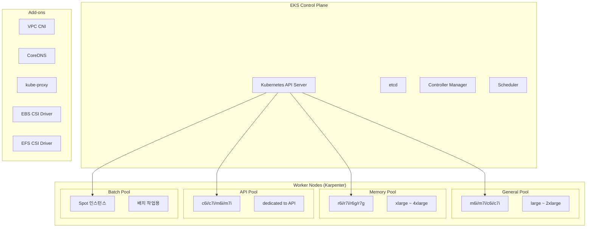
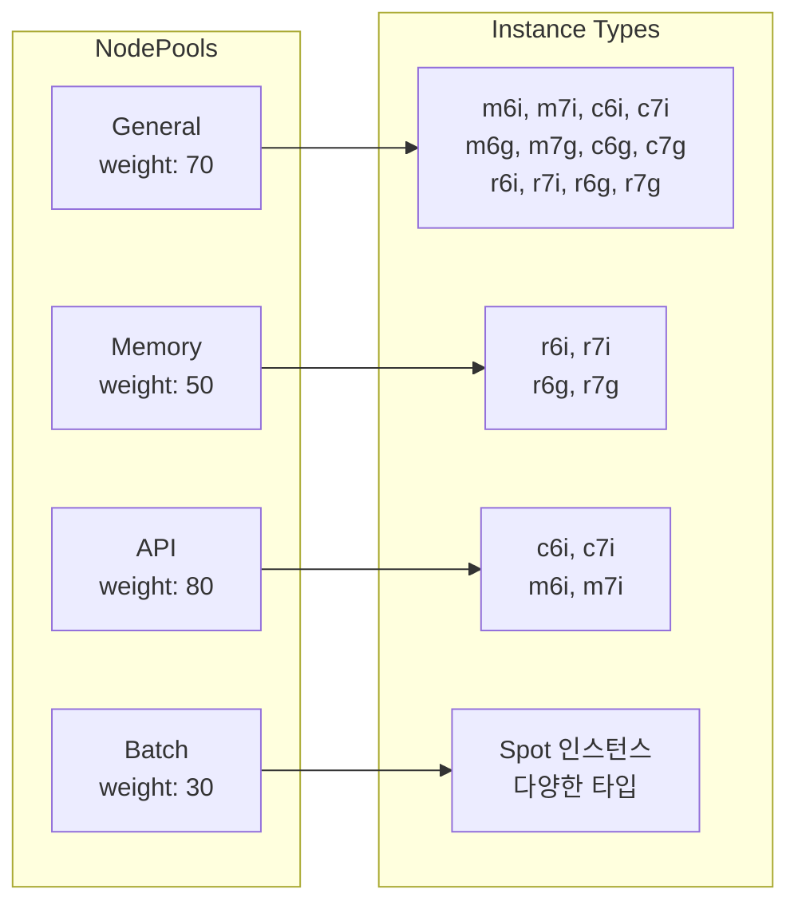
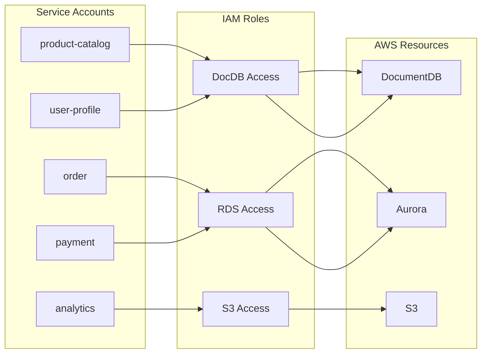

# EKS 클러스터

멀티 리전 쇼핑몰 플랫폼은 각 리전에 **Amazon EKS** 클러스터를 배포합니다. Kubernetes 1.29를 사용하며, **Karpenter**를 통해 워크로드별 최적화된 노드를 자동으로 프로비저닝합니다.

## 클러스터 구성



## 클러스터 사양

| 항목 | us-east-1 | us-west-2 |
|------|-----------|-----------|
| 클러스터 이름 | `multi-region-mall` | `multi-region-mall` |
| Kubernetes 버전 | 1.29 | 1.29 |
| API 엔드포인트 | Private + Public | Private + Public |
| Service CIDR | 172.20.0.0/16 | 172.20.0.0/16 |
| Pod Networking | VPC CNI | VPC CNI |
| 로그 유형 | api, audit, authenticator, controllerManager, scheduler |

## Terraform 구성

```hcl
resource "aws_eks_cluster" "main" {
  name     = var.cluster_name
  version  = var.cluster_version  # "1.29"
  role_arn = aws_iam_role.eks_cluster.arn

  kubernetes_network_config {
    service_ipv4_cidr = "172.20.0.0/16"
  }

  vpc_config {
    subnet_ids              = var.private_subnet_ids
    endpoint_private_access = true
    endpoint_public_access  = true
  }

  enabled_cluster_log_types = [
    "api",
    "audit",
    "authenticator",
    "controllerManager",
    "scheduler"
  ]

  encryption_config {
    provider {
      key_arn = aws_kms_key.eks_secrets.arn
    }
    resources = ["secrets"]
  }
}
```

## Karpenter NodePools

Karpenter는 워크로드 요구사항에 따라 최적의 EC2 인스턴스를 자동으로 프로비저닝합니다.

### NodePool 구성



### General NodePool

범용 워크로드를 위한 기본 NodePool입니다.

```yaml
apiVersion: karpenter.sh/v1
kind: NodePool
metadata:
  name: general
spec:
  template:
    metadata:
      labels:
        node-pool: general
    spec:
      nodeClassRef:
        group: karpenter.k8s.aws
        kind: EC2NodeClass
        name: default
      requirements:
        - key: karpenter.sh/capacity-type
          operator: In
          values:
            - spot
            - on-demand
        - key: kubernetes.io/arch
          operator: In
          values:
            - amd64
            - arm64
        - key: karpenter.k8s.aws/instance-family
          operator: In
          values:
            - m6i
            - m6g
            - m7i
            - m7g
            - c6i
            - c6g
            - c7i
            - c7g
            - r6i
            - r6g
            - r7i
            - r7g
        - key: karpenter.k8s.aws/instance-size
          operator: In
          values:
            - large
            - xlarge
            - 2xlarge
  weight: 70
  limits:
    cpu: "200"
    memory: 400Gi
  disruption:
    consolidationPolicy: WhenEmptyOrUnderutilized
    consolidateAfter: 30s
```

### NodePool 요약

| NodePool | 인스턴스 패밀리 | 용량 타입 | 제한 | 용도 |
|----------|---------------|----------|------|------|
| **general** | m6i, m7i, c6i, c7i, r6i, r7i (+ ARM) | Spot + On-Demand | 200 vCPU, 400Gi | 범용 워크로드 |
| **memory** | r6i, r7i, r6g, r7g | On-Demand | 100 vCPU, 400Gi | 메모리 집약적 (Redis, 검색) |
| **api** | c6i, c7i, m6i, m7i | On-Demand | 80 vCPU, 160Gi | API 서버 워크로드 |
| **batch** | 다양한 타입 | Spot Only | 50 vCPU, 100Gi | 배치 작업, 분석 |

### EC2NodeClass

모든 NodePool에서 공유하는 EC2 설정입니다.

```yaml
apiVersion: karpenter.k8s.aws/v1
kind: EC2NodeClass
metadata:
  name: default
spec:
  amiSelectorTerms:
    - alias: al2023@latest
  role: "multi-region-mall-node-group-${REGION}"
  subnetSelectorTerms:
    - tags:
        karpenter.sh/discovery: multi-region-mall
  securityGroupSelectorTerms:
    - tags:
        karpenter.sh/discovery: multi-region-mall
  blockDeviceMappings:
    - deviceName: /dev/xvda
      ebs:
        volumeSize: 100Gi
        volumeType: gp3
        iops: 3000
        throughput: 125
        encrypted: true
```

## 관리형 애드온

EKS 클러스터에는 다음 관리형 애드온이 설치됩니다:

| 애드온 | 설명 | IRSA |
|--------|------|------|
| **vpc-cni** | AWS VPC CNI 플러그인 | O |
| **coredns** | Kubernetes DNS 서비스 | X |
| **kube-proxy** | 네트워크 프록시 | X |
| **aws-ebs-csi-driver** | EBS 볼륨 프로비저닝 | O |
| **aws-efs-csi-driver** | EFS 볼륨 마운트 | O |

```hcl
resource "aws_eks_addon" "vpc_cni" {
  cluster_name             = aws_eks_cluster.main.name
  addon_name               = "vpc-cni"
  service_account_role_arn = aws_iam_role.vpc_cni.arn
}

resource "aws_eks_addon" "coredns" {
  cluster_name = aws_eks_cluster.main.name
  addon_name   = "coredns"
  depends_on   = [aws_eks_addon.vpc_cni]
}

resource "aws_eks_addon" "kube_proxy" {
  cluster_name = aws_eks_cluster.main.name
  addon_name   = "kube-proxy"
}

resource "aws_eks_addon" "aws_ebs_csi_driver" {
  cluster_name = aws_eks_cluster.main.name
  addon_name   = "aws-ebs-csi-driver"
}

resource "aws_eks_addon" "aws_efs_csi_driver" {
  cluster_name = aws_eks_cluster.main.name
  addon_name   = "aws-efs-csi-driver"
}
```

## IRSA (IAM Roles for Service Accounts)

각 마이크로서비스는 IRSA를 통해 AWS 리소스에 안전하게 접근합니다.

### 서비스별 IRSA 매핑



### IRSA 구성 예시

```hcl
locals {
  services = {
    "product-catalog" = { namespace = "core-services", policies = ["AmazonDocDBFullAccess"] }
    "order"           = { namespace = "core-services", policies = ["AmazonRDSDataFullAccess"] }
    "payment"         = { namespace = "core-services", policies = ["AmazonRDSDataFullAccess"] }
    "user-profile"    = { namespace = "user-services", policies = ["AmazonDocDBFullAccess"] }
    "analytics"       = { namespace = "platform", policies = ["AmazonS3FullAccess"] }
  }
}

resource "aws_iam_role" "service_irsa" {
  for_each = local.services

  name = "${var.cluster_name}-${each.key}-${var.region}"

  assume_role_policy = jsonencode({
    Version = "2012-10-17"
    Statement = [{
      Action = "sts:AssumeRoleWithWebIdentity"
      Effect = "Allow"
      Principal = {
        Federated = aws_iam_openid_connect_provider.eks.arn
      }
      Condition = {
        StringEquals = {
          "${local.oidc_provider_url}:aud" = "sts.amazonaws.com"
          "${local.oidc_provider_url}:sub" = "system:serviceaccount:${each.value.namespace}:${each.key}"
        }
      }
    }]
  })
}
```

## 클러스터 보안

### 암호화

- **Secrets 암호화**: KMS 키를 사용한 Kubernetes Secrets 암호화
- **etcd 암호화**: AWS 관리형 암호화

```hcl
encryption_config {
  provider {
    key_arn = aws_kms_key.eks_secrets.arn
  }
  resources = ["secrets"]
}
```

### 네트워크 보안

- **프라이빗 서브넷**: 워커 노드는 프라이빗 서브넷에 배치
- **보안 그룹**: 클러스터 및 노드 보안 그룹 분리
- **API 엔드포인트**: Private + Public 액세스 (VPN/Bastion 권장)

## 클러스터 연결

```bash
# kubeconfig 업데이트
aws eks update-kubeconfig \
  --name multi-region-mall \
  --region us-east-1

# 클러스터 확인
kubectl cluster-info
kubectl get nodes
```

## 다음 단계

- [Aurora Global Database](/infrastructure/databases/aurora-global) - PostgreSQL 데이터베이스
- [GitOps - ArgoCD](/deployment/gitops-argocd) - Kubernetes 배포
- [Kustomize 오버레이](/deployment/kustomize-overlays) - 리전별 구성
