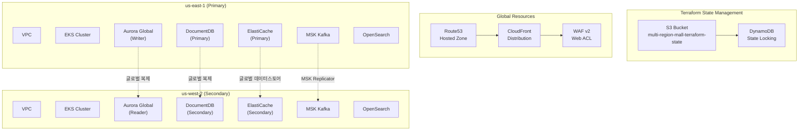
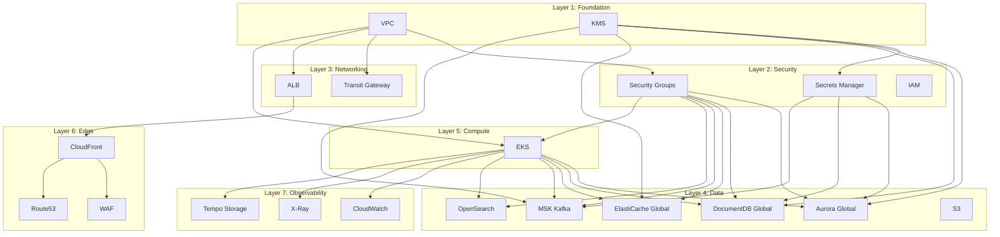

# 인프라 개요

멀티 리전 쇼핑몰 플랫폼은 **Terraform**을 사용하여 AWS 인프라를 코드로 관리합니다. us-east-1(프라이머리)과 us-west-2(세컨더리) 두 리전에 걸쳐 **260개 이상의 리소스**를 프로비저닝합니다.

## 아키텍처 다이어그램



## State 관리

Terraform 상태는 S3 백엔드와 DynamoDB 잠금을 사용하여 중앙 집중식으로 관리됩니다.

| 구성 요소 | 값 |
|---------|-----|
| S3 버킷 | `multi-region-mall-terraform-state` |
| DynamoDB 테이블 | `terraform-state-lock` |
| 리전 | `us-east-1` |
| 암호화 | AES-256 서버 측 암호화 |

```hcl
terraform {
  backend "s3" {
    bucket         = "multi-region-mall-terraform-state"
    key            = "environments/production/us-east-1/terraform.tfstate"
    region         = "us-east-1"
    dynamodb_table = "terraform-state-lock"
    encrypt        = true
  }
}
```

## 모듈 의존성 다이어그램



## 리전별 리소스 현황

### us-east-1 (프라이머리 리전)

| 카테고리 | 리소스 수 | 주요 구성 요소 |
|---------|----------|--------------|
| 네트워킹 | ~30 | VPC, Subnets, NAT GW, Transit Gateway |
| 컴퓨팅 | ~45 | EKS Cluster, Node Groups, ALB |
| 데이터 | ~80 | Aurora, DocumentDB, ElastiCache, MSK, OpenSearch |
| 보안 | ~35 | KMS, Secrets Manager, IAM, Security Groups |
| 엣지 | ~20 | CloudFront, WAF, Route53 |
| 관찰성 | ~50 | CloudWatch, X-Ray, Tempo Storage |
| **합계** | **~260** | |

### us-west-2 (세컨더리 리전)

| 카테고리 | 리소스 수 | 주요 구성 요소 |
|---------|----------|--------------|
| 네트워킹 | ~30 | VPC, Subnets, NAT GW, Transit Gateway |
| 컴퓨팅 | ~45 | EKS Cluster, Node Groups, ALB |
| 데이터 | ~75 | Aurora (Read), DocumentDB, ElastiCache, MSK, OpenSearch |
| 보안 | ~35 | KMS, Secrets Manager, IAM, Security Groups |
| 관찰성 | ~50 | CloudWatch, X-Ray, Tempo Storage |
| **합계** | **~235** | |

## 환경 구조

```
terraform/
├── environments/
│   └── production/
│       ├── us-east-1/          # 프라이머리 리전
│       │   ├── main.tf
│       │   ├── variables.tf
│       │   ├── outputs.tf
│       │   └── terraform.tfvars
│       └── us-west-2/          # 세컨더리 리전
│           ├── main.tf
│           ├── variables.tf
│           ├── outputs.tf
│           └── terraform.tfvars
├── global/                     # 글로벌 리소스
│   ├── route53/
│   └── iam/
└── modules/                    # 재사용 가능한 모듈
    ├── compute/
    ├── data/
    ├── edge/
    ├── networking/
    ├── observability/
    └── security/
```

## 프로비저닝 순서

멀티 리전 배포 시 리소스 간 의존성을 고려하여 다음 순서로 프로비저닝해야 합니다:

1. **글로벌 리소스**: Route53 호스팅 영역, IAM 역할
2. **us-east-1 프라이머리**: 전체 인프라 (글로벌 데이터베이스 프라이머리 포함)
3. **us-west-2 세컨더리**: 전체 인프라 (글로벌 데이터베이스 세컨더리로 조인)

:::caution 주의사항
- 두 리전에서 동시에 `terraform apply`를 실행하면 상태 충돌이 발생할 수 있습니다
- 항상 프라이머리 리전을 먼저 배포한 후 세컨더리 리전을 배포하세요
- 글로벌 데이터베이스(Aurora, DocumentDB, ElastiCache)는 프라이머리에서 생성 후 세컨더리가 조인합니다
:::

## 태그 전략

모든 리소스에는 다음 태그가 적용됩니다:

```hcl
default_tags {
  tags = {
    Environment = "production"
    Region      = var.region
    ManagedBy   = "terraform"
    Project     = "multi-region-mall"
  }
}
```

## 다음 단계

- [Terraform 모듈](/infrastructure/terraform-modules) - 17개 모듈 상세 설명
- [EKS 클러스터](/infrastructure/eks-cluster) - Kubernetes 클러스터 구성
- [데이터베이스](/infrastructure/databases/aurora-global) - 글로벌 데이터베이스 구성
