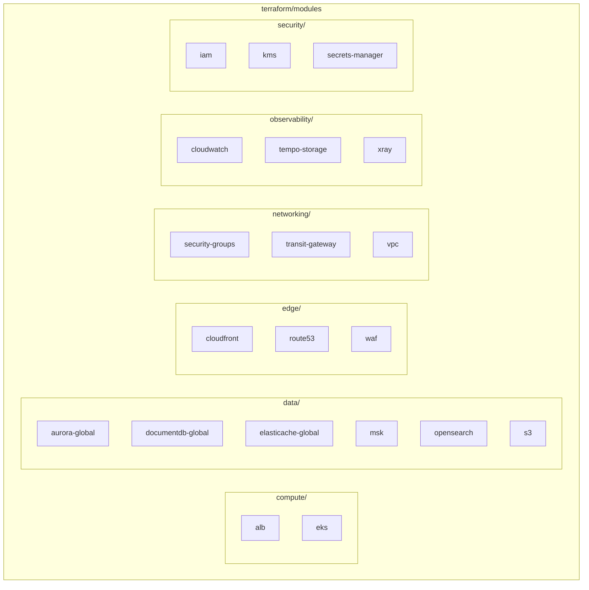
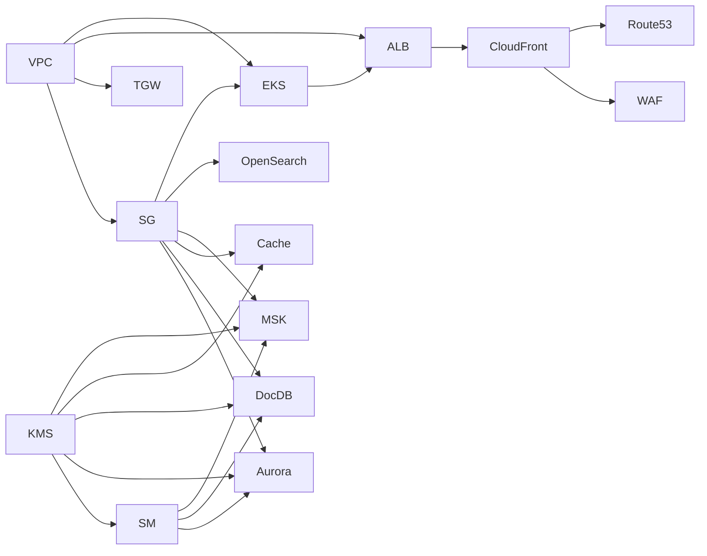

# Terraform 모듈

멀티 리전 쇼핑몰 플랫폼은 17개의 재사용 가능한 Terraform 모듈로 구성됩니다. 각 모듈은 특정 인프라 도메인을 담당하며, 두 리전에서 동일하게 사용됩니다.

## 모듈 구조



## 전체 모듈 목록

| # | 모듈명 | 경로 | 리소스 수 | 설명 |
|---|--------|------|----------|------|
| 1 | **vpc** | `networking/vpc` | ~15 | VPC, Subnets, NAT Gateway, Internet Gateway |
| 2 | **transit-gateway** | `networking/transit-gateway` | ~5 | Transit Gateway, VPC Attachments |
| 3 | **security-groups** | `networking/security-groups` | ~12 | 서비스별 보안 그룹 |
| 4 | **kms** | `security/kms` | ~8 | 서비스별 KMS 키 (Aurora, DocDB, MSK 등) |
| 5 | **secrets-manager** | `security/secrets-manager` | ~10 | 데이터베이스 자격 증명 |
| 6 | **iam** | `security/iam` | ~20 | 서비스 역할 및 정책 |
| 7 | **eks** | `compute/eks` | ~35 | EKS 클러스터, 애드온, IRSA |
| 8 | **alb** | `compute/alb` | ~10 | Application Load Balancer |
| 9 | **aurora-global** | `data/aurora-global` | ~12 | Aurora PostgreSQL Global Database |
| 10 | **documentdb-global** | `data/documentdb-global` | ~10 | DocumentDB Global Cluster |
| 11 | **elasticache-global** | `data/elasticache-global` | ~8 | ElastiCache Valkey Global Datastore |
| 12 | **msk** | `data/msk` | ~15 | MSK Kafka 클러스터, Replicator |
| 13 | **opensearch** | `data/opensearch` | ~12 | OpenSearch 도메인 |
| 14 | **s3** | `data/s3` | ~10 | S3 버킷, 복제 규칙 |
| 15 | **cloudfront** | `edge/cloudfront` | ~5 | CloudFront 배포 |
| 16 | **waf** | `edge/waf` | ~8 | WAF v2 Web ACL |
| 17 | **route53** | `edge/route53` | ~10 | DNS 레코드, Health Checks |
| 18 | **cloudwatch** | `observability/cloudwatch` | ~25 | 대시보드, 알람, 로그 그룹 |
| 19 | **xray** | `observability/xray` | ~5 | X-Ray 그룹, 샘플링 규칙 |
| 20 | **tempo-storage** | `observability/tempo-storage` | ~8 | Tempo S3 버킷, IAM 역할 |

## 모듈 상세

### 1. VPC 모듈

네트워크 기반 인프라를 구성합니다.

```hcl
module "vpc" {
  source = "../../../modules/networking/vpc"

  environment          = var.environment
  region               = var.region
  vpc_cidr             = "10.0.0.0/16"
  availability_zones   = ["us-east-1a", "us-east-1b", "us-east-1c"]
  public_subnet_cidrs  = ["10.0.1.0/24", "10.0.2.0/24", "10.0.3.0/24"]
  private_subnet_cidrs = ["10.0.11.0/24", "10.0.12.0/24", "10.0.13.0/24"]
  data_subnet_cidrs    = ["10.0.21.0/24", "10.0.22.0/24", "10.0.23.0/24"]
}
```

**출력값:**
- `vpc_id` - VPC ID
- `public_subnet_ids` - 퍼블릭 서브넷 ID 목록
- `private_subnet_ids` - 프라이빗 서브넷 ID 목록
- `data_subnet_ids` - 데이터 서브넷 ID 목록

### 2. EKS 모듈

Kubernetes 클러스터와 관련 리소스를 프로비저닝합니다.

```hcl
module "eks" {
  source = "../../../modules/compute/eks"

  cluster_name       = "multi-region-mall"
  cluster_version    = "1.29"
  region             = var.region
  vpc_id             = module.vpc.vpc_id
  private_subnet_ids = module.vpc.private_subnet_ids
}
```

**주요 기능:**
- EKS 클러스터 (Kubernetes 1.29)
- OIDC Provider (IRSA용)
- 관리형 애드온: vpc-cni, coredns, kube-proxy, aws-ebs-csi-driver, aws-efs-csi-driver
- 서비스별 IRSA 역할 (20개 마이크로서비스)

### 3. Aurora Global 모듈

PostgreSQL 호환 Aurora Global Database를 구성합니다.

```hcl
module "aurora" {
  source = "../../../modules/data/aurora-global"

  environment           = var.environment
  region                = var.region
  is_primary            = true  # us-west-2에서는 false
  global_cluster_identifier = "production-aurora-global"

  writer_instance_class = "db.r6g.2xlarge"
  reader_instance_class = "db.r6g.xlarge"
  reader_count          = 2
}
```

### 4. DocumentDB Global 모듈

MongoDB 호환 DocumentDB Global Cluster를 구성합니다.

```hcl
module "documentdb" {
  source = "../../../modules/data/documentdb-global"

  environment              = var.environment
  region                   = var.region
  is_primary               = true
  global_cluster_identifier = "production-docdb-global"

  instance_class = "db.r6g.xlarge"
  instance_count = 3
}
```

### 5. ElastiCache Global 모듈

Valkey 7.2 기반 Global Datastore를 구성합니다.

```hcl
module "elasticache" {
  source = "../../../modules/data/elasticache-global"

  environment      = var.environment
  region           = var.region
  is_primary       = true

  node_type                = "cache.r7g.xlarge"
  num_node_groups          = 3
  replicas_per_node_group  = 2
}
```

### 6. MSK 모듈

Apache Kafka 클러스터와 MSK Replicator를 구성합니다.

```hcl
module "msk" {
  source = "../../../modules/data/msk"

  environment           = var.environment
  region                = var.region
  kafka_version         = "3.5.1"
  broker_instance_type  = "kafka.m5.2xlarge"
  number_of_broker_nodes = 6
  ebs_volume_size       = 1000
}
```

### 7. OpenSearch 모듈

한국어 검색을 위한 OpenSearch 도메인을 구성합니다.

```hcl
module "opensearch" {
  source = "../../../modules/data/opensearch"

  environment          = var.environment
  region               = var.region

  master_instance_type  = "r6g.large.search"
  master_instance_count = 3
  data_instance_type    = "r6g.xlarge.search"
  data_instance_count   = 6
  ebs_volume_size       = 500
  enable_ultrawarm      = true
}
```

## 모듈 의존성



## 모듈 개발 가이드라인

### 표준 파일 구조

각 모듈은 다음 파일 구조를 따릅니다:

```
modules/<category>/<module-name>/
├── main.tf          # 주요 리소스 정의
├── variables.tf     # 입력 변수
├── outputs.tf       # 출력 값
└── versions.tf      # Provider 버전 제약 (선택)
```

### 변수 명명 규칙

```hcl
# 환경 변수 (필수)
variable "environment" {
  type        = string
  description = "배포 환경 (예: production, staging)"
}

variable "region" {
  type        = string
  description = "AWS 리전"
}

# 리소스별 변수
variable "instance_class" {
  type        = string
  description = "인스턴스 클래스"
  default     = "db.r6g.large"
}
```

### 태그 표준

```hcl
tags = merge(var.tags, {
  Name        = "${var.environment}-<resource-name>"
  Environment = var.environment
  Module      = "<module-name>"
})
```

## 다음 단계

- [EKS 클러스터](/infrastructure/eks-cluster) - EKS 상세 구성
- [Aurora Global Database](/infrastructure/databases/aurora-global) - Aurora 글로벌 데이터베이스
- [배포 파이프라인](/deployment/ci-cd-pipeline) - Terraform CI/CD
