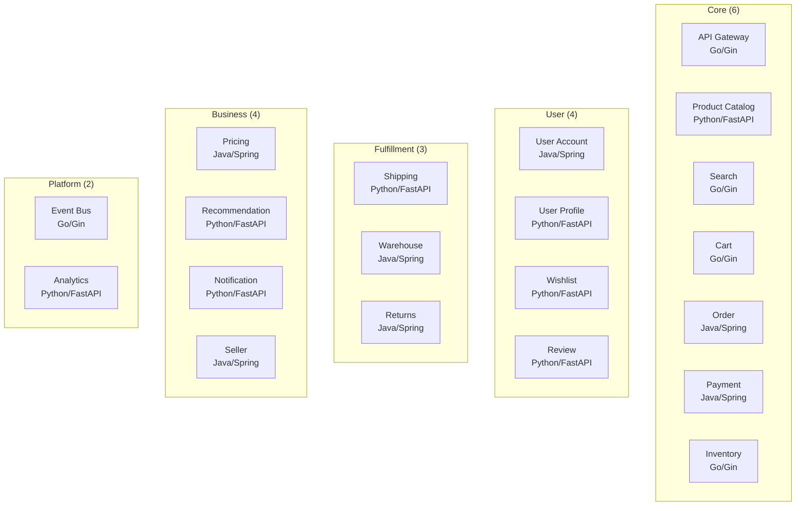
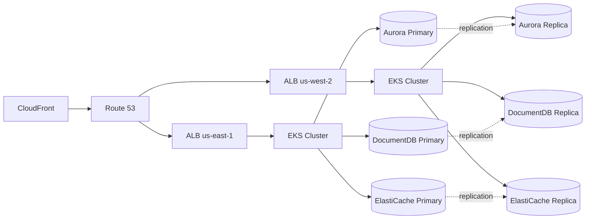

# Multi-Region Shopping Mall

AWS 기반 멀티리전 마이크로서비스 쇼핑몰 플랫폼의 기술 문서입니다.

## 프로젝트 개요

이 프로젝트는 Amazon.com의 인프라 패턴을 모델로 한 글로벌 규모의 쇼핑몰 플랫폼입니다. **us-east-1** (Primary)과 **us-west-2** (Secondary) 두 리전에 걸쳐 Active-Active 구성으로 운영됩니다.

### 주요 특징

| 항목 | 상세 |
|------|------|
| **아키텍처 패턴** | Write-Primary / Read-Local |
| **마이크로서비스** | 20개 (Go 5, Java 7, Python 8) |
| **데이터 스토어** | Aurora PostgreSQL, DocumentDB, ElastiCache Valkey, OpenSearch, MSK Kafka |
| **인프라** | Terraform 260+ 리소스, EKS, VPC 3-tier |
| **배포** | GitOps (ArgoCD), GitHub Actions CI/CD |
| **관측성** | OpenTelemetry, Grafana Tempo, Prometheus, X-Ray |
| **가용성 목표** | 99.99% SLA, RPO &lt;1s, RTO &lt;10m |

### 서비스 도메인

### 인프라 스택

## 문서 구성

- **[시작하기](/getting-started/prerequisites)** - 사전 요구사항, 빠른 시작, 로컬 개발 환경
- **[아키텍처](/architecture/overview)** - 시스템 설계, 멀티리전, 네트워크, 데이터
- **[서비스](/services/overview)** - 20개 마이크로서비스 상세 설계 문서
- **[인프라스트럭처](/infrastructure/overview)** - Terraform, EKS, 데이터베이스, 엣지
- **[배포](/deployment/overview)** - GitOps, CI/CD, Kustomize, 롤아웃
- **[관측성](/observability/overview)** - 분산 추적, 메트릭, 로깅, 대시보드
- **[운영](/operations/disaster-recovery)** - 장애 복구, 페일오버, 시드 데이터

## 기술 스택

| 카테고리 | 기술 |
|----------|------|
| **언어** | Go 1.21, Java 17 (Spring Boot 3.2), Python 3.11 (FastAPI) |
| **컨테이너** | EKS (Kubernetes 1.29), Karpenter |
| **데이터베이스** | Aurora PostgreSQL 15, DocumentDB 5.0, ElastiCache Valkey 7.2 |
| **검색** | OpenSearch 2.11 (nori 한국어 분석기) |
| **메시징** | MSK Kafka 3.5 (SASL/SCRAM) |
| **IaC** | Terraform 1.7+ |
| **GitOps** | ArgoCD, Kustomize |
| **관측성** | OpenTelemetry, Grafana Tempo, Prometheus, AWS X-Ray |
| **엣지** | CloudFront, WAF v2, Route 53 |
| **보안** | KMS, Secrets Manager, IAM (IRSA) |
