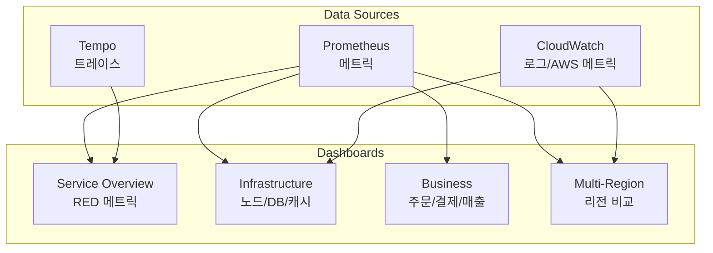

# Grafana 대시보드

Grafana를 통해 시스템 상태를 시각화하고 모니터링합니다. 서비스 개요, 인프라, 비즈니스 메트릭, 멀티리전 비교 대시보드를 제공합니다.

## 대시보드 구성



## 1. 서비스 개요 대시보드 (RED Metrics)

각 마이크로서비스의 핵심 지표를 한눈에 파악합니다.

### 레이아웃

```
+----------------------------------+----------------------------------+
|        Request Rate (QPS)         |         Error Rate (%)           |
|    [Line Chart - 서비스별]         |    [Line Chart - 서비스별]        |
+----------------------------------+----------------------------------+
|              P50 Latency          |              P99 Latency          |
|    [Line Chart - 서비스별]         |    [Line Chart - 서비스별]        |
+----------------------------------+----------------------------------+
|                    Service Map (Tempo)                               |
|                    [Node Graph - 서비스 간 관계]                       |
+---------------------------------------------------------------------+
|                    Active Traces                                     |
|                    [Table - 최근 에러/느린 트레이스]                    |
+---------------------------------------------------------------------+
```

### 패널 쿼리

**Request Rate (QPS)**
```promql
sum(rate(http_requests_total[5m])) by (service)
```

**Error Rate (%)**
```promql
(
  sum(rate(http_requests_total{status=~"5.."}[5m])) by (service)
  /
  sum(rate(http_requests_total[5m])) by (service)
) * 100
```

**P50 Latency**
```promql
histogram_quantile(0.50,
  sum(rate(http_request_duration_seconds_bucket[5m])) by (le, service)
)
```

**P99 Latency**
```promql
histogram_quantile(0.99,
  sum(rate(http_request_duration_seconds_bucket[5m])) by (le, service)
)
```

### 서비스 상태 테이블

```promql
# Up/Down 상태
up{job=~".*service.*"}

# Pod 수
count(kube_pod_status_ready{condition="true"}) by (deployment)
```

## 2. 인프라 대시보드

EKS 노드, 데이터베이스, 캐시 등 인프라 구성요소를 모니터링합니다.

### 레이아웃

```
+------------------+------------------+------------------+
|   Node CPU (%)   |  Node Memory (%) |   Node Count     |
|   [Gauge Panel]  |   [Gauge Panel]  |   [Stat Panel]   |
+------------------+------------------+------------------+
|                Node Resource Usage by Instance                |
|                [Time Series - CPU/Memory/Disk]               |
+-------------------------------------------------------------+
|   Aurora Connections  |  Aurora Replica Lag  |  Aurora IOPS  |
|    [Time Series]      |    [Time Series]     |  [Time Series]|
+-------------------------------------------------------------+
|  ElastiCache Memory   | ElastiCache Hits/Miss| ElastiCache Conn|
|    [Time Series]      |    [Time Series]     |  [Time Series]|
+-------------------------------------------------------------+
|    MSK Bytes In/Out   |  MSK Consumer Lag    | MSK Partitions |
|    [Time Series]      |    [Time Series]     |   [Stat Panel] |
+-------------------------------------------------------------+
```

### 패널 쿼리

**Node CPU 사용률**
```promql
(1 - avg(rate(node_cpu_seconds_total{mode="idle"}[5m])) by (instance)) * 100
```

**Node Memory 사용률**
```promql
(1 - node_memory_MemAvailable_bytes / node_memory_MemTotal_bytes) * 100
```

**Aurora 연결 수**
```promql
# CloudWatch 메트릭
aws_rds_database_connections_average{dbinstance_identifier=~"production-aurora.*"}
```

**Aurora 복제 지연**
```promql
aws_rds_aurora_replica_lag_average{dbinstance_identifier=~"production-aurora.*"}
```

**ElastiCache 메모리 사용률**
```promql
aws_elasticache_database_memory_usage_percentage_average{cache_cluster_id=~"production-elasticache.*"}
```

**MSK Consumer Lag**
```promql
aws_kafka_sum_offset_lag_sum{consumer_group=~".*"}
```

## 3. 비즈니스 대시보드

주문, 결제, 매출 등 비즈니스 지표를 추적합니다.

### 레이아웃

```
+------------------+------------------+------------------+
|  Orders/min      |  Payment Success |   Revenue Today  |
|   [Stat Panel]   |   [Gauge Panel]  |   [Stat Panel]   |
+------------------+------------------+------------------+
|                    Orders Over Time                      |
|          [Time Series - 주문 상태별 추이]                  |
+----------------------------------------------------------+
|        Payment Methods         |    Payment Status       |
|        [Pie Chart]             |    [Bar Chart]          |
+----------------------------------------------------------+
|                    Top Selling Products                   |
|                    [Table - 인기 상품]                     |
+----------------------------------------------------------+
|    Active Carts    |   Wishlist Items  |  Review Count   |
|   [Stat Panel]     |   [Stat Panel]    |  [Stat Panel]   |
+----------------------------------------------------------+
```

### 패널 쿼리

**분당 주문 수**
```promql
sum(rate(orders_total[1m])) * 60
```

**결제 성공률**
```promql
(
  sum(rate(payments_total{status="success"}[5m]))
  /
  sum(rate(payments_total[5m]))
) * 100
```

**주문 상태별 추이**
```promql
sum(increase(orders_total[5m])) by (status)
```

**결제 수단 분포**
```promql
sum(payments_total) by (method)
```

**인기 상품 (Top 10)**
```promql
topk(10, sum(order_items_total) by (product_id, product_name))
```

## 4. 멀티리전 비교 대시보드

us-east-1과 us-west-2 리전 간 상태를 비교합니다.

### 레이아웃

```
+---------------------------+---------------------------+
|        us-east-1          |        us-west-2          |
|  [Region Status Badge]    |  [Region Status Badge]    |
+---------------------------+---------------------------+
|    Request Rate           |    Request Rate           |
|    [Time Series]          |    [Time Series]          |
+---------------------------+---------------------------+
|    Error Rate             |    Error Rate             |
|    [Time Series]          |    [Time Series]          |
+---------------------------+---------------------------+
|                  Cross-Region Latency                  |
|                  [Time Series - 리전 간 지연]           |
+--------------------------------------------------------+
|      Aurora Replication Lag      |   Route53 Health    |
|        [Time Series]             |    [Status Panel]   |
+--------------------------------------------------------+
|                 Traffic Distribution                   |
|                 [Pie Chart - 리전별 트래픽]             |
+--------------------------------------------------------+
```

### 패널 쿼리

**리전별 Request Rate**
```promql
sum(rate(http_requests_total[5m])) by (region)
```

**리전별 Error Rate**
```promql
(
  sum(rate(http_requests_total{status=~"5.."}[5m])) by (region)
  /
  sum(rate(http_requests_total[5m])) by (region)
) * 100
```

**Aurora 복제 지연 (Cross-Region)**
```promql
aws_rds_aurora_replica_lag_average{dbinstance_identifier=~".*us-west-2.*"}
```

**트래픽 분포**
```promql
sum(increase(http_requests_total[1h])) by (region)
```

## Grafana 설정

### 데이터 소스 구성

```yaml
# grafana-datasources.yaml
apiVersion: 1
datasources:
  - name: Prometheus
    type: prometheus
    access: proxy
    url: http://prometheus-kube-prometheus-prometheus.monitoring:9090
    isDefault: true

  - name: Tempo
    type: tempo
    url: http://tempo.observability:3200
    jsonData:
      tracesToLogsV2:
        datasourceUid: cloudwatch
        filterByTraceID: true
      tracesToMetrics:
        datasourceUid: prometheus
      serviceMap:
        datasourceUid: prometheus
      nodeGraph:
        enabled: true

  - name: CloudWatch
    type: cloudwatch
    jsonData:
      authType: default
      defaultRegion: us-east-1
```

### 대시보드 프로비저닝

```yaml
# grafana-dashboards.yaml
apiVersion: 1
providers:
  - name: default
    orgId: 1
    folder: ''
    type: file
    disableDeletion: false
    editable: true
    options:
      path: /var/lib/grafana/dashboards/default
```

## 알림 설정

### Slack 알림 채널

```yaml
# alertmanager-config.yaml
receivers:
  - name: slack-notifications
    slack_configs:
      - api_url: ${SLACK_WEBHOOK_URL}
        channel: '#alerts-production'
        title: '{{ .Status | toUpper }}: {{ .CommonAnnotations.summary }}'
        text: '{{ .CommonAnnotations.description }}'
        send_resolved: true
```

### 알림 정책

```yaml
route:
  group_by: ['alertname', 'service']
  group_wait: 30s
  group_interval: 5m
  repeat_interval: 4h
  receiver: slack-notifications
  routes:
    - match:
        severity: critical
      receiver: pagerduty-critical
    - match:
        severity: warning
      receiver: slack-notifications
```

## 대시보드 JSON 예시

### 서비스 개요 패널

```json
{
  "panels": [
    {
      "title": "Request Rate (QPS)",
      "type": "timeseries",
      "gridPos": { "h": 8, "w": 12, "x": 0, "y": 0 },
      "targets": [
        {
          "expr": "sum(rate(http_requests_total[5m])) by (service)",
          "legendFormat": "{{ service }}"
        }
      ],
      "fieldConfig": {
        "defaults": {
          "unit": "reqps",
          "color": { "mode": "palette-classic" }
        }
      }
    },
    {
      "title": "Error Rate (%)",
      "type": "timeseries",
      "gridPos": { "h": 8, "w": 12, "x": 12, "y": 0 },
      "targets": [
        {
          "expr": "(sum(rate(http_requests_total{status=~\"5..\"}[5m])) by (service) / sum(rate(http_requests_total[5m])) by (service)) * 100",
          "legendFormat": "{{ service }}"
        }
      ],
      "fieldConfig": {
        "defaults": {
          "unit": "percent",
          "thresholds": {
            "steps": [
              { "color": "green", "value": null },
              { "color": "yellow", "value": 1 },
              { "color": "red", "value": 5 }
            ]
          }
        }
      }
    }
  ]
}
```

## CloudWatch Dashboard

Terraform으로 관리되는 AWS CloudWatch 대시보드:

```hcl
resource "aws_cloudwatch_dashboard" "main" {
  dashboard_name = "production-platform-dashboard"

  dashboard_body = jsonencode({
    widgets = [
      {
        type = "metric"
        properties = {
          title = "ALB Request Count"
          metrics = [["AWS/ApplicationELB", "RequestCount"]]
        }
      },
      {
        type = "metric"
        properties = {
          title = "ALB Response Time"
          metrics = [["AWS/ApplicationELB", "TargetResponseTime"]]
        }
      },
      {
        type = "metric"
        properties = {
          title = "Aurora Replication Lag"
          metrics = [["AWS/RDS", "AuroraReplicaLag"]]
        }
      },
      {
        type = "metric"
        properties = {
          title = "MSK Bytes In/Out"
          metrics = [
            ["AWS/Kafka", "BytesInPerSec"],
            ["AWS/Kafka", "BytesOutPerSec"]
          ]
        }
      }
    ]
  })
}
```

## 접속 방법

```bash
# Grafana 포트 포워딩
kubectl port-forward svc/prometheus-grafana -n monitoring 3000:80

# 브라우저에서 접속
open http://localhost:3000

# 기본 계정
# Username: admin
# Password: prom-operator
```

## 관련 문서

- [관측성 개요](./overview)
- [Prometheus 메트릭](./metrics-prometheus)
- [분산 추적](./distributed-tracing)
