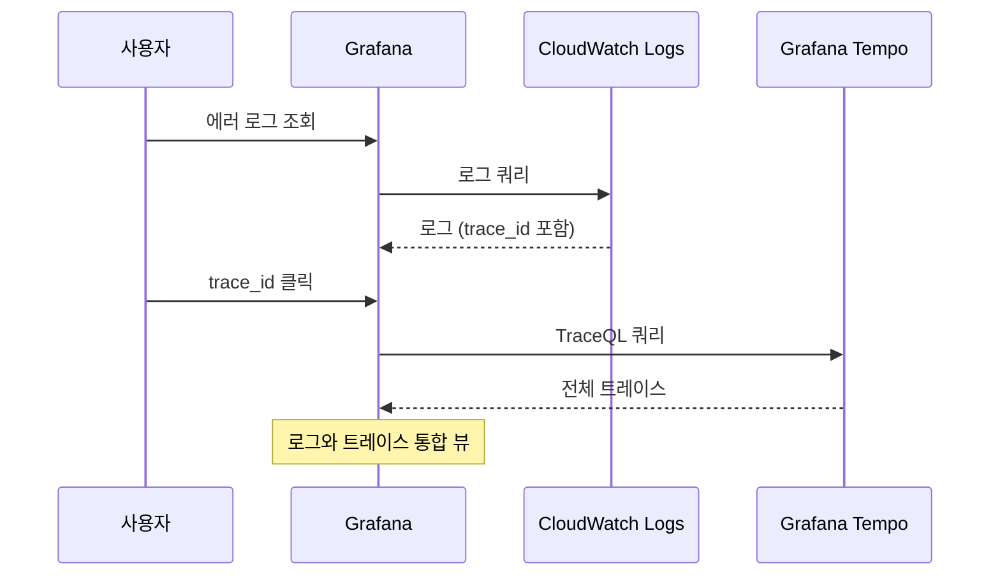

# 로깅 (Logging)

Fluent Bit DaemonSet을 사용하여 모든 컨테이너 로그를 수집하고 CloudWatch Logs로 전송합니다. 구조화된 JSON 로그 포맷과 트레이스 ID 연동을 통해 효율적인 로그 분석이 가능합니다.

## 아키텍처

```mermaid
flowchart TB
    subgraph "EKS Node"
        subgraph "Application Pods"
            APP1[order-service<br/>JSON stdout]
            APP2[payment-service<br/>JSON stdout]
            APP3[inventory-service<br/>JSON stdout]
        end

        LOG[/var/log/containers/*.log]
        FB[Fluent Bit<br/>DaemonSet]
    end

    subgraph "AWS"
        CWL[CloudWatch Logs<br/>90일 보관]
        CWI[CloudWatch Logs Insights]
    end

    subgraph "Visualization"
        GRAF[Grafana<br/>CloudWatch Plugin]
    end

    APP1 -->|stdout| LOG
    APP2 -->|stdout| LOG
    APP3 -->|stdout| LOG

    LOG --> FB
    FB -->|AWS API| CWL
    CWL --> CWI
    CWL --> GRAF
```

## Fluent Bit 구성

### DaemonSet 배포

```yaml
apiVersion: apps/v1
kind: DaemonSet
metadata:
  name: fluent-bit
  namespace: amazon-cloudwatch
spec:
  template:
    spec:
      serviceAccountName: fluent-bit  # IRSA
      tolerations:
        - key: node-role.kubernetes.io/control-plane
          effect: NoSchedule
        - key: node-pool
          operator: Exists
          effect: NoSchedule
      containers:
        - name: fluent-bit
          image: public.ecr.aws/aws-observability/aws-for-fluent-bit:stable
          env:
            - name: AWS_REGION
              valueFrom:
                configMapKeyRef:
                  name: cluster-info
                  key: region
            - name: CLUSTER_NAME
              valueFrom:
                configMapKeyRef:
                  name: cluster-info
                  key: cluster-name
            - name: HOST_NAME
              valueFrom:
                fieldRef:
                  fieldPath: spec.nodeName
          resources:
            requests:
              cpu: 100m
              memory: 128Mi
            limits:
              cpu: 200m
              memory: 256Mi
          volumeMounts:
            - name: varlog
              mountPath: /var/log
              readOnly: true
            - name: varlibdockercontainers
              mountPath: /var/lib/docker/containers
              readOnly: true
```

### Fluent Bit 설정

```ini
[SERVICE]
    Flush         5
    Log_Level     info
    Daemon        off
    Parsers_File  parsers.conf
    HTTP_Server   On
    HTTP_Listen   0.0.0.0
    HTTP_Port     2020

[INPUT]
    Name              tail
    Tag               kube.*
    Path              /var/log/containers/*.log
    Parser            docker
    DB                /var/log/flb_kube.db
    Mem_Buf_Limit     50MB
    Skip_Long_Lines   On
    Refresh_Interval  10

[FILTER]
    Name                kubernetes
    Match               kube.*
    Kube_URL            https://kubernetes.default.svc:443
    Kube_CA_File        /var/run/secrets/kubernetes.io/serviceaccount/ca.crt
    Kube_Token_File     /var/run/secrets/kubernetes.io/serviceaccount/token
    Merge_Log           On
    Merge_Log_Key       log_processed
    K8S-Logging.Parser  On
    K8S-Logging.Exclude Off
    Labels              On
    Annotations         Off

[FILTER]
    Name    modify
    Match   kube.*
    Add     cluster ${CLUSTER_NAME}
    Add     region ${AWS_REGION}

[OUTPUT]
    Name                cloudwatch_logs
    Match               kube.*
    region              ${AWS_REGION}
    log_group_name      /eks/${CLUSTER_NAME}/containers
    log_stream_prefix   ${HOST_NAME}-
    auto_create_group   true
    log_format          json/emf
    retry_limit         2
```

## 표준 로그 포맷

모든 서비스는 다음 JSON 포맷으로 로그를 출력해야 합니다:

```json
{
  "timestamp": "2026-03-15T10:30:45.123Z",
  "level": "INFO",
  "service": "order-service",
  "region": "us-east-1",
  "trace_id": "0af7651916cd43dd8448eb211c80319c",
  "span_id": "b7ad6b7169203331",
  "message": "주문 생성 완료",
  "order_id": "ORD-123456",
  "user_id": "a0000001-0000-0000-0000-000000000001",
  "amount": 159000,
  "duration_ms": 45
}
```

### 필수 필드

| 필드 | 타입 | 설명 |
|------|------|------|
| `timestamp` | string (ISO 8601) | 로그 발생 시간 |
| `level` | string | DEBUG, INFO, WARN, ERROR, FATAL |
| `service` | string | 서비스 이름 |
| `region` | string | AWS 리전 |
| `message` | string | 로그 메시지 |

### 권장 필드

| 필드 | 타입 | 설명 |
|------|------|------|
| `trace_id` | string | OpenTelemetry trace ID |
| `span_id` | string | OpenTelemetry span ID |
| `user_id` | string | 사용자 ID |
| `request_id` | string | 요청 ID |
| `duration_ms` | number | 처리 시간 (밀리초) |

## 언어별 로깅 구현

### Go (zerolog)

```go
import (
    "github.com/rs/zerolog"
    "github.com/rs/zerolog/log"
    "go.opentelemetry.io/otel/trace"
)

func init() {
    zerolog.TimeFieldFormat = time.RFC3339Nano

    log.Logger = zerolog.New(os.Stdout).With().
        Str("service", "order-service").
        Str("region", os.Getenv("AWS_REGION")).
        Timestamp().
        Logger()
}

// 트레이스 컨텍스트 포함 로깅
func LogWithTrace(ctx context.Context) zerolog.Logger {
    span := trace.SpanFromContext(ctx)
    if span.SpanContext().IsValid() {
        return log.With().
            Str("trace_id", span.SpanContext().TraceID().String()).
            Str("span_id", span.SpanContext().SpanID().String()).
            Logger()
    }
    return log.Logger
}

// 사용 예시
func CreateOrder(ctx context.Context, order *Order) error {
    logger := LogWithTrace(ctx)

    logger.Info().
        Str("order_id", order.ID).
        Str("user_id", order.UserID).
        Int64("amount", order.Amount).
        Msg("주문 생성 시작")

    // 처리 로직...

    logger.Info().
        Str("order_id", order.ID).
        Int64("duration_ms", elapsed.Milliseconds()).
        Msg("주문 생성 완료")

    return nil
}
```

### Java (Logback + Logstash Encoder)

```xml
<!-- logback-spring.xml -->
<configuration>
    <appender name="STDOUT" class="ch.qos.logback.core.ConsoleAppender">
        <encoder class="net.logstash.logback.encoder.LogstashEncoder">
            <customFields>
                {"service":"payment-service","region":"${AWS_REGION:-unknown}"}
            </customFields>
            <provider class="net.logstash.logback.composite.loggingevent.LoggingEventPatternJsonProvider">
                <pattern>
                    {
                        "trace_id": "%mdc{traceId}",
                        "span_id": "%mdc{spanId}"
                    }
                </pattern>
            </provider>
        </encoder>
    </appender>

    <root level="INFO">
        <appender-ref ref="STDOUT"/>
    </root>
</configuration>
```

```java
import org.slf4j.Logger;
import org.slf4j.LoggerFactory;
import org.slf4j.MDC;

@Service
public class PaymentService {
    private static final Logger log = LoggerFactory.getLogger(PaymentService.class);

    public PaymentResult processPayment(PaymentRequest request) {
        // MDC에 추가 컨텍스트 설정
        MDC.put("order_id", request.getOrderId());
        MDC.put("user_id", request.getUserId());

        try {
            log.info("결제 처리 시작 - 금액: {}", request.getAmount());

            // 결제 로직...

            log.info("결제 처리 완료 - 트랜잭션: {}", result.getTransactionId());
            return result;

        } catch (Exception e) {
            log.error("결제 처리 실패: {}", e.getMessage(), e);
            throw e;
        } finally {
            MDC.clear();
        }
    }
}
```

### Python (structlog)

```python
import structlog
import os
from opentelemetry import trace

def configure_logging():
    structlog.configure(
        processors=[
            structlog.stdlib.filter_by_level,
            structlog.stdlib.add_logger_name,
            structlog.stdlib.add_log_level,
            structlog.stdlib.PositionalArgumentsFormatter(),
            structlog.processors.TimeStamper(fmt="iso"),
            structlog.processors.StackInfoRenderer(),
            structlog.processors.format_exc_info,
            structlog.processors.UnicodeDecoder(),
            structlog.processors.JSONRenderer()
        ],
        context_class=dict,
        logger_factory=structlog.stdlib.LoggerFactory(),
        wrapper_class=structlog.stdlib.BoundLogger,
        cache_logger_on_first_use=True,
    )

def get_logger(name: str):
    logger = structlog.get_logger(name)
    return logger.bind(
        service="recommendation-service",
        region=os.getenv("AWS_REGION", "unknown")
    )

# 트레이스 컨텍스트 추가
def log_with_trace(logger, **kwargs):
    span = trace.get_current_span()
    if span.get_span_context().is_valid:
        kwargs["trace_id"] = format(span.get_span_context().trace_id, "032x")
        kwargs["span_id"] = format(span.get_span_context().span_id, "016x")
    return logger.bind(**kwargs)

# 사용 예시
logger = get_logger(__name__)

async def get_recommendations(user_id: str):
    ctx_logger = log_with_trace(logger, user_id=user_id)

    ctx_logger.info("추천 생성 시작")

    # 추천 로직...

    ctx_logger.info(
        "추천 생성 완료",
        item_count=len(recommendations),
        duration_ms=elapsed_ms
    )

    return recommendations
```

## 로그 레벨 가이드라인

| 레벨 | 용도 | 예시 |
|------|------|------|
| **DEBUG** | 개발/디버깅용 상세 정보 | 변수 값, SQL 쿼리 |
| **INFO** | 정상 동작 기록 | 요청 시작/완료, 상태 변경 |
| **WARN** | 잠재적 문제 | 재시도, 폴백 사용 |
| **ERROR** | 에러 발생 (복구 가능) | API 호출 실패, 유효성 검사 실패 |
| **FATAL** | 심각한 에러 (복구 불가) | 서비스 시작 실패 |

## CloudWatch Logs 구조

### 로그 그룹

Terraform으로 관리되는 로그 그룹:

```hcl
# 네임스페이스별 로그 그룹
/eks/multi-region-mall/core-services
/eks/multi-region-mall/user-services
/eks/multi-region-mall/fulfillment
/eks/multi-region-mall/business-services
/eks/multi-region-mall/platform

# 보관 기간: 90일
```

### 로그 스트림

```
{node-name}-{namespace}_{pod-name}_{container-name}-{container-id}
```

예시:
```
ip-10-0-1-123-core-services_order-service-abc123_order-service-def456
```

## CloudWatch Logs Insights 쿼리

### 에러 로그 검색

```sql
fields @timestamp, @message, service, trace_id, error
| filter level = "ERROR"
| sort @timestamp desc
| limit 100
```

### 특정 주문 추적

```sql
fields @timestamp, @message, service, level
| filter order_id = "ORD-123456"
| sort @timestamp asc
```

### 느린 요청 분석

```sql
fields @timestamp, service, message, duration_ms
| filter duration_ms > 1000
| stats avg(duration_ms) as avg_duration,
        max(duration_ms) as max_duration,
        count(*) as request_count
  by service
| sort avg_duration desc
```

### 트레이스 ID로 로그 연결

```sql
fields @timestamp, @message, service, level, span_id
| filter trace_id = "0af7651916cd43dd8448eb211c80319c"
| sort @timestamp asc
```

### 서비스별 에러율

```sql
fields service, level
| stats count(*) as total,
        sum(case when level = "ERROR" then 1 else 0 end) as errors
  by service
| display service, errors, total, (errors * 100.0 / total) as error_rate
| sort error_rate desc
```

### 사용자별 활동

```sql
fields @timestamp, service, message, user_id
| filter user_id = "a0000001-0000-0000-0000-000000000001"
| sort @timestamp desc
| limit 50
```

## 로그와 트레이스 연결

Grafana에서 로그와 트레이스를 연결하여 조회할 수 있습니다:



### Grafana 데이터 소스 연결 설정

```yaml
# Tempo 데이터 소스
jsonData:
  tracesToLogsV2:
    datasourceUid: cloudwatch
    filterByTraceID: true
    filterBySpanID: true
    customQuery: true
    query: |
      fields @timestamp, @message, service, level
      | filter trace_id = "${__trace.traceId}"
      | sort @timestamp asc
```

## 민감 정보 마스킹

로그에 민감 정보가 포함되지 않도록 마스킹합니다:

### Go

```go
func maskSensitiveData(data string) string {
    // 신용카드 번호 마스킹
    cardRegex := regexp.MustCompile(`\d{4}[-\s]?\d{4}[-\s]?\d{4}[-\s]?\d{4}`)
    data = cardRegex.ReplaceAllString(data, "****-****-****-****")

    // 이메일 마스킹
    emailRegex := regexp.MustCompile(`[\w.-]+@[\w.-]+\.\w+`)
    data = emailRegex.ReplaceAllStringFunc(data, func(email string) string {
        parts := strings.Split(email, "@")
        return parts[0][:2] + "***@" + parts[1]
    })

    return data
}
```

### Python

```python
import re

class SensitiveDataFilter:
    PATTERNS = [
        (re.compile(r'\d{4}[-\s]?\d{4}[-\s]?\d{4}[-\s]?\d{4}'), '****-****-****-****'),
        (re.compile(r'[\w.-]+@[\w.-]+\.\w+'), lambda m: m.group()[:2] + '***@***'),
        (re.compile(r'password["\s:=]+["\']?\w+["\']?', re.I), 'password=***'),
    ]

    @classmethod
    def filter(cls, message: str) -> str:
        for pattern, replacement in cls.PATTERNS:
            if callable(replacement):
                message = pattern.sub(replacement, message)
            else:
                message = pattern.sub(replacement, message)
        return message
```

## 트러블슈팅

### 로그가 수집되지 않을 때

```bash
# 1. Fluent Bit 상태 확인
kubectl get pods -n amazon-cloudwatch -l app=fluent-bit

# 2. Fluent Bit 로그 확인
kubectl logs -n amazon-cloudwatch -l app=fluent-bit --tail=100

# 3. CloudWatch 로그 그룹 확인
aws logs describe-log-groups --log-group-name-prefix "/eks/multi-region-mall"

# 4. 컨테이너 로그 직접 확인
kubectl logs <pod-name> -n <namespace> --tail=50
```

### 로그 포맷 검증

```bash
# Pod 로그가 JSON 형식인지 확인
kubectl logs <pod-name> | head -5 | jq .

# 필수 필드 확인
kubectl logs <pod-name> | head -1 | jq 'has("timestamp", "level", "service", "message")'
```

## 관련 문서

- [관측성 개요](./overview)
- [분산 추적](./distributed-tracing)
- [대시보드](./dashboards)
