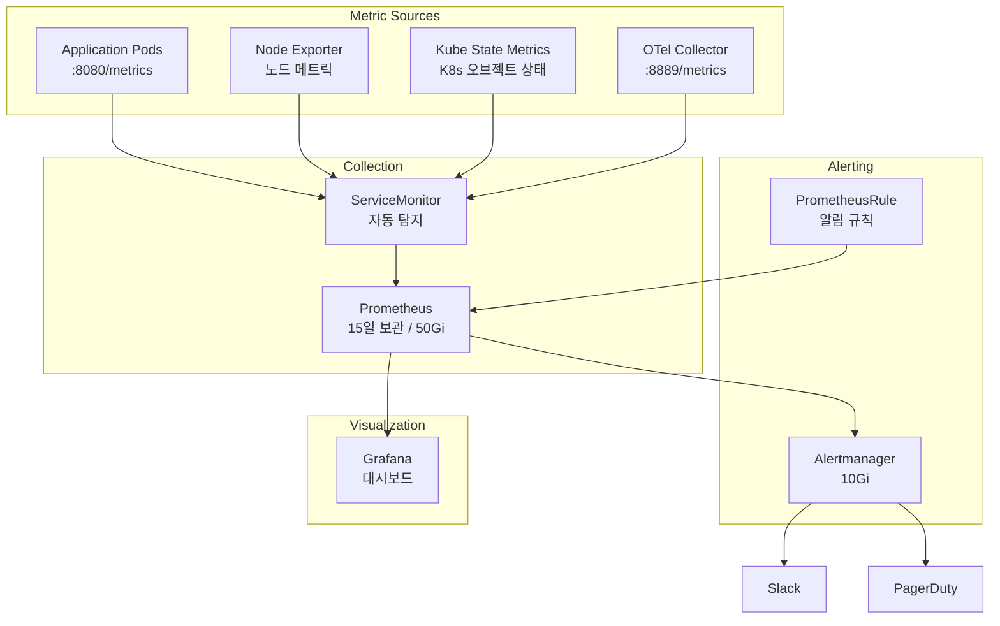

# Prometheus 메트릭

Prometheus를 사용하여 EKS 클러스터와 마이크로서비스의 메트릭을 수집하고, Alertmanager를 통해 알림을 발송합니다.

## 아키텍처



## Prometheus Stack 설정

### Helm Values

```yaml
prometheus:
  prometheusSpec:
    retention: 15d                    # 15일 보관
    storageSpec:
      volumeClaimTemplate:
        spec:
          storageClassName: gp3
          resources:
            requests:
              storage: 50Gi
    serviceMonitorSelectorNilUsesHelmValues: false  # 모든 ServiceMonitor 탐지
    podMonitorSelectorNilUsesHelmValues: false
    ruleSelectorNilUsesHelmValues: false
    resources:
      requests:
        cpu: 500m
        memory: 2Gi
      limits:
        cpu: 2
        memory: 4Gi

alertmanager:
  alertmanagerSpec:
    storage:
      volumeClaimTemplate:
        spec:
          storageClassName: gp3
          resources:
            requests:
              storage: 10Gi

kubeStateMetrics:
  enabled: true

nodeExporter:
  enabled: true

prometheusOperator:
  resources:
    requests:
      cpu: 100m
      memory: 256Mi
    limits:
      cpu: 200m
      memory: 512Mi
```

## 서비스 탐지 (Service Discovery)

### Pod Annotation 기반 탐지

```yaml
apiVersion: v1
kind: Pod
metadata:
  annotations:
    prometheus.io/scrape: "true"
    prometheus.io/port: "8080"
    prometheus.io/path: "/metrics"
```

### ServiceMonitor 예시

```yaml
apiVersion: monitoring.coreos.com/v1
kind: ServiceMonitor
metadata:
  name: order-service
  namespace: core-services
  labels:
    app: order-service
spec:
  selector:
    matchLabels:
      app: order-service
  endpoints:
    - port: http
      interval: 30s
      path: /metrics
  namespaceSelector:
    matchNames:
      - core-services
```

## 언어별 메트릭 설정

### Go (Gin + Prometheus)

```go
import (
    "github.com/gin-gonic/gin"
    "github.com/prometheus/client_golang/prometheus"
    "github.com/prometheus/client_golang/prometheus/promhttp"
)

var (
    httpRequestsTotal = prometheus.NewCounterVec(
        prometheus.CounterOpts{
            Name: "http_requests_total",
            Help: "Total number of HTTP requests",
        },
        []string{"method", "endpoint", "status"},
    )

    httpRequestDuration = prometheus.NewHistogramVec(
        prometheus.HistogramOpts{
            Name:    "http_request_duration_seconds",
            Help:    "HTTP request duration in seconds",
            Buckets: []float64{0.01, 0.05, 0.1, 0.25, 0.5, 1, 2.5, 5},
        },
        []string{"method", "endpoint"},
    )

    orderTotal = prometheus.NewCounterVec(
        prometheus.CounterOpts{
            Name: "orders_total",
            Help: "Total number of orders",
        },
        []string{"status", "region"},
    )
)

func init() {
    prometheus.MustRegister(httpRequestsTotal, httpRequestDuration, orderTotal)
}

func main() {
    r := gin.New()

    // 메트릭 미들웨어
    r.Use(func(c *gin.Context) {
        start := time.Now()
        c.Next()
        duration := time.Since(start).Seconds()

        httpRequestsTotal.WithLabelValues(
            c.Request.Method,
            c.FullPath(),
            strconv.Itoa(c.Writer.Status()),
        ).Inc()

        httpRequestDuration.WithLabelValues(
            c.Request.Method,
            c.FullPath(),
        ).Observe(duration)
    })

    // 메트릭 엔드포인트
    r.GET("/metrics", gin.WrapH(promhttp.Handler()))
}
```

### Java (Spring Boot + Micrometer)

```yaml
# application.yaml
management:
  endpoints:
    web:
      exposure:
        include: prometheus,health,info
  endpoint:
    prometheus:
      enabled: true
  metrics:
    tags:
      application: payment-service
      region: ${AWS_REGION:unknown}
    distribution:
      percentiles-histogram:
        http.server.requests: true
      slo:
        http.server.requests: 50ms,100ms,200ms,500ms,1s
```

```java
// 커스텀 메트릭
@Component
public class PaymentMetrics {
    private final Counter paymentSuccessCounter;
    private final Counter paymentFailureCounter;
    private final Timer paymentProcessingTime;

    public PaymentMetrics(MeterRegistry registry) {
        this.paymentSuccessCounter = Counter.builder("payments_total")
            .tag("status", "success")
            .description("Total successful payments")
            .register(registry);

        this.paymentFailureCounter = Counter.builder("payments_total")
            .tag("status", "failure")
            .description("Total failed payments")
            .register(registry);

        this.paymentProcessingTime = Timer.builder("payment_processing_seconds")
            .description("Payment processing time")
            .publishPercentiles(0.5, 0.9, 0.99)
            .register(registry);
    }

    public void recordSuccess() {
        paymentSuccessCounter.increment();
    }

    public void recordFailure() {
        paymentFailureCounter.increment();
    }

    public void recordProcessingTime(Duration duration) {
        paymentProcessingTime.record(duration);
    }
}
```

### Python (FastAPI + prometheus_fastapi_instrumentator)

```python
from fastapi import FastAPI
from prometheus_fastapi_instrumentator import Instrumentator
from prometheus_client import Counter, Histogram, Gauge

app = FastAPI()

# 자동 계측
Instrumentator().instrument(app).expose(app)

# 커스텀 메트릭
recommendation_requests = Counter(
    "recommendation_requests_total",
    "Total recommendation requests",
    ["user_tier", "category"]
)

recommendation_latency = Histogram(
    "recommendation_latency_seconds",
    "Recommendation generation latency",
    buckets=[0.01, 0.05, 0.1, 0.25, 0.5, 1.0]
)

active_users = Gauge(
    "active_users",
    "Number of currently active users"
)

@app.get("/api/v1/recommendations/{user_id}")
async def get_recommendations(user_id: str):
    with recommendation_latency.time():
        recommendation_requests.labels(
            user_tier="gold",
            category="electronics"
        ).inc()
        # 추천 로직...
        return {"recommendations": [...]}
```

## 핵심 메트릭 (RED Method)

각 서비스에서 수집해야 할 핵심 메트릭입니다:

| 메트릭 | 설명 | PromQL |
|--------|------|--------|
| **Rate** | 초당 요청 수 | `rate(http_requests_total[5m])` |
| **Errors** | 에러율 | `rate(http_requests_total{status=~"5.."}[5m]) / rate(http_requests_total[5m])` |
| **Duration** | 응답 시간 | `histogram_quantile(0.99, rate(http_request_duration_seconds_bucket[5m]))` |

## 알림 규칙 (PrometheusRule)

### 서비스 알림

```yaml
apiVersion: monitoring.coreos.com/v1
kind: PrometheusRule
metadata:
  name: service-alerts
  namespace: monitoring
spec:
  groups:
    - name: service.rules
      rules:
        # 높은 에러율
        - alert: HighErrorRate
          expr: |
            (
              sum(rate(http_requests_total{status=~"5.."}[5m])) by (service)
              /
              sum(rate(http_requests_total[5m])) by (service)
            ) > 0.05
          for: 5m
          labels:
            severity: critical
          annotations:
            summary: "{{ $labels.service }} 서비스 에러율 높음"
            description: "{{ $labels.service }}의 5XX 에러율이 5%를 초과했습니다 (현재: {{ $value | humanizePercentage }})"

        # 느린 응답
        - alert: HighLatency
          expr: |
            histogram_quantile(0.99,
              sum(rate(http_request_duration_seconds_bucket[5m])) by (le, service)
            ) > 2
          for: 5m
          labels:
            severity: warning
          annotations:
            summary: "{{ $labels.service }} 응답 지연"
            description: "{{ $labels.service }}의 p99 응답 시간이 2초를 초과했습니다"

        # Pod 재시작
        - alert: PodRestartingTooOften
          expr: |
            increase(kube_pod_container_status_restarts_total[1h]) > 5
          for: 10m
          labels:
            severity: warning
          annotations:
            summary: "{{ $labels.pod }} Pod 빈번한 재시작"
            description: "{{ $labels.namespace }}/{{ $labels.pod }}가 1시간 내 5회 이상 재시작했습니다"
```

### 인프라 알림

```yaml
apiVersion: monitoring.coreos.com/v1
kind: PrometheusRule
metadata:
  name: infrastructure-alerts
  namespace: monitoring
spec:
  groups:
    - name: infrastructure.rules
      rules:
        # 노드 CPU 높음
        - alert: NodeHighCPU
          expr: |
            (1 - avg(rate(node_cpu_seconds_total{mode="idle"}[5m])) by (instance)) > 0.85
          for: 10m
          labels:
            severity: warning
          annotations:
            summary: "노드 {{ $labels.instance }} CPU 사용률 높음"
            description: "CPU 사용률이 85%를 초과했습니다 (현재: {{ $value | humanizePercentage }})"

        # 노드 메모리 부족
        - alert: NodeMemoryPressure
          expr: |
            (1 - node_memory_MemAvailable_bytes / node_memory_MemTotal_bytes) > 0.90
          for: 5m
          labels:
            severity: critical
          annotations:
            summary: "노드 {{ $labels.instance }} 메모리 부족"
            description: "메모리 사용률이 90%를 초과했습니다"

        # 디스크 공간 부족
        - alert: DiskSpaceLow
          expr: |
            (node_filesystem_avail_bytes{fstype!="tmpfs"} / node_filesystem_size_bytes) < 0.15
          for: 15m
          labels:
            severity: warning
          annotations:
            summary: "노드 {{ $labels.instance }} 디스크 공간 부족"
            description: "{{ $labels.mountpoint }}의 여유 공간이 15% 미만입니다"
```

### 비즈니스 알림

```yaml
apiVersion: monitoring.coreos.com/v1
kind: PrometheusRule
metadata:
  name: business-alerts
  namespace: monitoring
spec:
  groups:
    - name: business.rules
      rules:
        # 주문 처리 중단
        - alert: NoOrdersProcessed
          expr: |
            sum(increase(orders_total[10m])) == 0
          for: 10m
          labels:
            severity: critical
          annotations:
            summary: "주문 처리 중단"
            description: "최근 10분간 처리된 주문이 없습니다"

        # 결제 실패율 높음
        - alert: HighPaymentFailureRate
          expr: |
            (
              sum(rate(payments_total{status="failure"}[5m]))
              /
              sum(rate(payments_total[5m]))
            ) > 0.10
          for: 5m
          labels:
            severity: critical
          annotations:
            summary: "결제 실패율 높음"
            description: "결제 실패율이 10%를 초과했습니다 (현재: {{ $value | humanizePercentage }})"
```

## Grafana 데이터 소스 설정

```yaml
apiVersion: 1
datasources:
  - name: Prometheus
    type: prometheus
    access: proxy
    url: http://prometheus-kube-prometheus-prometheus.monitoring:9090
    isDefault: true
    jsonData:
      timeInterval: 15s
      httpMethod: POST

  - name: Alertmanager
    type: alertmanager
    access: proxy
    url: http://prometheus-kube-prometheus-alertmanager.monitoring:9093
    jsonData:
      implementation: prometheus
```

## 유용한 PromQL 쿼리

### 서비스 상태

```promql
# 서비스별 초당 요청 수
sum(rate(http_requests_total[5m])) by (service)

# 서비스별 에러율
sum(rate(http_requests_total{status=~"5.."}[5m])) by (service)
/ sum(rate(http_requests_total[5m])) by (service)

# 서비스별 p99 응답 시간
histogram_quantile(0.99,
  sum(rate(http_request_duration_seconds_bucket[5m])) by (le, service)
)
```

### 리소스 사용량

```promql
# Pod CPU 사용률
sum(rate(container_cpu_usage_seconds_total{container!=""}[5m])) by (pod, namespace)

# Pod 메모리 사용량 (MB)
sum(container_memory_working_set_bytes{container!=""}) by (pod, namespace) / 1024 / 1024

# 네임스페이스별 총 CPU 요청
sum(kube_pod_container_resource_requests{resource="cpu"}) by (namespace)
```

### 비즈니스 메트릭

```promql
# 분당 주문 수
sum(rate(orders_total[1m])) * 60

# 결제 성공률
sum(rate(payments_total{status="success"}[5m]))
/ sum(rate(payments_total[5m])) * 100

# 평균 주문 금액
sum(order_amount_sum) / sum(order_amount_count)
```

## 트러블슈팅

### 메트릭이 수집되지 않을 때

```bash
# 1. ServiceMonitor 확인
kubectl get servicemonitors -A

# 2. 타겟 상태 확인 (Prometheus UI)
kubectl port-forward svc/prometheus-kube-prometheus-prometheus -n monitoring 9090:9090
# http://localhost:9090/targets 접속

# 3. Pod 메트릭 엔드포인트 확인
kubectl exec -it <pod-name> -- curl localhost:8080/metrics | head -50
```

### Alertmanager 알림 테스트

```bash
# 테스트 알림 발송
curl -X POST http://localhost:9093/api/v2/alerts \
  -H "Content-Type: application/json" \
  -d '[{
    "labels": {
      "alertname": "TestAlert",
      "severity": "warning",
      "service": "test-service"
    },
    "annotations": {
      "summary": "테스트 알림입니다",
      "description": "이것은 테스트 알림입니다"
    }
  }]'
```

## 관련 문서

- [관측성 개요](./overview)
- [대시보드](./dashboards)
- [분산 추적](./distributed-tracing)
