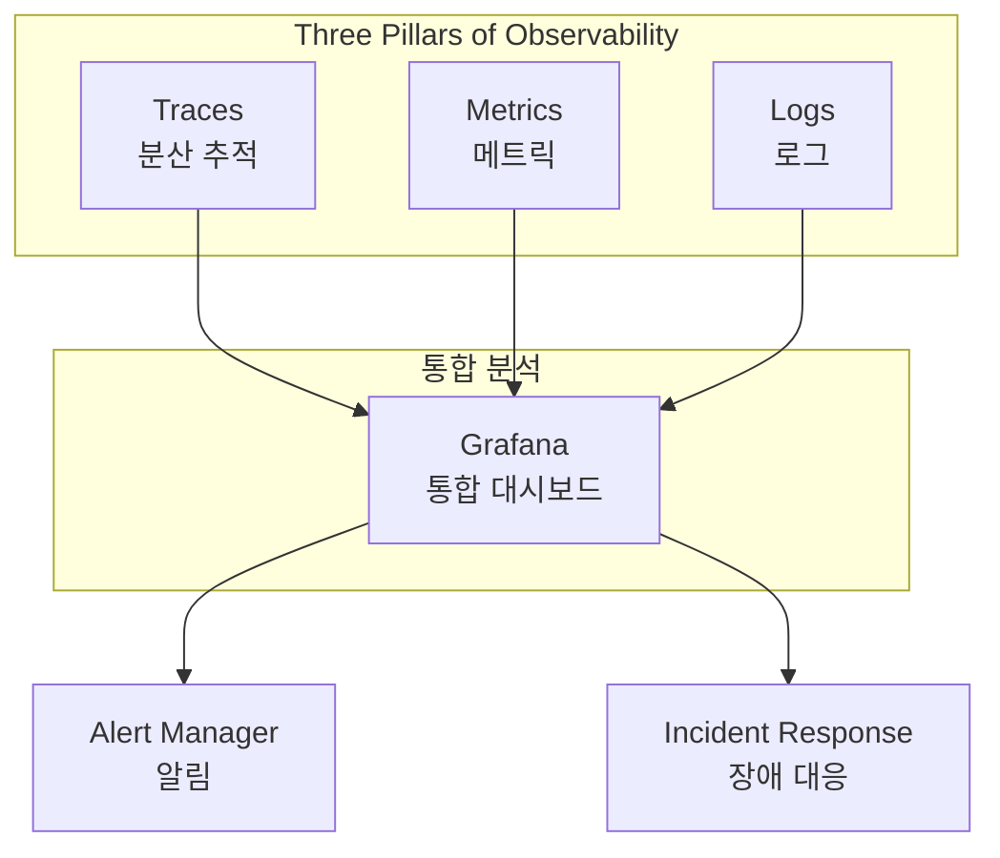
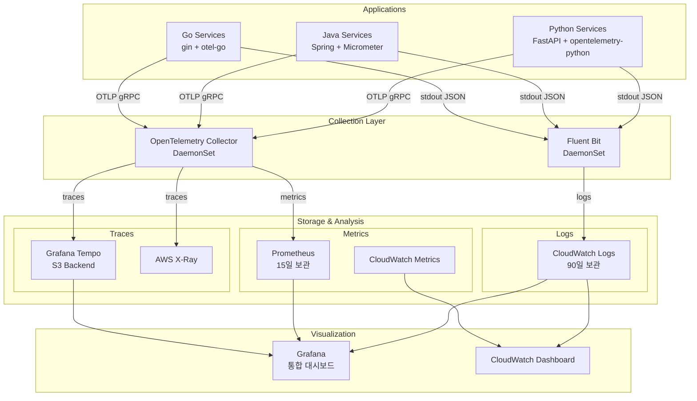
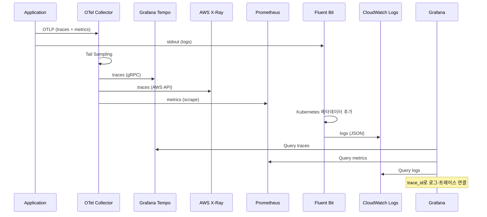
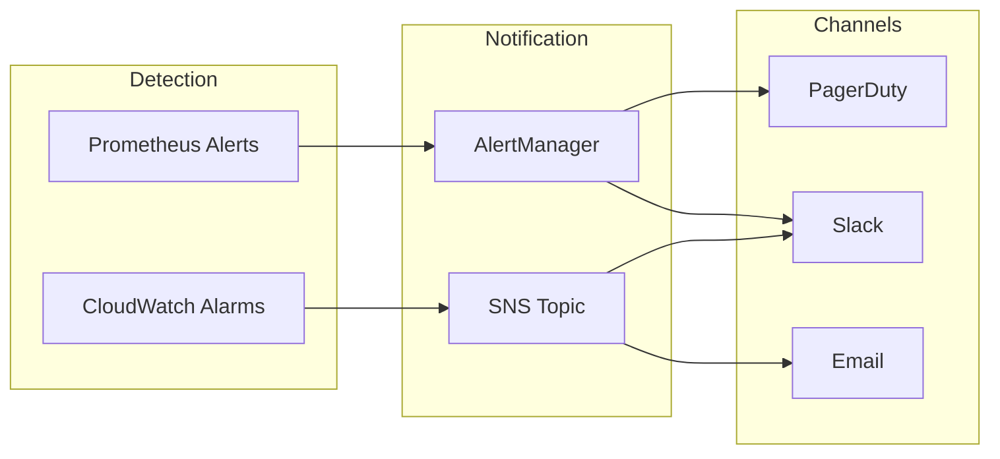

# 관측성 개요

멀티리전 쇼핑몰 플랫폼의 전체 관측성(Observability) 스택을 소개합니다. 분산 시스템에서 문제를 신속하게 파악하고 해결하기 위해 **트레이스(Traces)**, **메트릭(Metrics)**, **로그(Logs)** 세 가지 핵심 요소를 통합 운영합니다.

## 관측성의 세 가지 기둥



| 기둥 | 목적 | 도구 |
|------|------|------|
| **Traces** | 요청의 전체 흐름 추적 | OpenTelemetry, Tempo, X-Ray |
| **Metrics** | 시스템 상태 수치화 | Prometheus, CloudWatch |
| **Logs** | 상세 이벤트 기록 | Fluent Bit, CloudWatch Logs |

## 전체 아키텍처



## 핵심 컴포넌트

### 1. OpenTelemetry Collector (DaemonSet)

모든 노드에서 실행되며 애플리케이션의 텔레메트리 데이터를 수집합니다.

```yaml
# 수신 포트
- OTLP gRPC: 4317
- OTLP HTTP: 4318
- Prometheus metrics: 8889

# 주요 기능
- Tail-based Sampling (에러 100%, 느린 요청 100%, 기본 10%)
- 배치 처리 (1024개 단위)
- 메모리 제한 (512Mi)
```

**이중 내보내기 (Dual Export):**
- **Grafana Tempo**: 장기 보관 및 상세 분석
- **AWS X-Ray**: AWS 서비스 통합 및 서비스 맵

### 2. Prometheus + Grafana

```yaml
# Prometheus 설정
retention: 15d
storage: 50Gi (gp3)
serviceMonitor: 자동 탐지

# Grafana 설정
persistence: 10Gi
dataSource:
  - Prometheus (기본)
  - Tempo (트레이스)
  - CloudWatch (AWS 메트릭)
```

### 3. Fluent Bit (DaemonSet)

모든 컨테이너 로그를 수집하여 CloudWatch Logs로 전송합니다.

```yaml
# 로그 그룹 구조
/eks/{cluster-name}/containers

# 로그 스트림
{node-name}-{container-name}

# 보관 기간
90일
```

### 4. CloudWatch 통합

Terraform으로 관리되는 CloudWatch 리소스:

```hcl
# 네임스페이스별 로그 그룹
- /eks/multi-region-mall/core-services
- /eks/multi-region-mall/user-services
- /eks/multi-region-mall/fulfillment
- /eks/multi-region-mall/business-services
- /eks/multi-region-mall/platform

# 주요 알람
- high-error-rate: 5XX 에러율 > 1%
- high-latency: 응답시간 > 2초
- aurora-replication-lag: 복제 지연 > 1000ms
- msk-under-replicated: 언더 복제 파티션 감지
```

## 데이터 흐름 상세



## 리전별 구성

각 리전(us-east-1, us-west-2)은 독립적인 관측성 스택을 운영합니다:

| 컴포넌트 | us-east-1 | us-west-2 |
|----------|-----------|-----------|
| OTel Collector | DaemonSet | DaemonSet |
| Tempo | S3 버킷 (use1) | S3 버킷 (usw2) |
| Prometheus | 50Gi PVC | 50Gi PVC |
| CloudWatch | /eks/multi-region-mall/* | /eks/multi-region-mall/* |

### Tempo IRSA 설정

ArgoCD ApplicationSet을 통해 리전별 IAM Role을 자동 패치합니다:

```yaml
# appset-tempo.yaml
patches:
  - target:
      kind: ServiceAccount
      name: tempo
    patch: |-
      - op: replace
        path: /metadata/annotations/eks.amazonaws.com~1role-arn
        value: "arn:aws:iam::123456789012:role/production-tempo-{{metadata.labels.region}}"
```

## 알림 및 에스컬레이션



## 빠른 시작

### 1. Grafana 접속

```bash
# 포트 포워딩
kubectl port-forward svc/prometheus-grafana -n monitoring 3000:80

# 브라우저에서 접속
open http://localhost:3000
# 기본 계정: admin / prom-operator
```

### 2. 트레이스 검색

```bash
# Tempo API로 트레이스 검색
curl -G http://localhost:3200/api/search \
  --data-urlencode 'tags=service.name=order-service' \
  --data-urlencode 'minDuration=500ms'
```

### 3. 로그 조회

```bash
# CloudWatch Logs Insights
aws logs start-query \
  --log-group-name "/eks/multi-region-mall/core-services" \
  --query-string 'fields @timestamp, @message | filter @message like /ERROR/ | limit 100'
```

## 관련 문서

- [분산 추적](./distributed-tracing) - OpenTelemetry 상세 설정
- [Prometheus 메트릭](./metrics-prometheus) - 메트릭 수집 및 알림
- [로깅](./logging) - Fluent Bit 및 로그 포맷
- [대시보드](./dashboards) - Grafana 대시보드 구성
