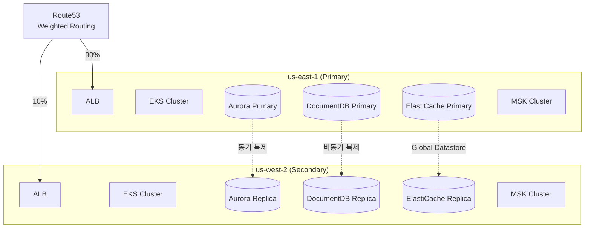
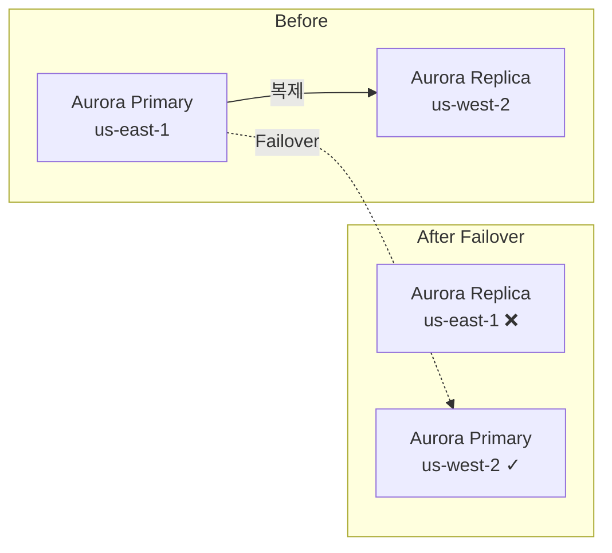
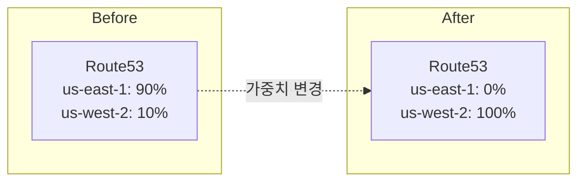
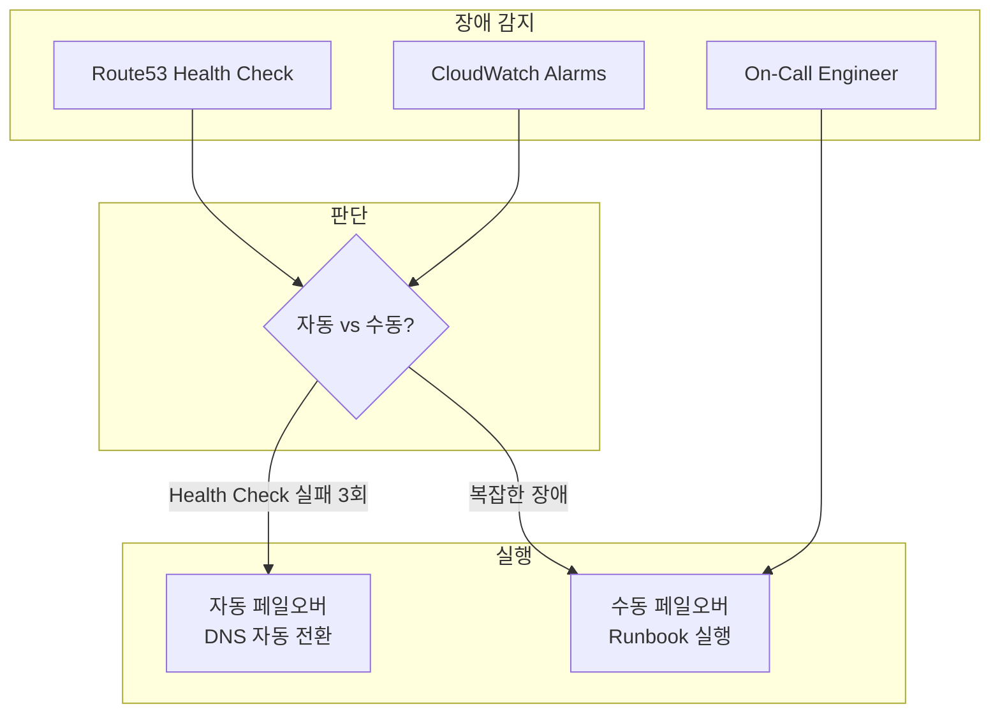

# 재해 복구 (Disaster Recovery)

멀티리전 쇼핑몰 플랫폼의 재해 복구(DR) 전략을 설명합니다. **RPO < 1초**, **RTO < 10분**을 목표로 합니다.

## DR 목표

| 지표 | 목표 | 설명 |
|------|------|------|
| **RPO** (Recovery Point Objective) | < 1초 | 최대 데이터 손실 허용 시간 |
| **RTO** (Recovery Time Objective) | < 10분 | 서비스 복구까지 최대 시간 |
| **가용성** | 99.99% | 연간 다운타임 < 53분 |

## 리전 구성



## 복구 티어 (Recovery Tiers)

### Tier 1: 데이터베이스 페일오버 (RTO: 1-2분)

단일 데이터베이스 장애 시 자동/수동 페일오버합니다.



**대상 서비스:**
- Aurora Global Database
- DocumentDB Global Cluster
- ElastiCache Global Datastore

### Tier 2: DNS 페일오버 (RTO: 2-5분)

애플리케이션 레이어 장애 시 Route53 가중치를 조정합니다.



### Tier 3: 전체 리전 페일오버 (RTO: 5-10분)

Primary 리전 전체 장애 시 Secondary 리전으로 완전 전환합니다.



## 데이터 저장소 복구 상태

| 데이터 저장소 | 복제 방식 | RPO | 자동 페일오버 | 비고 |
|--------------|----------|-----|--------------|------|
| **Aurora Global** | 동기 복제 | < 1초 | 지원 | Global Database |
| **DocumentDB Global** | 비동기 복제 | < 1초 | 수동 | Global Cluster |
| **ElastiCache Global** | 비동기 복제 | < 1초 | 지원 | Global Datastore |
| **OpenSearch** | 독립 클러스터 | N/A | N/A | 리전별 별도 |
| **MSK** | 독립 클러스터 | N/A | N/A | 리전별 별도 |
| **S3** | Cross-Region Replication | < 15분 | N/A | 비동기 |

## Runbook: Tier 1 - Aurora 페일오버

### 사전 조건
- Aurora Global Database 구성 완료
- Secondary 리전에 Reader 인스턴스 존재
- 복제 지연 < 100ms

### 절차

```bash
# 1. 현재 상태 확인
aws rds describe-global-clusters \
  --global-cluster-identifier production-aurora-global \
  --query 'GlobalClusters[0].GlobalClusterMembers'

# 2. 복제 지연 확인
aws cloudwatch get-metric-statistics \
  --namespace AWS/RDS \
  --metric-name AuroraReplicaLag \
  --dimensions Name=DBClusterIdentifier,Value=production-aurora-global-us-west-2 \
  --start-time $(date -u -d '10 minutes ago' +%Y-%m-%dT%H:%M:%SZ) \
  --end-time $(date -u +%Y-%m-%dT%H:%M:%SZ) \
  --period 60 \
  --statistics Average

# 3. Secondary를 Primary로 승격 (Planned)
aws rds failover-global-cluster \
  --global-cluster-identifier production-aurora-global \
  --target-db-cluster-identifier arn:aws:rds:us-west-2:180294183052:cluster:production-aurora-global-us-west-2

# 4. 승격 완료 확인
aws rds describe-global-clusters \
  --global-cluster-identifier production-aurora-global \
  --query 'GlobalClusters[0].GlobalClusterMembers[?IsWriter==`true`].DBClusterArn'
```

### 예상 소요 시간
- 계획된 페일오버: 1-2분
- 비계획 페일오버: 2-5분

## Runbook: Tier 2 - DNS 페일오버

### 절차

```bash
# 1. 현재 Route53 가중치 확인
aws route53 list-resource-record-sets \
  --hosted-zone-id Z1234567890ABC \
  --query "ResourceRecordSets[?Name=='api.atomai.click.']"

# 2. us-east-1 가중치를 0으로 변경
aws route53 change-resource-record-sets \
  --hosted-zone-id Z1234567890ABC \
  --change-batch '{
    "Changes": [{
      "Action": "UPSERT",
      "ResourceRecordSet": {
        "Name": "api.atomai.click",
        "Type": "A",
        "SetIdentifier": "us-east-1",
        "Weight": 0,
        "AliasTarget": {
          "HostedZoneId": "Z35SXDOTRQ7X7K",
          "DNSName": "alb-us-east-1.elb.amazonaws.com",
          "EvaluateTargetHealth": true
        }
      }
    }]
  }'

# 3. us-west-2 가중치를 100으로 변경
aws route53 change-resource-record-sets \
  --hosted-zone-id Z1234567890ABC \
  --change-batch '{
    "Changes": [{
      "Action": "UPSERT",
      "ResourceRecordSet": {
        "Name": "api.atomai.click",
        "Type": "A",
        "SetIdentifier": "us-west-2",
        "Weight": 100,
        "AliasTarget": {
          "HostedZoneId": "Z1H1FL5HABSF5",
          "DNSName": "alb-us-west-2.elb.amazonaws.com",
          "EvaluateTargetHealth": true
        }
      }
    }]
  }'

# 4. 변경 전파 확인
aws route53 get-change --id <change-id>

# 5. DNS 확인
dig api.atomai.click +short
```

## Runbook: Tier 3 - 전체 리전 페일오버

### 체크리스트

```markdown
## 페일오버 전 확인
- [ ] 장애 원인 파악 (일시적 vs 장기)
- [ ] Secondary 리전 상태 정상 확인
- [ ] 데이터 복제 상태 확인 (모든 DB)
- [ ] 팀 알림 및 승인

## 페일오버 실행
- [ ] 1. Aurora Global 페일오버
- [ ] 2. DocumentDB 페일오버
- [ ] 3. ElastiCache 페일오버
- [ ] 4. Route53 DNS 가중치 변경
- [ ] 5. ArgoCD 애플리케이션 동기화 확인

## 페일오버 후 확인
- [ ] 모든 서비스 Health Check 통과
- [ ] 주요 API 응답 확인
- [ ] 에러율 정상 범위
- [ ] 상태 페이지 업데이트
```

### 전체 페일오버 스크립트

```bash
#!/bin/bash
# full-region-failover.sh

set -e

SOURCE_REGION="us-east-1"
TARGET_REGION="us-west-2"

echo "=== 전체 리전 페일오버 시작 ==="
echo "From: ${SOURCE_REGION} -> To: ${TARGET_REGION}"
echo ""

# 1. Aurora 페일오버
echo "[1/5] Aurora Global Database 페일오버..."
aws rds failover-global-cluster \
  --global-cluster-identifier production-aurora-global \
  --target-db-cluster-identifier arn:aws:rds:${TARGET_REGION}:180294183052:cluster:production-aurora-global-${TARGET_REGION}
echo "Aurora 페일오버 시작됨"

# 2. DocumentDB 페일오버 (수동)
echo "[2/5] DocumentDB 페일오버..."
# DocumentDB는 Global Cluster에서 Secondary를 분리 후 승격
aws docdb modify-global-cluster \
  --global-cluster-identifier production-docdb-global \
  --deletion-protection false
aws docdb remove-from-global-cluster \
  --global-cluster-identifier production-docdb-global \
  --db-cluster-identifier production-docdb-global-${TARGET_REGION}
echo "DocumentDB 페일오버 완료"

# 3. ElastiCache 페일오버
echo "[3/5] ElastiCache Global Datastore 페일오버..."
aws elasticache failover-global-replication-group \
  --global-replication-group-id production-elasticache-global \
  --primary-region ${TARGET_REGION} \
  --primary-replication-group-id production-elasticache-${TARGET_REGION}
echo "ElastiCache 페일오버 시작됨"

# 4. Route53 가중치 변경
echo "[4/5] Route53 DNS 가중치 변경..."
# (위 DNS 페일오버 명령 실행)
echo "DNS 가중치 변경 완료"

# 5. 상태 확인
echo "[5/5] 상태 확인 중..."
sleep 60

# Health Check
curl -s https://api.atomai.click/health | jq .
echo ""
echo "=== 페일오버 완료 ==="
```

## 복구 후 절차

### 1. 원본 리전 복구 시

```bash
# 1. 원본 리전 인프라 상태 확인
aws ec2 describe-availability-zones --region us-east-1

# 2. 데이터베이스 재동기화
# Aurora: 자동으로 역복제 설정됨
# DocumentDB: Global Cluster 재구성 필요
# ElastiCache: Global Datastore 자동 동기화

# 3. 점진적 트래픽 복귀
# us-east-1: 10% -> 30% -> 50% -> 90%
```

### 2. 사후 분석 (Post-Mortem)

```markdown
## 장애 보고서 템플릿

### 개요
- 발생 시간:
- 탐지 시간:
- 복구 시간:
- 영향 범위:

### 타임라인
| 시간 | 이벤트 |
|------|--------|
| HH:MM | 장애 발생 |
| HH:MM | 알림 수신 |
| HH:MM | 페일오버 결정 |
| HH:MM | 페일오버 완료 |
| HH:MM | 서비스 정상화 |

### 근본 원인

### 영향도
- 영향받은 사용자 수:
- 실패한 요청 수:
- 매출 영향:

### 개선 사항
1.
2.
3.
```

## 정기 DR 훈련

### 분기별 훈련 일정

| 훈련 | 주기 | 범위 | 목표 RTO |
|------|------|------|----------|
| DB 페일오버 | 월 1회 | Tier 1 | < 2분 |
| DNS 페일오버 | 분기 1회 | Tier 2 | < 5분 |
| 전체 리전 페일오버 | 반기 1회 | Tier 3 | < 10분 |
| 카오스 엔지니어링 | 월 1회 | 무작위 | 측정 |

### 훈련 체크리스트

```markdown
## DR 훈련 준비
- [ ] 훈련 일정 공지 (최소 1주 전)
- [ ] 롤백 계획 준비
- [ ] 모니터링 대시보드 준비
- [ ] 커뮤니케이션 채널 확인

## 훈련 실행
- [ ] 기준 메트릭 기록
- [ ] 페일오버 실행
- [ ] RTO 측정
- [ ] 데이터 무결성 확인

## 훈련 후
- [ ] 결과 문서화
- [ ] 개선점 식별
- [ ] 다음 훈련 일정 확정
```

## 관련 문서

- [페일오버 절차](./failover-procedures)
- [시드 데이터](./seed-data)
- [트러블슈팅](./troubleshooting)
