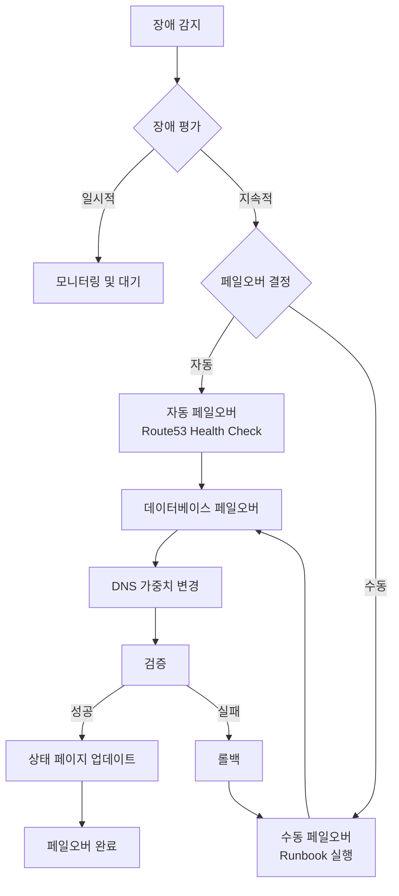
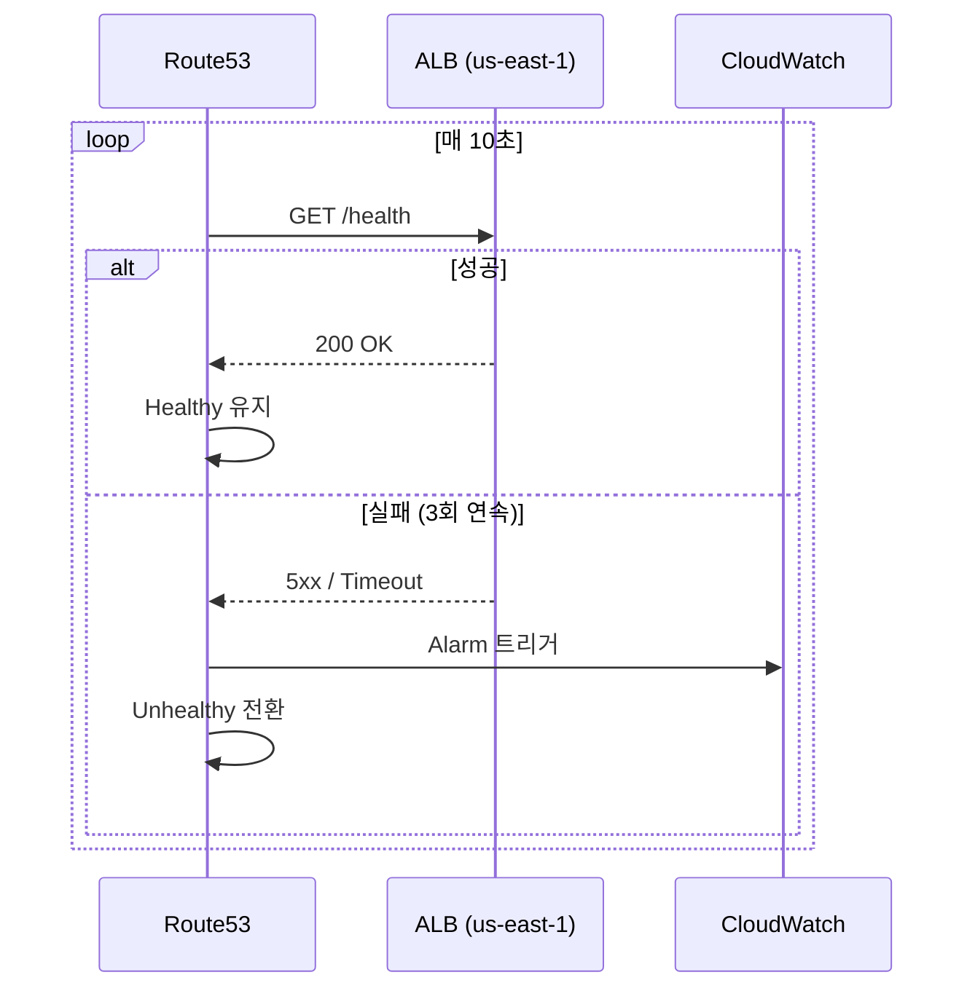

# 페일오버 절차 (Failover Procedures)

리전 장애 발생 시 단계별 페일오버 절차를 상세히 설명합니다.

## 페일오버 흐름



## 1단계: 장애 감지 (Detect)

### Route53 Health Check



### Health Check 상태 확인

```bash
# Route53 Health Check 상태 조회
aws route53 get-health-check-status \
  --health-check-id <health-check-id>

# 결과 예시
{
  "HealthCheckObservations": [
    {
      "Region": "us-east-1",
      "StatusReport": {
        "Status": "Failure",
        "CheckedTime": "2026-03-15T10:30:00Z"
      }
    }
  ]
}
```

### CloudWatch Alarm 확인

```bash
# 알람 상태 확인
aws cloudwatch describe-alarms \
  --alarm-names "production-high-error-rate" "production-high-latency" \
  --query 'MetricAlarms[*].[AlarmName,StateValue,StateReason]' \
  --output table
```

## 2단계: 장애 평가 (Assess)

### 체크리스트

```bash
#!/bin/bash
# assess-failure.sh

echo "=== 장애 평가 시작 ==="

# 1. EKS 클러스터 상태
echo "[1] EKS 클러스터 상태"
aws eks describe-cluster --name multi-region-mall --region us-east-1 \
  --query 'cluster.status'

# 2. 노드 상태
echo "[2] 노드 상태"
kubectl get nodes --context=us-east-1

# 3. Pod 상태
echo "[3] Pod 상태 (core-services)"
kubectl get pods -n core-services --context=us-east-1 | grep -v Running

# 4. Aurora 상태
echo "[4] Aurora 클러스터 상태"
aws rds describe-db-clusters \
  --db-cluster-identifier production-aurora-global-us-east-1 \
  --query 'DBClusters[0].Status'

# 5. DocumentDB 상태
echo "[5] DocumentDB 클러스터 상태"
aws docdb describe-db-clusters \
  --db-cluster-identifier production-docdb-global-us-east-1 \
  --query 'DBClusters[0].Status'

# 6. ElastiCache 상태
echo "[6] ElastiCache 상태"
aws elasticache describe-replication-groups \
  --replication-group-id production-elasticache-us-east-1 \
  --query 'ReplicationGroups[0].Status'

# 7. MSK 상태
echo "[7] MSK 클러스터 상태"
aws kafka describe-cluster \
  --cluster-arn arn:aws:kafka:us-east-1:123456789012:cluster/production-msk-us-east-1 \
  --query 'ClusterInfo.State'

echo "=== 평가 완료 ==="
```

### 장애 유형 분류

| 유형 | 증상 | 권장 조치 |
|------|------|----------|
| **네트워크 장애** | 간헐적 타임아웃, 패킷 손실 | 모니터링, 자동 복구 대기 |
| **애플리케이션 장애** | 특정 서비스 5xx | Pod 재시작, 스케일 아웃 |
| **데이터베이스 장애** | DB 연결 실패 | DB 페일오버 (Tier 1) |
| **리전 장애** | 전체 서비스 불가 | 전체 페일오버 (Tier 3) |

## 3단계: 페일오버 결정 (Decide)

### 자동 페일오버 조건

- Route53 Health Check 3회 연속 실패
- 또는 CloudWatch Alarm이 5분 이상 ALARM 상태

### 수동 페일오버 조건

- 복잡한 장애 (데이터 정합성 이슈)
- 부분 장애 (특정 서비스만 영향)
- 자동 페일오버 실패

### 의사결정 트리

```
장애 지속 시간?
├── < 5분: 모니터링
├── 5-15분: DB 페일오버 검토
└── > 15분: 전체 페일오버 실행

데이터 정합성?
├── 정상: 자동 페일오버 진행
└── 의심: 수동 페일오버 + 데이터 검증
```

## 4단계: 페일오버 실행 (Execute)

### 4.1 Aurora Global Database 페일오버

```bash
# 1. 현재 Global Cluster 상태 확인
aws rds describe-global-clusters \
  --global-cluster-identifier production-aurora-global \
  --query 'GlobalClusters[0].{
    GlobalClusterIdentifier: GlobalClusterIdentifier,
    Status: Status,
    Members: GlobalClusterMembers[*].{
      Cluster: DBClusterArn,
      IsWriter: IsWriter,
      Status: GlobalWriteForwardingStatus
    }
  }'

# 2. 복제 지연 확인 (< 100ms 권장)
aws cloudwatch get-metric-statistics \
  --namespace AWS/RDS \
  --metric-name AuroraReplicaLag \
  --dimensions Name=DBClusterIdentifier,Value=production-aurora-global-us-west-2 \
  --start-time $(date -u -d '5 minutes ago' +%Y-%m-%dT%H:%M:%SZ) \
  --end-time $(date -u +%Y-%m-%dT%H:%M:%SZ) \
  --period 60 \
  --statistics Average \
  --query 'Datapoints[*].Average'

# 3. 페일오버 실행
aws rds failover-global-cluster \
  --global-cluster-identifier production-aurora-global \
  --target-db-cluster-identifier arn:aws:rds:us-west-2:123456789012:cluster:production-aurora-global-us-west-2

# 4. 페일오버 진행 상황 모니터링
watch -n 5 "aws rds describe-global-clusters \
  --global-cluster-identifier production-aurora-global \
  --query 'GlobalClusters[0].GlobalClusterMembers[*].[DBClusterArn,IsWriter]'"

# 5. 새 Primary 엔드포인트 확인
aws rds describe-db-clusters \
  --db-cluster-identifier production-aurora-global-us-west-2 \
  --query 'DBClusters[0].Endpoint'
```

### 4.2 DocumentDB Global Cluster 페일오버

```bash
# 1. Global Cluster 상태 확인
aws docdb describe-global-clusters \
  --global-cluster-identifier production-docdb-global

# 2. Secondary 클러스터 분리
aws docdb remove-from-global-cluster \
  --global-cluster-identifier production-docdb-global \
  --db-cluster-identifier production-docdb-global-us-west-2

# 3. 분리된 클러스터가 독립 Primary가 됨
# 엔드포인트: production-docdb-global-us-west-2.cluster-xxx.us-west-2.docdb.amazonaws.com

# 4. 애플리케이션 연결 문자열 업데이트 필요
# ConfigMap 또는 Secret 업데이트
kubectl set env deployment/product-catalog -n core-services \
  DOCUMENTDB_HOST=production-docdb-global-us-west-2.cluster-yyyyyyyyyyyy.us-west-2.docdb.amazonaws.com
```

### 4.3 ElastiCache Global Datastore 페일오버

```bash
# 1. Global Datastore 상태 확인
aws elasticache describe-global-replication-groups \
  --global-replication-group-id production-elasticache-global \
  --query 'GlobalReplicationGroups[0].{
    Status: Status,
    PrimaryCluster: PrimaryReplicationGroupId,
    Members: Members[*].{
      ReplicationGroupId: ReplicationGroupId,
      Role: Role,
      Status: Status
    }
  }'

# 2. 페일오버 실행
aws elasticache failover-global-replication-group \
  --global-replication-group-id production-elasticache-global \
  --primary-region us-west-2 \
  --primary-replication-group-id production-elasticache-us-west-2

# 3. 페일오버 완료 대기
aws elasticache wait replication-group-available \
  --replication-group-id production-elasticache-us-west-2

# 4. 새 엔드포인트 확인
aws elasticache describe-replication-groups \
  --replication-group-id production-elasticache-us-west-2 \
  --query 'ReplicationGroups[0].ConfigurationEndpoint'
```

### 4.4 Route53 DNS 가중치 변경

```bash
# 1. 현재 레코드 확인
HOSTED_ZONE_ID="Z1234567890ABC"

aws route53 list-resource-record-sets \
  --hosted-zone-id ${HOSTED_ZONE_ID} \
  --query "ResourceRecordSets[?Name=='api.atomai.click.']"

# 2. us-east-1을 0으로, us-west-2를 100으로 변경
cat << 'EOF' > /tmp/dns-failover.json
{
  "Changes": [
    {
      "Action": "UPSERT",
      "ResourceRecordSet": {
        "Name": "api.atomai.click",
        "Type": "A",
        "SetIdentifier": "primary-us-east-1",
        "Weight": 0,
        "AliasTarget": {
          "HostedZoneId": "Z0EXAMPLE7654321",
          "DNSName": "dualstack.prod-alb-us-east-1-123456.us-east-1.elb.amazonaws.com",
          "EvaluateTargetHealth": true
        }
      }
    },
    {
      "Action": "UPSERT",
      "ResourceRecordSet": {
        "Name": "api.atomai.click",
        "Type": "A",
        "SetIdentifier": "secondary-us-west-2",
        "Weight": 100,
        "AliasTarget": {
          "HostedZoneId": "Z0EXAMPLEABCDEFG",
          "DNSName": "dualstack.prod-alb-us-west-2-654321.us-west-2.elb.amazonaws.com",
          "EvaluateTargetHealth": true
        }
      }
    }
  ]
}
EOF

aws route53 change-resource-record-sets \
  --hosted-zone-id ${HOSTED_ZONE_ID} \
  --change-batch file:///tmp/dns-failover.json

# 3. 변경 상태 확인
CHANGE_ID=$(aws route53 change-resource-record-sets ... --query 'ChangeInfo.Id' --output text)
aws route53 get-change --id ${CHANGE_ID}

# 4. DNS 전파 확인
dig api.atomai.click +short
nslookup api.atomai.click 8.8.8.8
```

## 5단계: 검증 (Verify)

### 5.1 Health Check 검증

```bash
# API 헬스체크
curl -s https://api.atomai.click/health | jq .

# 예상 응답
{
  "status": "healthy",
  "region": "us-west-2",
  "timestamp": "2026-03-15T10:35:00Z",
  "services": {
    "database": "healthy",
    "cache": "healthy",
    "kafka": "healthy"
  }
}
```

### 5.2 데이터 무결성 검증

```bash
# Aurora 연결 테스트
kubectl exec -it deploy/order-service -n core-services -- \
  psql -h $AURORA_HOST -U mall_admin -d mall -c "SELECT count(*) FROM orders;"

# DocumentDB 연결 테스트
kubectl exec -it deploy/product-catalog -n core-services -- \
  mongosh "$DOCUMENTDB_URI" --eval "db.products.countDocuments()"

# ElastiCache 연결 테스트
kubectl exec -it deploy/cart-service -n core-services -- \
  redis-cli -h $ELASTICACHE_HOST PING
```

### 5.3 서비스 기능 테스트

```bash
# 주요 API 엔드포인트 테스트
ENDPOINTS=(
  "/api/v1/products"
  "/api/v1/users/health"
  "/api/v1/orders/health"
  "/api/v1/cart/health"
)

for endpoint in "${ENDPOINTS[@]}"; do
  echo -n "Testing ${endpoint}: "
  STATUS=$(curl -s -o /dev/null -w "%{http_code}" "https://api.atomai.click${endpoint}")
  if [ "$STATUS" == "200" ]; then
    echo "OK"
  else
    echo "FAILED (${STATUS})"
  fi
done
```

### 5.4 에러율 확인

```bash
# Prometheus 쿼리 (최근 5분 에러율)
curl -s "http://prometheus:9090/api/v1/query" \
  --data-urlencode 'query=sum(rate(http_requests_total{status=~"5.."}[5m])) / sum(rate(http_requests_total[5m])) * 100' \
  | jq '.data.result[0].value[1]'

# 허용 기준: < 1%
```

## 6단계: 커뮤니케이션 (Communicate)

### 상태 페이지 업데이트

```markdown
## 서비스 상태 업데이트

**시간**: 2026-03-15 10:30 KST
**상태**: 복구됨

### 타임라인
- 10:15 - us-east-1 리전 장애 감지
- 10:20 - 페일오버 시작
- 10:28 - us-west-2 리전으로 트래픽 전환 완료
- 10:30 - 서비스 정상화 확인

### 영향 범위
- 약 15분간 간헐적 서비스 지연 발생
- 데이터 손실 없음

### 현재 상태
모든 서비스가 us-west-2 리전에서 정상 운영 중입니다.
```

### Slack 알림

```bash
curl -X POST https://hooks.slack.com/services/xxx \
  -H 'Content-Type: application/json' \
  -d '{
    "channel": "#incidents",
    "username": "Failover Bot",
    "icon_emoji": ":rotating_light:",
    "attachments": [{
      "color": "good",
      "title": "페일오버 완료",
      "text": "us-east-1 -> us-west-2 페일오버가 성공적으로 완료되었습니다.",
      "fields": [
        {"title": "RTO", "value": "8분 32초", "short": true},
        {"title": "데이터 손실", "value": "없음", "short": true}
      ],
      "ts": '"$(date +%s)"'
    }]
  }'
```

## 롤백 절차

페일오버 후 문제가 발생한 경우:

```bash
#!/bin/bash
# rollback-failover.sh

echo "=== 페일오버 롤백 시작 ==="

# 1. DNS를 원래대로 복원
aws route53 change-resource-record-sets \
  --hosted-zone-id ${HOSTED_ZONE_ID} \
  --change-batch file:///tmp/dns-original.json

# 2. 데이터베이스는 롤백하지 않음 (데이터 손실 위험)
# 대신 원본 리전 복구 후 재동기화

echo "DNS 롤백 완료. 데이터베이스는 수동 확인 필요."
```

## 관련 문서

- [재해 복구](./disaster-recovery)
- [트러블슈팅](./troubleshooting)
- [관측성 개요](/observability/overview.md)
