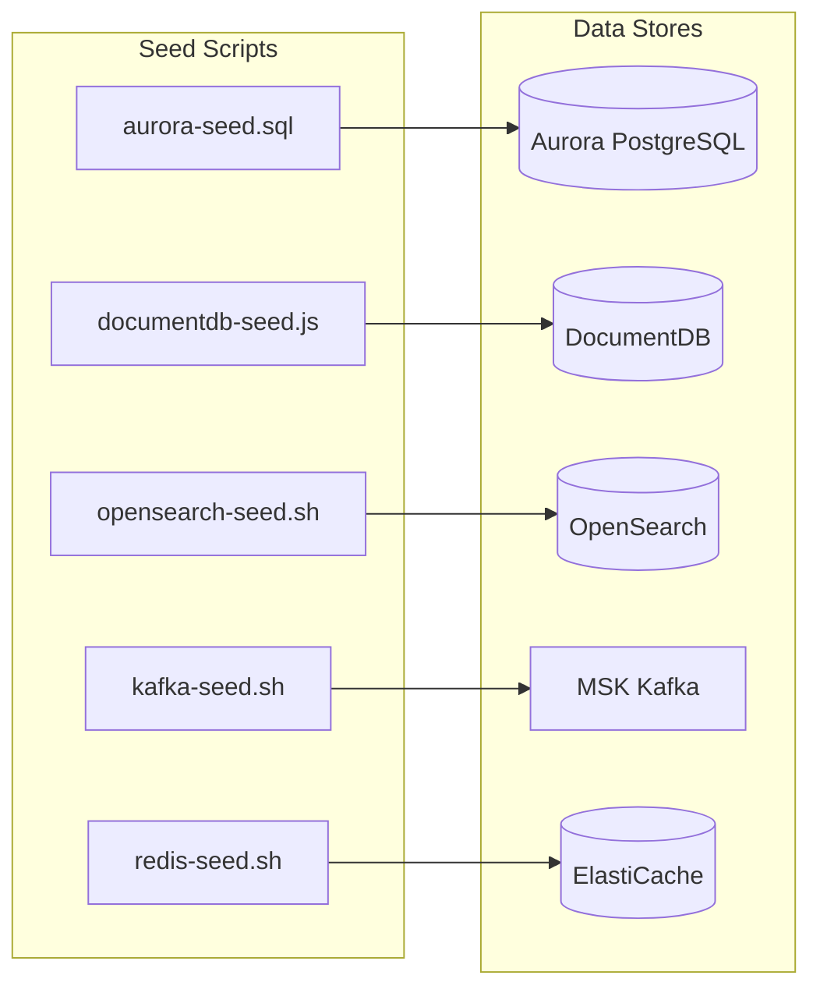
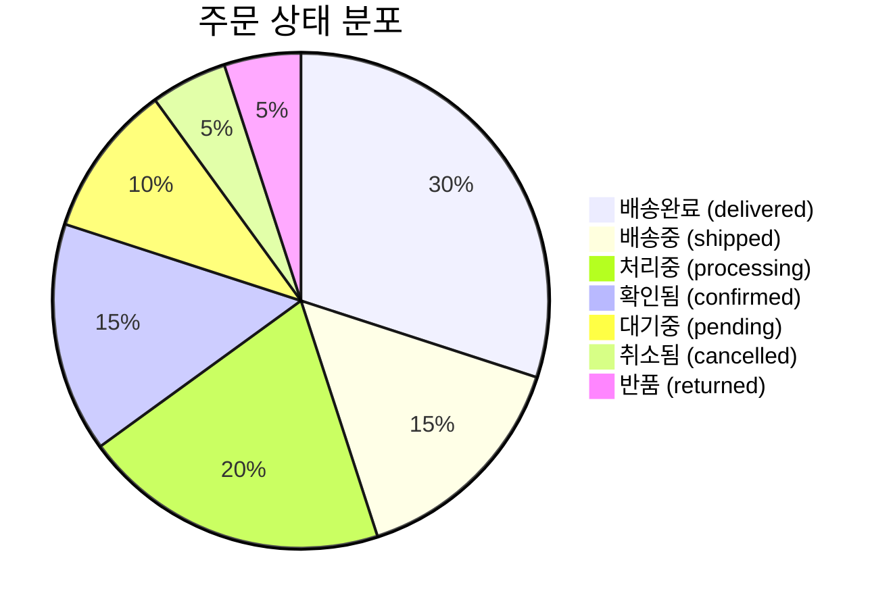

# 시드 데이터 (Seed Data)

개발, 테스트, 데모 환경을 위한 시드 데이터 구성 및 실행 방법을 설명합니다.

## 시드 데이터 개요



## 데이터 요약

| 데이터 저장소 | 데이터 유형 | 건수 |
|--------------|-----------|------|
| **Aurora** | 사용자, 주문, 결제, 재고, 배송 | 50 사용자, 200 주문, 150 재고 |
| **DocumentDB** | 카테고리, 상품, 프로필, 위시리스트, 리뷰, 알림 | 10 카테고리, 150 상품, 300 리뷰 |
| **OpenSearch** | 상품 검색 인덱스 | 150 상품 |
| **MSK** | Kafka 토픽 | 40+ 토픽 |
| **ElastiCache** | 캐시, 세션, 장바구니 | 다수 키 |

## 카테고리 (10개)

| ID | 카테고리명 | Slug |
|----|----------|------|
| CAT-01 | 전자제품 | electronics |
| CAT-02 | 패션 | fashion |
| CAT-03 | 식품 | food |
| CAT-04 | 뷰티 | beauty |
| CAT-05 | 가전 | appliances |
| CAT-06 | 스포츠 | sports |
| CAT-07 | 도서 | books |
| CAT-08 | 반려동물 | pets |
| CAT-09 | 가구 | furniture |
| CAT-10 | 유아용품 | baby |

## 상품 (150개)

카테고리별 15개씩, 총 150개의 한국 시장 맞춤 상품 데이터입니다.

### 전자제품 (CAT-01)

| 상품명 | 브랜드 | 가격 |
|--------|--------|------|
| 삼성 갤럭시 S25 울트라 | 삼성전자 | 1,799,000원 |
| 아이폰 16 프로 맥스 | Apple | 1,990,000원 |
| LG 그램 17인치 노트북 | LG전자 | 2,190,000원 |
| 삼성 갤럭시 탭 S10 | 삼성전자 | 1,290,000원 |
| 소니 WH-1000XM6 헤드폰 | Sony | 459,000원 |

### 패션 (CAT-02)

| 상품명 | 브랜드 | 가격 |
|--------|--------|------|
| 나이키 에어맥스 DN | Nike | 199,000원 |
| 노스페이스 눕시 패딩 | The North Face | 369,000원 |
| 리바이스 501 오리지널 진 | Levi's | 129,000원 |
| 무신사 스탠다드 맨투맨 | 무신사 스탠다드 | 29,900원 |

### 식품 (CAT-03)

| 상품명 | 브랜드 | 가격 |
|--------|--------|------|
| 농심 신라면 멀티팩 | 농심 | 4,980원 |
| 비비고 왕교자 1kg | CJ비비고 | 12,900원 |
| 종가집 포기김치 3kg | 종가집 | 22,900원 |
| 참이슬 후레쉬 360ml 20본 | 하이트진로 | 28,900원 |

## 사용자 (50명)

한국 이름으로 구성된 테스트 사용자입니다.

```sql
-- 예시 사용자
('a0000001-0000-0000-0000-000000000001', 'kim.minjun@gmail.com', '김민준', 'active'),
('a0000001-0000-0000-0000-000000000002', 'lee.soyeon@naver.com', '이소연', 'active'),
('a0000001-0000-0000-0000-000000000003', 'park.jihoon@kakao.com', '박지훈', 'active'),
...
```

### 회원 등급

| 등급 | 사용자 수 |
|------|----------|
| bronze | 10명 |
| silver | 10명 |
| gold | 15명 |
| platinum | 10명 |
| diamond | 4명 |
| vip | 1명 |

## 주문 (200건)

다양한 상태의 주문 데이터입니다.

### 주문 상태 분포



### 배송 주소

| 도시 | 구 | 예시 주소 |
|------|---|---------|
| 서울 | 강남구 | 테헤란로 152 |
| 서울 | 마포구 | 월드컵북로 396 |
| 부산 | 해운대구 | 해운대해변로 264 |
| 인천 | 연수구 | 송도과학로 32 |
| 대전 | 유성구 | 대학로 99 |
| 대구 | 수성구 | 달구벌대로 2503 |
| 광주 | 서구 | 상무대로 1001 |
| 수원 | 영통구 | 삼성로 129 |
| 성남 | 분당구 | 판교역로 235 |
| 제주 | 제주시 | 노형로 75 |

## Kafka 토픽

### 도메인별 토픽

```bash
# 주문 도메인
order.created           (12 partitions)
order.confirmed         (12 partitions)
order.cancelled         (6 partitions)
order.status-changed    (12 partitions)

# 결제 도메인
payment.initiated       (12 partitions)
payment.completed       (12 partitions)
payment.failed          (6 partitions)
payment.refunded        (6 partitions)

# 재고 도메인
inventory.reserved      (12 partitions)
inventory.released      (6 partitions)
inventory.low-stock     (3 partitions)
inventory.restocked     (6 partitions)

# 배송 도메인
shipping.dispatched     (12 partitions)
shipping.in-transit     (12 partitions)
shipping.delivered      (12 partitions)
shipping.returned       (6 partitions)

# 알림 도메인
notification.email      (6 partitions)
notification.push       (6 partitions)
notification.sms        (3 partitions)
notification.kakao      (6 partitions)

# 사용자 도메인
user.registered         (6 partitions)
user.profile-updated    (6 partitions)
user.login              (6 partitions)

# 상품 도메인
product.created         (6 partitions)
product.updated         (6 partitions)
product.price-changed   (6 partitions)
product.viewed          (12 partitions)

# 리뷰 도메인
review.submitted        (6 partitions)
review.approved         (6 partitions)

# 분석 도메인
search.query-logged     (12 partitions)
analytics.page-view     (12 partitions)
analytics.click         (12 partitions)

# 인프라
dlq.all                 (6 partitions, 30일 보관)
saga.orchestrator       (12 partitions)
```

## ElastiCache 데이터

### 캐시 유형

| 키 패턴 | 용도 | TTL |
|---------|------|-----|
| `product:{id}` | 상품 상세 캐시 | 1시간 |
| `cache:categories` | 카테고리 목록 | 24시간 |
| `cart:{userId}` | 장바구니 | 7일 |
| `session:{sessionId}` | 사용자 세션 | 2시간 |
| `ratelimit:api:{userId}` | API Rate Limit | 60초 |
| `leaderboard:popular` | 인기 상품 (Sorted Set) | 영구 |
| `stock:{productId}` | 실시간 재고 | 영구 |
| `search-history:{userId}` | 검색 기록 | 30일 |
| `promo:*` | 프로모션 캐시 | 다양 |

### 예시 데이터

```json
// 장바구니 (cart:a0000001-0000-0000-0000-000000000001)
{
  "userId": "a0000001-0000-0000-0000-000000000001",
  "items": [
    {"productId": "PROD-001", "quantity": 2, "price": 1799000},
    {"productId": "PROD-015", "quantity": 1, "price": 299000}
  ],
  "updatedAt": "2026-03-15T10:00:00Z"
}

// 프로모션 (promo:flash-sale)
{
  "id": "FLASH-001",
  "title": "오늘만 특가! 전자제품 최대 50% 할인",
  "products": ["PROD-001", "PROD-005", "PROD-010", "PROD-015"],
  "discountRate": 50
}
```

## 시드 스크립트 실행

### 환경 변수 설정

```bash
# Aurora
export AURORA_ENDPOINT="production-aurora-global-us-east-1.cluster-xxx.us-east-1.rds.amazonaws.com"
export AURORA_USER="mall_admin"
export AURORA_PASSWORD="<password>"
export AURORA_DB="mall"

# DocumentDB
export DOCUMENTDB_URI="mongodb://mall_admin:<password>@production-docdb-global-us-east-1.cluster-xxx.us-east-1.docdb.amazonaws.com:27017/?tls=true&replicaSet=rs0"
export TLS_CA_FILE="/tmp/global-bundle.pem"

# OpenSearch
export OPENSEARCH_ENDPOINT="https://vpc-production-os-use1-xxx.us-east-1.es.amazonaws.com"
export OPENSEARCH_USER="admin"
export OPENSEARCH_PASS="<password>"

# MSK
export MSK_BOOTSTRAP="b-1.productionmskuseast1.xxx.c3.kafka.us-east-1.amazonaws.com:9096"
export KAFKA_HOME="/opt/kafka"

# ElastiCache
export ELASTICACHE_ENDPOINT="clustercfg.production-elasticache-us-east-1.xxx.use1.cache.amazonaws.com"
export ELASTICACHE_PORT="6379"
```

### 개별 스크립트 실행

```bash
cd /home/ec2-user/multi-region-architecture/scripts/seed-data

# Aurora PostgreSQL
PGPASSWORD=$AURORA_PASSWORD psql \
  -h $AURORA_ENDPOINT \
  -U $AURORA_USER \
  -d $AURORA_DB \
  -f seed-aurora.sql

# DocumentDB
# 먼저 TLS CA 인증서 다운로드
wget -O /tmp/global-bundle.pem https://truststore.pki.rds.amazonaws.com/global/global-bundle.pem
node seed-documentdb.js

# OpenSearch
bash seed-opensearch.sh

# Kafka Topics
bash seed-kafka-topics.sh

# ElastiCache
bash seed-redis.sh
```

### 마스터 스크립트 실행

```bash
# 모든 시드 데이터 한 번에 실행
cd /home/ec2-user/multi-region-architecture/scripts/seed-data
bash run-seed.sh

# 출력 예시
============================================
 Shopping Mall - Data Seeding
 Region: us-east-1
 Time:   2026-03-15T10:00:00Z
============================================

──────────────────────────────────────────
▶ Aurora PostgreSQL
──────────────────────────────────────────
Seed complete: 50 users, 200 orders, 200 payments, 150 inventory items, 180 shipments
✓ Aurora PostgreSQL completed

──────────────────────────────────────────
▶ DocumentDB
──────────────────────────────────────────
Inserted 10 categories
Inserted 150 products
Inserted 50 user profiles
Inserted 30 wishlists
Inserted 300 reviews
Inserted 50 notifications
✓ DocumentDB completed

──────────────────────────────────────────
▶ OpenSearch
──────────────────────────────────────────
Bulk indexing complete: 150 products indexed successfully
✓ OpenSearch completed

──────────────────────────────────────────
▶ MSK Topics
──────────────────────────────────────────
MSK seed complete: 42 topics created
✓ MSK Topics completed

──────────────────────────────────────────
▶ ElastiCache
──────────────────────────────────────────
Total keys: 350
✓ ElastiCache completed

============================================
 Seed Summary
============================================
 Succeeded: 5
 Failed:    0
 Skipped:   0
============================================
```

## 데이터 검증

### Aurora 검증

```sql
-- 테이블별 건수 확인
SELECT 'users' as table_name, count(*) FROM users
UNION ALL
SELECT 'orders', count(*) FROM orders
UNION ALL
SELECT 'order_items', count(*) FROM order_items
UNION ALL
SELECT 'payments', count(*) FROM payments
UNION ALL
SELECT 'inventory', count(*) FROM inventory
UNION ALL
SELECT 'shipments', count(*) FROM shipments;

-- 주문 상태 분포
SELECT status, count(*) FROM orders GROUP BY status ORDER BY count DESC;
```

### DocumentDB 검증

```javascript
// mongosh
use mall

// 컬렉션별 건수
db.getCollectionNames().forEach(c => {
  print(`${c}: ${db[c].countDocuments()}`);
});

// 카테고리별 상품 수
db.products.aggregate([
  { $group: { _id: "$category.name", count: { $sum: 1 } } },
  { $sort: { count: -1 } }
]);
```

### OpenSearch 검증

```bash
# 인덱스 목록
curl -s -u $OPENSEARCH_USER:$OPENSEARCH_PASS --insecure \
  "$OPENSEARCH_ENDPOINT/_cat/indices?v"

# 상품 검색 테스트
curl -s -u $OPENSEARCH_USER:$OPENSEARCH_PASS --insecure \
  -X POST "$OPENSEARCH_ENDPOINT/products/_search" \
  -H 'Content-Type: application/json' \
  -d '{"query": {"match": {"name": "삼성"}}, "size": 5}' | jq '.hits.hits[]._source.name'
```

### ElastiCache 검증

```bash
redis-cli -h $ELASTICACHE_ENDPOINT -p $ELASTICACHE_PORT --tls

# 키 개수
DBSIZE

# 인기 상품 TOP 5
ZREVRANGE leaderboard:popular 0 4 WITHSCORES

# 장바구니 확인
GET cart:a0000001-0000-0000-0000-000000000001
```

## 데이터 초기화

테스트 후 데이터를 초기화해야 할 경우:

```bash
# Aurora - 테이블 truncate
psql -h $AURORA_ENDPOINT -U $AURORA_USER -d $AURORA_DB << 'EOF'
TRUNCATE shipments, payments, order_items, orders, inventory, users CASCADE;
EOF

# DocumentDB - 컬렉션 삭제
mongosh "$DOCUMENTDB_URI" --eval "
  ['categories','products','user_profiles','wishlists','reviews','notifications']
    .forEach(c => db[c].drop())
"

# OpenSearch - 인덱스 삭제
curl -X DELETE "$OPENSEARCH_ENDPOINT/products" --insecure -u $OPENSEARCH_USER:$OPENSEARCH_PASS

# ElastiCache - 모든 키 삭제
redis-cli -h $ELASTICACHE_ENDPOINT --tls FLUSHALL
```

## 관련 문서

- [재해 복구](./disaster-recovery)
- [트러블슈팅](./troubleshooting)
- [데이터 아키텍처](/architecture/data)
