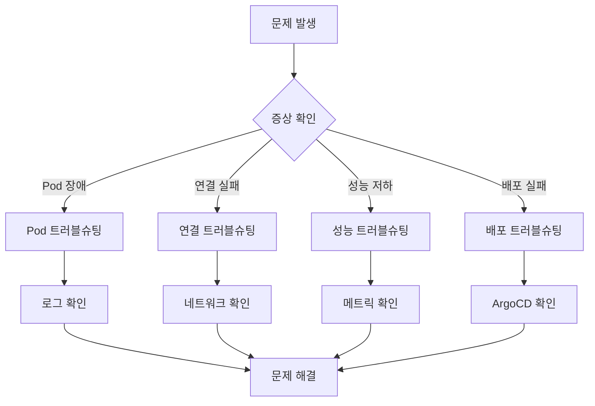

# 트러블슈팅 (Troubleshooting)

멀티리전 쇼핑몰 플랫폼 운영 중 발생할 수 있는 일반적인 문제와 해결 방법을 설명합니다.

## 문제 진단 흐름



## 1. Pod CrashLoopBackOff (DB 연결 실패)

### 증상
- Pod가 지속적으로 재시작됨
- 상태가 `CrashLoopBackOff` 또는 `Error`
- 로그에 데이터베이스 연결 에러

### 진단

```bash
# 1. Pod 상태 확인
kubectl get pods -n core-services -l app=order-service

# 2. Pod 이벤트 확인
kubectl describe pod <pod-name> -n core-services

# 3. 로그 확인 (이전 컨테이너 포함)
kubectl logs <pod-name> -n core-services --previous

# 4. 에러 메시지 예시
# "connection refused to production-aurora-global-us-east-1.cluster-xxx:5432"
# "dial tcp: lookup production-aurora... no such host"
```

### 원인 및 해결

#### 원인 1: 데이터베이스 엔드포인트 잘못됨

```bash
# Secret 확인
kubectl get secret aurora-credentials -n core-services -o jsonpath='{.data.host}' | base64 -d

# 실제 Aurora 엔드포인트 확인
aws rds describe-db-clusters \
  --db-cluster-identifier production-aurora-global-us-east-1 \
  --query 'DBClusters[0].Endpoint'

# Secret 업데이트
kubectl patch secret aurora-credentials -n core-services \
  -p '{"data":{"host":"'$(echo -n "correct-endpoint.rds.amazonaws.com" | base64)'"}}'

# Pod 재시작
kubectl rollout restart deployment/order-service -n core-services
```

#### 원인 2: Security Group 규칙 누락

```bash
# EKS 노드 Security Group ID 확인
EKS_SG=$(aws eks describe-cluster --name multi-region-mall \
  --query 'cluster.resourcesVpcConfig.clusterSecurityGroupId' --output text)

# Aurora Security Group에 인바운드 규칙 추가
aws ec2 authorize-security-group-ingress \
  --group-id <aurora-sg-id> \
  --protocol tcp \
  --port 5432 \
  --source-group $EKS_SG
```

#### 원인 3: IAM 인증 문제 (IRSA)

```bash
# ServiceAccount 확인
kubectl get sa order-service -n core-services -o yaml

# IAM Role ARN 확인
kubectl get sa order-service -n core-services \
  -o jsonpath='{.metadata.annotations.eks\.amazonaws\.com/role-arn}'

# IAM Role 정책 확인
aws iam get-role-policy \
  --role-name production-order-service-role \
  --policy-name rds-connect-policy
```

## 2. Kafka Consumer Lag

### 증상
- 이벤트 처리 지연
- Consumer lag 지속적 증가
- 메시지 처리 타임아웃

### 진단

```bash
# 1. Consumer Group lag 확인 (MSK)
aws kafka describe-cluster --cluster-arn <cluster-arn> \
  --query 'ClusterInfo.ZookeeperConnectString'

# Kafka 도구로 lag 확인
kafka-consumer-groups.sh --bootstrap-server $MSK_BOOTSTRAP \
  --group order-processor \
  --describe

# 2. CloudWatch에서 lag 확인
aws cloudwatch get-metric-statistics \
  --namespace AWS/Kafka \
  --metric-name SumOffsetLag \
  --dimensions Name=ConsumerGroup,Value=order-processor \
  --start-time $(date -u -d '1 hour ago' +%Y-%m-%dT%H:%M:%SZ) \
  --end-time $(date -u +%Y-%m-%dT%H:%M:%SZ) \
  --period 300 \
  --statistics Sum
```

### 원인 및 해결

#### 원인 1: Consumer 처리 속도 부족

```bash
# Consumer Pod 수 확인
kubectl get pods -n core-services -l app=order-processor

# HPA 상태 확인
kubectl get hpa order-processor -n core-services

# 수동 스케일 아웃
kubectl scale deployment/order-processor -n core-services --replicas=10

# 또는 KEDA ScaledObject 확인
kubectl get scaledobject order-processor -n core-services -o yaml
```

#### 원인 2: 처리 중 에러로 인한 재시도

```bash
# Consumer 로그에서 에러 확인
kubectl logs -l app=order-processor -n core-services --tail=100 | grep -i error

# DLQ(Dead Letter Queue) 확인
kafka-console-consumer.sh --bootstrap-server $MSK_BOOTSTRAP \
  --topic dlq.all \
  --from-beginning \
  --max-messages 10
```

#### 원인 3: Kafka 브로커 문제

```bash
# 브로커 상태 확인
aws kafka describe-cluster \
  --cluster-arn <cluster-arn> \
  --query 'ClusterInfo.{State:State,NumberOfBrokerNodes:NumberOfBrokerNodes}'

# Under-replicated 파티션 확인
kafka-topics.sh --bootstrap-server $MSK_BOOTSTRAP \
  --describe \
  --under-replicated-partitions
```

## 3. ElastiCache 연결 타임아웃 (Secondary 리전)

### 증상
- us-west-2 리전에서만 캐시 연결 실패
- "Connection timed out" 에러
- us-east-1은 정상

### 진단

```bash
# 1. ElastiCache 엔드포인트 확인
aws elasticache describe-replication-groups \
  --replication-group-id production-elasticache-us-west-2 \
  --query 'ReplicationGroups[0].ConfigurationEndpoint'

# 2. Pod에서 연결 테스트
kubectl exec -it deploy/cart-service -n core-services -- \
  redis-cli -h $ELASTICACHE_HOST -p 6379 --tls PING

# 3. 네트워크 연결 테스트
kubectl exec -it deploy/cart-service -n core-services -- \
  nc -zv $ELASTICACHE_HOST 6379
```

### 원인 및 해결

#### 원인 1: VPC 피어링 / Transit Gateway 라우팅

```bash
# 라우트 테이블 확인
aws ec2 describe-route-tables \
  --filters "Name=vpc-id,Values=<eks-vpc-id>" \
  --query 'RouteTables[*].Routes[?DestinationCidrBlock==`10.1.0.0/16`]'

# ElastiCache 서브넷 CIDR 확인 후 라우팅 추가
aws ec2 create-route \
  --route-table-id <rtb-id> \
  --destination-cidr-block 10.1.0.0/16 \
  --transit-gateway-id <tgw-id>
```

#### 원인 2: Security Group

```bash
# ElastiCache Security Group 인바운드 확인
aws ec2 describe-security-groups \
  --group-ids <elasticache-sg-id> \
  --query 'SecurityGroups[0].IpPermissions'

# us-west-2 EKS CIDR에서의 접근 허용
aws ec2 authorize-security-group-ingress \
  --group-id <elasticache-sg-id> \
  --protocol tcp \
  --port 6379 \
  --cidr 10.2.0.0/16  # us-west-2 EKS VPC CIDR
```

#### 원인 3: Global Datastore 복제 지연

```bash
# 복제 지연 확인
aws elasticache describe-global-replication-groups \
  --global-replication-group-id production-elasticache-global \
  --query 'GlobalReplicationGroups[0].Members[*].{Region:ReplicationGroupId,Status:Status}'
```

## 4. OpenSearch 인덱싱 실패

### 증상
- 상품 검색 결과 불완전
- 인덱싱 API 에러 응답
- 벌크 인덱싱 부분 실패

### 진단

```bash
# 1. 클러스터 상태 확인
curl -s -u $OS_USER:$OS_PASS --insecure \
  "$OPENSEARCH_ENDPOINT/_cluster/health" | jq .

# 2. 인덱스 상태 확인
curl -s -u $OS_USER:$OS_PASS --insecure \
  "$OPENSEARCH_ENDPOINT/_cat/indices?v"

# 3. 샤드 할당 문제 확인
curl -s -u $OS_USER:$OS_PASS --insecure \
  "$OPENSEARCH_ENDPOINT/_cat/shards?v&h=index,shard,prirep,state,unassigned.reason"
```

### 원인 및 해결

#### 원인 1: 디스크 공간 부족

```bash
# 노드별 디스크 사용량 확인
curl -s -u $OS_USER:$OS_PASS --insecure \
  "$OPENSEARCH_ENDPOINT/_cat/allocation?v"

# 오래된 인덱스 삭제
curl -X DELETE -u $OS_USER:$OS_PASS --insecure \
  "$OPENSEARCH_ENDPOINT/old-index-2025-*"

# 또는 인덱스 라이프사이클 정책 적용
```

#### 원인 2: 매핑 충돌

```bash
# 현재 매핑 확인
curl -s -u $OS_USER:$OS_PASS --insecure \
  "$OPENSEARCH_ENDPOINT/products/_mapping" | jq .

# 인덱스 재생성 (매핑 변경 시)
curl -X DELETE -u $OS_USER:$OS_PASS --insecure \
  "$OPENSEARCH_ENDPOINT/products"

# 새 매핑으로 인덱스 생성
bash /home/ec2-user/multi-region-architecture/scripts/seed-data/seed-opensearch.sh
```

#### 원인 3: 벌크 요청 크기 초과

```bash
# 벌크 요청 크기 제한 확인
curl -s -u $OS_USER:$OS_PASS --insecure \
  "$OPENSEARCH_ENDPOINT/_cluster/settings?include_defaults=true" \
  | jq '.defaults.http.max_content_length'

# 더 작은 배치로 분할 인덱싱
```

## 5. Terraform State Lock 충돌

### 증상
- `terraform apply` 시 "Error acquiring the state lock" 에러
- 다른 프로세스가 lock을 보유 중

### 진단

```bash
# 에러 메시지 예시
# Error: Error acquiring the state lock
# Lock Info:
#   ID:        xxxxxxxx-xxxx-xxxx-xxxx-xxxxxxxxxxxx
#   Path:      multi-region-mall-terraform-state/production/us-east-1/terraform.tfstate
#   Operation: OperationTypeApply
#   Who:       user@hostname
#   Created:   2026-03-15 10:00:00 +0000 UTC
```

### 원인 및 해결

#### 원인 1: 이전 실행이 비정상 종료됨

```bash
# 1. 다른 terraform 프로세스가 실행 중인지 확인
ps aux | grep terraform

# 2. DynamoDB에서 lock 확인
aws dynamodb scan \
  --table-name multi-region-mall-terraform-locks \
  --filter-expression "LockID = :lockid" \
  --expression-attribute-values '{":lockid":{"S":"multi-region-mall-terraform-state/production/us-east-1/terraform.tfstate"}}'

# 3. 강제 unlock (주의: 다른 사용자가 실행 중이 아닌지 확인)
terraform force-unlock <lock-id>

# 또는 DynamoDB에서 직접 삭제
aws dynamodb delete-item \
  --table-name multi-region-mall-terraform-locks \
  --key '{"LockID":{"S":"multi-region-mall-terraform-state/production/us-east-1/terraform.tfstate"}}'
```

#### 원인 2: 동시 실행 방지

```bash
# CI/CD에서 Terraform 실행 시 concurrency 제한
# GitHub Actions 예시
concurrency:
  group: terraform-${{ github.ref }}
  cancel-in-progress: false
```

## 6. ArgoCD Sync 실패

### 증상
- Application 상태가 `OutOfSync` 또는 `Degraded`
- Sync 버튼 클릭해도 변경 안됨
- Health check 실패

### 진단

```bash
# 1. Application 상태 확인
argocd app get infra-tempo-us-east-1

# 2. Sync 상태 상세 확인
argocd app get infra-tempo-us-east-1 --show-params

# 3. 리소스별 상태 확인
kubectl get all -n observability -l app=tempo

# 4. ArgoCD 서버 로그 확인
kubectl logs -n argocd deploy/argocd-server --tail=100
```

### 원인 및 해결

#### 원인 1: 리소스 정의 충돌

```bash
# 수동으로 생성된 리소스가 있는지 확인
kubectl get configmap tempo-config -n observability -o yaml

# ArgoCD가 관리하도록 annotation 추가
kubectl annotate configmap tempo-config -n observability \
  argocd.argoproj.io/sync-options="Prune=false"

# 또는 기존 리소스 삭제 후 ArgoCD로 재생성
kubectl delete configmap tempo-config -n observability
argocd app sync infra-tempo-us-east-1
```

#### 원인 2: Kustomize 패치 오류

```bash
# Kustomize 빌드 테스트
cd k8s/infra/tempo
kustomize build .

# 에러 확인 후 수정
# 예: 잘못된 patch target
```

#### 원인 3: IRSA Role 누락

```bash
# ServiceAccount의 IAM Role 확인
kubectl get sa tempo -n observability \
  -o jsonpath='{.metadata.annotations.eks\.amazonaws\.com/role-arn}'

# Role이 없으면 Terraform으로 생성
cd terraform/environments/production/us-east-1
terraform apply -target=module.tempo_irsa

# ArgoCD 재동기화
argocd app sync infra-tempo-us-east-1 --force
```

## 빠른 진단 스크립트

```bash
#!/bin/bash
# quick-diagnosis.sh

echo "=== 빠른 시스템 진단 ==="
echo ""

echo "[1] 클러스터 노드 상태"
kubectl get nodes
echo ""

echo "[2] 문제 있는 Pod"
kubectl get pods -A | grep -v Running | grep -v Completed
echo ""

echo "[3] 최근 이벤트 (Warning)"
kubectl get events -A --sort-by='.lastTimestamp' | grep Warning | tail -10
echo ""

echo "[4] 리소스 사용량"
kubectl top nodes
echo ""

echo "[5] PVC 상태"
kubectl get pvc -A | grep -v Bound
echo ""

echo "[6] ArgoCD Application 상태"
argocd app list --output wide | grep -v Healthy
echo ""

echo "[7] 최근 에러 로그"
kubectl logs -l app=order-service -n core-services --tail=10 2>/dev/null | grep -i error
echo ""

echo "=== 진단 완료 ==="
```

## 관련 문서

- [재해 복구](./disaster-recovery)
- [페일오버 절차](./failover-procedures)
- [관측성 개요](/observability/overview.md)
- [분산 추적](/observability/distributed-tracing.md)
