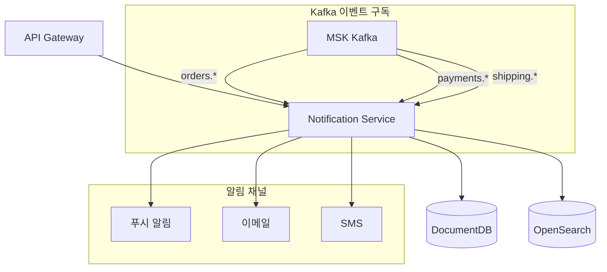
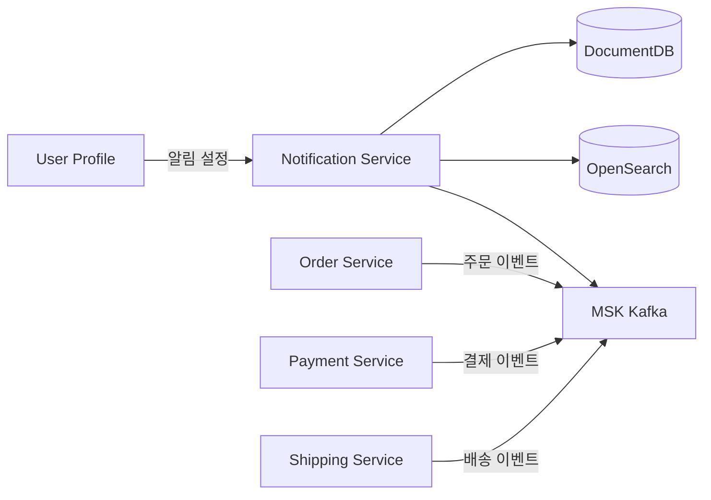

# 알림 서비스 (Notification)

## 개요

알림 서비스는 사용자에게 다양한 채널(푸시, 이메일, SMS)을 통해 알림을 발송합니다. 주문/결제/배송 이벤트를 구독하여 자동으로 알림을 생성하고, OpenSearch를 통해 알림 이력을 검색할 수 있습니다.

| 항목 | 값 |
|------|-----|
| 언어 | Python 3.11 |
| 프레임워크 | FastAPI |
| 데이터베이스 | DocumentDB (MongoDB 호환) |
| 검색 | OpenSearch |
| 네임스페이스 | `mall-services` |
| 포트 | 8000 |
| 헬스체크 | `GET /health` |

## 아키텍처



## API 엔드포인트

### 알림 API

| 메서드 | 경로 | 설명 |
|--------|------|------|
| `GET` | `/api/v1/notifications/{user_id}` | 사용자 알림 목록 |
| `POST` | `/api/v1/notifications/send` | 알림 발송 |

### 요청/응답 예시

#### 사용자 알림 목록

**요청:**
```http
GET /api/v1/notifications/user_001?limit=50
```

**응답:**
```json
{
  "notifications": [
    {
      "id": "notif_001",
      "user_id": "user_001",
      "channel": "PUSH",
      "subject": "주문이 완료되었습니다",
      "message": "주문번호 ORD-2024-001의 주문이 정상적으로 완료되었습니다. 배송 준비 중입니다.",
      "status": "SENT",
      "created_at": "2024-01-15T10:00:00Z",
      "sent_at": "2024-01-15T10:00:05Z",
      "metadata": {
        "order_id": "ORD-2024-001",
        "event_type": "order.completed"
      }
    },
    {
      "id": "notif_002",
      "user_id": "user_001",
      "channel": "EMAIL",
      "subject": "배송이 시작되었습니다",
      "message": "주문하신 상품이 CJ대한통운을 통해 발송되었습니다. 송장번호: 1234567890123",
      "status": "SENT",
      "created_at": "2024-01-15T14:00:00Z",
      "sent_at": "2024-01-15T14:00:03Z",
      "metadata": {
        "order_id": "ORD-2024-001",
        "carrier": "CJ대한통운",
        "tracking_number": "1234567890123"
      }
    },
    {
      "id": "notif_003",
      "user_id": "user_001",
      "channel": "PUSH",
      "subject": "배송이 완료되었습니다",
      "message": "주문하신 상품이 배송 완료되었습니다. 상품 리뷰를 작성해주세요!",
      "status": "SENT",
      "created_at": "2024-01-16T14:00:00Z",
      "sent_at": "2024-01-16T14:00:02Z",
      "metadata": {
        "order_id": "ORD-2024-001",
        "event_type": "shipping.delivered"
      }
    }
  ],
  "total": 3
}
```

#### 알림 발송

**요청:**
```http
POST /api/v1/notifications/send
Content-Type: application/json

{
  "user_id": "user_001",
  "channel": "PUSH",
  "subject": "특별 할인 이벤트",
  "message": "관심 상품이 30% 할인 중입니다! 지금 확인하세요.",
  "metadata": {
    "campaign_id": "PROMO-2024-001",
    "product_id": "prod_001"
  }
}
```

**응답:**
```json
{
  "id": "notif_004",
  "user_id": "user_001",
  "channel": "PUSH",
  "status": "SENT",
  "created_at": "2024-01-15T11:00:00Z"
}
```

## 데이터 모델

### NotificationChannel (Enum)

```python
class NotificationChannel(str, Enum):
    EMAIL = "EMAIL"   # 이메일
    SMS = "SMS"       # 문자 메시지
    PUSH = "PUSH"     # 푸시 알림
```

### NotificationStatus (Enum)

```python
class NotificationStatus(str, Enum):
    PENDING = "PENDING"   # 대기 중
    SENT = "SENT"         # 발송 완료
    FAILED = "FAILED"     # 발송 실패
```

### Notification

```python
class Notification(BaseModel):
    id: str
    user_id: str
    channel: NotificationChannel
    subject: str
    message: str
    status: NotificationStatus = NotificationStatus.PENDING
    created_at: datetime
    sent_at: Optional[datetime] = None
    metadata: Optional[dict] = None
```

### NotificationRequest

```python
class NotificationRequest(BaseModel):
    user_id: str
    channel: NotificationChannel
    subject: str
    message: str
    metadata: Optional[dict] = None
```

### NotificationResponse

```python
class NotificationResponse(BaseModel):
    id: str
    user_id: str
    channel: NotificationChannel
    status: NotificationStatus
    created_at: datetime
```

### NotificationListResponse

```python
class NotificationListResponse(BaseModel):
    notifications: list[Notification]
    total: int
```

## 이벤트 (Kafka)

### 구독 토픽

| 토픽 | 이벤트 | 알림 내용 |
|------|--------|-----------|
| `orders.*` | 주문 이벤트 | 주문 접수/확정/취소 알림 |
| `payments.*` | 결제 이벤트 | 결제 완료/실패/환불 알림 |
| `shipping.*` | 배송 이벤트 | 배송 출발/도착/완료 알림 |

### 이벤트 컨슈머 설정

```python
consumer_configs = [
    ("orders.*", "notification-orders-consumer", handle_order_event),
    ("payments.*", "notification-payments-consumer", handle_payment_event),
    ("shipping.*", "notification-shipping-consumer", handle_shipping_event),
]
```

### 이벤트별 알림 템플릿

| 이벤트 | 제목 | 메시지 |
|--------|------|--------|
| `order.created` | 주문이 접수되었습니다 | 주문번호 {order_id}가 접수되었습니다. |
| `order.confirmed` | 주문이 확정되었습니다 | 주문번호 {order_id}가 확정되어 배송 준비 중입니다. |
| `payment.completed` | 결제가 완료되었습니다 | {amount}원 결제가 완료되었습니다. |
| `payment.failed` | 결제에 실패했습니다 | 결제 처리 중 문제가 발생했습니다. 다시 시도해주세요. |
| `shipping.picked_up` | 상품이 발송되었습니다 | {carrier}를 통해 상품이 발송되었습니다. 송장번호: {tracking} |
| `shipping.out_for_delivery` | 배송이 시작되었습니다 | 오늘 중 상품이 도착할 예정입니다. |
| `shipping.delivered` | 배송이 완료되었습니다 | 상품이 배송 완료되었습니다. 리뷰를 작성해주세요! |

## 환경 변수

| 변수명 | 설명 | 기본값 |
|--------|------|--------|
| `SERVICE_NAME` | 서비스 이름 | `notification` |
| `PORT` | 서비스 포트 | `8080` |
| `AWS_REGION` | AWS 리전 | `us-east-1` |
| `REGION_ROLE` | 리전 역할 (PRIMARY/SECONDARY) | `PRIMARY` |
| `DB_HOST` | DocumentDB 호스트 | `localhost` |
| `DB_PORT` | DocumentDB 포트 | `27017` |
| `DB_USER` | 데이터베이스 사용자 | `mall` |
| `DB_PASSWORD` | 데이터베이스 비밀번호 | - |
| `DOCUMENTDB_HOST` | DocumentDB 호스트 | `localhost` |
| `DOCUMENTDB_PORT` | DocumentDB 포트 | `27017` |
| `KAFKA_BROKERS` | Kafka 브로커 주소 | `localhost:9092` |
| `OPENSEARCH_ENDPOINT` | OpenSearch 엔드포인트 | `http://localhost:9200` |
| `LOG_LEVEL` | 로그 레벨 | `info` |

## 서비스 의존성



### 의존하는 서비스
- **DocumentDB**: 알림 데이터 저장
- **OpenSearch**: 알림 이력 검색
- **MSK Kafka**: 이벤트 구독
- **User Profile Service**: 사용자 알림 선호도 조회

### 의존받는 서비스
- **API Gateway**: 사용자 알림 센터 표시

## 기능 상세

### 알림 채널별 특성

| 채널 | 용도 | 특성 |
|------|------|------|
| **PUSH** | 즉시 알림 | 앱 설치 필수, 실시간성 높음 |
| **EMAIL** | 상세 정보 | 주문 확인서, 영수증 첨부 가능 |
| **SMS** | 중요 알림 | 배송 완료, 인증번호 등 |

### 알림 우선순위

1. **긴급 (Urgent)**: 결제 실패, 주문 취소 - 모든 채널 동시 발송
2. **높음 (High)**: 배송 시작/완료 - PUSH + EMAIL
3. **보통 (Normal)**: 주문 확정 - PUSH 또는 EMAIL
4. **낮음 (Low)**: 프로모션 - 사용자 설정에 따름

### 사용자 알림 설정 연동

User Profile 서비스의 `preferences` 필드 참조:
```json
{
  "notification_email": true,
  "notification_push": true,
  "notification_sms": false
}
```

### 재시도 정책

- 발송 실패 시 최대 3회 재시도
- 지수 백오프: 1분 -> 5분 -> 30분
- 3회 실패 후 FAILED 상태로 변경
