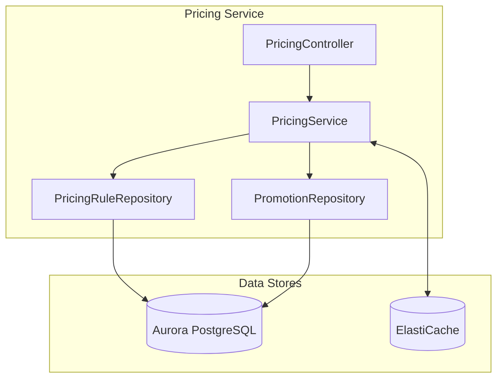
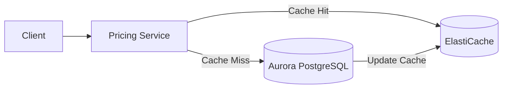
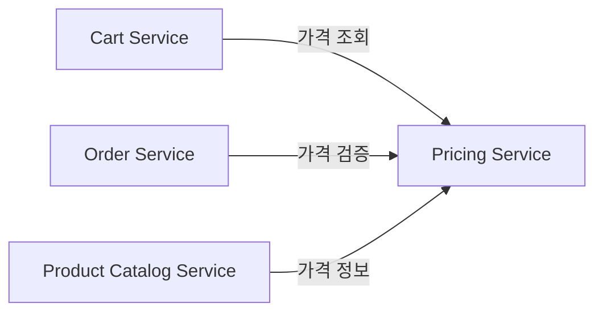
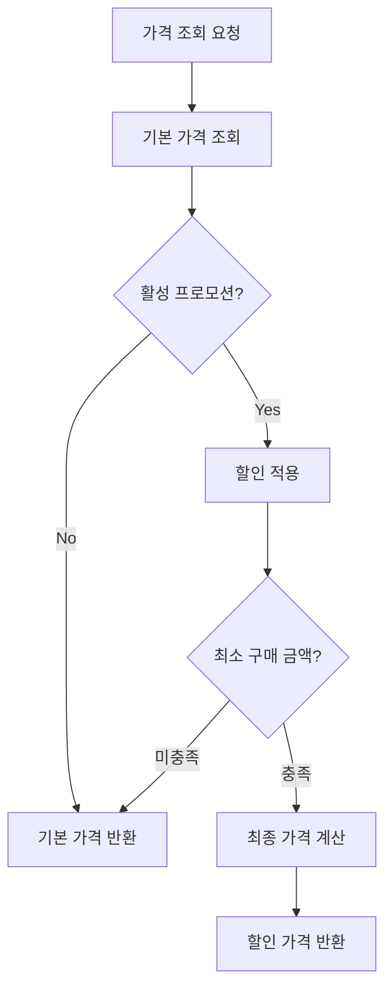

# 가격 서비스 (Pricing Service)

## 개요

가격 서비스는 동적 가격 책정, 프로모션, 플래시 세일을 관리합니다. ElastiCache를 활용하여 자주 조회되는 가격 데이터를 캐싱하여 빠른 응답 속도를 제공합니다.

| 항목 | 내용 |
|------|------|
| 언어 | Java 17 |
| 프레임워크 | Spring Boot 3.2 |
| 데이터베이스 | Aurora PostgreSQL (Global Database) |
| 캐시 | ElastiCache (Valkey/Redis) |
| 네임스페이스 | `mall-pricing` |
| 포트 | 8080 |
| 헬스체크 | `/actuator/health` |

## 아키텍처



## API 엔드포인트

| 메서드 | 경로 | 설명 |
|--------|------|------|
| `GET` | `/api/v1/pricing/{sku}` | SKU별 가격 조회 |
| `POST` | `/api/v1/pricing/calculate` | 장바구니 가격 계산 |
| `GET` | `/api/v1/promotions` | 활성 프로모션 목록 조회 |
| `POST` | `/api/v1/promotions` | 프로모션 생성 |

### SKU별 가격 조회

**GET** `/api/v1/pricing/{sku}`

응답 (200 OK):
```json
{
  "id": "550e8400-e29b-41d4-a716-446655440000",
  "sku": "SKU-ELECTRONICS-001",
  "basePrice": 299000.00,
  "finalPrice": 269100.00,
  "currency": "KRW",
  "discountApplied": 29900.00
}
```

### 장바구니 가격 계산

**POST** `/api/v1/pricing/calculate`

요청:
```json
{
  "items": [
    {
      "sku": "SKU-ELECTRONICS-001",
      "quantity": 2
    },
    {
      "sku": "SKU-FASHION-001",
      "quantity": 1
    }
  ]
}
```

응답 (200 OK):
```json
{
  "items": [
    {
      "id": "550e8400-e29b-41d4-a716-446655440000",
      "sku": "SKU-ELECTRONICS-001",
      "basePrice": 299000.00,
      "finalPrice": 269100.00,
      "currency": "KRW",
      "discountApplied": 29900.00
    },
    {
      "id": "550e8400-e29b-41d4-a716-446655440001",
      "sku": "SKU-FASHION-001",
      "basePrice": 89000.00,
      "finalPrice": 89000.00,
      "currency": "KRW",
      "discountApplied": 0.00
    }
  ],
  "subtotal": 687000.00,
  "totalDiscount": 59800.00,
  "total": 627200.00,
  "currency": "KRW"
}
```

### 활성 프로모션 목록 조회

**GET** `/api/v1/promotions`

응답 (200 OK):
```json
[
  {
    "id": "660e8400-e29b-41d4-a716-446655440000",
    "name": "설날 특별 할인",
    "discountType": "PERCENTAGE",
    "discountValue": 10.00,
    "minPurchase": 50000.00,
    "startDate": "2024-02-01T00:00:00",
    "endDate": "2024-02-15T23:59:59",
    "active": true,
    "createdAt": "2024-01-15T10:00:00"
  },
  {
    "id": "660e8400-e29b-41d4-a716-446655440001",
    "name": "신규 가입 쿠폰",
    "discountType": "FIXED",
    "discountValue": 5000.00,
    "minPurchase": 30000.00,
    "startDate": "2024-01-01T00:00:00",
    "endDate": "2024-12-31T23:59:59",
    "active": true,
    "createdAt": "2024-01-01T00:00:00"
  }
]
```

### 프로모션 생성

**POST** `/api/v1/promotions`

요청:
```json
{
  "name": "봄맞이 특별 할인",
  "discountType": "PERCENTAGE",
  "discountValue": 15.00,
  "minPurchase": 100000.00,
  "startDate": "2024-03-01T00:00:00",
  "endDate": "2024-03-31T23:59:59",
  "active": true
}
```

응답 (201 Created):
```json
{
  "id": "660e8400-e29b-41d4-a716-446655440002",
  "name": "봄맞이 특별 할인",
  "discountType": "PERCENTAGE",
  "discountValue": 15.00,
  "minPurchase": 100000.00,
  "startDate": "2024-03-01T00:00:00",
  "endDate": "2024-03-31T23:59:59",
  "active": true,
  "createdAt": "2024-02-15T10:00:00"
}
```

## 데이터 모델

### PricingRule 엔티티

```java
@Entity
@Table(name = "pricing_rules")
public class PricingRule {
    @Id
    @GeneratedValue(strategy = GenerationType.UUID)
    private UUID id;

    @Column(unique = true, nullable = false)
    private String sku;

    @Column(name = "base_price", nullable = false, precision = 12, scale = 2)
    private BigDecimal basePrice;

    @Column(length = 3)
    private String currency = "KRW";

    private Boolean active = true;

    @Column(name = "created_at")
    private LocalDateTime createdAt;

    @Column(name = "updated_at")
    private LocalDateTime updatedAt;
}
```

### Promotion 엔티티

```java
@Entity
@Table(name = "promotions")
public class Promotion {
    public enum DiscountType {
        PERCENTAGE,  // 정률 할인
        FIXED        // 정액 할인
    }

    @Id
    @GeneratedValue(strategy = GenerationType.UUID)
    private UUID id;

    @Column(nullable = false)
    private String name;

    @Column(name = "discount_type", nullable = false)
    @Enumerated(EnumType.STRING)
    private DiscountType discountType;

    @Column(name = "discount_value", nullable = false, precision = 12, scale = 2)
    private BigDecimal discountValue;

    @Column(name = "min_purchase", precision = 12, scale = 2)
    private BigDecimal minPurchase = BigDecimal.ZERO;

    @Column(name = "start_date", nullable = false)
    private LocalDateTime startDate;

    @Column(name = "end_date", nullable = false)
    private LocalDateTime endDate;

    private Boolean active = true;

    @Column(name = "created_at")
    private LocalDateTime createdAt;

    // 현재 활성 상태 확인 메서드
    public boolean isCurrentlyActive() {
        LocalDateTime now = LocalDateTime.now();
        return active && now.isAfter(startDate) && now.isBefore(endDate);
    }
}
```

### 할인 타입

| 타입 | 설명 | 예시 |
|------|------|------|
| `PERCENTAGE` | 정률 할인 | 10% 할인 |
| `FIXED` | 정액 할인 | 5,000원 할인 |

### 데이터베이스 스키마

```sql
CREATE TABLE pricing_rules (
    id UUID PRIMARY KEY DEFAULT gen_random_uuid(),
    sku VARCHAR(255) UNIQUE NOT NULL,
    base_price DECIMAL(12, 2) NOT NULL,
    currency VARCHAR(3) DEFAULT 'KRW',
    active BOOLEAN DEFAULT true,
    created_at TIMESTAMP DEFAULT CURRENT_TIMESTAMP,
    updated_at TIMESTAMP DEFAULT CURRENT_TIMESTAMP
);

CREATE TABLE promotions (
    id UUID PRIMARY KEY DEFAULT gen_random_uuid(),
    name VARCHAR(255) NOT NULL,
    discount_type VARCHAR(50) NOT NULL,
    discount_value DECIMAL(12, 2) NOT NULL,
    min_purchase DECIMAL(12, 2) DEFAULT 0,
    start_date TIMESTAMP NOT NULL,
    end_date TIMESTAMP NOT NULL,
    active BOOLEAN DEFAULT true,
    created_at TIMESTAMP DEFAULT CURRENT_TIMESTAMP
);

CREATE UNIQUE INDEX idx_pricing_rules_sku ON pricing_rules(sku);
CREATE INDEX idx_promotions_active ON promotions(active);
CREATE INDEX idx_promotions_dates ON promotions(start_date, end_date);
```

## 캐싱 전략

### ElastiCache 활용



### 캐시 키 패턴

| 키 패턴 | 설명 | TTL |
|---------|------|-----|
| `pricing:sku:{sku}` | SKU별 가격 정보 | 5분 |
| `promotions:active` | 활성 프로모션 목록 | 1분 |
| `pricing:calculated:{hash}` | 장바구니 계산 결과 | 30초 |

### 캐시 무효화

- 가격 규칙 변경 시 해당 SKU 캐시 삭제
- 프로모션 생성/수정 시 프로모션 캐시 삭제
- 프로모션 시작/종료 시 자동 캐시 갱신

## 환경 변수

| 변수명 | 설명 | 기본값 |
|--------|------|--------|
| `SPRING_DATASOURCE_URL` | Aurora PostgreSQL 연결 URL | - |
| `SPRING_DATASOURCE_USERNAME` | DB 사용자명 | - |
| `SPRING_DATASOURCE_PASSWORD` | DB 비밀번호 | - |
| `SPRING_REDIS_HOST` | ElastiCache 호스트 | - |
| `SPRING_REDIS_PORT` | ElastiCache 포트 | 6379 |
| `CACHE_TTL_SECONDS` | 기본 캐시 TTL | 300 |
| `SERVER_PORT` | 서비스 포트 | 8080 |

## 서비스 의존성



### 가격 계산 로직



### 에러 처리

| HTTP 상태 코드 | 에러 | 설명 |
|----------------|------|------|
| 404 | PricingRuleNotFoundException | SKU에 대한 가격 정보 없음 |
| 400 | InvalidPromotionException | 유효하지 않은 프로모션 설정 |
| 400 | PromotionExpiredException | 만료된 프로모션 |
