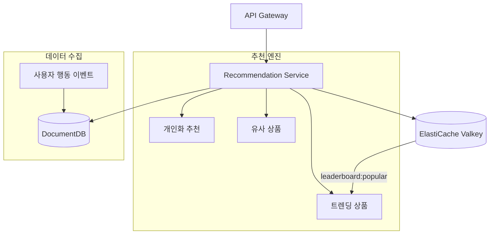
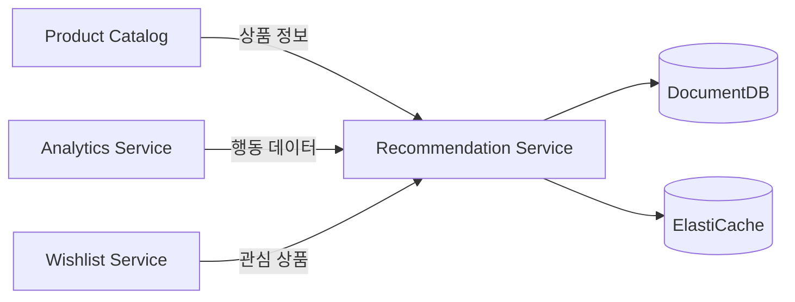

# 추천 서비스 (Recommendation)

## 개요

추천 서비스는 사용자 행동 데이터를 기반으로 개인화된 상품 추천을 제공합니다. DocumentDB에 사용자 활동을 저장하고, ElastiCache(Valkey)를 통해 추천 결과를 캐싱하여 빠른 응답 속도를 보장합니다.

| 항목 | 값 |
|------|-----|
| 언어 | Python 3.11 |
| 프레임워크 | FastAPI |
| 데이터베이스 | DocumentDB (MongoDB 호환) |
| 캐시 | ElastiCache (Valkey) |
| 네임스페이스 | `mall-services` |
| 포트 | 8000 |
| 헬스체크 | `GET /health` |

## 아키텍처



## API 엔드포인트

### 추천 API

| 메서드 | 경로 | 설명 |
|--------|------|------|
| `GET` | `/api/v1/recommendations/{user_id}` | 개인화 추천 |
| `GET` | `/api/v1/recommendations/trending` | 트렌딩 상품 |
| `GET` | `/api/v1/recommendations/similar/{product_id}` | 유사 상품 추천 |

### 요청/응답 예시

#### 개인화 추천

**요청:**
```http
GET /api/v1/recommendations/user_001?limit=10
```

**응답:**
```json
{
  "user_id": "user_001",
  "recommendations": [
    {
      "product_id": "prod_101",
      "score": 0.95,
      "reason": "Based on your browsing history",
      "category": "electronics"
    },
    {
      "product_id": "prod_205",
      "score": 0.87,
      "reason": "Based on your browsing history",
      "category": "fashion"
    },
    {
      "product_id": "prod_089",
      "score": 0.82,
      "reason": "Based on your browsing history",
      "category": "electronics"
    }
  ],
  "generated_at": "2024-01-15T10:00:00Z"
}
```

#### 트렌딩 상품

**요청:**
```http
GET /api/v1/recommendations/trending
```

**응답:**
```json
{
  "products": [
    {
      "product_id": "prod_001",
      "name": "삼성 갤럭시 S24",
      "category": "electronics",
      "score": 0.98,
      "view_count": 15420,
      "purchase_count": 2341
    },
    {
      "product_id": "prod_042",
      "name": "나이키 에어맥스",
      "category": "fashion",
      "score": 0.94,
      "view_count": 12890,
      "purchase_count": 1876
    },
    {
      "product_id": "prod_078",
      "name": "애플 에어팟 프로",
      "category": "electronics",
      "score": 0.91,
      "view_count": 11200,
      "purchase_count": 1543
    }
  ],
  "generated_at": "2024-01-15T10:00:00Z"
}
```

#### 유사 상품 추천

**요청:**
```http
GET /api/v1/recommendations/similar/prod_001?limit=10
```

**응답:**
```json
{
  "product_id": "prod_001",
  "similar": [
    {
      "product_id": "prod_002",
      "score": 0.89,
      "reason": "Users who viewed this also viewed",
      "category": "electronics"
    },
    {
      "product_id": "prod_015",
      "score": 0.76,
      "reason": "Users who viewed this also viewed",
      "category": "electronics"
    },
    {
      "product_id": "prod_023",
      "score": 0.71,
      "reason": "Users who viewed this also viewed",
      "category": "accessories"
    }
  ],
  "generated_at": "2024-01-15T10:00:00Z"
}
```

## 데이터 모델

### Recommendation

```python
class Recommendation(BaseModel):
    product_id: str
    score: float = Field(ge=0.0, le=1.0)  # 0.0 ~ 1.0
    reason: str  # 추천 이유
    category: Optional[str] = None
```

### UserActivity

```python
class UserActivity(BaseModel):
    user_id: str
    product_id: str
    action: str  # view, click, purchase, add_to_cart
    timestamp: datetime
    metadata: Optional[dict] = None
```

### TrendingProduct

```python
class TrendingProduct(BaseModel):
    product_id: str
    name: str
    category: str
    score: float
    view_count: int
    purchase_count: int
```

### RecommendationResponse

```python
class RecommendationResponse(BaseModel):
    user_id: str
    recommendations: list[Recommendation]
    generated_at: datetime
```

### TrendingResponse

```python
class TrendingResponse(BaseModel):
    products: list[TrendingProduct]
    generated_at: datetime
```

### SimilarProductsResponse

```python
class SimilarProductsResponse(BaseModel):
    product_id: str
    similar: list[Recommendation]
    generated_at: datetime
```

## 추천 알고리즘

### 행동 가중치

| 행동 | 가중치 | 설명 |
|------|--------|------|
| `purchase` | 1.0 | 구매 완료 |
| `add_to_cart` | 0.7 | 장바구니 담기 |
| `click` | 0.3 | 상품 클릭 |
| `view` | 0.1 | 상품 조회 |

### 개인화 추천 로직

```python
def _generate_recommendations(activities: list[dict], limit: int) -> list[Recommendation]:
    product_scores: dict[str, float] = {}
    action_weights = {
        "purchase": 1.0,
        "add_to_cart": 0.7,
        "click": 0.3,
        "view": 0.1
    }

    for activity in activities:
        product_id = activity.get("product_id")
        action = activity.get("action", "view")
        weight = action_weights.get(action, 0.1)
        product_scores[product_id] = product_scores.get(product_id, 0) + weight

    sorted_products = sorted(product_scores.items(), key=lambda x: x[1], reverse=True)[:limit]

    return [
        Recommendation(
            product_id=pid,
            score=min(score / 10.0, 1.0),
            reason="Based on your browsing history"
        )
        for pid, score in sorted_products
    ]
```

## 캐싱 전략

### ElastiCache (Valkey) 키 구조

| 키 패턴 | 설명 | TTL |
|---------|------|-----|
| `recommendations:{user_id}` | 개인화 추천 결과 | 1시간 |
| `recommendations:trending` | 트렌딩 상품 목록 | 1시간 |
| `recommendations:similar:{product_id}` | 유사 상품 목록 | 1시간 |
| `leaderboard:popular` | 인기 상품 정렬 집합 | 실시간 |

### 캐시 로직

```python
CACHE_TTL_SECONDS = 3600  # 1시간

async def get_personalized_recommendations(user_id: str, limit: int = 10):
    cache_key = f"recommendations:{user_id}"

    # 캐시 확인
    cached = await valkey.get_json(cache_key)
    if cached:
        return RecommendationResponse(**cached)

    # 추천 생성
    activities = await repo.get_user_activities(user_id)
    recommendations = _generate_recommendations(activities, limit)

    response = RecommendationResponse(
        user_id=user_id,
        recommendations=recommendations,
        generated_at=datetime.utcnow()
    )

    # 캐시 저장
    await valkey.set_json(cache_key, response.model_dump(mode="json"), CACHE_TTL_SECONDS)

    return response
```

## 환경 변수

| 변수명 | 설명 | 기본값 |
|--------|------|--------|
| `SERVICE_NAME` | 서비스 이름 | `recommendation` |
| `PORT` | 서비스 포트 | `8080` |
| `AWS_REGION` | AWS 리전 | `us-east-1` |
| `REGION_ROLE` | 리전 역할 (PRIMARY/SECONDARY) | `PRIMARY` |
| `DB_HOST` | DocumentDB 호스트 | `localhost` |
| `DB_PORT` | DocumentDB 포트 | `27017` |
| `DB_NAME` | 데이터베이스 이름 | `recommendations` |
| `DB_USER` | 데이터베이스 사용자 | `mall` |
| `DB_PASSWORD` | 데이터베이스 비밀번호 | - |
| `DOCUMENTDB_HOST` | DocumentDB 호스트 | `localhost` |
| `DOCUMENTDB_PORT` | DocumentDB 포트 | `27017` |
| `CACHE_HOST` | ElastiCache 호스트 | `localhost` |
| `CACHE_PORT` | ElastiCache 포트 | `6379` |
| `KAFKA_BROKERS` | Kafka 브로커 주소 | `localhost:9092` |
| `LOG_LEVEL` | 로그 레벨 | `info` |

## 서비스 의존성



### 의존하는 서비스
- **DocumentDB**: 사용자 활동 데이터 저장
- **ElastiCache (Valkey)**: 추천 결과 캐싱, 인기 상품 리더보드
- **Product Catalog**: 상품 메타데이터 조회

### 의존받는 서비스
- **API Gateway**: 홈/상품 페이지에서 추천 표시
- **Search Service**: 검색 결과에 개인화 적용

## 기능 상세

### 트렌딩 상품 계산
- 최근 24시간 조회수/구매수 기준
- ElastiCache Sorted Set으로 실시간 순위 관리
- 키: `leaderboard:popular`

### 유사 상품 추천
- "이 상품을 본 사람들이 함께 본 상품" 기반
- 협업 필터링 알고리즘 적용
- 동일 카테고리 상품 우선

### 다양성 보장
- 같은 카테고리 상품이 연속 3개 이상 나오지 않도록 조정
- 이미 구매한 상품은 제외
