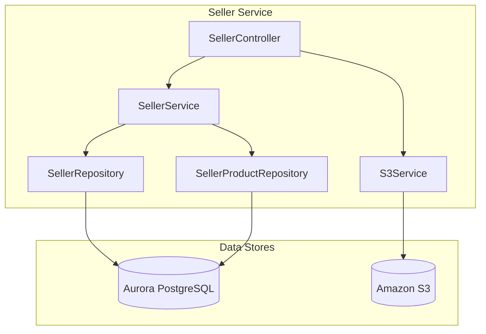
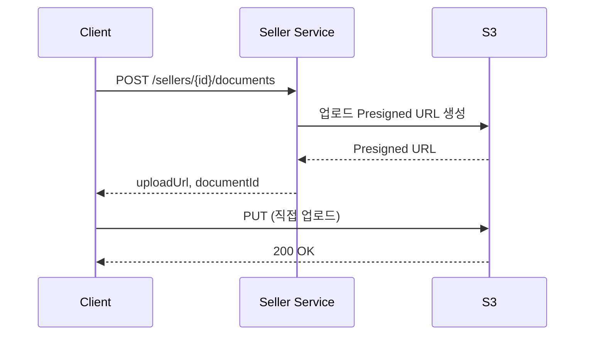
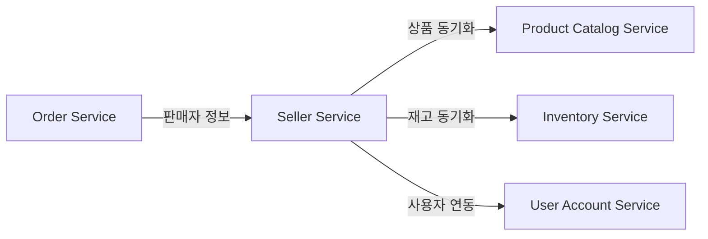
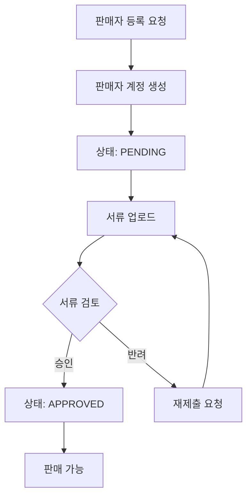
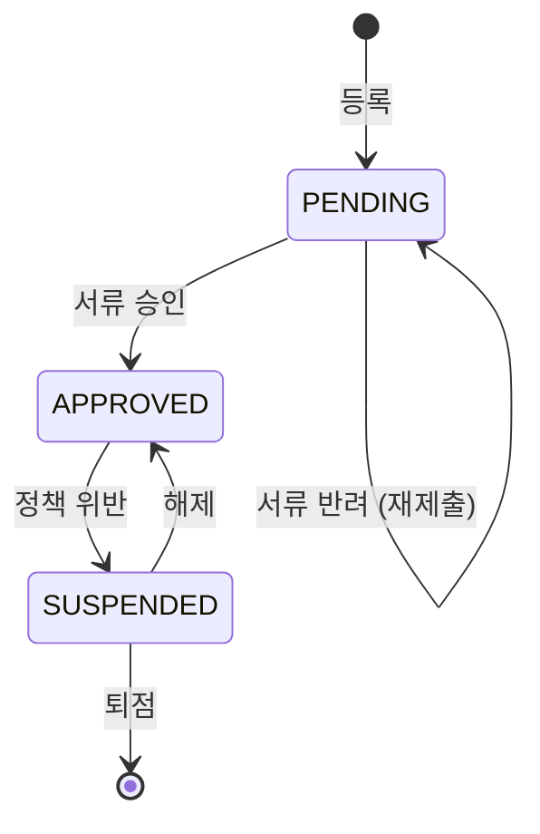

# 판매자 서비스 (Seller Service)

## 개요

판매자 서비스는 판매자 등록, 스토어 관리, 상품 등록, 사업자 서류 검증을 담당합니다. S3를 활용한 서류 업로드 기능을 제공합니다.

| 항목 | 내용 |
|------|------|
| 언어 | Java 17 |
| 프레임워크 | Spring Boot 3.2 |
| 데이터베이스 | Aurora PostgreSQL (Global Database) |
| 파일 저장소 | Amazon S3 |
| 네임스페이스 | `mall-seller` |
| 포트 | 8080 |
| 헬스체크 | `/actuator/health` |

## 아키텍처



## API 엔드포인트

| 메서드 | 경로 | 설명 |
|--------|------|------|
| `POST` | `/api/v1/sellers/register` | 판매자 등록 |
| `GET` | `/api/v1/sellers/{id}` | 판매자 조회 |
| `GET` | `/api/v1/sellers` | 판매자 목록 조회 |
| `POST` | `/api/v1/sellers/{id}/products` | 상품 등록 |
| `GET` | `/api/v1/sellers/{id}/products` | 판매자 상품 목록 조회 |
| `POST` | `/api/v1/sellers/{id}/documents` | 서류 업로드 URL 생성 |

### 판매자 등록

**POST** `/api/v1/sellers/register`

요청:
```json
{
  "businessName": "서울마트",
  "email": "seller@seoulmart.com",
  "phone": "02-1234-5678"
}
```

응답 (201 Created):
```json
{
  "id": "550e8400-e29b-41d4-a716-446655440000",
  "businessName": "서울마트",
  "email": "seller@seoulmart.com",
  "phone": "02-1234-5678",
  "status": "PENDING",
  "createdAt": "2024-01-15T10:00:00"
}
```

### 판매자 조회

**GET** `/api/v1/sellers/{id}`

응답 (200 OK):
```json
{
  "id": "550e8400-e29b-41d4-a716-446655440000",
  "businessName": "서울마트",
  "email": "seller@seoulmart.com",
  "phone": "02-1234-5678",
  "status": "APPROVED",
  "createdAt": "2024-01-15T10:00:00"
}
```

### 판매자 목록 조회

**GET** `/api/v1/sellers`

응답 (200 OK):
```json
[
  {
    "id": "550e8400-e29b-41d4-a716-446655440000",
    "businessName": "서울마트",
    "email": "seller@seoulmart.com",
    "phone": "02-1234-5678",
    "status": "APPROVED",
    "createdAt": "2024-01-15T10:00:00"
  },
  {
    "id": "550e8400-e29b-41d4-a716-446655440001",
    "businessName": "부산상회",
    "email": "seller@busanshop.com",
    "phone": "051-9876-5432",
    "status": "PENDING",
    "createdAt": "2024-01-16T14:00:00"
  }
]
```

### 상품 등록

**POST** `/api/v1/sellers/{id}/products`

요청:
```json
{
  "productId": "prod-001",
  "sku": "SKU-SEOUL-ELECTRONICS-001",
  "price": 299000.00,
  "stock": 100
}
```

응답 (201 Created):
```json
{
  "id": "660e8400-e29b-41d4-a716-446655440000",
  "sellerId": "550e8400-e29b-41d4-a716-446655440000",
  "productId": "prod-001",
  "sku": "SKU-SEOUL-ELECTRONICS-001",
  "price": 299000.00,
  "stock": 100,
  "active": true,
  "createdAt": "2024-01-15T11:00:00"
}
```

### 판매자 상품 목록 조회

**GET** `/api/v1/sellers/{id}/products`

응답 (200 OK):
```json
[
  {
    "id": "660e8400-e29b-41d4-a716-446655440000",
    "sellerId": "550e8400-e29b-41d4-a716-446655440000",
    "productId": "prod-001",
    "sku": "SKU-SEOUL-ELECTRONICS-001",
    "price": 299000.00,
    "stock": 100,
    "active": true,
    "createdAt": "2024-01-15T11:00:00"
  },
  {
    "id": "660e8400-e29b-41d4-a716-446655440001",
    "sellerId": "550e8400-e29b-41d4-a716-446655440000",
    "productId": "prod-002",
    "sku": "SKU-SEOUL-FASHION-001",
    "price": 89000.00,
    "stock": 50,
    "active": true,
    "createdAt": "2024-01-15T11:30:00"
  }
]
```

### 서류 업로드 URL 생성

**POST** `/api/v1/sellers/{id}/documents`

요청:
```json
{
  "fileName": "business_license.pdf",
  "contentType": "application/pdf",
  "documentType": "BUSINESS_LICENSE"
}
```

지원 서류 타입:
- `BUSINESS_LICENSE` - 사업자등록증
- `BANK_ACCOUNT` - 통장 사본
- `ID_CARD` - 대표자 신분증

응답 (200 OK):
```json
{
  "documentId": "doc-550e8400-e29b-41d4-a716-446655440000",
  "uploadUrl": "https://s3.amazonaws.com/bucket/sellers/550e8400/documents/doc-550e8400?X-Amz-Algorithm=...",
  "key": "sellers/550e8400/documents/doc-550e8400/business_license.pdf",
  "expiresAt": "2024-01-15T11:15:00"
}
```

## 데이터 모델

### Seller 엔티티

```java
@Entity
@Table(name = "sellers")
public class Seller {
    public enum Status {
        PENDING,    // 승인 대기
        APPROVED,   // 승인됨
        SUSPENDED   // 정지됨
    }

    @Id
    @GeneratedValue(strategy = GenerationType.UUID)
    private UUID id;

    @Column(name = "business_name", nullable = false)
    private String businessName;

    @Column(unique = true, nullable = false)
    private String email;

    @Column(length = 50)
    private String phone;

    @Enumerated(EnumType.STRING)
    @Column(length = 50)
    private Status status = Status.PENDING;

    @Column(name = "created_at")
    private LocalDateTime createdAt;

    @Column(name = "updated_at")
    private LocalDateTime updatedAt;
}
```

### SellerProduct 엔티티

```java
@Entity
@Table(name = "seller_products")
public class SellerProduct {
    @Id
    @GeneratedValue(strategy = GenerationType.UUID)
    private UUID id;

    @ManyToOne(fetch = FetchType.LAZY)
    @JoinColumn(name = "seller_id")
    private Seller seller;

    @Column(name = "product_id")
    private String productId;

    @Column(nullable = false)
    private String sku;

    @Column(nullable = false, precision = 12, scale = 2)
    private BigDecimal price;

    @Column(columnDefinition = "INTEGER DEFAULT 0")
    private Integer stock = 0;

    @Column(columnDefinition = "BOOLEAN DEFAULT true")
    private Boolean active = true;

    @Column(name = "created_at")
    private LocalDateTime createdAt;
}
```

### 판매자 상태

| 상태 | 설명 |
|------|------|
| `PENDING` | 승인 대기 - 서류 검토 중 |
| `APPROVED` | 승인됨 - 판매 가능 |
| `SUSPENDED` | 정지됨 - 판매 일시 중단 |

### 데이터베이스 스키마

```sql
CREATE TABLE sellers (
    id UUID PRIMARY KEY DEFAULT gen_random_uuid(),
    business_name VARCHAR(255) NOT NULL,
    email VARCHAR(255) UNIQUE NOT NULL,
    phone VARCHAR(50),
    status VARCHAR(50) DEFAULT 'PENDING',
    created_at TIMESTAMP DEFAULT CURRENT_TIMESTAMP,
    updated_at TIMESTAMP DEFAULT CURRENT_TIMESTAMP
);

CREATE TABLE seller_products (
    id UUID PRIMARY KEY DEFAULT gen_random_uuid(),
    seller_id UUID REFERENCES sellers(id),
    product_id VARCHAR(255),
    sku VARCHAR(255) NOT NULL,
    price DECIMAL(12, 2) NOT NULL,
    stock INTEGER DEFAULT 0,
    active BOOLEAN DEFAULT true,
    created_at TIMESTAMP DEFAULT CURRENT_TIMESTAMP
);

CREATE UNIQUE INDEX idx_sellers_email ON sellers(email);
CREATE INDEX idx_sellers_status ON sellers(status);
CREATE INDEX idx_seller_products_seller_id ON seller_products(seller_id);
CREATE INDEX idx_seller_products_sku ON seller_products(sku);
```

## S3 서류 업로드

### Presigned URL 흐름



### S3 버킷 구조

```
s3://mall-seller-documents/
├── sellers/
│   ├── {seller-id}/
│   │   ├── documents/
│   │   │   ├── {document-id}/
│   │   │   │   ├── business_license.pdf
│   │   │   │   ├── bank_account.pdf
│   │   │   │   └── id_card.jpg
```

## 환경 변수

| 변수명 | 설명 | 기본값 |
|--------|------|--------|
| `SPRING_DATASOURCE_URL` | Aurora PostgreSQL 연결 URL | - |
| `SPRING_DATASOURCE_USERNAME` | DB 사용자명 | - |
| `SPRING_DATASOURCE_PASSWORD` | DB 비밀번호 | - |
| `AWS_S3_BUCKET` | S3 버킷명 | - |
| `AWS_S3_REGION` | S3 리전 | - |
| `AWS_ACCESS_KEY_ID` | AWS 액세스 키 | - |
| `AWS_SECRET_ACCESS_KEY` | AWS 시크릿 키 | - |
| `PRESIGNED_URL_EXPIRATION` | Presigned URL 만료 시간 (분) | 15 |
| `SERVER_PORT` | 서비스 포트 | 8080 |

## 서비스 의존성



### 판매자 등록 프로세스



### 판매자 상태 흐름



### 에러 처리

| HTTP 상태 코드 | 에러 | 설명 |
|----------------|------|------|
| 404 | SellerNotFoundException | 판매자를 찾을 수 없음 |
| 409 | DuplicateEmailException | 이미 등록된 이메일 |
| 400 | InvalidDocumentException | 유효하지 않은 서류 형식 |
| 403 | SellerNotApprovedException | 미승인 판매자의 상품 등록 시도 |
