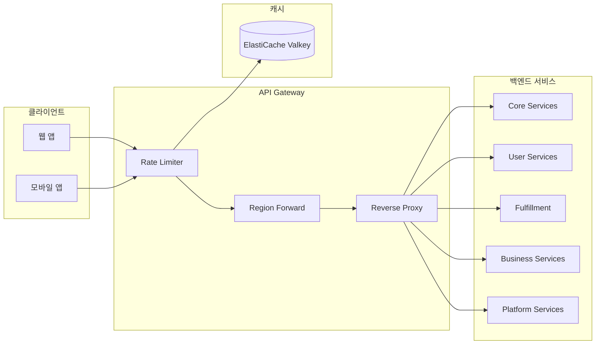
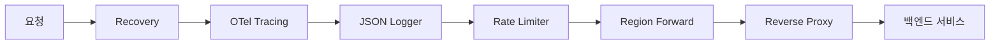

# API Gateway

## 개요

API Gateway는 모든 클라이언트 요청의 단일 진입점으로, 19개의 백엔드 마이크로서비스로 요청을 라우팅하는 리버스 프록시 역할을 수행합니다.

| 항목 | 내용 |
|------|------|
| 언어 | Go 1.21+ |
| 프레임워크 | Gin |
| 데이터베이스 | ElastiCache (Valkey) - Rate Limiting |
| 네임스페이스 | core-services |
| 포트 | 8080 |
| 헬스체크 | `/healthz`, `/readyz` |

## 아키텍처



## 주요 기능

### 1. 리버스 프록시
- 경로 prefix 기반 서비스 라우팅
- 자동 서비스 디스커버리 (Kubernetes DNS)
- 업스트림 에러 핸들링

### 2. Rate Limiting
- Token Bucket 알고리즘 구현
- API Key 또는 Client IP 기반 제한
- ElastiCache Valkey를 통한 분산 카운터

### 3. 리전 포워딩
- Secondary 리전에서 쓰기 요청 감지
- Primary 리전으로 자동 포워딩
- `X-Forwarded-Region` 헤더 전파

## API 엔드포인트

### 프록시 라우팅

| 메서드 | 경로 | 설명 | 백엔드 서비스 |
|--------|------|------|---------------|
| ANY | `/api/v1/products/*` | 상품 카탈로그 | product-catalog.core-services |
| ANY | `/api/v1/search/*` | 검색 | search.core-services |
| ANY | `/api/v1/cart/*` | 장바구니 | cart.core-services |
| ANY | `/api/v1/orders/*` | 주문 | order.core-services |
| ANY | `/api/v1/payments/*` | 결제 | payment.core-services |
| ANY | `/api/v1/inventory/*` | 재고 | inventory.core-services |
| ANY | `/api/v1/auth/*` | 인증 | user-account.user-services |
| ANY | `/api/v1/profiles/*` | 프로필 | user-profile.user-services |
| ANY | `/api/v1/wishlists/*` | 위시리스트 | wishlist.user-services |
| ANY | `/api/v1/reviews/*` | 리뷰 | review.user-services |
| ANY | `/api/v1/shipments/*` | 배송 | shipping.fulfillment |
| ANY | `/api/v1/warehouses/*` | 창고 | warehouse.fulfillment |
| ANY | `/api/v1/returns/*` | 반품 | returns.fulfillment |
| ANY | `/api/v1/pricing/*` | 가격 | pricing.business-services |
| ANY | `/api/v1/recommendations/*` | 추천 | recommendation.business-services |
| ANY | `/api/v1/notifications/*` | 알림 | notification.business-services |
| ANY | `/api/v1/sellers/*` | 판매자 | seller.business-services |
| ANY | `/api/v1/events/*` | 이벤트 버스 | event-bus.platform |
| ANY | `/api/v1/analytics/*` | 분석 | analytics.platform |

### Rate Limit 응답 헤더

```http
X-RateLimit-Limit: 6000
X-RateLimit-Remaining: 5999
Retry-After: 60
```

### Rate Limit 초과 응답

```json
{
  "error": "rate limit exceeded",
  "limit": 6000,
  "window": 60,
  "retryIn": 60
}
```

## 데이터 모델

### Route Map

```go
// GetRouteMap returns the mapping of API path prefixes to backend services
func GetRouteMap() map[string]string {
    return map[string]string{
        // Core Services
        "/api/v1/products":  "product-catalog.core-services.svc.cluster.local:80",
        "/api/v1/search":    "search.core-services.svc.cluster.local:80",
        "/api/v1/cart":      "cart.core-services.svc.cluster.local:80",
        "/api/v1/orders":    "order.core-services.svc.cluster.local:80",
        "/api/v1/payments":  "payment.core-services.svc.cluster.local:80",
        "/api/v1/inventory": "inventory.core-services.svc.cluster.local:80",
        // ... 추가 서비스들
    }
}
```

### Config

```go
type Config struct {
    ServiceName    string
    Port           string
    AWSRegion      string
    RegionRole     string // PRIMARY or SECONDARY
    PrimaryHost    string
    CacheHost      string
    CachePort      int
    RateLimitRPS   int    // 초당 요청 제한
    RateLimitBurst int    // 버스트 허용량
    RateLimitWindow int   // 윈도우 크기 (초)
}
```

## 이벤트 (Kafka)

API Gateway는 Kafka 이벤트를 직접 발행하거나 구독하지 않습니다. 모든 이벤트 처리는 백엔드 서비스에서 수행됩니다.

## 환경 변수

| 변수명 | 설명 | 기본값 |
|--------|------|--------|
| `PORT` | 서버 포트 | `8080` |
| `AWS_REGION` | AWS 리전 | `us-east-1` |
| `REGION_ROLE` | 리전 역할 (PRIMARY/SECONDARY) | `PRIMARY` |
| `PRIMARY_HOST` | Primary 리전 호스트 | - |
| `CACHE_HOST` | ElastiCache 호스트 | `localhost` |
| `CACHE_PORT` | ElastiCache 포트 | `6379` |
| `RATE_LIMIT_RPS` | 초당 요청 제한 | `100` |
| `RATE_LIMIT_BURST` | 버스트 허용량 | `200` |
| `RATE_LIMIT_WINDOW` | Rate Limit 윈도우 (초) | `60` |
| `LOG_LEVEL` | 로그 레벨 | `info` |

## 서비스 의존성

### 의존하는 서비스
- **ElastiCache (Valkey)**: Rate Limiting 카운터 저장
- **모든 백엔드 서비스**: 프록시 대상

### 이 서비스에 의존하는 컴포넌트
- **웹/모바일 클라이언트**: 모든 API 요청
- **CloudFront**: CDN 오리진
- **ALB**: 로드 밸런싱

## 미들웨어 체인



1. **Recovery**: 패닉 복구
2. **OTel Tracing**: 분산 추적
3. **JSON Logger**: 구조화된 로깅
4. **Rate Limiter**: 요청 제한 (Valkey 사용 가능 시)
5. **Region Forward**: 쓰기 요청 Primary 포워딩
6. **Reverse Proxy**: 백엔드 서비스 라우팅

## 에러 응답

### 404 Not Found
```json
{
  "error": "no route found"
}
```

### 502 Bad Gateway
```json
{
  "error": "upstream unavailable"
}
```

### 429 Too Many Requests
```json
{
  "error": "rate limit exceeded",
  "limit": 6000,
  "window": 60,
  "retryIn": 60
}
```
