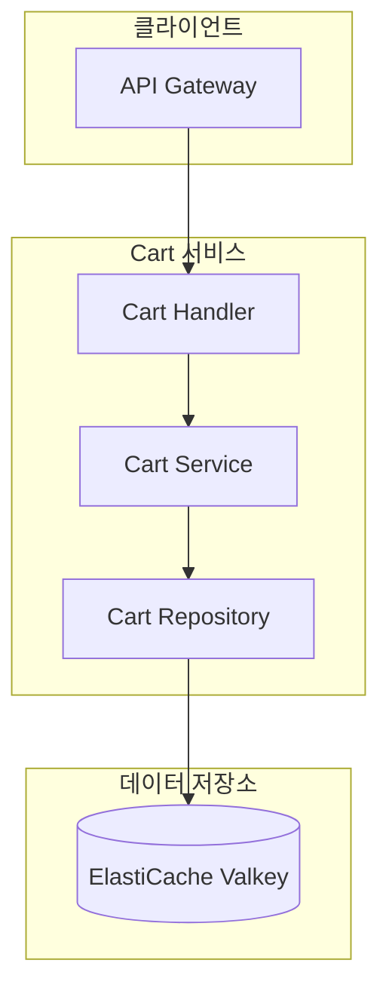
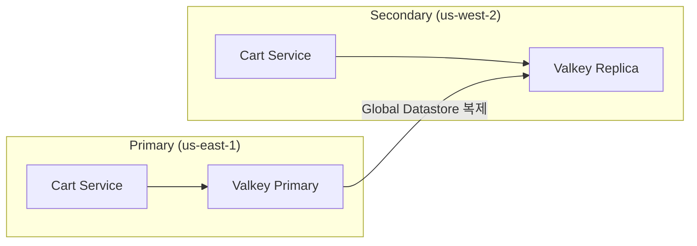

# Cart 서비스

## 개요

Cart 서비스는 사용자의 장바구니 관리 기능을 제공합니다. ElastiCache Valkey를 주 데이터 저장소로 사용하여 빠른 읽기/쓰기 성능을 보장하며, 7일간 장바구니 데이터를 유지합니다.

| 항목 | 내용 |
|------|------|
| 언어 | Go 1.21+ |
| 프레임워크 | Gin |
| 데이터베이스 | ElastiCache (Valkey) |
| 네임스페이스 | core-services |
| 포트 | 8080 |
| 헬스체크 | `/healthz`, `/readyz` |

## 아키텍처



## 주요 기능

### 1. 장바구니 CRUD
- 장바구니 조회
- 상품 추가
- 수량 변경
- 상품 삭제
- 장바구니 비우기

### 2. 데이터 저장
- Hash 자료구조를 사용한 효율적인 저장
- 7일 TTL 자동 만료
- 사용자별 독립적인 장바구니

### 3. 리전 인식
- Secondary 리전에서 쓰기 요청 시 Primary로 포워딩

## API 엔드포인트

| 메서드 | 경로 | 설명 |
|--------|------|------|
| GET | `/api/v1/cart/:user_id` | 장바구니 조회 |
| POST | `/api/v1/cart/:user_id/items` | 상품 추가 |
| PUT | `/api/v1/cart/:user_id/items/:item_id` | 수량 변경 |
| DELETE | `/api/v1/cart/:user_id/items/:item_id` | 상품 삭제 |
| DELETE | `/api/v1/cart/:user_id` | 장바구니 비우기 |

### 장바구니 조회

#### 요청

```bash
GET /api/v1/cart/user-123
```

#### 응답

```json
{
  "user_id": "user-123",
  "items": [
    {
      "item_id": "550e8400-e29b-41d4-a716-446655440000",
      "product_id": "prod-001",
      "sku": "SGB-PRO-15",
      "name": "삼성 갤럭시북 프로",
      "price": 1590000,
      "quantity": 1,
      "added_at": "2024-01-15T09:30:00Z"
    },
    {
      "item_id": "550e8400-e29b-41d4-a716-446655440001",
      "product_id": "prod-002",
      "sku": "APL-MBA-13",
      "name": "Apple MacBook Air M3",
      "price": 1890000,
      "quantity": 2,
      "added_at": "2024-01-15T10:15:00Z"
    }
  ],
  "total": 5370000,
  "item_count": 3,
  "updated_at": "2024-01-15T10:15:00Z"
}
```

### 상품 추가

#### 요청

```bash
POST /api/v1/cart/user-123/items
Content-Type: application/json

{
  "product_id": "prod-001",
  "sku": "SGB-PRO-15",
  "name": "삼성 갤럭시북 프로",
  "price": 1590000,
  "quantity": 1
}
```

#### 응답

```json
{
  "item_id": "550e8400-e29b-41d4-a716-446655440000",
  "product_id": "prod-001",
  "sku": "SGB-PRO-15",
  "name": "삼성 갤럭시북 프로",
  "price": 1590000,
  "quantity": 1,
  "added_at": "2024-01-15T09:30:00Z"
}
```

### 수량 변경

#### 요청

```bash
PUT /api/v1/cart/user-123/items/550e8400-e29b-41d4-a716-446655440000
Content-Type: application/json

{
  "quantity": 3
}
```

#### 응답

```json
{
  "item_id": "550e8400-e29b-41d4-a716-446655440000",
  "product_id": "prod-001",
  "sku": "SGB-PRO-15",
  "name": "삼성 갤럭시북 프로",
  "price": 1590000,
  "quantity": 3,
  "added_at": "2024-01-15T09:30:00Z"
}
```

:::tip 수량을 0으로 설정
수량을 0으로 설정하면 해당 상품이 장바구니에서 삭제됩니다. 이 경우 응답은 `204 No Content`입니다.
:::

### 상품 삭제

#### 요청

```bash
DELETE /api/v1/cart/user-123/items/550e8400-e29b-41d4-a716-446655440000
```

#### 응답

```
204 No Content
```

### 장바구니 비우기

#### 요청

```bash
DELETE /api/v1/cart/user-123
```

#### 응답

```
204 No Content
```

## 데이터 모델

### CartItem

```go
type CartItem struct {
    ItemID    string    `json:"item_id"`
    ProductID string    `json:"product_id"`
    SKU       string    `json:"sku"`
    Name      string    `json:"name"`
    Price     float64   `json:"price"`
    Quantity  int       `json:"quantity"`
    AddedAt   time.Time `json:"added_at"`
}
```

### Cart

```go
type Cart struct {
    UserID    string     `json:"user_id"`
    Items     []CartItem `json:"items"`
    Total     float64    `json:"total"`
    ItemCount int        `json:"item_count"`
    UpdatedAt time.Time  `json:"updated_at"`
}
```

### AddItemRequest

```go
type AddItemRequest struct {
    ProductID string  `json:"product_id" binding:"required"`
    SKU       string  `json:"sku" binding:"required"`
    Name      string  `json:"name" binding:"required"`
    Price     float64 `json:"price" binding:"required"`
    Quantity  int     `json:"quantity" binding:"required,min=1"`
}
```

### UpdateItemRequest

```go
type UpdateItemRequest struct {
    Quantity int `json:"quantity" binding:"required,min=0"`
}
```

## Valkey 데이터 구조

### 키 패턴

```
cart:{user_id}
```

예시: `cart:user-123`

### 저장 구조

Hash 자료구조를 사용하여 각 아이템을 필드로 저장합니다.

```
HSET cart:user-123
  "550e8400-..." '{"product_id":"prod-001","sku":"SGB-PRO-15",...}'
  "550e8400-..." '{"product_id":"prod-002","sku":"APL-MBA-13",...}'
```

### TTL

모든 장바구니는 **7일(168시간)** TTL로 설정됩니다. 장바구니에 아이템이 추가되거나 수정될 때마다 TTL이 갱신됩니다.

```go
const cartTTL = 7 * 24 * time.Hour // 7 days
```

## 이벤트 (Kafka)

Cart 서비스는 현재 Kafka 이벤트를 발행하거나 구독하지 않습니다.

:::note 향후 계획
체크아웃 프로세스 구현 시 다음 이벤트가 추가될 예정입니다:
- `cart.updated` - 장바구니 변경 이벤트
- `cart.checkout-initiated` - 체크아웃 시작 이벤트
:::

## 환경 변수

| 변수명 | 설명 | 기본값 |
|--------|------|--------|
| `PORT` | 서버 포트 | `8080` |
| `AWS_REGION` | AWS 리전 | `us-east-1` |
| `REGION_ROLE` | 리전 역할 (PRIMARY/SECONDARY) | `PRIMARY` |
| `PRIMARY_HOST` | Primary 리전 호스트 | - |
| `CACHE_HOST` | ElastiCache 호스트 | `localhost` |
| `CACHE_PORT` | ElastiCache 포트 | `6379` |
| `LOG_LEVEL` | 로그 레벨 | `info` |

## 서비스 의존성

### 의존하는 서비스

| 서비스 | 용도 |
|--------|------|
| ElastiCache (Valkey) | 장바구니 데이터 저장 |

### 이 서비스에 의존하는 컴포넌트

| 컴포넌트 | 용도 |
|----------|------|
| API Gateway | Cart API 라우팅 |
| 웹/모바일 클라이언트 | 장바구니 관리 |
| Order 서비스 | 체크아웃 시 장바구니 데이터 조회 |

## 멀티 리전 동작

### ElastiCache Global Datastore

Cart 서비스는 ElastiCache Global Datastore를 통해 리전 간 데이터를 복제합니다.



### 쓰기 작업
- Primary 리전: 직접 Valkey에 쓰기
- Secondary 리전: Primary로 요청 포워딩

### 읽기 작업
- 모든 리전에서 로컬 Valkey Replica 읽기
- 복제 지연 최소화 (일반적으로 1초 미만)

## 에러 응답

### 400 Bad Request

```json
{
  "error": "invalid request body"
}
```

### 404 Not Found

```json
{
  "error": "item not found"
}
```

### 500 Internal Server Error

```json
{
  "error": "failed to add item"
}
```
