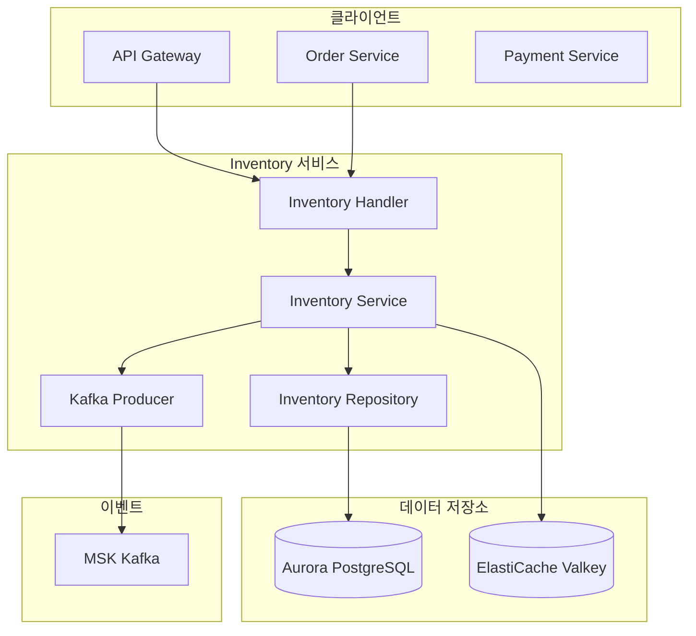
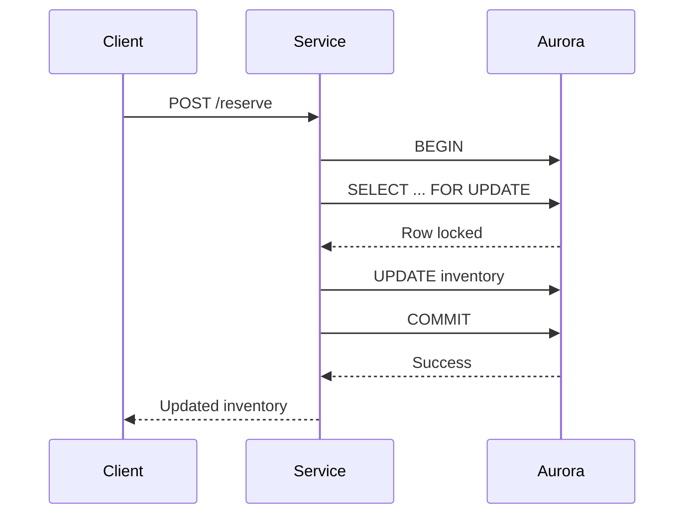
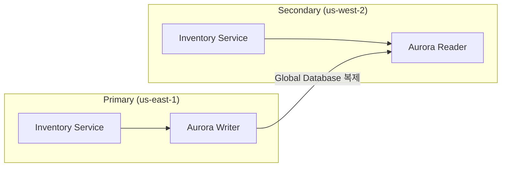

# Inventory 서비스

## 개요

Inventory 서비스는 상품 재고 관리 기능을 제공합니다. Aurora PostgreSQL을 사용하여 재고 데이터를 저장하고, Reserve/Release 패턴을 통해 동시성 문제를 해결합니다. 재고 변경 시 Kafka 이벤트를 발행하여 다른 서비스와 연동합니다.

| 항목 | 내용 |
|------|------|
| 언어 | Go 1.21+ |
| 프레임워크 | Gin |
| 데이터베이스 | Aurora PostgreSQL |
| 캐시 | ElastiCache (Valkey) |
| 네임스페이스 | core-services |
| 포트 | 8080 |
| 헬스체크 | `/healthz`, `/readyz` |

## 아키텍처



## 주요 기능

### 1. 재고 조회
- SKU 기반 재고 조회
- 가용 수량, 예약 수량, 전체 수량 제공

### 2. 재고 예약 (Reserve)
- 주문 시 재고 예약
- 트랜잭션 기반 동시성 제어
- 재고 부족 시 에러 반환

### 3. 재고 해제 (Release)
- 주문 취소 시 예약 해제
- 예약 수량 범위 내에서 해제

### 4. 재고 업데이트
- 관리자용 재고 직접 수정
- Upsert 지원

## API 엔드포인트

| 메서드 | 경로 | 설명 |
|--------|------|------|
| GET | `/api/v1/inventory/:sku` | 재고 조회 |
| POST | `/api/v1/inventory/:sku/reserve` | 재고 예약 |
| POST | `/api/v1/inventory/:sku/release` | 예약 해제 |
| PUT | `/api/v1/inventory/:sku` | 재고 업데이트 |

### 재고 조회

#### 요청

```bash
GET /api/v1/inventory/SGB-PRO-15
```

#### 응답

```json
{
  "sku": "SGB-PRO-15",
  "available": 45,
  "reserved": 5,
  "total": 50,
  "updated_at": "2024-01-15T10:30:00Z"
}
```

### 재고 예약

#### 요청

```bash
POST /api/v1/inventory/SGB-PRO-15/reserve
Content-Type: application/json

{
  "quantity": 2
}
```

#### 응답 (성공)

```json
{
  "sku": "SGB-PRO-15",
  "available": 43,
  "reserved": 7,
  "total": 50,
  "updated_at": "2024-01-15T10:35:00Z"
}
```

#### 응답 (재고 부족)

```json
{
  "error": "insufficient stock"
}
```
HTTP Status: 409 Conflict

### 예약 해제

#### 요청

```bash
POST /api/v1/inventory/SGB-PRO-15/release
Content-Type: application/json

{
  "quantity": 1
}
```

#### 응답

```json
{
  "sku": "SGB-PRO-15",
  "available": 44,
  "reserved": 6,
  "total": 50,
  "updated_at": "2024-01-15T10:40:00Z"
}
```

### 재고 업데이트

#### 요청

```bash
PUT /api/v1/inventory/SGB-PRO-15
Content-Type: application/json

{
  "available": 100,
  "total": 100
}
```

#### 응답

```json
{
  "sku": "SGB-PRO-15",
  "available": 100,
  "reserved": 0,
  "total": 100,
  "updated_at": "2024-01-15T11:00:00Z"
}
```

## 데이터 모델

### Inventory

```go
type Inventory struct {
    SKU       string    `json:"sku"`
    Available int       `json:"available"`
    Reserved  int       `json:"reserved"`
    Total     int       `json:"total"`
    UpdatedAt time.Time `json:"updated_at"`
}
```

### ReserveRequest

```go
type ReserveRequest struct {
    Quantity int `json:"quantity" binding:"required,min=1"`
}
```

### ReleaseRequest

```go
type ReleaseRequest struct {
    Quantity int `json:"quantity" binding:"required,min=1"`
}
```

### UpdateStockRequest

```go
type UpdateStockRequest struct {
    Available int `json:"available" binding:"min=0"`
    Total     int `json:"total" binding:"min=0"`
}
```

## 데이터베이스 스키마

### inventory 테이블

```sql
CREATE TABLE inventory (
    sku VARCHAR(100) PRIMARY KEY,
    available INTEGER NOT NULL DEFAULT 0,
    reserved INTEGER NOT NULL DEFAULT 0,
    total INTEGER NOT NULL DEFAULT 0,
    updated_at TIMESTAMP WITH TIME ZONE DEFAULT NOW(),

    CONSTRAINT available_non_negative CHECK (available >= 0),
    CONSTRAINT reserved_non_negative CHECK (reserved >= 0),
    CONSTRAINT total_equals_sum CHECK (total = available + reserved)
);

CREATE INDEX idx_inventory_updated_at ON inventory(updated_at);
```

## 이벤트 (Kafka)

### 발행하는 토픽

| 토픽 | 설명 | 발행 시점 |
|------|------|----------|
| `inventory.reserved` | 재고 예약 이벤트 | Reserve 성공 시 |
| `inventory.released` | 예약 해제 이벤트 | Release 성공 시 |
| `inventory.updated` | 재고 업데이트 이벤트 | UpdateStock 성공 시 |

### 이벤트 페이로드

#### inventory.reserved

```json
{
  "event": "inventory.reserved",
  "sku": "SGB-PRO-15",
  "quantity": 2,
  "inventory": {
    "sku": "SGB-PRO-15",
    "available": 43,
    "reserved": 7,
    "total": 50,
    "updated_at": "2024-01-15T10:35:00Z"
  }
}
```

#### inventory.released

```json
{
  "event": "inventory.released",
  "sku": "SGB-PRO-15",
  "quantity": 1,
  "inventory": {
    "sku": "SGB-PRO-15",
    "available": 44,
    "reserved": 6,
    "total": 50,
    "updated_at": "2024-01-15T10:40:00Z"
  }
}
```

#### inventory.updated

```json
{
  "event": "inventory.updated",
  "sku": "SGB-PRO-15",
  "inventory": {
    "sku": "SGB-PRO-15",
    "available": 100,
    "reserved": 0,
    "total": 100,
    "updated_at": "2024-01-15T11:00:00Z"
  }
}
```

## 환경 변수

| 변수명 | 설명 | 기본값 |
|--------|------|--------|
| `PORT` | 서버 포트 | `8080` |
| `AWS_REGION` | AWS 리전 | `us-east-1` |
| `REGION_ROLE` | 리전 역할 (PRIMARY/SECONDARY) | `PRIMARY` |
| `PRIMARY_HOST` | Primary 리전 호스트 | - |
| `DB_HOST` | Aurora 호스트 | `localhost` |
| `DB_PORT` | Aurora 포트 | `5432` |
| `DB_NAME` | 데이터베이스 이름 | `inventory` |
| `DB_USER` | 데이터베이스 사용자 | `mall` |
| `DB_PASSWORD` | 데이터베이스 비밀번호 | - |
| `CACHE_HOST` | ElastiCache 호스트 | `localhost` |
| `CACHE_PORT` | ElastiCache 포트 | `6379` |
| `KAFKA_BROKERS` | Kafka 브로커 주소 | `localhost:9092` |
| `LOG_LEVEL` | 로그 레벨 | `info` |

## 서비스 의존성

### 의존하는 서비스

| 서비스 | 용도 |
|--------|------|
| Aurora PostgreSQL | 재고 데이터 저장 |
| ElastiCache (Valkey) | 캐싱 (옵션) |
| MSK (Kafka) | 이벤트 발행 |

### 이 서비스에 의존하는 컴포넌트

| 컴포넌트 | 용도 |
|----------|------|
| API Gateway | Inventory API 라우팅 |
| Order 서비스 | 주문 시 재고 예약 |
| Payment 서비스 | 결제 완료 시 재고 확정 |
| Warehouse 서비스 | 재고 입출고 관리 |

## 동시성 제어

Reserve와 Release 작업은 `SELECT FOR UPDATE`를 사용하여 행 수준 잠금을 수행합니다.



### 재고 부족 처리

```go
if inv.Available < quantity {
    return nil, ErrInsufficientStock
}
```

재고가 부족한 경우 409 Conflict 응답을 반환합니다.

## 멀티 리전 동작

### Aurora Global Database

Inventory 서비스는 Aurora Global Database를 통해 리전 간 데이터를 복제합니다.



### 쓰기 작업
- Primary 리전: 직접 Aurora Writer에 쓰기
- Secondary 리전: Primary로 요청 포워딩

### 읽기 작업
- 모든 리전에서 로컬 Aurora Reader 읽기

## 에러 응답

### 400 Bad Request

```json
{
  "error": "invalid request body"
}
```

### 404 Not Found

```json
{
  "error": "inventory not found"
}
```

### 409 Conflict

```json
{
  "error": "insufficient stock"
}
```

### 500 Internal Server Error

```json
{
  "error": "internal server error"
}
```
