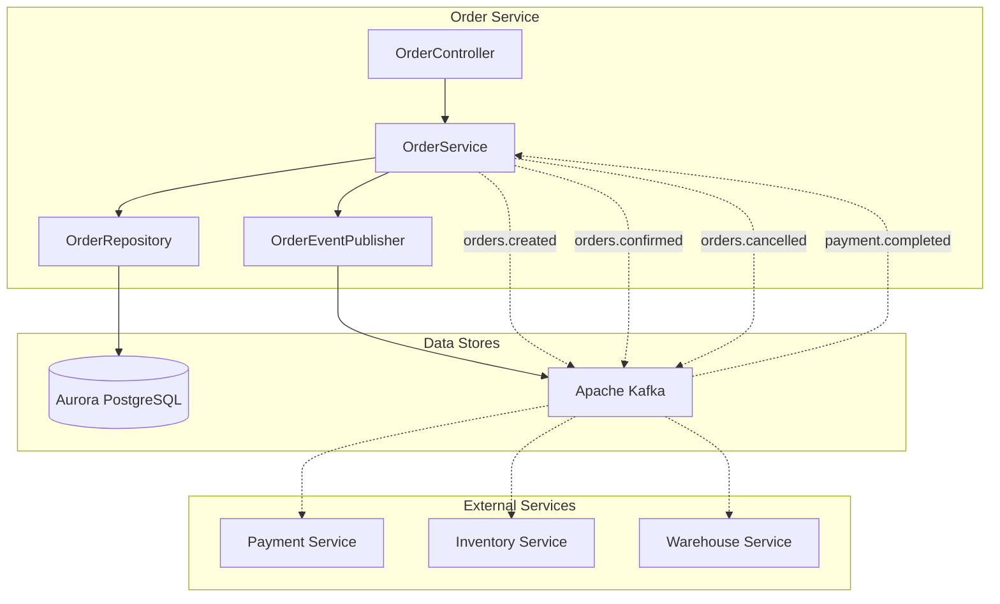
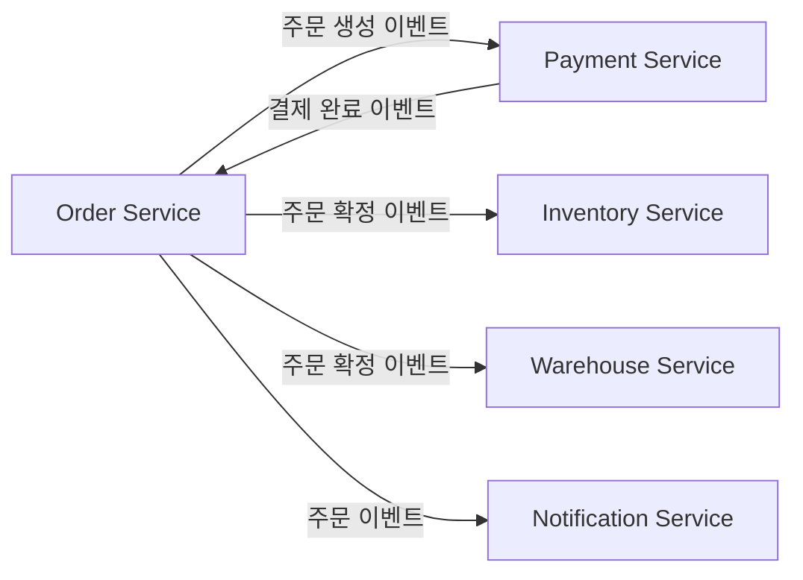

# 주문 서비스 (Order Service)

## 개요

주문 서비스는 쇼핑몰의 핵심 주문 처리를 담당하며, SAGA 패턴을 활용한 분산 트랜잭션 오케스트레이터 역할을 수행합니다.

| 항목 | 내용 |
|------|------|
| 언어 | Java 17 |
| 프레임워크 | Spring Boot 3.2 |
| 데이터베이스 | Aurora PostgreSQL (Global Database) |
| 네임스페이스 | `mall-order` |
| 포트 | 8080 |
| 헬스체크 | `/actuator/health` |

## 아키텍처



## API 엔드포인트

| 메서드 | 경로 | 설명 |
|--------|------|------|
| `POST` | `/api/v1/orders` | 주문 생성 |
| `GET` | `/api/v1/orders/{id}` | 주문 조회 |
| `GET` | `/api/v1/orders?userId={userId}` | 사용자별 주문 목록 조회 |
| `PUT` | `/api/v1/orders/{id}/cancel` | 주문 취소 |

### 주문 생성

**POST** `/api/v1/orders`

요청:
```json
{
  "userId": "user-123",
  "items": [
    {
      "productId": "prod-001",
      "sku": "SKU-ELECTRONICS-001",
      "quantity": 2,
      "price": 299000.00
    },
    {
      "productId": "prod-002",
      "sku": "SKU-FASHION-001",
      "quantity": 1,
      "price": 89000.00
    }
  ]
}
```

응답 (201 Created):
```json
{
  "id": "550e8400-e29b-41d4-a716-446655440000",
  "userId": "user-123",
  "status": "PENDING",
  "totalAmount": 687000.00,
  "items": [
    {
      "id": "item-uuid-1",
      "productId": "prod-001",
      "sku": "SKU-ELECTRONICS-001",
      "quantity": 2,
      "price": 299000.00
    },
    {
      "id": "item-uuid-2",
      "productId": "prod-002",
      "sku": "SKU-FASHION-001",
      "quantity": 1,
      "price": 89000.00
    }
  ],
  "createdAt": "2024-01-15T10:30:00",
  "updatedAt": "2024-01-15T10:30:00"
}
```

### 주문 조회

**GET** `/api/v1/orders/{id}`

응답 (200 OK):
```json
{
  "id": "550e8400-e29b-41d4-a716-446655440000",
  "userId": "user-123",
  "status": "CONFIRMED",
  "totalAmount": 687000.00,
  "items": [...],
  "createdAt": "2024-01-15T10:30:00",
  "updatedAt": "2024-01-15T10:35:00"
}
```

### 주문 취소

**PUT** `/api/v1/orders/{id}/cancel`

응답 (200 OK):
```json
{
  "id": "550e8400-e29b-41d4-a716-446655440000",
  "userId": "user-123",
  "status": "CANCELLED",
  "totalAmount": 687000.00,
  "items": [...],
  "createdAt": "2024-01-15T10:30:00",
  "updatedAt": "2024-01-15T11:00:00"
}
```

## 데이터 모델

### Order 엔티티

```java
@Entity
@Table(name = "orders")
public class Order {
    @Id
    @GeneratedValue(strategy = GenerationType.UUID)
    private UUID id;

    @Column(name = "user_id", nullable = false)
    private String userId;

    @Enumerated(EnumType.STRING)
    @Column(nullable = false)
    private OrderStatus status = OrderStatus.PENDING;

    @Column(name = "total_amount", precision = 12, scale = 2)
    private BigDecimal totalAmount = BigDecimal.ZERO;

    @OneToMany(mappedBy = "order", cascade = CascadeType.ALL)
    private List<OrderItem> items = new ArrayList<>();

    @Column(name = "created_at")
    private LocalDateTime createdAt;

    @Column(name = "updated_at")
    private LocalDateTime updatedAt;
}
```

### OrderItem 엔티티

```java
@Entity
@Table(name = "order_items")
public class OrderItem {
    @Id
    @GeneratedValue(strategy = GenerationType.UUID)
    private UUID id;

    @ManyToOne(fetch = FetchType.LAZY)
    @JoinColumn(name = "order_id")
    private Order order;

    @Column(name = "product_id", nullable = false)
    private String productId;

    @Column(nullable = false)
    private String sku;

    @Column(nullable = false)
    private Integer quantity;

    @Column(precision = 12, scale = 2, nullable = false)
    private BigDecimal price;
}
```

### OrderStatus 열거형

```java
public enum OrderStatus {
    PENDING,    // 대기 중
    CONFIRMED,  // 확정됨
    CANCELLED,  // 취소됨
    FAILED      // 실패
}
```

### 데이터베이스 스키마

```sql
CREATE TABLE orders (
    id UUID PRIMARY KEY DEFAULT gen_random_uuid(),
    user_id VARCHAR(255) NOT NULL,
    status VARCHAR(50) NOT NULL DEFAULT 'PENDING',
    total_amount DECIMAL(12, 2) DEFAULT 0,
    created_at TIMESTAMP DEFAULT CURRENT_TIMESTAMP,
    updated_at TIMESTAMP DEFAULT CURRENT_TIMESTAMP
);

CREATE TABLE order_items (
    id UUID PRIMARY KEY DEFAULT gen_random_uuid(),
    order_id UUID REFERENCES orders(id),
    product_id VARCHAR(255) NOT NULL,
    sku VARCHAR(255) NOT NULL,
    quantity INTEGER NOT NULL,
    price DECIMAL(12, 2) NOT NULL
);

CREATE INDEX idx_orders_user_id ON orders(user_id);
CREATE INDEX idx_orders_status ON orders(status);
CREATE INDEX idx_order_items_order_id ON order_items(order_id);
```

## 이벤트 (Kafka)

### 발행 토픽

| 토픽명 | 이벤트 | 설명 |
|--------|--------|------|
| `orders.created` | order.created | 주문 생성 시 발행 |
| `orders.confirmed` | order.confirmed | 결제 완료 후 주문 확정 시 발행 |
| `orders.cancelled` | order.cancelled | 주문 취소 시 발행 |

#### orders.created 페이로드

```json
{
  "event": "order.created",
  "order": {
    "id": "550e8400-e29b-41d4-a716-446655440000",
    "userId": "user-123",
    "status": "PENDING",
    "totalAmount": 687000.00,
    "items": [...],
    "createdAt": "2024-01-15T10:30:00",
    "updatedAt": "2024-01-15T10:30:00"
  }
}
```

#### orders.confirmed 페이로드

```json
{
  "event": "order.confirmed",
  "order": {
    "id": "550e8400-e29b-41d4-a716-446655440000",
    "userId": "user-123",
    "status": "CONFIRMED",
    "totalAmount": 687000.00,
    "items": [...],
    "createdAt": "2024-01-15T10:30:00",
    "updatedAt": "2024-01-15T10:35:00"
  }
}
```

### 구독 토픽

| 토픽명 | 설명 |
|--------|------|
| `payments.completed` | 결제 완료 이벤트 수신하여 주문 확정 처리 |

## 환경 변수

| 변수명 | 설명 | 기본값 |
|--------|------|--------|
| `SPRING_DATASOURCE_URL` | Aurora PostgreSQL 연결 URL | - |
| `SPRING_DATASOURCE_USERNAME` | DB 사용자명 | - |
| `SPRING_DATASOURCE_PASSWORD` | DB 비밀번호 | - |
| `SPRING_KAFKA_BOOTSTRAP_SERVERS` | Kafka 브로커 주소 | - |
| `SERVER_PORT` | 서비스 포트 | 8080 |

## 서비스 의존성



### SAGA 패턴

주문 서비스는 분산 트랜잭션을 위해 SAGA 오케스트레이터 패턴을 사용합니다:

1. **주문 생성**: `PENDING` 상태로 주문 생성
2. **재고 확인**: Inventory 서비스에 재고 확보 요청
3. **결제 처리**: Payment 서비스에 결제 요청
4. **주문 확정**: 모든 단계 성공 시 `CONFIRMED` 상태로 변경
5. **보상 트랜잭션**: 실패 시 이전 단계 롤백

### 에러 처리

| HTTP 상태 코드 | 에러 | 설명 |
|----------------|------|------|
| 404 | OrderNotFoundException | 주문을 찾을 수 없음 |
| 400 | IllegalStateException | 잘못된 상태 전이 (예: 이미 취소된 주문 취소) |
| 500 | SagaException | SAGA 트랜잭션 실패 |
