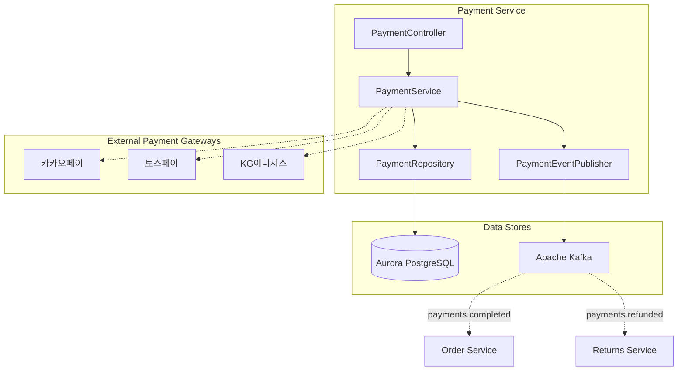
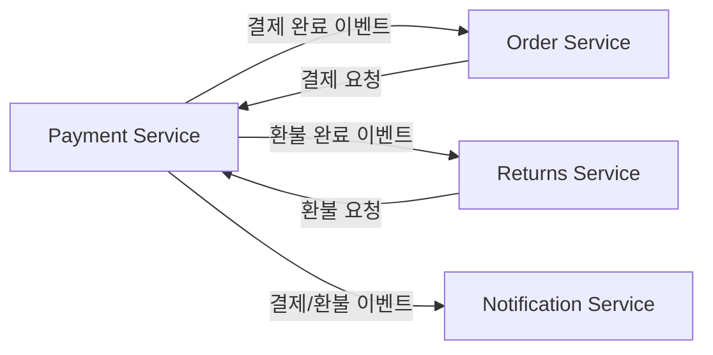
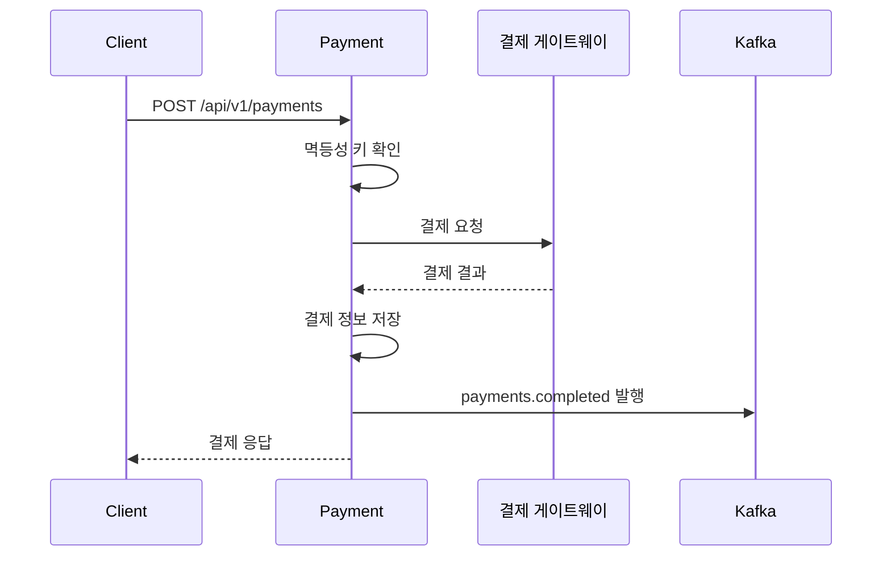

# 결제 서비스 (Payment Service)

## 개요

결제 서비스는 주문에 대한 결제 처리, 환불을 담당하며 한국의 주요 결제 수단(카카오페이, 토스, KG이니시스)을 지원합니다.

| 항목 | 내용 |
|------|------|
| 언어 | Java 17 |
| 프레임워크 | Spring Boot 3.2 |
| 데이터베이스 | Aurora PostgreSQL (Global Database) |
| 네임스페이스 | `mall-payment` |
| 포트 | 8080 |
| 헬스체크 | `/actuator/health` |

## 아키텍처



## API 엔드포인트

| 메서드 | 경로 | 설명 |
|--------|------|------|
| `POST` | `/api/v1/payments` | 결제 처리 |
| `GET` | `/api/v1/payments/{id}` | 결제 조회 |
| `POST` | `/api/v1/payments/{id}/refund` | 환불 처리 |

### 결제 처리

**POST** `/api/v1/payments`

요청:
```json
{
  "orderId": "550e8400-e29b-41d4-a716-446655440000",
  "amount": 687000.00,
  "currency": "KRW",
  "paymentMethod": "KAKAO_PAY",
  "idempotencyKey": "order-550e8400-payment-001"
}
```

지원 결제 수단:
- `KAKAO_PAY` - 카카오페이
- `TOSS_PAY` - 토스페이
- `KG_INICIS` - KG이니시스
- `CREDIT_CARD` - 신용카드

응답 (201 Created):
```json
{
  "id": "660e8400-e29b-41d4-a716-446655440001",
  "orderId": "550e8400-e29b-41d4-a716-446655440000",
  "amount": 687000.00,
  "currency": "KRW",
  "status": "COMPLETED",
  "paymentMethod": "KAKAO_PAY",
  "idempotencyKey": "order-550e8400-payment-001",
  "createdAt": "2024-01-15T10:32:00",
  "updatedAt": "2024-01-15T10:32:00"
}
```

### 결제 조회

**GET** `/api/v1/payments/{id}`

응답 (200 OK):
```json
{
  "id": "660e8400-e29b-41d4-a716-446655440001",
  "orderId": "550e8400-e29b-41d4-a716-446655440000",
  "amount": 687000.00,
  "currency": "KRW",
  "status": "COMPLETED",
  "paymentMethod": "KAKAO_PAY",
  "idempotencyKey": "order-550e8400-payment-001",
  "createdAt": "2024-01-15T10:32:00",
  "updatedAt": "2024-01-15T10:32:00"
}
```

### 환불 처리

**POST** `/api/v1/payments/{id}/refund`

응답 (200 OK):
```json
{
  "id": "660e8400-e29b-41d4-a716-446655440001",
  "orderId": "550e8400-e29b-41d4-a716-446655440000",
  "amount": 687000.00,
  "currency": "KRW",
  "status": "REFUNDED",
  "paymentMethod": "KAKAO_PAY",
  "idempotencyKey": "order-550e8400-payment-001",
  "createdAt": "2024-01-15T10:32:00",
  "updatedAt": "2024-01-15T12:00:00"
}
```

## 데이터 모델

### Payment 엔티티

```java
@Entity
@Table(name = "payments")
public class Payment {
    @Id
    @GeneratedValue(strategy = GenerationType.UUID)
    private UUID id;

    @Column(name = "order_id", nullable = false)
    private UUID orderId;

    @Column(precision = 12, scale = 2, nullable = false)
    private BigDecimal amount;

    @Column(length = 3)
    private String currency = "USD";

    @Enumerated(EnumType.STRING)
    @Column(nullable = false)
    private PaymentStatus status = PaymentStatus.PENDING;

    @Column(name = "idempotency_key", unique = true)
    private String idempotencyKey;

    @Column(name = "payment_method")
    private String paymentMethod;

    @Column(name = "created_at")
    private LocalDateTime createdAt;

    @Column(name = "updated_at")
    private LocalDateTime updatedAt;
}
```

### PaymentStatus 열거형

```java
public enum PaymentStatus {
    PENDING,    // 대기 중
    COMPLETED,  // 완료
    FAILED,     // 실패
    REFUNDED    // 환불됨
}
```

### 데이터베이스 스키마

```sql
CREATE TABLE payments (
    id UUID PRIMARY KEY DEFAULT gen_random_uuid(),
    order_id UUID NOT NULL,
    amount DECIMAL(12, 2) NOT NULL,
    currency VARCHAR(3) DEFAULT 'KRW',
    status VARCHAR(50) NOT NULL DEFAULT 'PENDING',
    idempotency_key VARCHAR(255) UNIQUE,
    payment_method VARCHAR(50),
    created_at TIMESTAMP DEFAULT CURRENT_TIMESTAMP,
    updated_at TIMESTAMP DEFAULT CURRENT_TIMESTAMP
);

CREATE INDEX idx_payments_order_id ON payments(order_id);
CREATE INDEX idx_payments_status ON payments(status);
CREATE INDEX idx_payments_idempotency_key ON payments(idempotency_key);
```

## 이벤트 (Kafka)

### 발행 토픽

| 토픽명 | 이벤트 | 설명 |
|--------|--------|------|
| `payments.completed` | payment.completed | 결제 완료 시 발행 |
| `payments.failed` | payment.failed | 결제 실패 시 발행 |
| `payments.refunded` | payment.refunded | 환불 완료 시 발행 |

#### payments.completed 페이로드

```json
{
  "event": "payment.completed",
  "payment": {
    "id": "660e8400-e29b-41d4-a716-446655440001",
    "orderId": "550e8400-e29b-41d4-a716-446655440000",
    "amount": 687000.00,
    "currency": "KRW",
    "status": "COMPLETED",
    "paymentMethod": "KAKAO_PAY",
    "idempotencyKey": "order-550e8400-payment-001",
    "createdAt": "2024-01-15T10:32:00",
    "updatedAt": "2024-01-15T10:32:00"
  }
}
```

#### payments.refunded 페이로드

```json
{
  "event": "payment.refunded",
  "payment": {
    "id": "660e8400-e29b-41d4-a716-446655440001",
    "orderId": "550e8400-e29b-41d4-a716-446655440000",
    "amount": 687000.00,
    "currency": "KRW",
    "status": "REFUNDED",
    "paymentMethod": "KAKAO_PAY",
    "idempotencyKey": "order-550e8400-payment-001",
    "createdAt": "2024-01-15T10:32:00",
    "updatedAt": "2024-01-15T12:00:00"
  }
}
```

## 환경 변수

| 변수명 | 설명 | 기본값 |
|--------|------|--------|
| `SPRING_DATASOURCE_URL` | Aurora PostgreSQL 연결 URL | - |
| `SPRING_DATASOURCE_USERNAME` | DB 사용자명 | - |
| `SPRING_DATASOURCE_PASSWORD` | DB 비밀번호 | - |
| `SPRING_KAFKA_BOOTSTRAP_SERVERS` | Kafka 브로커 주소 | - |
| `KAKAO_PAY_API_KEY` | 카카오페이 API 키 | - |
| `TOSS_PAY_SECRET_KEY` | 토스페이 시크릿 키 | - |
| `KG_INICIS_MID` | KG이니시스 상점 ID | - |
| `SERVER_PORT` | 서비스 포트 | 8080 |

## 서비스 의존성



### 멱등성 (Idempotency)

결제 서비스는 `idempotencyKey`를 통해 중복 결제를 방지합니다:

1. 클라이언트는 고유한 `idempotencyKey`를 생성하여 요청
2. 동일한 키로 재요청 시 기존 결제 결과 반환
3. 네트워크 오류 등으로 인한 중복 결제 방지

### 결제 흐름



### 에러 처리

| HTTP 상태 코드 | 에러 | 설명 |
|----------------|------|------|
| 404 | PaymentNotFoundException | 결제 정보를 찾을 수 없음 |
| 400 | IllegalStateException | 잘못된 상태 전이 (예: 이미 환불된 결제 환불) |
| 409 | DuplicatePaymentException | 중복 결제 시도 (동일 idempotencyKey) |
