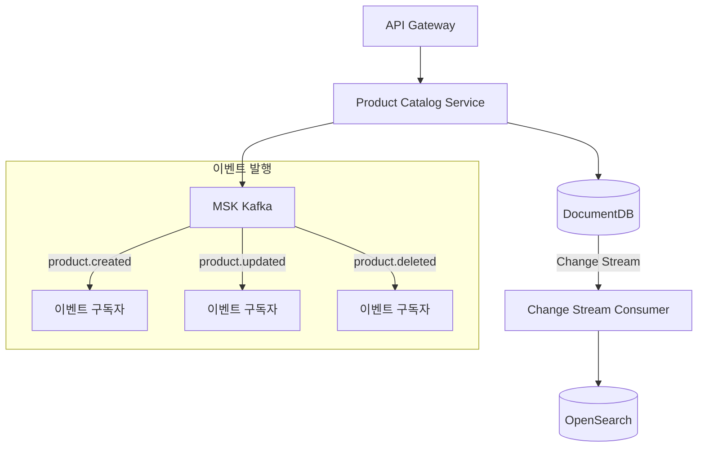
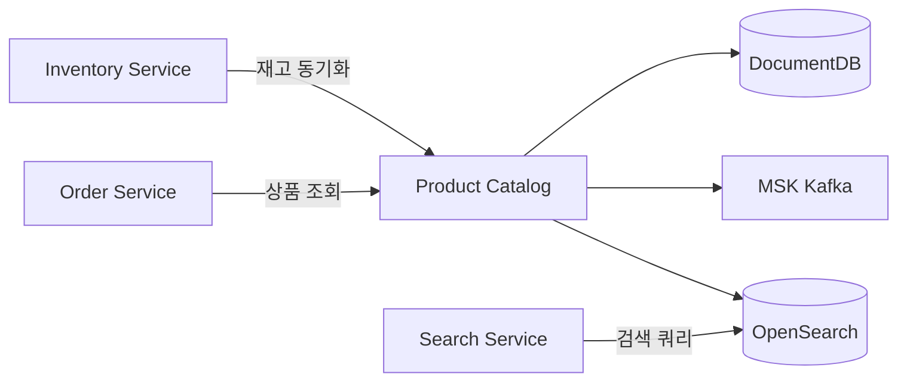

# 상품 카탈로그 서비스 (Product Catalog)

## 개요

상품 카탈로그 서비스는 쇼핑몰의 상품 및 카테고리 정보를 관리합니다. DocumentDB에 저장된 상품 데이터는 Change Stream을 통해 OpenSearch로 실시간 동기화됩니다.

| 항목 | 값 |
|------|-----|
| 언어 | Python 3.11 |
| 프레임워크 | FastAPI |
| 데이터베이스 | DocumentDB (MongoDB 호환) |
| 네임스페이스 | `mall-services` |
| 포트 | 8000 |
| 헬스체크 | `GET /health` |

## 아키텍처



## API 엔드포인트

### 상품 API

| 메서드 | 경로 | 설명 |
|--------|------|------|
| `GET` | `/api/v1/products` | 상품 목록 조회 |
| `GET` | `/api/v1/products/{product_id}` | 상품 상세 조회 |
| `POST` | `/api/v1/products` | 상품 등록 |
| `PUT` | `/api/v1/products/{product_id}` | 상품 수정 |
| `DELETE` | `/api/v1/products/{product_id}` | 상품 삭제 |
| `GET` | `/api/v1/categories` | 카테고리 목록 조회 |

### 요청/응답 예시

#### 상품 목록 조회

**요청:**
```http
GET /api/v1/products?skip=0&limit=20&category=electronics
```

**응답:**
```json
{
  "products": [
    {
      "_id": "prod_001",
      "name": "삼성 갤럭시 S24",
      "description": "최신 스마트폰",
      "sku": "SGS24-256GB",
      "price": 1199000,
      "currency": "KRW",
      "category_id": "electronics",
      "images": ["https://cdn.example.com/products/s24.jpg"],
      "attributes": {
        "color": "블랙",
        "storage": "256GB"
      },
      "inventory_count": 150,
      "is_active": true,
      "created_at": "2024-01-15T10:00:00Z",
      "updated_at": "2024-01-15T10:00:00Z"
    }
  ],
  "skip": 0,
  "limit": 20
}
```

#### 상품 등록

**요청:**
```http
POST /api/v1/products
Content-Type: application/json

{
  "name": "나이키 에어맥스",
  "description": "편안한 러닝화",
  "sku": "NIKE-AM-42",
  "price": 189000,
  "currency": "KRW",
  "category_id": "fashion",
  "images": ["https://cdn.example.com/products/airmax.jpg"],
  "attributes": {
    "size": "270",
    "color": "화이트"
  },
  "inventory_count": 50,
  "is_active": true
}
```

**응답 (201 Created):**
```json
{
  "_id": "prod_002",
  "name": "나이키 에어맥스",
  "description": "편안한 러닝화",
  "sku": "NIKE-AM-42",
  "price": 189000,
  "currency": "KRW",
  "category_id": "fashion",
  "images": ["https://cdn.example.com/products/airmax.jpg"],
  "attributes": {
    "size": "270",
    "color": "화이트"
  },
  "inventory_count": 50,
  "is_active": true,
  "created_at": "2024-01-15T11:00:00Z",
  "updated_at": "2024-01-15T11:00:00Z"
}
```

## 데이터 모델

### Product

```python
class Product(BaseModel):
    id: str = Field(alias="_id")
    name: str
    description: Optional[str] = None
    sku: str
    price: float
    currency: str = "USD"
    category_id: Optional[str] = None
    images: list[str] = []
    attributes: dict = {}
    inventory_count: int = 0
    is_active: bool = True
    created_at: datetime
    updated_at: datetime
```

### Category

```python
class Category(BaseModel):
    id: str = Field(alias="_id")
    name: str
    description: Optional[str] = None
    parent_id: Optional[str] = None
    created_at: datetime
```

### 한국 카테고리 (10개)

| ID | 이름 | 설명 |
|----|------|------|
| `electronics` | 전자기기 | 스마트폰, 노트북, 태블릿 |
| `fashion` | 패션 | 의류, 신발, 액세서리 |
| `beauty` | 뷰티 | 화장품, 스킨케어 |
| `home` | 홈/리빙 | 가구, 인테리어 |
| `food` | 식품 | 신선식품, 가공식품 |
| `sports` | 스포츠 | 운동용품, 아웃도어 |
| `books` | 도서 | 책, 전자책 |
| `toys` | 완구 | 장난감, 게임 |
| `baby` | 유아동 | 유아용품, 아동복 |
| `pets` | 반려동물 | 사료, 용품 |

## 이벤트 (Kafka)

### 발행 토픽

| 토픽 | 이벤트 | 설명 |
|------|--------|------|
| `products.created` | 상품 등록 | 새 상품 등록 시 발행 |
| `products.updated` | 상품 수정 | 상품 정보 변경 시 발행 |
| `products.deleted` | 상품 삭제 | 상품 삭제 시 발행 |

### 이벤트 페이로드 예시

```json
{
  "event_type": "product.created",
  "product_id": "prod_001",
  "timestamp": "2024-01-15T10:00:00Z",
  "data": {
    "name": "삼성 갤럭시 S24",
    "sku": "SGS24-256GB",
    "price": 1199000,
    "category_id": "electronics"
  }
}
```

## 환경 변수

| 변수명 | 설명 | 기본값 |
|--------|------|--------|
| `SERVICE_NAME` | 서비스 이름 | `product-catalog` |
| `PORT` | 서비스 포트 | `8080` |
| `AWS_REGION` | AWS 리전 | `us-east-1` |
| `REGION_ROLE` | 리전 역할 (PRIMARY/SECONDARY) | `PRIMARY` |
| `DB_HOST` | 데이터베이스 호스트 | `localhost` |
| `DB_PORT` | 데이터베이스 포트 | `27017` |
| `DB_NAME` | 데이터베이스 이름 | `product_catalog` |
| `DB_USER` | 데이터베이스 사용자 | `mall` |
| `DB_PASSWORD` | 데이터베이스 비밀번호 | - |
| `DOCUMENTDB_HOST` | DocumentDB 호스트 | `localhost` |
| `DOCUMENTDB_PORT` | DocumentDB 포트 | `27017` |
| `KAFKA_BROKERS` | Kafka 브로커 주소 | `localhost:9092` |
| `OPENSEARCH_ENDPOINT` | OpenSearch 엔드포인트 | `http://localhost:9200` |
| `LOG_LEVEL` | 로그 레벨 | `info` |

## 서비스 의존성



### 의존하는 서비스
- **DocumentDB**: 상품/카테고리 데이터 저장
- **MSK Kafka**: 이벤트 발행
- **OpenSearch**: 검색 인덱스 (Change Stream 통해 동기화)

### 의존받는 서비스
- **Search Service**: 상품 검색
- **Order Service**: 주문 시 상품 정보 조회
- **Inventory Service**: 재고 수량 업데이트
- **Recommendation Service**: 추천 상품 조회
