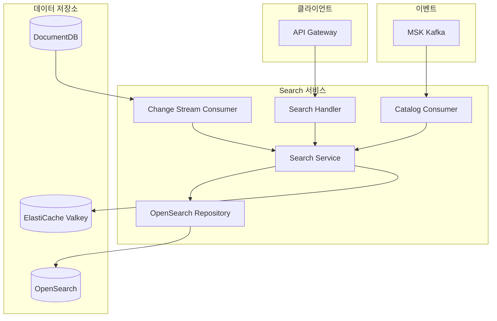
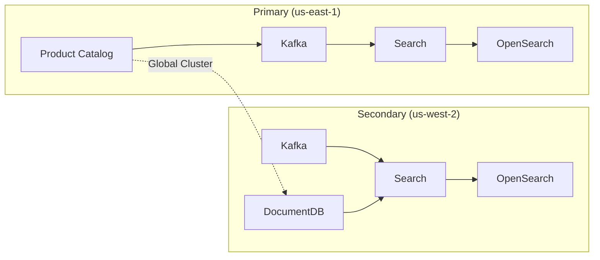

# Search 서비스

## 개요

Search 서비스는 OpenSearch를 활용한 상품 검색 기능을 제공합니다. Kafka를 통해 Product Catalog의 변경 이벤트를 수신하여 검색 인덱스를 자동으로 동기화하며, Secondary 리전에서는 DocumentDB 변경 스트림을 통해 데이터를 동기화합니다.

| 항목 | 내용 |
|------|------|
| 언어 | Go 1.21+ |
| 프레임워크 | Gin |
| 데이터베이스 | OpenSearch, DocumentDB (Change Stream) |
| 캐시 | ElastiCache (Valkey) |
| 네임스페이스 | core-services |
| 포트 | 8080 |
| 헬스체크 | `/healthz`, `/readyz` |

## 아키텍처



## 주요 기능

### 1. 상품 검색
- 멀티 필드 검색 (이름, 설명, SKU)
- 카테고리 필터링
- 가격 범위 필터링
- 페이지네이션

### 2. 검색 결과 캐싱
- Valkey를 통한 검색 결과 캐싱 (5분 TTL)
- 캐시 키 기반 중복 쿼리 방지

### 3. 실시간 인덱스 동기화
- Kafka 이벤트를 통한 인덱스 업데이트
- DocumentDB Change Stream을 통한 Secondary 리전 동기화

## API 엔드포인트

### 상품 검색

| 메서드 | 경로 | 설명 |
|--------|------|------|
| GET | `/api/v1/search` | 상품 검색 |

#### 요청 파라미터

| 파라미터 | 타입 | 필수 | 설명 | 기본값 |
|----------|------|------|------|--------|
| `q` | string | N | 검색 키워드 | - |
| `category` | string | N | 카테고리 ID | - |
| `min_price` | float | N | 최소 가격 | - |
| `max_price` | float | N | 최대 가격 | - |
| `page` | int | N | 페이지 번호 | 1 |
| `size` | int | N | 페이지 크기 (최대 100) | 20 |

#### 요청 예시

```bash
GET /api/v1/search?q=노트북&category=electronics&min_price=500000&max_price=2000000&page=1&size=20
```

#### 응답 예시

```json
{
  "products": [
    {
      "id": "prod-001",
      "name": "삼성 갤럭시북 프로",
      "description": "15.6인치 AMOLED 디스플레이 노트북",
      "sku": "SGB-PRO-15",
      "price": 1590000,
      "currency": "KRW",
      "category_id": "electronics",
      "images": [
        "https://cdn.example.com/products/sgb-pro-1.jpg"
      ],
      "attributes": {
        "brand": "Samsung",
        "display_size": "15.6",
        "memory": "16GB"
      },
      "is_active": true
    }
  ],
  "total": 42,
  "page": 1,
  "size": 20
}
```

## 데이터 모델

### Product (검색 인덱스)

```go
type Product struct {
    ID          string            `json:"id"`
    Name        string            `json:"name"`
    Description string            `json:"description"`
    SKU         string            `json:"sku"`
    Price       float64           `json:"price"`
    Currency    string            `json:"currency"`
    CategoryID  string            `json:"category_id"`
    Images      []string          `json:"images"`
    Attributes  map[string]string `json:"attributes"`
    IsActive    bool              `json:"is_active"`
}
```

### SearchParams

```go
type SearchParams struct {
    Query    string   // 검색 키워드
    Category string   // 카테고리 필터
    MinPrice *float64 // 최소 가격
    MaxPrice *float64 // 최대 가격
    Page     int      // 페이지 번호
    Size     int      // 페이지 크기
}
```

### SearchResult

```go
type SearchResult struct {
    Products []Product `json:"products"`
    Total    int64     `json:"total"`
    Page     int       `json:"page"`
    Size     int       `json:"size"`
}
```

### OpenSearch 인덱스 매핑

```json
{
  "mappings": {
    "properties": {
      "id": {"type": "keyword"},
      "name": {"type": "text", "analyzer": "standard"},
      "description": {"type": "text", "analyzer": "standard"},
      "sku": {"type": "keyword"},
      "price": {"type": "float"},
      "currency": {"type": "keyword"},
      "category_id": {"type": "keyword"},
      "is_active": {"type": "boolean"}
    }
  }
}
```

## 이벤트 (Kafka)

### 구독하는 토픽

| 토픽 | 설명 | Consumer Group |
|------|------|----------------|
| `catalog.product.created` | 상품 생성 이벤트 | search-indexer |
| `catalog.product.updated` | 상품 수정 이벤트 | search-indexer |
| `catalog.product.deleted` | 상품 삭제 이벤트 | search-indexer |

### 이벤트 페이로드 예시

#### product.created / product.updated

```json
{
  "event": "product.created",
  "product": {
    "id": "prod-001",
    "name": "삼성 갤럭시북 프로",
    "description": "15.6인치 AMOLED 디스플레이 노트북",
    "sku": "SGB-PRO-15",
    "price": 1590000,
    "currency": "KRW",
    "category_id": "electronics",
    "images": ["https://cdn.example.com/products/sgb-pro-1.jpg"],
    "attributes": {"brand": "Samsung"},
    "is_active": true
  }
}
```

#### product.deleted

```json
{
  "event": "product.deleted",
  "product_id": "prod-001"
}
```

## 환경 변수

| 변수명 | 설명 | 기본값 |
|--------|------|--------|
| `PORT` | 서버 포트 | `8080` |
| `AWS_REGION` | AWS 리전 | `us-east-1` |
| `REGION_ROLE` | 리전 역할 (PRIMARY/SECONDARY) | `PRIMARY` |
| `OPENSEARCH_ENDPOINT` | OpenSearch 엔드포인트 | `http://localhost:9200` |
| `CACHE_HOST` | ElastiCache 호스트 | `localhost` |
| `CACHE_PORT` | ElastiCache 포트 | `6379` |
| `KAFKA_BROKERS` | Kafka 브로커 주소 | `localhost:9092` |
| `DOCUMENTDB_HOST` | DocumentDB 호스트 (Secondary) | `localhost` |
| `DOCUMENTDB_PORT` | DocumentDB 포트 | `27017` |
| `LOG_LEVEL` | 로그 레벨 | `info` |

## 서비스 의존성

### 의존하는 서비스

| 서비스 | 용도 |
|--------|------|
| OpenSearch | 검색 인덱스 저장 및 쿼리 |
| ElastiCache (Valkey) | 검색 결과 캐싱 |
| MSK (Kafka) | 상품 변경 이벤트 수신 |
| DocumentDB | Change Stream (Secondary 리전) |

### 이 서비스에 의존하는 컴포넌트

| 컴포넌트 | 용도 |
|----------|------|
| API Gateway | 검색 API 라우팅 |
| 웹/모바일 클라이언트 | 상품 검색 |

## 멀티 리전 동작

### Primary 리전 (us-east-1)
- Kafka 이벤트를 통해 Product Catalog 변경사항 수신
- OpenSearch 인덱스 업데이트

### Secondary 리전 (us-west-2)
- Kafka 이벤트 + DocumentDB Change Stream 이중 동기화
- DocumentDB Global Cluster의 복제 데이터를 Change Stream으로 감지
- 로컬 OpenSearch 인덱스 업데이트



## 캐싱 전략

검색 결과는 Valkey에 5분간 캐싱됩니다.

### 캐시 키 형식

```
search:{query}:{category}:{page}:{size}[:min{price}][:max{price}]
```

예시:
```
search:노트북:electronics:1:20:min500000:max2000000
```
