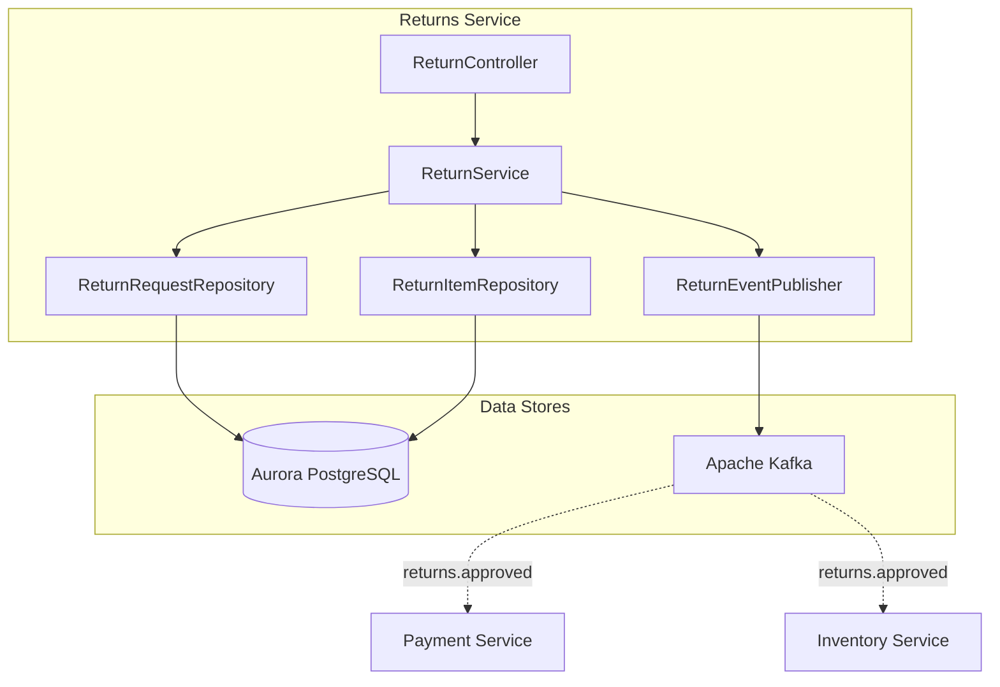
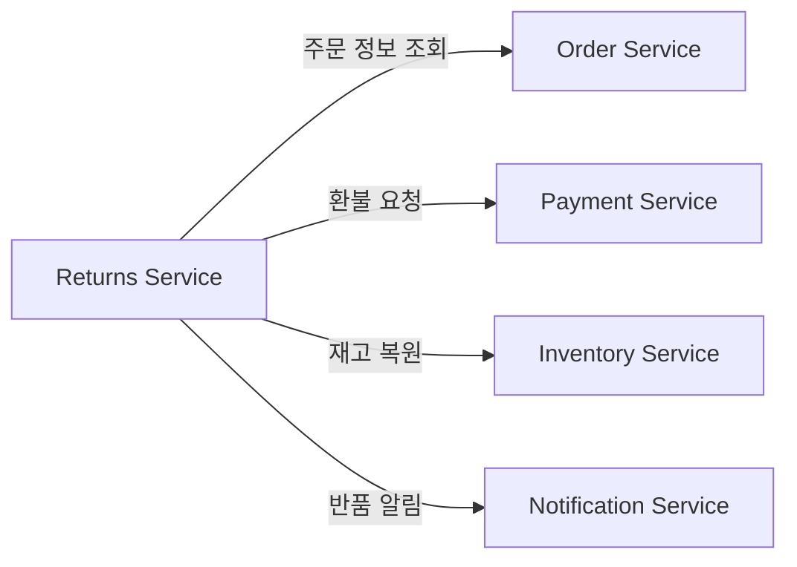
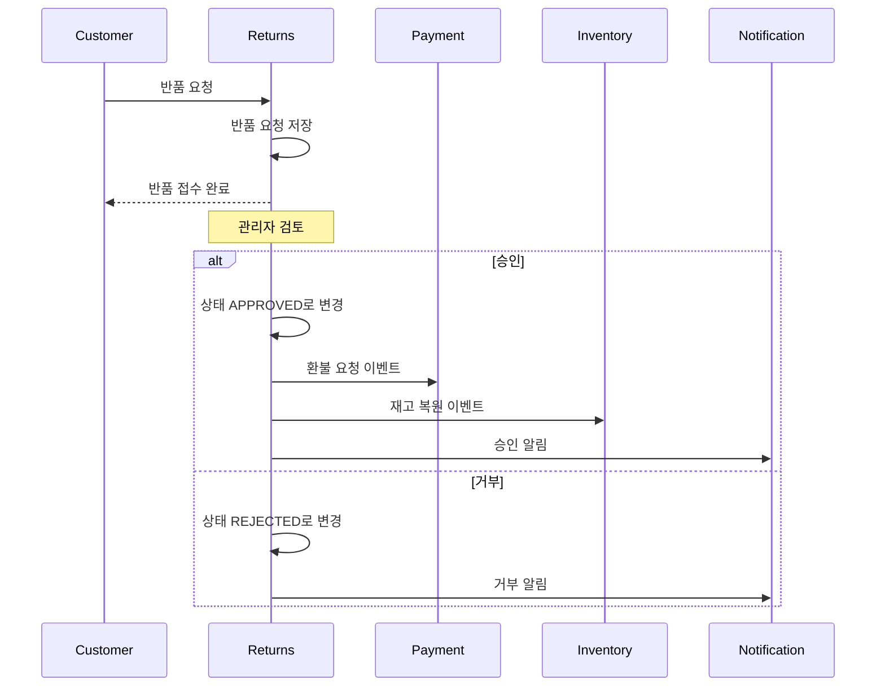
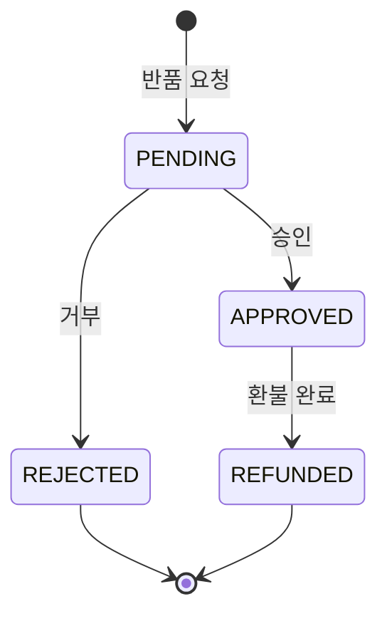

# 반품 서비스 (Returns Service)

## 개요

반품 서비스는 반품 요청의 생성, 승인, 거부 처리와 환불 조정을 담당합니다. 반품 승인 시 결제 서비스와 연동하여 환불 처리를 진행합니다.

| 항목 | 내용 |
|------|------|
| 언어 | Java 17 |
| 프레임워크 | Spring Boot 3.2 |
| 데이터베이스 | Aurora PostgreSQL (Global Database) |
| 네임스페이스 | `mall-returns` |
| 포트 | 8080 |
| 헬스체크 | `/actuator/health` |

## 아키텍처



## API 엔드포인트

| 메서드 | 경로 | 설명 |
|--------|------|------|
| `POST` | `/api/v1/returns` | 반품 요청 생성 |
| `GET` | `/api/v1/returns/{id}` | 반품 요청 조회 |
| `GET` | `/api/v1/returns?userId={userId}` | 사용자별 반품 목록 조회 |
| `PUT` | `/api/v1/returns/{id}/approve` | 반품 승인 |
| `PUT` | `/api/v1/returns/{id}/reject` | 반품 거부 |

### 반품 요청 생성

**POST** `/api/v1/returns`

요청:
```json
{
  "orderId": "550e8400-e29b-41d4-a716-446655440000",
  "userId": "user-123",
  "reason": "상품 불량",
  "items": [
    {
      "productId": "prod-001",
      "sku": "SKU-ELECTRONICS-001",
      "quantity": 1,
      "reason": "화면 결함"
    }
  ]
}
```

응답 (201 Created):
```json
{
  "id": "770e8400-e29b-41d4-a716-446655440000",
  "orderId": "550e8400-e29b-41d4-a716-446655440000",
  "userId": "user-123",
  "reason": "상품 불량",
  "status": "PENDING",
  "items": [
    {
      "id": "880e8400-e29b-41d4-a716-446655440000",
      "productId": "prod-001",
      "sku": "SKU-ELECTRONICS-001",
      "quantity": 1,
      "reason": "화면 결함"
    }
  ],
  "createdAt": "2024-01-20T10:00:00",
  "updatedAt": "2024-01-20T10:00:00"
}
```

### 반품 요청 조회

**GET** `/api/v1/returns/{id}`

응답 (200 OK):
```json
{
  "id": "770e8400-e29b-41d4-a716-446655440000",
  "orderId": "550e8400-e29b-41d4-a716-446655440000",
  "userId": "user-123",
  "reason": "상품 불량",
  "status": "PENDING",
  "items": [
    {
      "id": "880e8400-e29b-41d4-a716-446655440000",
      "productId": "prod-001",
      "sku": "SKU-ELECTRONICS-001",
      "quantity": 1,
      "reason": "화면 결함"
    }
  ],
  "createdAt": "2024-01-20T10:00:00",
  "updatedAt": "2024-01-20T10:00:00"
}
```

### 사용자별 반품 목록 조회

**GET** `/api/v1/returns?userId=user-123`

응답 (200 OK):
```json
[
  {
    "id": "770e8400-e29b-41d4-a716-446655440000",
    "orderId": "550e8400-e29b-41d4-a716-446655440000",
    "userId": "user-123",
    "reason": "상품 불량",
    "status": "APPROVED",
    "items": [...],
    "createdAt": "2024-01-20T10:00:00",
    "updatedAt": "2024-01-21T14:00:00"
  }
]
```

### 반품 승인

**PUT** `/api/v1/returns/{id}/approve`

응답 (200 OK):
```json
{
  "id": "770e8400-e29b-41d4-a716-446655440000",
  "orderId": "550e8400-e29b-41d4-a716-446655440000",
  "userId": "user-123",
  "reason": "상품 불량",
  "status": "APPROVED",
  "items": [...],
  "createdAt": "2024-01-20T10:00:00",
  "updatedAt": "2024-01-21T14:00:00"
}
```

### 반품 거부

**PUT** `/api/v1/returns/{id}/reject`

응답 (200 OK):
```json
{
  "id": "770e8400-e29b-41d4-a716-446655440000",
  "orderId": "550e8400-e29b-41d4-a716-446655440000",
  "userId": "user-123",
  "reason": "상품 불량",
  "status": "REJECTED",
  "items": [...],
  "createdAt": "2024-01-20T10:00:00",
  "updatedAt": "2024-01-21T14:00:00"
}
```

## 데이터 모델

### ReturnRequest 엔티티

```java
@Entity
@Table(name = "return_requests")
public class ReturnRequest {
    @Id
    @GeneratedValue(strategy = GenerationType.UUID)
    private UUID id;

    @Column(name = "order_id", nullable = false)
    private UUID orderId;

    @Column(name = "user_id", nullable = false)
    private String userId;

    @Column(columnDefinition = "TEXT")
    private String reason;

    @Enumerated(EnumType.STRING)
    @Column(length = 50)
    private ReturnStatus status = ReturnStatus.PENDING;

    @OneToMany(mappedBy = "returnRequest", cascade = CascadeType.ALL, orphanRemoval = true)
    private List<ReturnItem> items = new ArrayList<>();

    @Column(name = "created_at")
    private LocalDateTime createdAt;

    @Column(name = "updated_at")
    private LocalDateTime updatedAt;
}
```

### ReturnItem 엔티티

```java
@Entity
@Table(name = "return_items")
public class ReturnItem {
    @Id
    @GeneratedValue(strategy = GenerationType.UUID)
    private UUID id;

    @ManyToOne
    @JoinColumn(name = "return_id")
    private ReturnRequest returnRequest;

    @Column(name = "product_id", nullable = false)
    private String productId;

    @Column(nullable = false)
    private String sku;

    @Column(nullable = false)
    private Integer quantity;

    @Column(columnDefinition = "TEXT")
    private String reason;
}
```

### ReturnStatus 열거형

```java
public enum ReturnStatus {
    PENDING,    // 대기 중
    APPROVED,   // 승인됨
    REJECTED,   // 거부됨
    REFUNDED    // 환불 완료
}
```

### 데이터베이스 스키마

```sql
CREATE TABLE return_requests (
    id UUID PRIMARY KEY DEFAULT gen_random_uuid(),
    order_id UUID NOT NULL,
    user_id VARCHAR(255) NOT NULL,
    reason TEXT,
    status VARCHAR(50) DEFAULT 'PENDING',
    created_at TIMESTAMP DEFAULT CURRENT_TIMESTAMP,
    updated_at TIMESTAMP DEFAULT CURRENT_TIMESTAMP
);

CREATE TABLE return_items (
    id UUID PRIMARY KEY DEFAULT gen_random_uuid(),
    return_id UUID REFERENCES return_requests(id),
    product_id VARCHAR(255) NOT NULL,
    sku VARCHAR(255) NOT NULL,
    quantity INTEGER NOT NULL,
    reason TEXT
);

CREATE INDEX idx_return_requests_order_id ON return_requests(order_id);
CREATE INDEX idx_return_requests_user_id ON return_requests(user_id);
CREATE INDEX idx_return_requests_status ON return_requests(status);
CREATE INDEX idx_return_items_return_id ON return_items(return_id);
```

## 이벤트 (Kafka)

### 발행 토픽

| 토픽명 | 이벤트 | 설명 |
|--------|--------|------|
| `returns.created` | return.created | 반품 요청 생성 시 발행 |
| `returns.approved` | return.approved | 반품 승인 시 발행 |
| `returns.rejected` | return.rejected | 반품 거부 시 발행 |

#### returns.created 페이로드

```json
{
  "return_id": "770e8400-e29b-41d4-a716-446655440000",
  "order_id": "550e8400-e29b-41d4-a716-446655440000",
  "user_id": "user-123",
  "status": "PENDING",
  "reason": "상품 불량",
  "item_count": 1
}
```

#### returns.approved 페이로드

```json
{
  "return_id": "770e8400-e29b-41d4-a716-446655440000",
  "order_id": "550e8400-e29b-41d4-a716-446655440000",
  "user_id": "user-123",
  "status": "APPROVED",
  "reason": "상품 불량",
  "item_count": 1
}
```

#### returns.rejected 페이로드

```json
{
  "return_id": "770e8400-e29b-41d4-a716-446655440000",
  "order_id": "550e8400-e29b-41d4-a716-446655440000",
  "user_id": "user-123",
  "status": "REJECTED",
  "reason": "상품 불량",
  "item_count": 1
}
```

## 환경 변수

| 변수명 | 설명 | 기본값 |
|--------|------|--------|
| `SPRING_DATASOURCE_URL` | Aurora PostgreSQL 연결 URL | - |
| `SPRING_DATASOURCE_USERNAME` | DB 사용자명 | - |
| `SPRING_DATASOURCE_PASSWORD` | DB 비밀번호 | - |
| `SPRING_KAFKA_BOOTSTRAP_SERVERS` | Kafka 브로커 주소 | - |
| `SERVER_PORT` | 서비스 포트 | 8080 |

## 서비스 의존성



### 반품 처리 흐름



### 반품 상태 흐름



### 에러 처리

| HTTP 상태 코드 | 에러 | 설명 |
|----------------|------|------|
| 404 | ReturnNotFoundException | 반품 요청을 찾을 수 없음 |
| 400 | IllegalStateException | 잘못된 상태 전이 (예: 이미 처리된 반품) |
| 400 | InvalidReturnRequestException | 유효하지 않은 반품 요청 (반품 기간 초과 등) |
