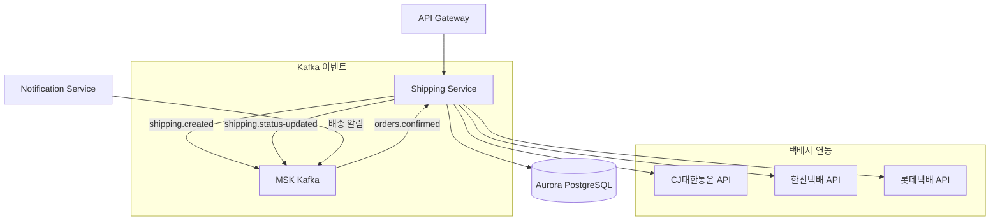
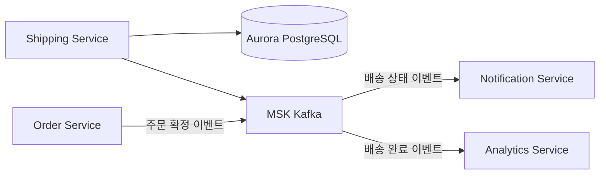

# 배송 서비스 (Shipping)

## 개요

배송 서비스는 주문 상품의 배송 생성, 추적, 상태 관리를 담당합니다. 국내 주요 택배사(CJ대한통운, 한진택배, 롯데택배)와 연동하여 실시간 배송 추적을 제공합니다.

| 항목 | 값 |
|------|-----|
| 언어 | Python 3.11 |
| 프레임워크 | FastAPI |
| 데이터베이스 | Aurora PostgreSQL |
| 네임스페이스 | `mall-services` |
| 포트 | 8000 |
| 헬스체크 | `GET /health` |

## 아키텍처



## API 엔드포인트

### 배송 API

| 메서드 | 경로 | 설명 |
|--------|------|------|
| `GET` | `/api/v1/shipments/{order_id}` | 주문별 배송 조회 |
| `POST` | `/api/v1/shipments` | 배송 생성 |
| `PUT` | `/api/v1/shipments/{shipment_id}/status` | 배송 상태 업데이트 |
| `GET` | `/api/v1/shipments/{shipment_id}/tracking` | 배송 추적 이력 |

### 요청/응답 예시

#### 주문별 배송 조회

**요청:**
```http
GET /api/v1/shipments/order_001
```

**응답:**
```json
{
  "id": "ship_001",
  "order_id": "order_001",
  "user_id": "user_001",
  "shipping_address": "서울특별시 강남구 테헤란로 123, 456호",
  "carrier": "CJ대한통운",
  "tracking_number": "1234567890123",
  "status": "IN_TRANSIT",
  "tracking_history": [
    {
      "status": "PENDING",
      "location": null,
      "description": "배송 준비 중",
      "timestamp": "2024-01-15T10:00:00Z"
    },
    {
      "status": "PICKED_UP",
      "location": "서울 송파 물류센터",
      "description": "상품을 인수했습니다",
      "timestamp": "2024-01-15T14:00:00Z"
    },
    {
      "status": "IN_TRANSIT",
      "location": "대전 허브터미널",
      "description": "배송 중입니다",
      "timestamp": "2024-01-16T08:00:00Z"
    }
  ],
  "created_at": "2024-01-15T10:00:00Z",
  "updated_at": "2024-01-16T08:00:00Z"
}
```

#### 배송 생성

**요청:**
```http
POST /api/v1/shipments
Content-Type: application/json

{
  "order_id": "order_002",
  "user_id": "user_002",
  "shipping_address": "부산광역시 해운대구 센텀로 456",
  "carrier": "한진택배"
}
```

**응답 (201 Created):**
```json
{
  "id": "ship_002",
  "order_id": "order_002",
  "user_id": "user_002",
  "shipping_address": "부산광역시 해운대구 센텀로 456",
  "carrier": "한진택배",
  "tracking_number": "9876543210987",
  "status": "PENDING",
  "tracking_history": [
    {
      "status": "PENDING",
      "location": null,
      "description": "배송 준비 중",
      "timestamp": "2024-01-16T09:00:00Z"
    }
  ],
  "created_at": "2024-01-16T09:00:00Z",
  "updated_at": "2024-01-16T09:00:00Z"
}
```

#### 배송 상태 업데이트

**요청:**
```http
PUT /api/v1/shipments/ship_002/status
Content-Type: application/json

{
  "status": "OUT_FOR_DELIVERY",
  "location": "부산 해운대 배송센터",
  "description": "배송 기사님이 배송 출발했습니다"
}
```

**응답:**
```json
{
  "id": "ship_002",
  "order_id": "order_002",
  "user_id": "user_002",
  "shipping_address": "부산광역시 해운대구 센텀로 456",
  "carrier": "한진택배",
  "tracking_number": "9876543210987",
  "status": "OUT_FOR_DELIVERY",
  "tracking_history": [
    {
      "status": "PENDING",
      "location": null,
      "description": "배송 준비 중",
      "timestamp": "2024-01-16T09:00:00Z"
    },
    {
      "status": "OUT_FOR_DELIVERY",
      "location": "부산 해운대 배송센터",
      "description": "배송 기사님이 배송 출발했습니다",
      "timestamp": "2024-01-17T08:30:00Z"
    }
  ],
  "created_at": "2024-01-16T09:00:00Z",
  "updated_at": "2024-01-17T08:30:00Z"
}
```

#### 배송 추적 이력

**요청:**
```http
GET /api/v1/shipments/ship_001/tracking
```

**응답:**
```json
[
  {
    "status": "PENDING",
    "location": null,
    "description": "배송 준비 중",
    "timestamp": "2024-01-15T10:00:00Z"
  },
  {
    "status": "PICKED_UP",
    "location": "서울 송파 물류센터",
    "description": "상품을 인수했습니다",
    "timestamp": "2024-01-15T14:00:00Z"
  },
  {
    "status": "IN_TRANSIT",
    "location": "대전 허브터미널",
    "description": "배송 중입니다",
    "timestamp": "2024-01-16T08:00:00Z"
  },
  {
    "status": "DELIVERED",
    "location": "서울 강남구",
    "description": "배송이 완료되었습니다",
    "timestamp": "2024-01-16T14:00:00Z"
  }
]
```

## 데이터 모델

### ShipmentStatus (Enum)

```python
class ShipmentStatus(str, Enum):
    PENDING = "PENDING"           # 배송 준비 중
    PICKED_UP = "PICKED_UP"       # 상품 인수
    IN_TRANSIT = "IN_TRANSIT"     # 배송 중
    OUT_FOR_DELIVERY = "OUT_FOR_DELIVERY"  # 배송 출발
    DELIVERED = "DELIVERED"       # 배송 완료
```

### Shipment

```python
class Shipment(BaseModel):
    id: Optional[str] = None
    order_id: str
    user_id: str
    shipping_address: str
    carrier: Optional[str] = None
    tracking_number: Optional[str] = None
    status: ShipmentStatus = ShipmentStatus.PENDING
    tracking_history: list[TrackingEvent] = []
    created_at: datetime
    updated_at: datetime
```

### TrackingEvent

```python
class TrackingEvent(BaseModel):
    status: ShipmentStatus
    location: Optional[str] = None
    description: Optional[str] = None
    timestamp: datetime
```

### ShipmentCreate

```python
class ShipmentCreate(BaseModel):
    order_id: str
    user_id: str
    shipping_address: str
    carrier: Optional[str] = None
```

### PostgreSQL 테이블 스키마

```sql
CREATE TABLE shipments (
    id UUID PRIMARY KEY DEFAULT gen_random_uuid(),
    order_id VARCHAR(50) NOT NULL UNIQUE,
    user_id VARCHAR(50) NOT NULL,
    shipping_address TEXT NOT NULL,
    carrier VARCHAR(50),
    tracking_number VARCHAR(50),
    status VARCHAR(20) NOT NULL DEFAULT 'PENDING',
    created_at TIMESTAMP WITH TIME ZONE DEFAULT NOW(),
    updated_at TIMESTAMP WITH TIME ZONE DEFAULT NOW()
);

CREATE TABLE tracking_events (
    id UUID PRIMARY KEY DEFAULT gen_random_uuid(),
    shipment_id UUID REFERENCES shipments(id),
    status VARCHAR(20) NOT NULL,
    location VARCHAR(200),
    description TEXT,
    timestamp TIMESTAMP WITH TIME ZONE DEFAULT NOW()
);

CREATE INDEX idx_shipments_order_id ON shipments(order_id);
CREATE INDEX idx_shipments_user_id ON shipments(user_id);
CREATE INDEX idx_tracking_events_shipment_id ON tracking_events(shipment_id);
```

## 이벤트 (Kafka)

### 구독 토픽

| 토픽 | 이벤트 | 설명 |
|------|--------|------|
| `orders.confirmed` | 주문 확정 | 재고 확보 후 배송 생성 트리거 |

### 발행 토픽

| 토픽 | 이벤트 | 설명 |
|------|--------|------|
| `shipping.created` | 배송 생성 | 배송 정보 생성 시 발행 |
| `shipping.status-updated` | 상태 변경 | 배송 상태 변경 시 발행 |
| `shipping.delivered` | 배송 완료 | 배송 완료 시 발행 |

### 이벤트 페이로드 예시

**orders.confirmed (구독):**
```json
{
  "event_type": "order.confirmed",
  "order_id": "order_001",
  "user_id": "user_001",
  "shipping_address": "서울특별시 강남구 테헤란로 123",
  "items": [
    {"product_id": "prod_001", "quantity": 2}
  ],
  "timestamp": "2024-01-15T10:00:00Z"
}
```

**shipping.status-updated (발행):**
```json
{
  "event_type": "shipping.status-updated",
  "shipment_id": "ship_001",
  "order_id": "order_001",
  "user_id": "user_001",
  "status": "OUT_FOR_DELIVERY",
  "carrier": "CJ대한통운",
  "tracking_number": "1234567890123",
  "timestamp": "2024-01-16T08:30:00Z"
}
```

## 환경 변수

| 변수명 | 설명 | 기본값 |
|--------|------|--------|
| `SERVICE_NAME` | 서비스 이름 | `shipping` |
| `PORT` | 서비스 포트 | `8080` |
| `AWS_REGION` | AWS 리전 | `us-east-1` |
| `REGION_ROLE` | 리전 역할 (PRIMARY/SECONDARY) | `PRIMARY` |
| `DB_HOST` | Aurora PostgreSQL 호스트 | `localhost` |
| `DB_PORT` | Aurora PostgreSQL 포트 | `5432` |
| `DB_NAME` | 데이터베이스 이름 | `shipping` |
| `DB_USER` | 데이터베이스 사용자 | `mall` |
| `DB_PASSWORD` | 데이터베이스 비밀번호 | - |
| `KAFKA_BROKERS` | Kafka 브로커 주소 | `localhost:9092` |
| `LOG_LEVEL` | 로그 레벨 | `info` |

## 서비스 의존성



### 의존하는 서비스
- **Aurora PostgreSQL**: 배송 데이터 저장
- **MSK Kafka**: 이벤트 발행/구독
- **Order Service**: `orders.confirmed` 이벤트 수신

### 의존받는 서비스
- **Notification Service**: 배송 상태 알림 발송
- **Analytics Service**: 배송 현황 대시보드
- **Order Service**: 배송 완료 시 주문 상태 업데이트

## 택배사 연동

### 지원 택배사

| 택배사 | 코드 | API 연동 |
|--------|------|----------|
| CJ대한통운 | `CJ` | 실시간 추적 |
| 한진택배 | `HANJIN` | 실시간 추적 |
| 롯데택배 | `LOTTE` | 실시간 추적 |

### 배송 상태 매핑

| 배송 상태 | CJ대한통운 | 한진택배 | 롯데택배 |
|-----------|------------|----------|----------|
| PENDING | 접수 | 접수완료 | 접수 |
| PICKED_UP | 집하 | 상품인수 | 집화처리 |
| IN_TRANSIT | 이동중 | 배송중 | 간선상차 |
| OUT_FOR_DELIVERY | 배송출발 | 배달출발 | 배달출발 |
| DELIVERED | 배달완료 | 배달완료 | 배달완료 |
