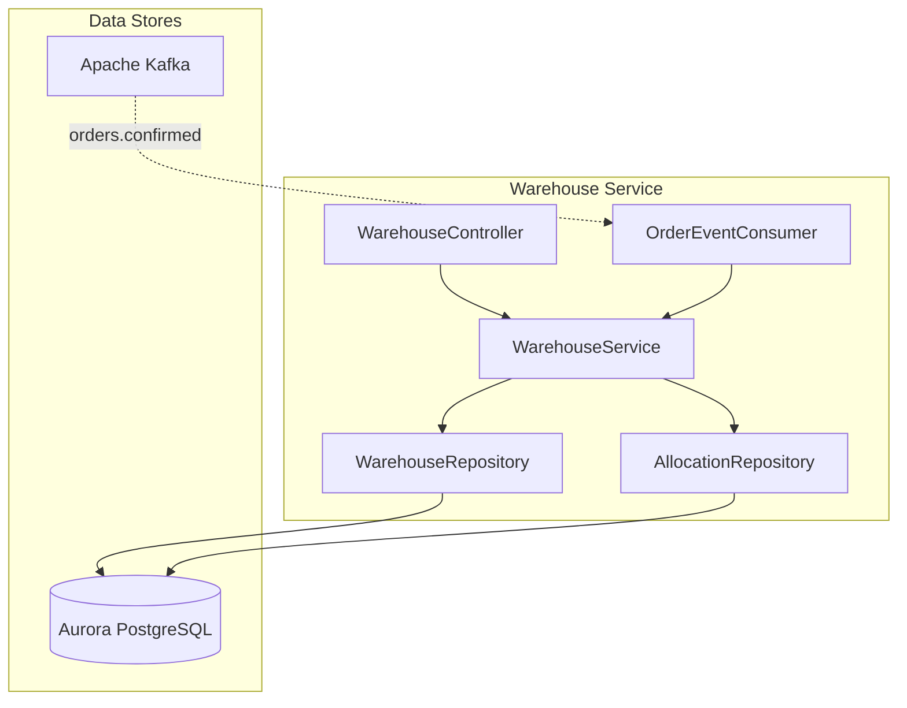
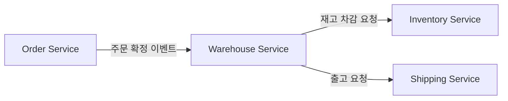
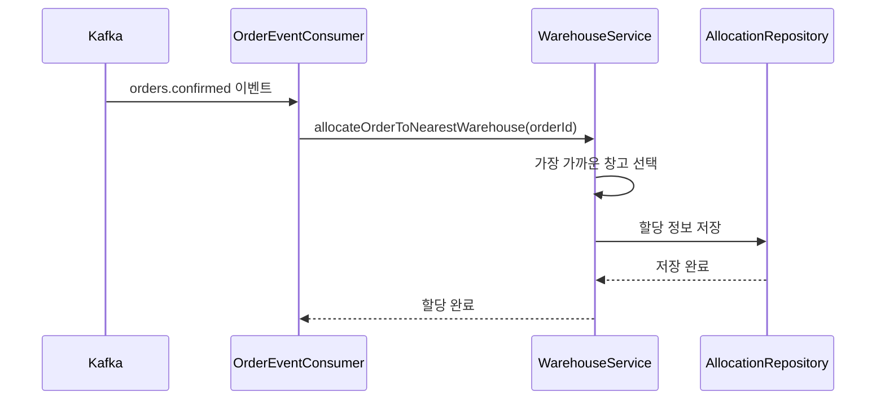
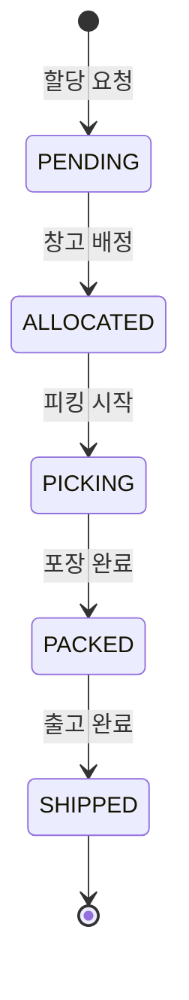

# 창고 서비스 (Warehouse Service)

## 개요

창고 서비스는 창고 관리, 재고 할당, 주문 배송을 위한 재고 추적을 담당합니다. 주문 확정 이벤트를 수신하여 자동으로 가장 가까운 창고에 재고를 할당합니다.

| 항목 | 내용 |
|------|------|
| 언어 | Java 17 |
| 프레임워크 | Spring Boot 3.2 |
| 데이터베이스 | Aurora PostgreSQL (Global Database) |
| 네임스페이스 | `mall-warehouse` |
| 포트 | 8080 |
| 헬스체크 | `/actuator/health` |

## 아키텍처



## API 엔드포인트

| 메서드 | 경로 | 설명 |
|--------|------|------|
| `GET` | `/api/v1/warehouses` | 창고 목록 조회 |
| `GET` | `/api/v1/warehouses/{id}` | 창고 상세 조회 |
| `POST` | `/api/v1/warehouses/{id}/allocate` | 주문 할당 |
| `GET` | `/api/v1/warehouses/{id}/inventory` | 창고 재고 현황 조회 |

### 창고 목록 조회

**GET** `/api/v1/warehouses`

응답 (200 OK):
```json
[
  {
    "id": "550e8400-e29b-41d4-a716-446655440000",
    "name": "서울 물류센터",
    "location": "서울특별시 강남구",
    "capacity": 10000,
    "active": true,
    "createdAt": "2024-01-01T00:00:00"
  },
  {
    "id": "550e8400-e29b-41d4-a716-446655440001",
    "name": "부산 물류센터",
    "location": "부산광역시 해운대구",
    "capacity": 8000,
    "active": true,
    "createdAt": "2024-01-01T00:00:00"
  }
]
```

### 창고 상세 조회

**GET** `/api/v1/warehouses/{id}`

응답 (200 OK):
```json
{
  "id": "550e8400-e29b-41d4-a716-446655440000",
  "name": "서울 물류센터",
  "location": "서울특별시 강남구",
  "capacity": 10000,
  "active": true,
  "createdAt": "2024-01-01T00:00:00"
}
```

### 주문 할당

**POST** `/api/v1/warehouses/{id}/allocate`

요청:
```json
{
  "orderId": "660e8400-e29b-41d4-a716-446655440000"
}
```

응답 (200 OK):
```json
{
  "id": "770e8400-e29b-41d4-a716-446655440000",
  "warehouseId": "550e8400-e29b-41d4-a716-446655440000",
  "warehouseName": "서울 물류센터",
  "orderId": "660e8400-e29b-41d4-a716-446655440000",
  "status": "ALLOCATED",
  "createdAt": "2024-01-15T10:35:00",
  "updatedAt": "2024-01-15T10:35:00"
}
```

### 창고 재고 현황 조회

**GET** `/api/v1/warehouses/{id}/inventory`

응답 (200 OK):
```json
{
  "warehouseId": "550e8400-e29b-41d4-a716-446655440000",
  "warehouseName": "서울 물류센터",
  "totalCapacity": 10000,
  "activeAllocations": 150,
  "availableCapacity": 9850
}
```

## 데이터 모델

### Warehouse 엔티티

```java
@Entity
@Table(name = "warehouses")
public class Warehouse {
    @Id
    @GeneratedValue(strategy = GenerationType.UUID)
    private UUID id;

    @Column(nullable = false)
    private String name;

    private String location;

    @Column(columnDefinition = "INTEGER DEFAULT 0")
    private Integer capacity = 0;

    @Column(columnDefinition = "BOOLEAN DEFAULT true")
    private Boolean active = true;

    @Column(name = "created_at")
    private LocalDateTime createdAt;
}
```

### Allocation 엔티티

```java
@Entity
@Table(name = "allocations")
public class Allocation {
    @Id
    @GeneratedValue(strategy = GenerationType.UUID)
    private UUID id;

    @ManyToOne
    @JoinColumn(name = "warehouse_id")
    private Warehouse warehouse;

    @Column(name = "order_id", nullable = false)
    private UUID orderId;

    @Enumerated(EnumType.STRING)
    @Column(length = 50)
    private AllocationStatus status = AllocationStatus.PENDING;

    @Column(name = "created_at")
    private LocalDateTime createdAt;

    @Column(name = "updated_at")
    private LocalDateTime updatedAt;
}
```

### AllocationStatus 열거형

```java
public enum AllocationStatus {
    PENDING,    // 대기 중
    ALLOCATED,  // 할당됨
    PICKING,    // 피킹 중
    PACKED,     // 포장 완료
    SHIPPED     // 출고 완료
}
```

### 데이터베이스 스키마

```sql
CREATE TABLE warehouses (
    id UUID PRIMARY KEY DEFAULT gen_random_uuid(),
    name VARCHAR(255) NOT NULL,
    location VARCHAR(255),
    capacity INTEGER DEFAULT 0,
    active BOOLEAN DEFAULT true,
    created_at TIMESTAMP DEFAULT CURRENT_TIMESTAMP
);

CREATE TABLE allocations (
    id UUID PRIMARY KEY DEFAULT gen_random_uuid(),
    warehouse_id UUID REFERENCES warehouses(id),
    order_id UUID NOT NULL,
    status VARCHAR(50) DEFAULT 'PENDING',
    created_at TIMESTAMP DEFAULT CURRENT_TIMESTAMP,
    updated_at TIMESTAMP DEFAULT CURRENT_TIMESTAMP
);

CREATE INDEX idx_allocations_warehouse_id ON allocations(warehouse_id);
CREATE INDEX idx_allocations_order_id ON allocations(order_id);
CREATE INDEX idx_allocations_status ON allocations(status);
```

## 이벤트 (Kafka)

### 구독 토픽

| 토픽명 | 설명 |
|--------|------|
| `orders.confirmed` | 주문 확정 이벤트 수신하여 자동 할당 |

#### orders.confirmed 처리

```java
@KafkaListener(topics = "orders.confirmed", groupId = "warehouse-service")
public void handleOrderConfirmed(Map<String, Object> orderData) {
    UUID orderId = UUID.fromString(orderData.get("order_id").toString());
    warehouseService.allocateOrderToNearestWarehouse(orderId);
}
```

수신 페이로드:
```json
{
  "event": "order.confirmed",
  "order_id": "660e8400-e29b-41d4-a716-446655440000",
  "user_id": "user-123",
  "total_amount": 687000.00
}
```

## 환경 변수

| 변수명 | 설명 | 기본값 |
|--------|------|--------|
| `SPRING_DATASOURCE_URL` | Aurora PostgreSQL 연결 URL | - |
| `SPRING_DATASOURCE_USERNAME` | DB 사용자명 | - |
| `SPRING_DATASOURCE_PASSWORD` | DB 비밀번호 | - |
| `SPRING_KAFKA_BOOTSTRAP_SERVERS` | Kafka 브로커 주소 | - |
| `SPRING_KAFKA_CONSUMER_GROUP_ID` | Kafka 컨슈머 그룹 ID | warehouse-service |
| `SERVER_PORT` | 서비스 포트 | 8080 |

## 서비스 의존성



### 자동 할당 프로세스



### 할당 상태 흐름



### 에러 처리

| HTTP 상태 코드 | 에러 | 설명 |
|----------------|------|------|
| 404 | WarehouseNotFoundException | 창고를 찾을 수 없음 |
| 400 | IllegalStateException | 할당 불가능 상태 (비활성 창고 등) |
| 400 | InsufficientCapacityException | 창고 용량 부족 |
