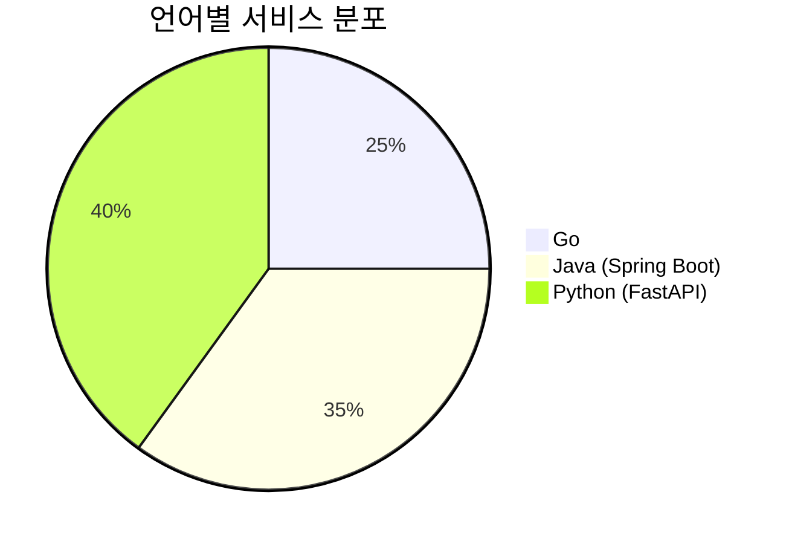

# 서비스 개요

Multi-Region Shopping Mall 플랫폼은 20개의 마이크로서비스로 구성되어 있습니다. 각 서비스는 특정 비즈니스 도메인을 담당하며, 독립적으로 배포 및 확장이 가능합니다.

## 서비스 목록

### Core Services (핵심 서비스)

| 서비스 | 언어 | 프레임워크 | 데이터베이스 | 포트 | 네임스페이스 |
|--------|------|------------|--------------|------|--------------|
| API Gateway | Go | Gin | ElastiCache (Valkey) | 8080 | core-services |
| Product Catalog | Python | FastAPI | DocumentDB | 8080 | core-services |
| Search | Go | Gin | OpenSearch, DocumentDB | 8080 | core-services |
| Cart | Go | Gin | ElastiCache (Valkey) | 8080 | core-services |
| Order | Java | Spring Boot | Aurora PostgreSQL | 8080 | core-services |
| Payment | Java | Spring Boot | Aurora PostgreSQL | 8080 | core-services |
| Inventory | Go | Gin | Aurora PostgreSQL | 8080 | core-services |

### User Services (사용자 서비스)

| 서비스 | 언어 | 프레임워크 | 데이터베이스 | 포트 | 네임스페이스 |
|--------|------|------------|--------------|------|--------------|
| User Account | Java | Spring Boot | Aurora PostgreSQL | 8080 | user-services |
| User Profile | Python | FastAPI | DocumentDB | 8080 | user-services |
| Wishlist | Python | FastAPI | DocumentDB | 8080 | user-services |
| Review | Python | FastAPI | DocumentDB | 8080 | user-services |

### Fulfillment Services (배송 서비스)

| 서비스 | 언어 | 프레임워크 | 데이터베이스 | 포트 | 네임스페이스 |
|--------|------|------------|--------------|------|--------------|
| Shipping | Python | FastAPI | DocumentDB | 8080 | fulfillment |
| Warehouse | Java | Spring Boot | Aurora PostgreSQL | 8080 | fulfillment |
| Returns | Java | Spring Boot | Aurora PostgreSQL | 8080 | fulfillment |

### Business Services (비즈니스 서비스)

| 서비스 | 언어 | 프레임워크 | 데이터베이스 | 포트 | 네임스페이스 |
|--------|------|------------|--------------|------|--------------|
| Pricing | Java | Spring Boot | Aurora PostgreSQL | 8080 | business-services |
| Recommendation | Python | FastAPI | DocumentDB, ElastiCache | 8080 | business-services |
| Notification | Python | FastAPI | DocumentDB | 8080 | business-services |
| Seller | Java | Spring Boot | Aurora PostgreSQL | 8080 | business-services |

### Platform Services (플랫폼 서비스)

| 서비스 | 언어 | 프레임워크 | 데이터베이스 | 포트 | 네임스페이스 |
|--------|------|------------|--------------|------|--------------|
| Event Bus | Go | Gin | MSK (Kafka) | 8080 | platform |
| Analytics | Python | FastAPI | OpenSearch | 8080 | platform |

## 기술 스택 분포

## 서비스 의존성 다이어그램

```mermaid
flowchart TB
    subgraph External["외부 클라이언트"]
        Client[웹/모바일 클라이언트]
    end

    subgraph Gateway["API Layer"]
        APIGateway[API Gateway]
    end

    subgraph Core["Core Services"]
        ProductCatalog[Product Catalog]
        Search[Search]
        Cart[Cart]
        Order[Order]
        Payment[Payment]
        Inventory[Inventory]
    end

    subgraph User["User Services"]
        UserAccount[User Account]
        UserProfile[User Profile]
        Wishlist[Wishlist]
        Review[Review]
    end

    subgraph Fulfillment["Fulfillment Services"]
        Shipping[Shipping]
        Warehouse[Warehouse]
        Returns[Returns]
    end

    subgraph Business["Business Services"]
        Pricing[Pricing]
        Recommendation[Recommendation]
        Notification[Notification]
        Seller[Seller]
    end

    subgraph Platform["Platform Services"]
        EventBus[Event Bus]
        Analytics[Analytics]
    end

    subgraph Data["데이터 레이어"]
        Aurora[(Aurora PostgreSQL)]
        DocumentDB[(DocumentDB)]
        ElastiCache[(ElastiCache Valkey)]
        OpenSearch[(OpenSearch)]
        MSK[(MSK Kafka)]
    end

    Client --> APIGateway

    APIGateway --> ProductCatalog
    APIGateway --> Search
    APIGateway --> Cart
    APIGateway --> Order
    APIGateway --> Payment
    APIGateway --> Inventory
    APIGateway --> UserAccount
    APIGateway --> UserProfile
    APIGateway --> Wishlist
    APIGateway --> Review
    APIGateway --> Shipping
    APIGateway --> Warehouse
    APIGateway --> Returns
    APIGateway --> Pricing
    APIGateway --> Recommendation
    APIGateway --> Notification
    APIGateway --> Seller
    APIGateway --> EventBus
    APIGateway --> Analytics

    %% Core Service Dependencies
    Search --> OpenSearch
    Search --> DocumentDB
    Cart --> ElastiCache
    Order --> Aurora
    Order --> EventBus
    Payment --> Aurora
    Payment --> EventBus
    Inventory --> Aurora
    Inventory --> EventBus

    %% User Service Dependencies
    UserAccount --> Aurora
    UserProfile --> DocumentDB
    Wishlist --> DocumentDB
    Review --> DocumentDB

    %% Fulfillment Dependencies
    Shipping --> DocumentDB
    Warehouse --> Aurora
    Returns --> Aurora

    %% Business Dependencies
    Pricing --> Aurora
    Recommendation --> DocumentDB
    Recommendation --> ElastiCache
    Notification --> DocumentDB
    Seller --> Aurora

    %% Platform Dependencies
    EventBus --> MSK
    Analytics --> OpenSearch

    %% Event-driven connections
    ProductCatalog -.->|이벤트| EventBus
    Order -.->|이벤트| EventBus
    Payment -.->|이벤트| EventBus
    Inventory -.->|이벤트| EventBus
    EventBus -.->|이벤트| Search
    EventBus -.->|이벤트| Notification
    EventBus -.->|이벤트| Analytics
```

## 리전별 배포 구성

| 리전 | 역할 | 특징 |
|------|------|------|
| us-east-1 | Primary | 쓰기 작업 처리, 글로벌 데이터베이스 Primary |
| us-west-2 | Secondary | 읽기 작업 처리, 쓰기 요청은 Primary로 포워딩 |

### 멀티 리전 데이터 복제

- **Aurora Global Database**: Primary에서 Secondary로 1초 미만의 복제 지연
- **DocumentDB Global Cluster**: 변경 스트림을 통한 데이터 동기화
- **ElastiCache Global Datastore**: 리전 간 세션 및 캐시 복제
- **MSK**: 리전별 독립 클러스터 (이벤트는 로컬 처리)

## API 경로 매핑

API Gateway가 모든 요청을 적절한 백엔드 서비스로 라우팅합니다:

| API 경로 | 백엔드 서비스 |
|----------|---------------|
| `/api/v1/products` | product-catalog.core-services |
| `/api/v1/search` | search.core-services |
| `/api/v1/cart` | cart.core-services |
| `/api/v1/orders` | order.core-services |
| `/api/v1/payments` | payment.core-services |
| `/api/v1/inventory` | inventory.core-services |
| `/api/v1/auth` | user-account.user-services |
| `/api/v1/profiles` | user-profile.user-services |
| `/api/v1/wishlists` | wishlist.user-services |
| `/api/v1/reviews` | review.user-services |
| `/api/v1/shipments` | shipping.fulfillment |
| `/api/v1/warehouses` | warehouse.fulfillment |
| `/api/v1/returns` | returns.fulfillment |
| `/api/v1/pricing` | pricing.business-services |
| `/api/v1/recommendations` | recommendation.business-services |
| `/api/v1/notifications` | notification.business-services |
| `/api/v1/sellers` | seller.business-services |
| `/api/v1/events` | event-bus.platform |
| `/api/v1/analytics` | analytics.platform |

## 공통 기능

모든 서비스는 다음 공통 기능을 제공합니다:

### 헬스 체크 엔드포인트
- `GET /healthz` - Liveness probe
- `GET /readyz` - Readiness probe

### 관찰성 (Observability)
- **분산 추적**: OpenTelemetry를 통한 Tempo/X-Ray 연동
- **메트릭**: Prometheus 형식 메트릭 노출
- **로깅**: 구조화된 JSON 로깅

### 리전 인식 미들웨어
- Secondary 리전에서 쓰기 요청 시 Primary로 자동 포워딩
- `X-Region` 헤더를 통한 리전 정보 전파
